# Math 119 Figures (Chapters 13-17)

## 13:_Vector-Valued_Functions

### 13.00:_Prelude_to_Vector-Valued_Functions

**13_00_fig_1.png**

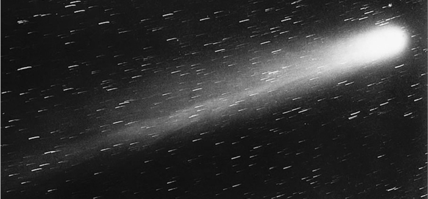

*Figure : Halley’s Comet appeared in view of Earth in 1986 and will appear again in 2061.*

### 13.01:_Vector-Valued_Functions_and_Space_Curves

**13_01_fig_1.png**

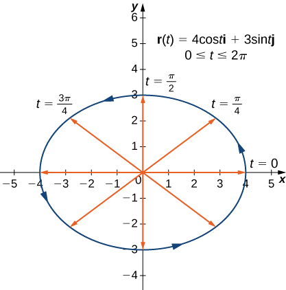

*Figure : The graph of the first vector-valued function is an ellipse.*

**13_01_fig_2.png**

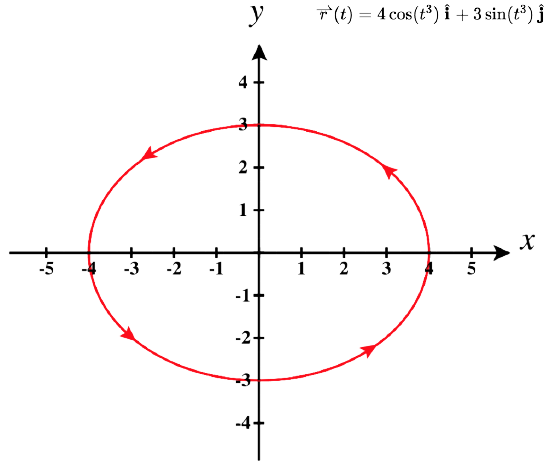

*Figure : The graph of the second vector-valued function is also an ellipse.*

**13_01_fig_3.png**

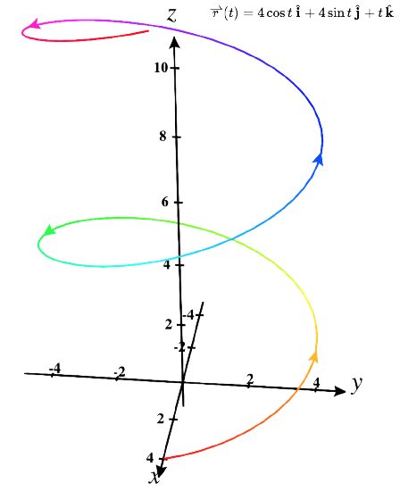

*Figure : The graph of the third vector-valued function is a helix.*

### 13.02:_Calculus_of_Vector-Valued_Functions

**13_02_fig_1.png**

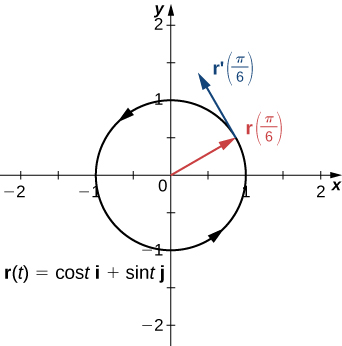

*Figure : The tangent line at a point is calculated from the derivative of the vector-valued function .*

### 13.03:_Arc_Length_and_Curvature

**13_03_fig_1.png**

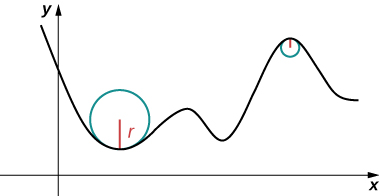

*Figure : The graph represents the curvature of a function  The sharper the turn in the graph, the greater the curvature, and the smaller the radius of the inscribed circle.*

**13_03_fig_2.png**

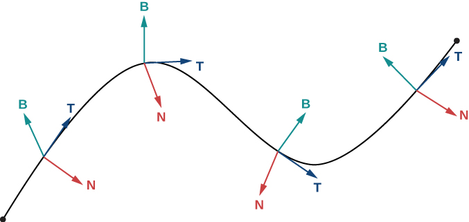

*Figure : This figure depicts a Frenet frame of reference. At every point  on a three-dimensional curve, the unit tangent, unit normal, and binormal vectors form a three-dimensional frame of reference.*

**13_03_fig_3.png**

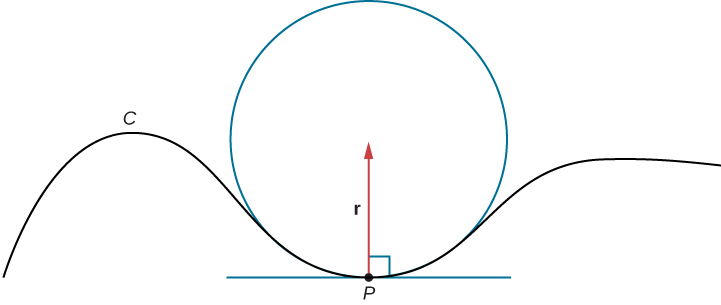

*Figure : In this osculating circle, the circle is tangent to curve  at point  and shares the same curvature.*

**13_03_fig_4.png**

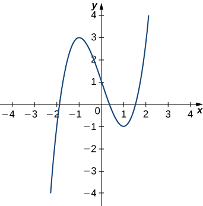

*Figure : We want to find the osculating circle of this graph at the point where .*

**13_03_fig_5.png**

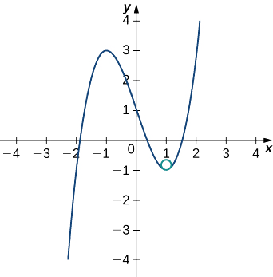

*Figure : The osculating circle has radius .*

### 13.04:_Motion_in_Space

**13_04_fig_1.png**

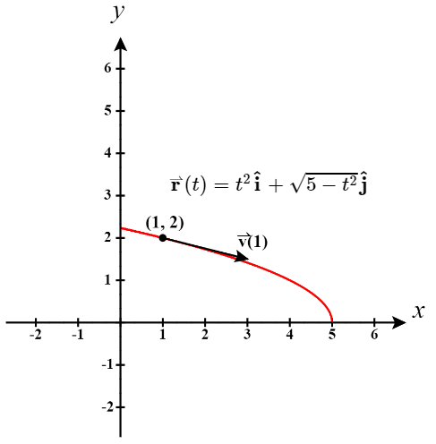

*Figure : This graph depicts the velocity vector at time  for a particle moving in a parabolic path.*

**13_04_fig_2.png**

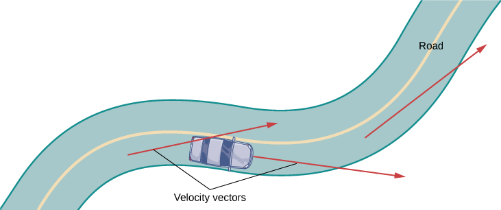

*Figure : At each point along a road traveled by a car, the velocity vector of the car is tangent to the path traveled by the car.*

**13_04_fig_3.png**

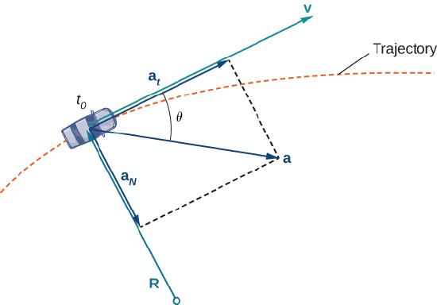

*Figure : The dashed line represents the trajectory of an object (a car, for example). The acceleration vector points toward the inside of the turn at all times.*

**13_04_fig_4.png**

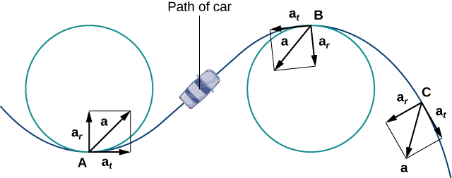

*Figure : The tangential and normal components of acceleration can be used to describe the acceleration vector.*

**13_04_fig_5.png**

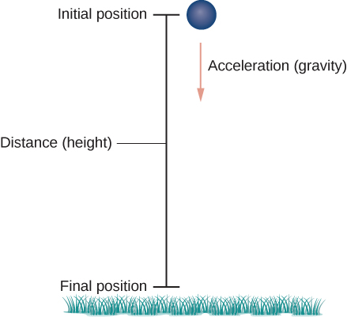

*Figure : An object is falling under the influence of gravity.*

**13_04_fig_6.png**

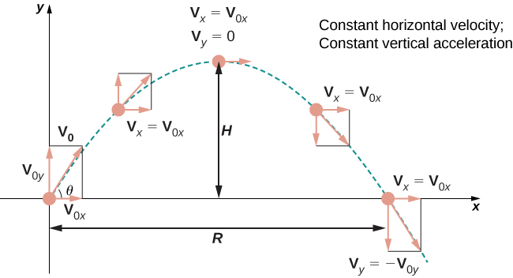

*Figure : Projectile motion when the object is thrown upward at an angle θ. The horizontal motion is at constant velocity and the vertical motion is at constant acceleration.*

**13_04_fig_7.png**

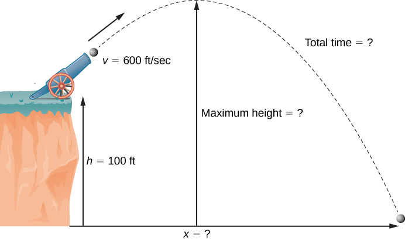

*Figure : The flight of a cannonball (ignoring air resistance) is projectile motion.*

**13_04_fig_8.png**

*Figure : Kepler’s first and second laws are pictured here. The Sun is located at a focus of the elliptical orbit of any planet. Furthermore, the shaded areas are all equal, assuming that the amount of time measured as the planet moves is the same for each region.*

**13_04_fig_9.png**

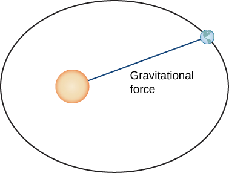

*Figure : The gravitational force between Earth and the Sun is equal to the mass of the earth times its acceleration.*

**13_04_fig_10.png**

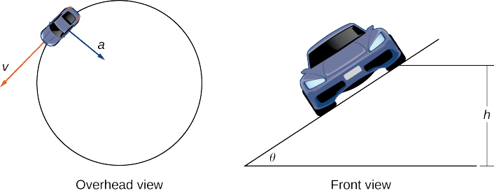

*Figure : Views of a race car moving around a track.*

**13_04_fig_11.png**

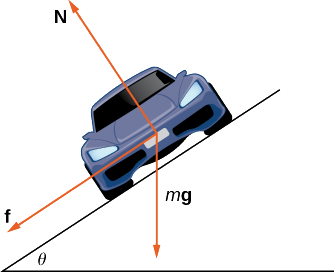

*Figure :  The car has three forces acting on it: gravity (denoted by ), the friction force , and the force exerted by the road .*

**13_04_fig_12.png**

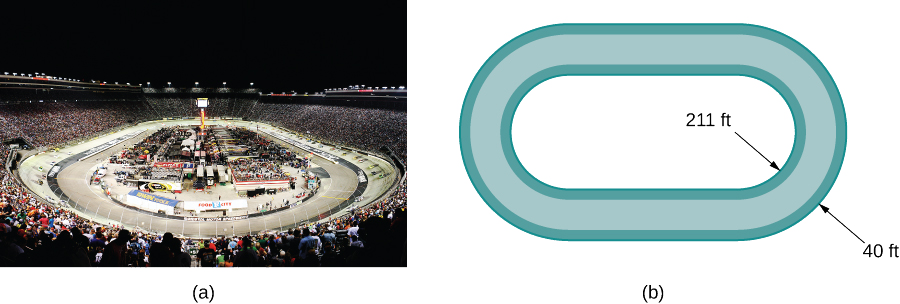

*Figure : At the Bristol Motor Speedway, Bristol, Tennessee (a), the turns have an inner radius of about 211 ft and a width of 40 ft (b). (credit: part (a) photo by Raniel Diaz, Flickr)*

## 14:_Differentiation_of_Functions_of_Several_Variables

### 14.00:_Prelude_to_Differentiation_of_Functions_of_Several_Variables

**14_00_fig_1.png**

*Figure : Americans use (and lose) millions of golf balls a year, which keeps golf ball manufacturers in business. In this chapter, we study a profit model and learn methods for calculating optimal production levels for a typical golf ball manufacturing company. (credit: modification of work by oatsy40, Flickr)*

### 14.01:_Functions_of_Several_Variables

**14_01_fig_1.png**

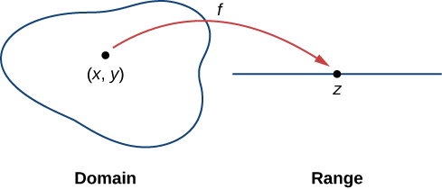

*Figure : The domain of a function of two variables consists of ordered pairs .*

**14_01_fig_2.png**

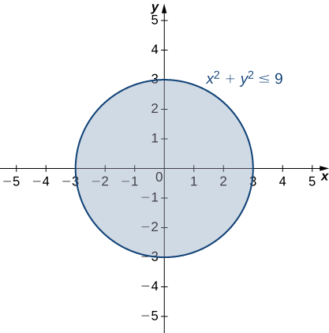

*Figure : The domain of the function  is a closed disk of radius 3.*

**14_01_fig_3.png**

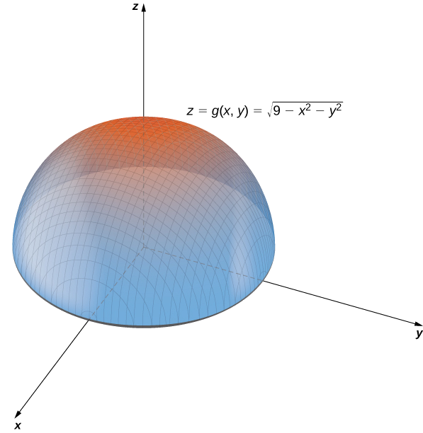

*Figure : Graph of the hemisphere represented by the given function of two variables.*

**14_01_fig_4.png**

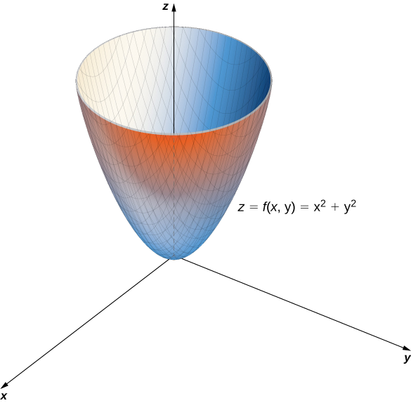

*Figure : A paraboloid is the graph of the given function of two variables.*

**14_01_fig_5.png**

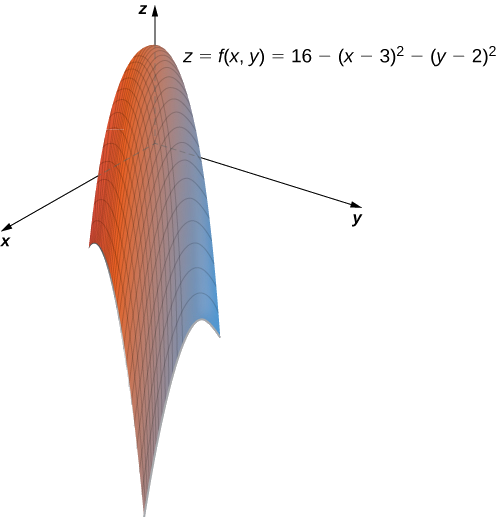

*Figure : The graph of the given function of two variables is also a paraboloid.*

**14_01_fig_6.png**

*Figure : (a) A topographical map of Devil’s Tower, Wyoming. Lines that are close together indicate very steep terrain. (b) A perspective photo of Devil’s Tower shows just how steep its sides are. Notice the top of the tower has the same shape as the center of the topographical map.*

**14_01_fig_7.png**

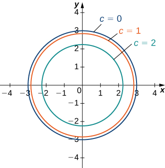

*Figure : Level curves of the function , using  and  corresponds to the origin).*

**14_01_fig_8.png**

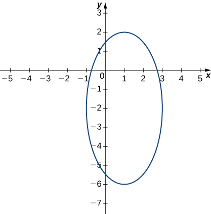

*Figure : Level curve of the function  corresponding to*

**14_01_fig_9.png**

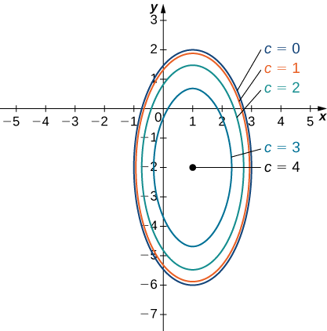

*Figure : Contour map for the function  using the values  and .*

**14_01_fig_10.png**

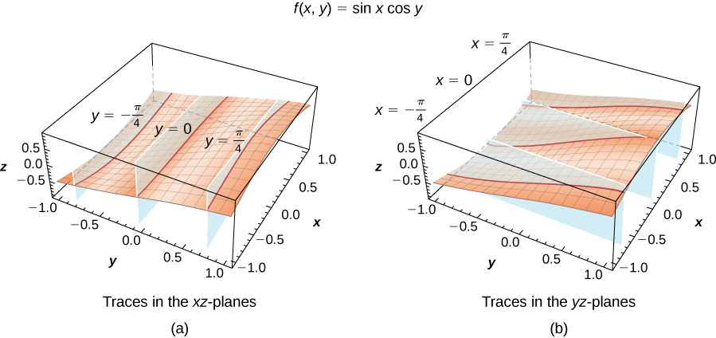

*Figure : Vertical traces of the function  are cosine curves in the  (a) and sine curves in the  (b).*

**14_01_fig_11.png**

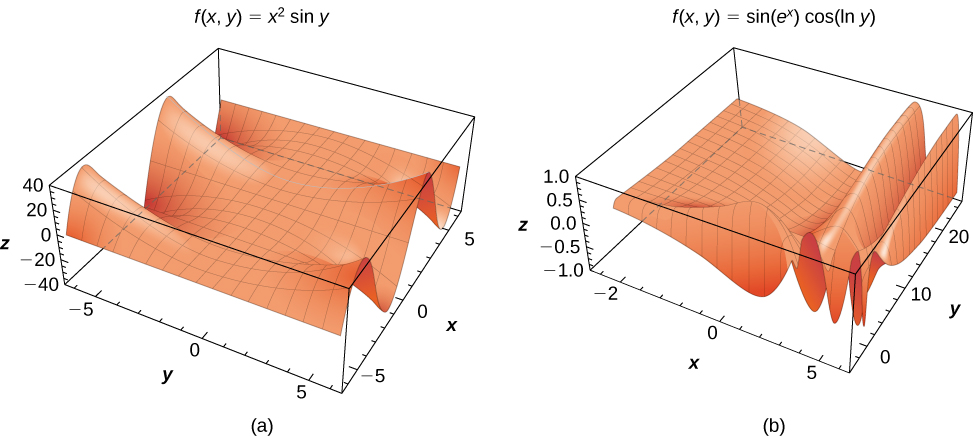

*Figure : Examples of surfaces representing functions of two variables: (a) a combination of a power function and a sine function and (b) a combination of trigonometric, exponential, and logarithmic functions.*

**14_01_fig_12.png**

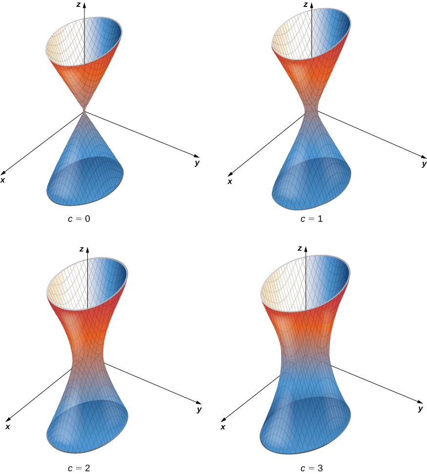

*Figure : A hyperboloid of one sheet with some of its level surfaces.*

### 14.02:_Limits_and_Continuity

**14_02_fig_1.png**

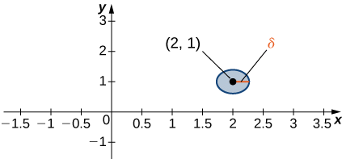

*Figure : A  disk centered around the point .*

**14_02_fig_2.png**

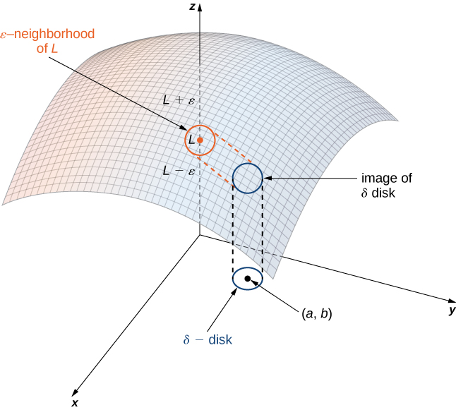

*Figure : The limit of a function involving two variables requires that  be within  of  whenever  is within  of . The smaller the value of , the smaller the value of .*

**14_02_fig_4.png**

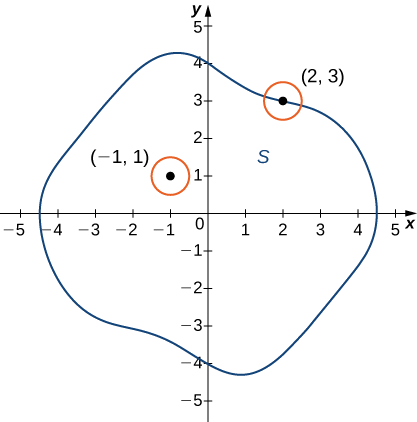

*Figure : In the set  shown,  is an interior point and  is a boundary point.*

**14_02_fig_5.png**

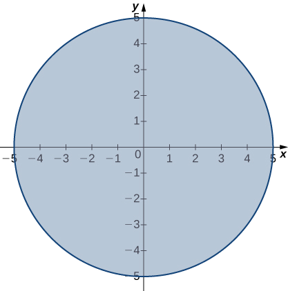

*Figure : Domain of the function .*

**14_02_fig_6.png**

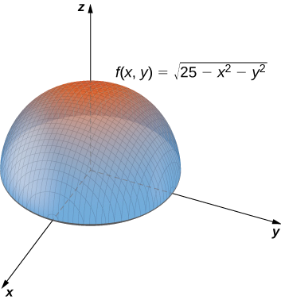

*Figure : Graph of the function .*

**14_02_fig_7.png**

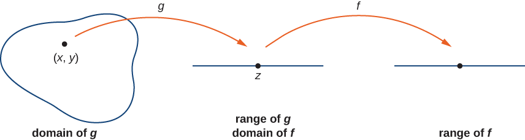

*Figure : The composition of two continuous functions is continuous.*

### 14.03:_Partial_Derivatives

**14_03_fig_1.png**

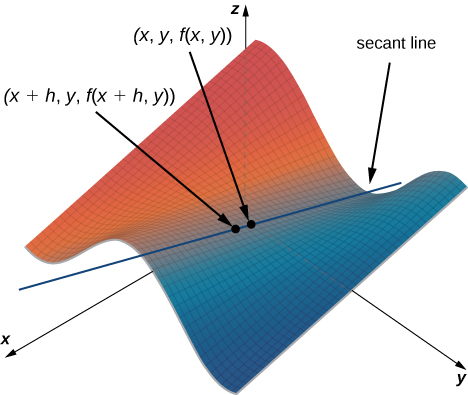

*Figure : Secant line passing through the points  and*

**14_03_fig_2.png**

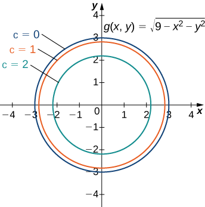

*Figure : Contour map for the function , using  and  corresponds to the origin).*

**14_03_fig_3.png**

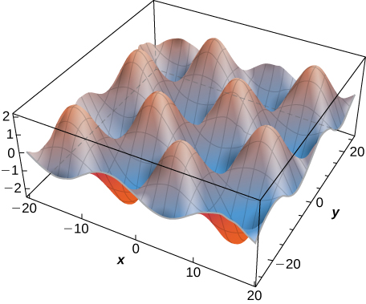

*Figure*

**14_03_fig_4.png**

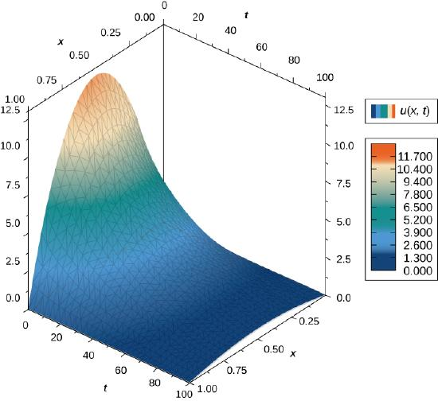

*Figure : Graph of a solution of the heat equation in one dimension over time.*

**14_03_fig_5.png**

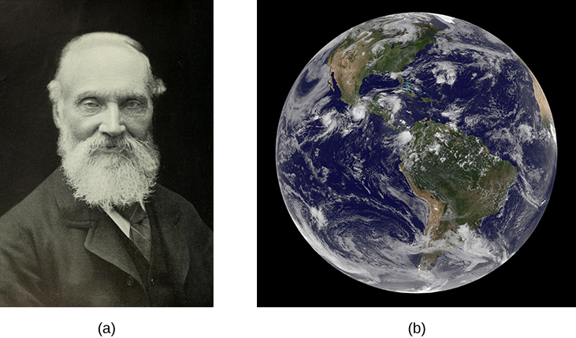

*Figure : (a) William Thomson (Lord Kelvin), 1824-1907, was a British physicist and electrical engineer; (b) Kelvin used the heat diffusion equation to estimate the age of Earth (credit: modification of work by NASA).*

**14_03_fig_6.png**

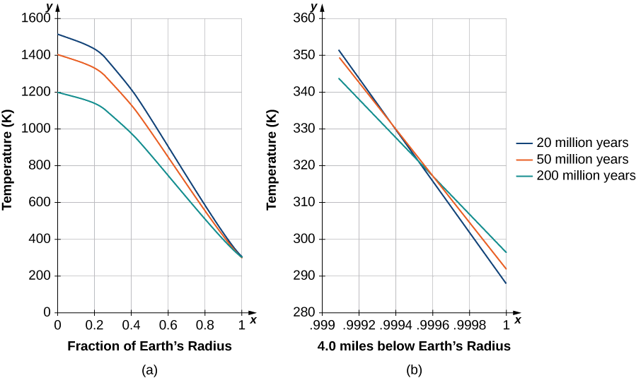

*Figure : Temperature versus radial distance from the center of Earth. (a) Kelvin’s results, plotted to scale. (b) A close-up of the results at a depth of  miles below Earth’s surface.*

### 14.04:_Tangent_Planes_and_Linear_Approximations

**14_04_fig_1.png**

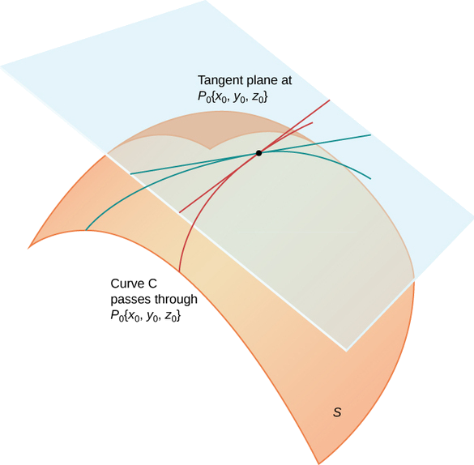

*Figure : The tangent plane to a surface  at a point  contains all the tangent lines to curves in  that pass through .*

**14_04_fig_2.png**

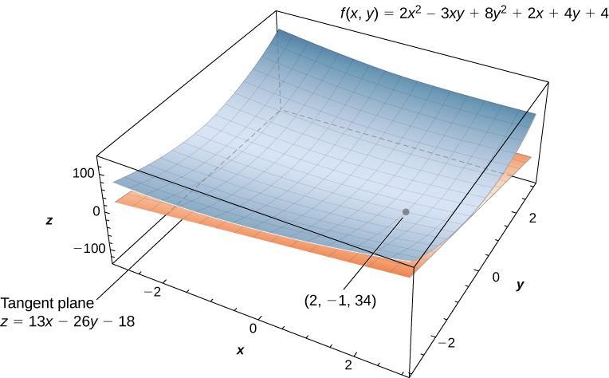

*Figure : Calculating the equation of a tangent plane to a given surface at a given point.*

**14_04_fig_3.png**

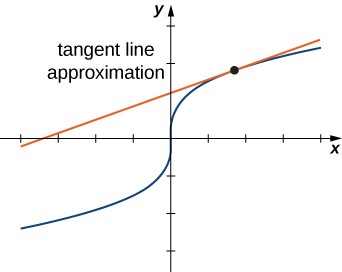

*Figure : Linear approximation of a function in one variable.*

**14_04_fig_4.png**

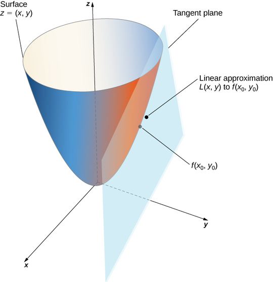

*Figure : Using a tangent plane for linear approximation at a point.*

**14_04_fig_5.png**

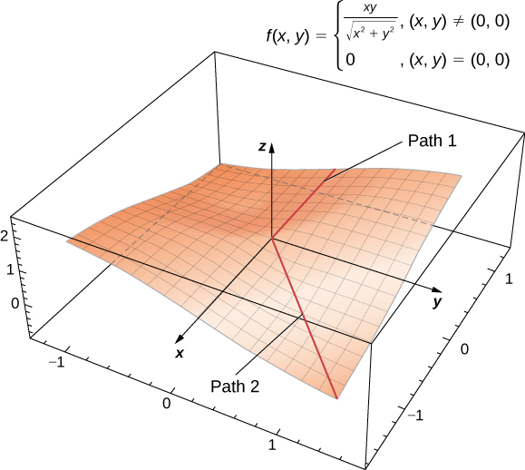

*Figure : This function  (Equation \ref{oddfunction}) is not differentiable at the origin.*

**14_04_fig_6.png**

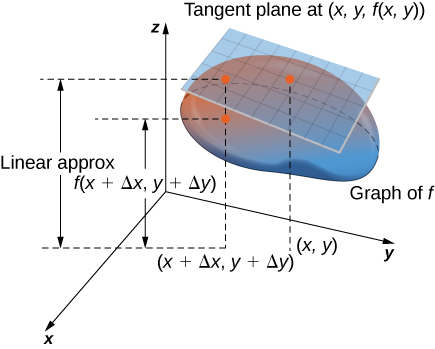

*Figure : The linear approximation is calculated via the formula*

### 14.05:_The_Chain_Rule_for_Multivariable_Functions

**14_05_fig_1.png**

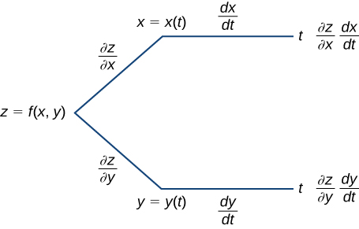

*Figure : Tree diagram for the case*

**14_05_fig_2.png**

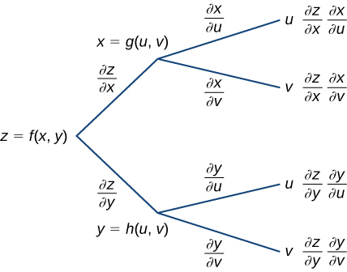

*Figure : Tree diagram for  and .*

**14_05_fig_3.png**

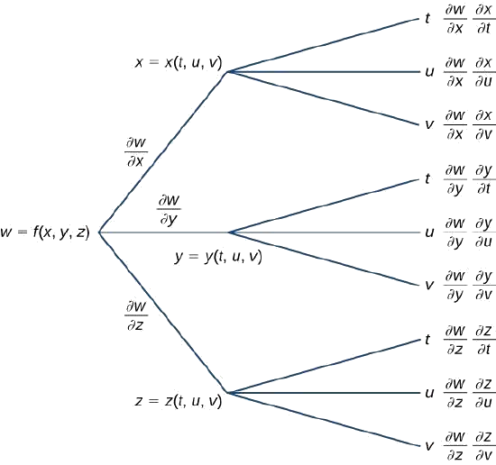

*Figure : Tree diagram for a function of three variables, each of which is a function of three independent variables.*

**14_05_fig_4.png**

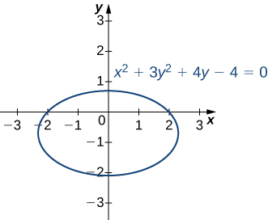

*Figure : Graph of the ellipse defined by .*

**14_05_fig_5.png**

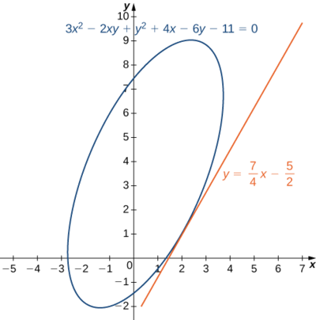

*Figure : Graph of the rotated ellipse defined by .*

### 14.06:_Directional_Derivatives_and_the_Gradient

**14_06_fig_1.png**

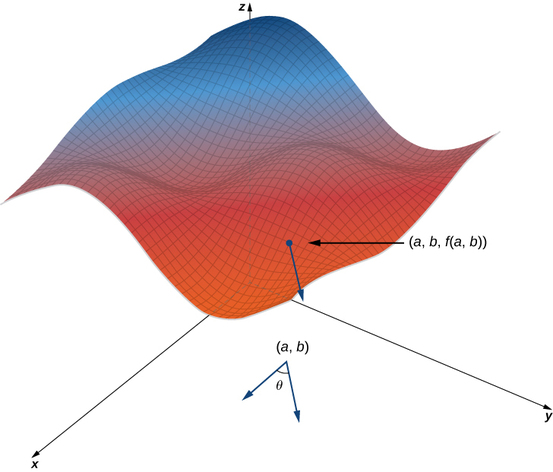

*Figure : Finding the directional derivative at a point on the graph of . The slope of the blue arrow on the graph indicates the value of the directional derivative at that point.*

**14_06_fig_2.png**

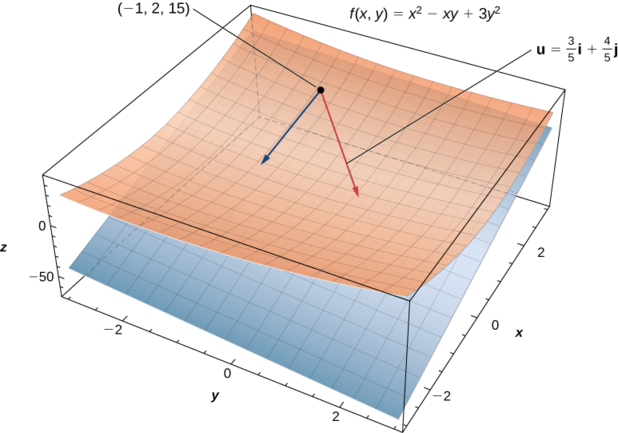

*Figure : Finding the directional derivative in a given direction  at a given point on a surface. The plane is tangent to the surface at the given point*

**14_06_fig_3.png**

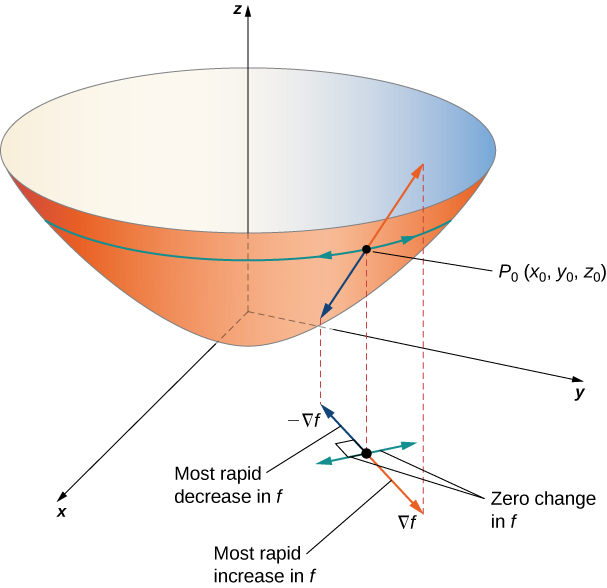

*Figure : The gradient indicates the maximum and minimum values of the directional derivative at a point.*

**14_06_fig_4.png**

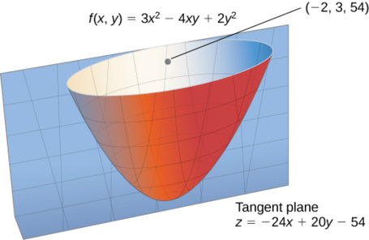

*Figure : The maximum value of the directional derivative at  is in the direction of the gradient.*

**14_06_fig_5.png**

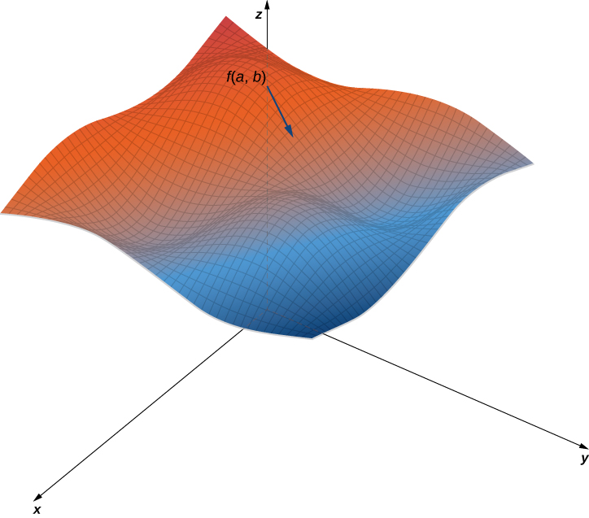

*Figure : A typical surface in . Given a point on the surface, the directional derivative can be calculated using the gradient.*

**14_06_fig_6.png**

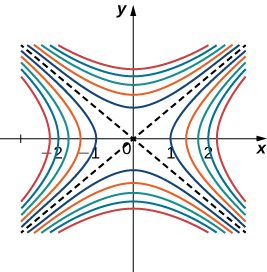

*Figure : Contour map for the function  using level values between  and .*

**14_06_fig_7.png**

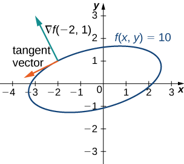

*Figure : Tangent and normal vectors to  at point .*

### 14.07:_Maxima_Minima_Problems

**14_07_fig_1.png**

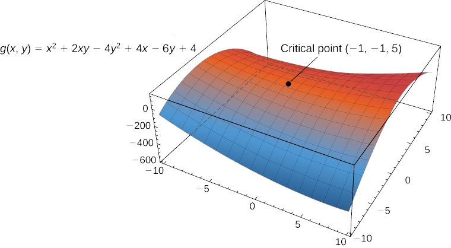

*Figure : The function  has a critical point at .*

**14_07_fig_2.png**

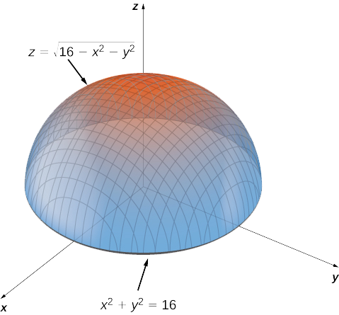

*Figure : The graph of  has a maximum value when . It attains its minimum value at the boundary of its domain, which is the circle*

**14_07_fig_3.png**

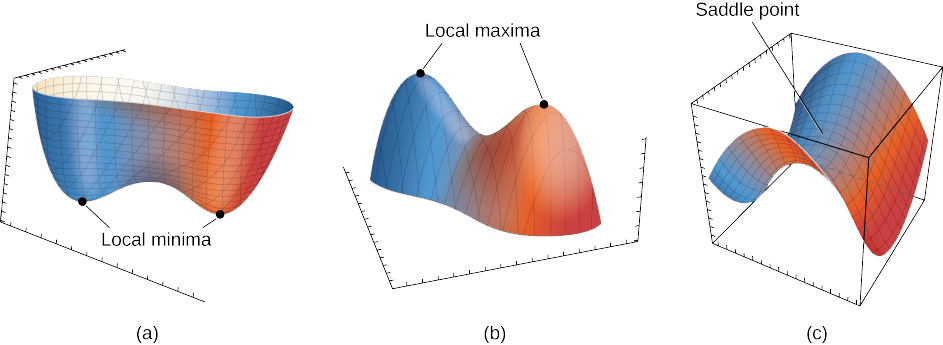

*Figure : The second derivative test can often determine whether a function of two variables has local minima (a), local maxima (b), or a saddle point (c).*

**14_07_fig_4.png**

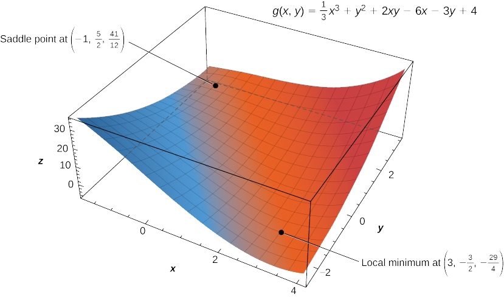

*Figure : The function  has a local minimum and a saddle point.*

**14_07_fig_5.png**

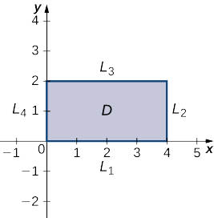

*Figure : Graph of the domain of the function*

**14_07_fig_6.png**

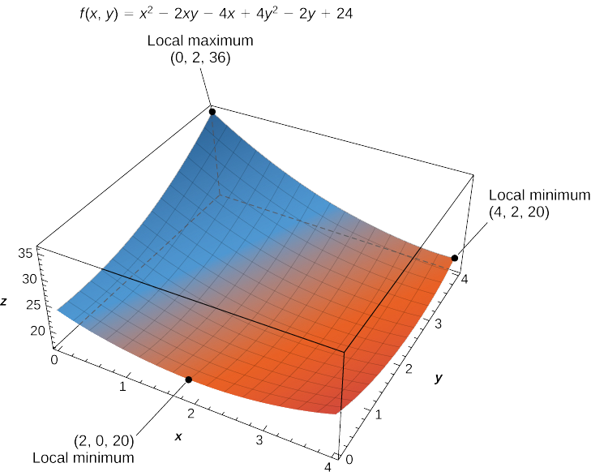

*Figure : The function  has two global minima and one global maximum over its domain.*

**14_07_fig_7.png**

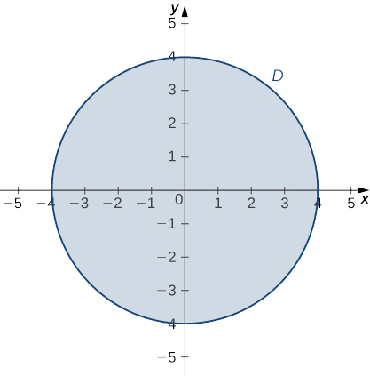

*Figure : Graph of the restricted domain of the function .*

**14_07_fig_9.png**

*Figure : (credit: modification of work by oatsy40, Flickr)*

**14_07_fig_10.png**

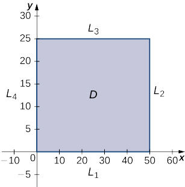

*Figure : Graph of the domain of the function*

**14_07_fig_11.png**

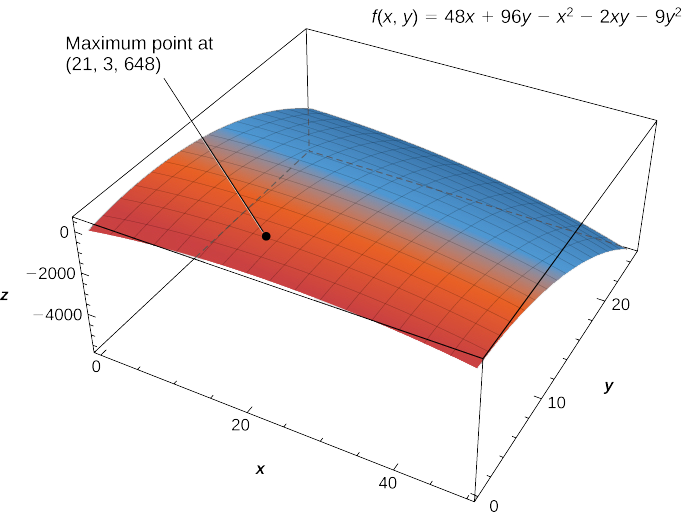

*Figure : The profit function  has a maximum at .*

### 14.08:_Lagrange_Multipliers

**14_08_fig_1.png**

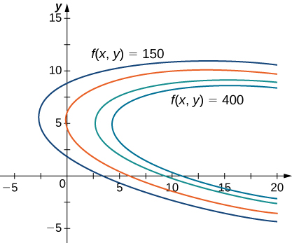

*Figure : Graph showing level curves of the function  corresponding to  and*

**14_08_fig_2.png**

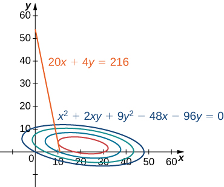

*Figure : Graph of level curves of the function  corresponding to  and . The red graph is the constraint function.*

**14_08_fig_3.png**

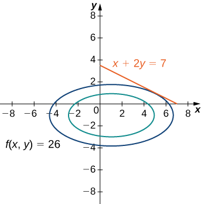

*Figure : Graph of level curves of the function  corresponding to  and . The red graph is the constraint function.*

## 15:_Multiple_Integration

### 15.00:_Prelude_to_Multiple_Integration

**15_00_fig_1.png**

![Figure : The City of Arts and Sciences in Valencia, Spain, has a unique structure along an axis of just two kilometers that was formerly the bed of the River Turia. The l’Hemisfèric has an IMAX cinema with three systems of modern digital projections onto a concave screen of 900 square meters. An oval roof over 100 meters long has been made to look like a huge human eye that comes alive and opens up to the world as the “Eye of Wisdom.” (credit: modification of work by Javier Yaya Tur, Wikimedia Commons)](./15_00_fig_1.png)

*Figure : The City of Arts and Sciences in Valencia, Spain, has a unique structure along an axis of just two kilometers that was formerly the bed of the River Turia. The l’Hemisfèric has an IMAX cinema with three systems of modern digital projections onto a concave screen of 900 square meters. An oval roof over 100 meters long has been made to look like a huge human eye that comes alive and opens up to the world as the “Eye of Wisdom.” (credit: modification of work by Javier Yaya Tur, Wikimedia Commons)*

### 15.01:_Double_Integrals_over_Rectangular_Regions

**15_01_fig_1.png**

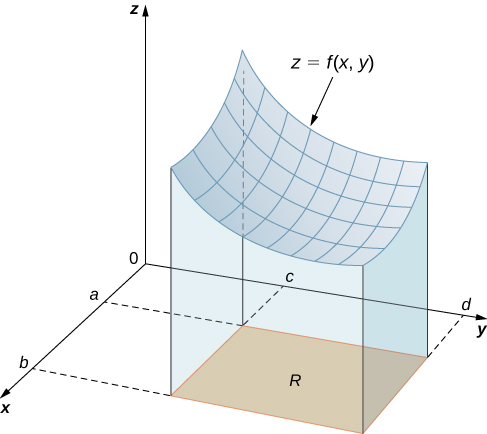

*Figure : The graph of  over the rectangle R in the -plane is a curved surface.*

**15_01_fig_2.png**

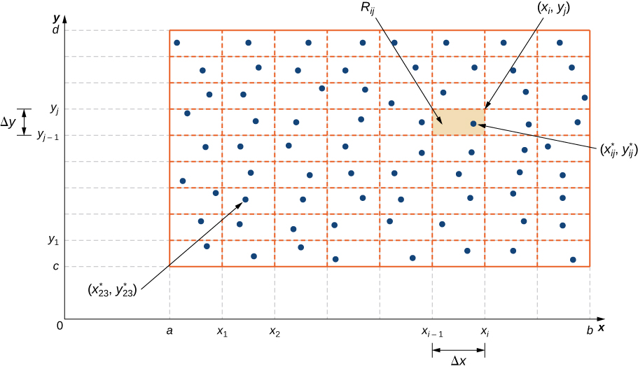

*Figure : Rectangle  is divided into small rectangles  each with area .*

**15_01_fig_3.png**

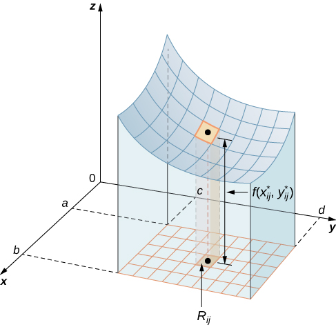

*Figure : A thin rectangular box above  with height .*

**15_01_fig_4.png**

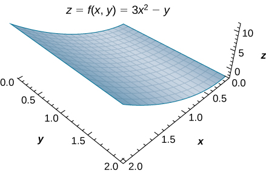

*Figure : The function  graphed over the rectangular region .*

**15_01_fig_5.png**

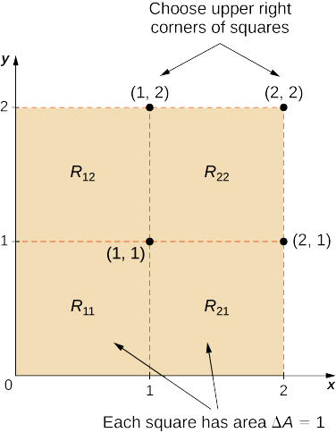

*Figure : Subrectangles for the rectangular region .*

**15_01_fig_6.png**

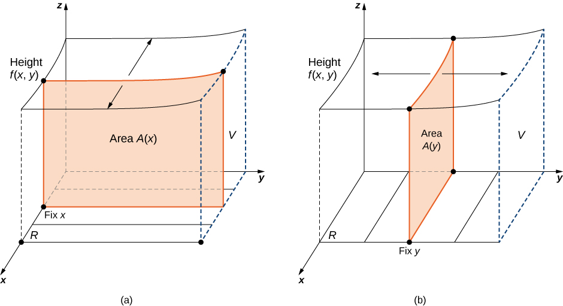

*Figure : (a) Integrating first with respect to  and then with respect to  to find the area  and then the volume ; (b) integrating first with respect to  and then with respect to  to find the area  and then the volume .*

**15_01_fig_7.png**

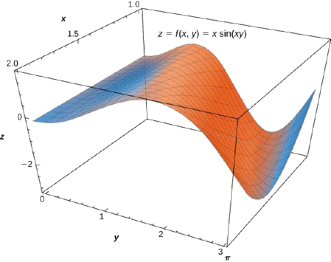

*Figure : The function  over the rectangular region*

**15_01_fig_8.png**

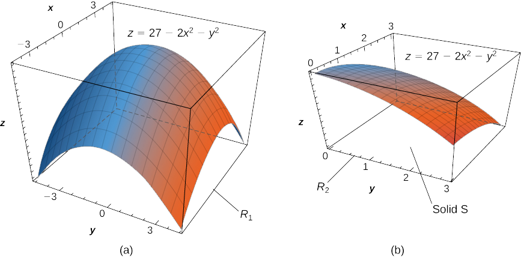

*Figure : (a) The surface  above the square region . (b) The solid  lies under the surface  above the square region .*

**15_01_fig_9.png**

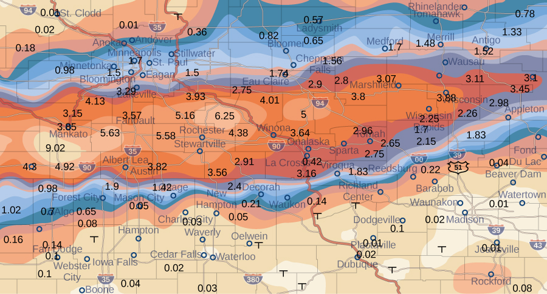

*Figure : Effects of Hurricane Karl, which dumped 4–8 inches (100–200 mm) of rain in some parts of southwest Wisconsin, southern Minnesota, and southeast South Dakota over a span of 300 miles east to west and 250 miles north to south.*

**15_01_fig_10.png**

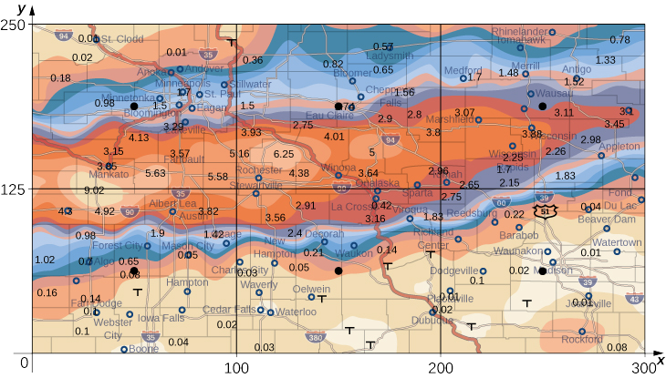

*Figure : Storm rainfall with rectangular axes and showing the midpoints of each subrectangle.*

### 15.02:_Double_Integrals_over_General_Regions

**15_02_fig_1.png**

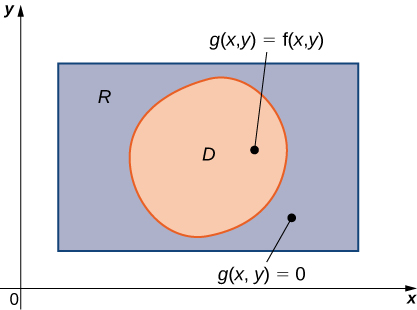

*Figure : For a region  that is a subset of , we can define a function  to equal  at every point in  and  at every point of  not in .*

**15_02_fig_2.png**

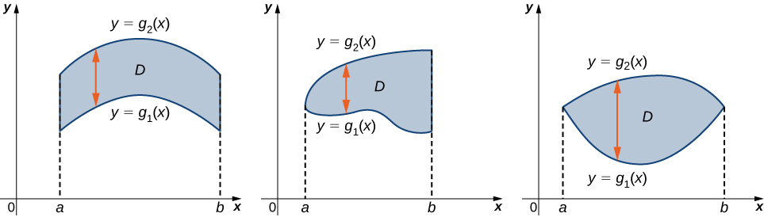

*Figure . A Type I region lies between two vertical lines and the graphs of two functions of .*

**15_02_fig_3.png**

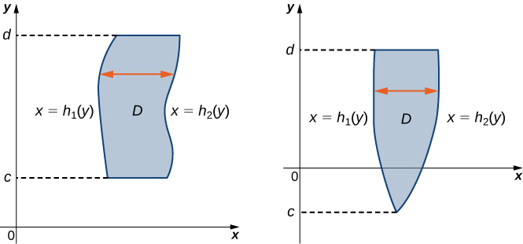

*Figure : A Type II region lies between two horizontal lines and the graphs of two functions of .*

**15_02_fig_4.png**

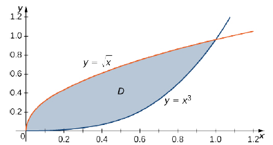

*Figure : Region  can be described as Type I or as Type II.*

**15_02_fig_5.png**

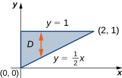

*Figure : We can express region  as a Type I region and integrate from  to  between the lines  and .*

**15_02_fig_6.png**

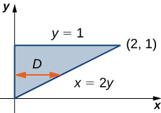

*Figure .*

**15_02_fig_7.png**

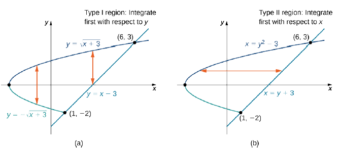

*Figure : The region  in this example can be either (a) Type I or (b) Type II.*

**15_02_fig_8.png**

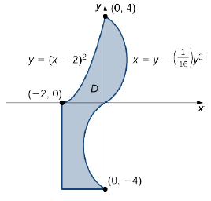

*Figure : This region can be decomposed into a union of three regions of Type I or Type II.*

**15_02_fig_9.png**

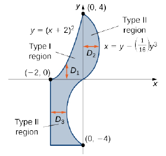

*Figure : Breaking the region into three subregions makes it easier to set up the integration.*

**15_02_fig_10.png**

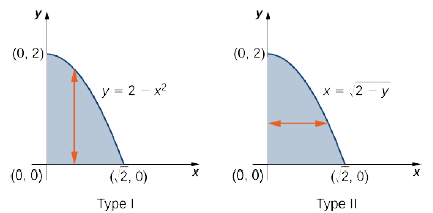

*Figure : Converting a region from Type I to Type II.*

**15_02_fig_11.png**

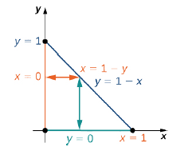

*Figure : A triangular region  for integrating in two ways.*

**15_02_fig_12.png**

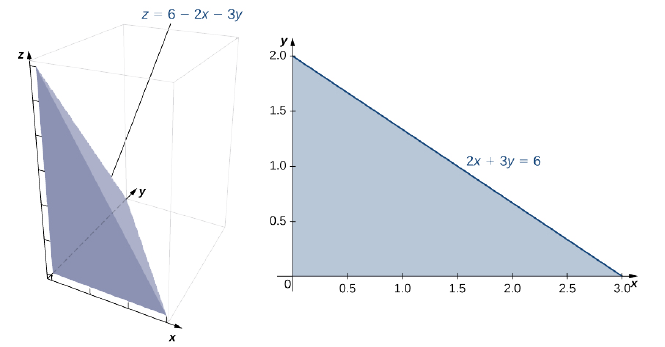

*Figure : A tetrahedron consisting of the three coordinate planes and the plane , with the base bound by , and .*

**15_02_fig_13.png**

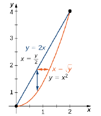

*Figure : The region bounded by  and .*

**15_02_fig_14.png**

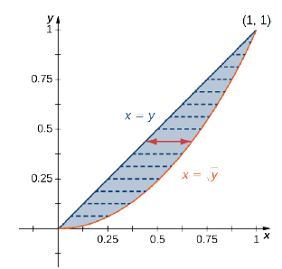

*Figure : The region bounded by  and .*

**15_02_fig_15.png**

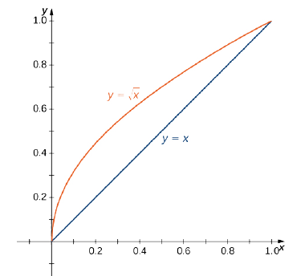

*Figure : The function  is continuous at all points of the region  except .*

**15_02_fig_16.png**

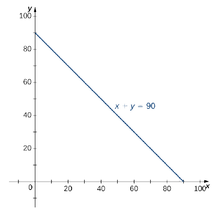

*Figure : The region of integration for a joint probability density function.*

### 15.03:_Double_Integrals_in_Polar_Coordinates

**15_03_fig_1.png**

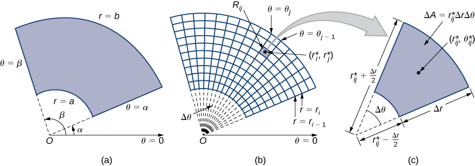

*Figure : (a) A polar rectangle  (b) divided into subrectangles  (c) Close-up of a subrectangle.*

**15_03_fig_2.png**

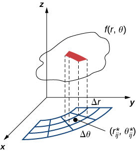

*Figure : Finding the volume of the thin box above polar rectangle .*

**15_03_fig_3.png**

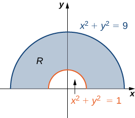

*Figure : The polar region  lies between two semicircles.*

**15_03_fig_4.png**

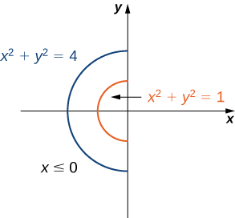

*Figure : The annular region of integration .*

**15_03_fig_5.png**

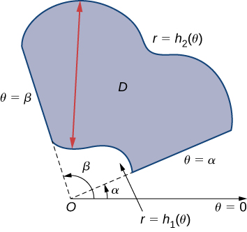

*Figure : A general polar region between  and .*

**15_03_fig_6.png**

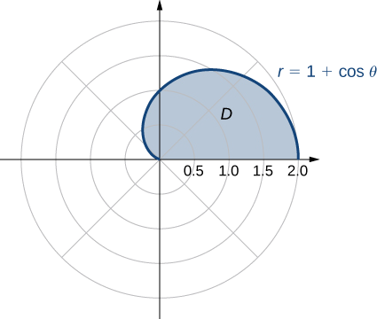

*Figure : The region  is the top half of a cardioid.*

**15_03_fig_7.png**

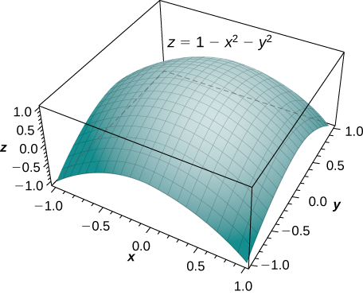

*Figure : Finding the volume of a solid under a paraboloid and above the unit circle.*

**15_03_fig_8.png**

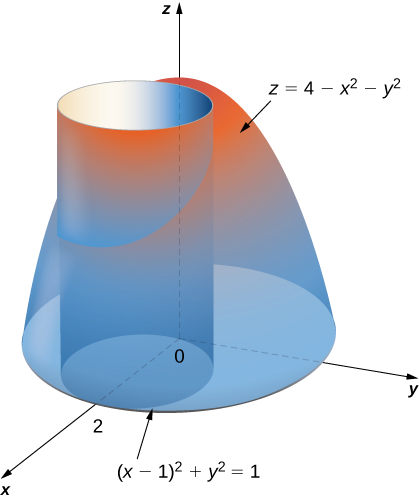

*Figure : Finding the volume of a solid with a paraboloid cap and a circular base.*

**15_03_fig_9.png**

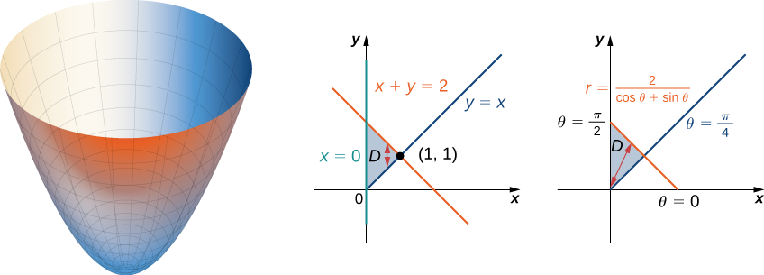

*Figure : Finding the volume of a solid under a paraboloid and above a given triangle.*

**15_03_fig_10.png**

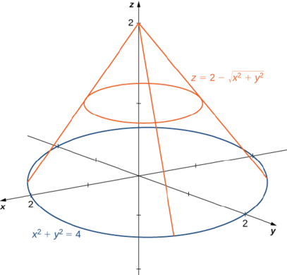

*Figure : Finding the volume of a solid inside the cone and above the -plane.*

**15_03_fig_11.png**

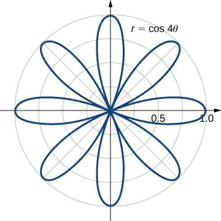

*Figure : Finding the area of a polar rose with eight petals.*

**15_03_fig_12.png**

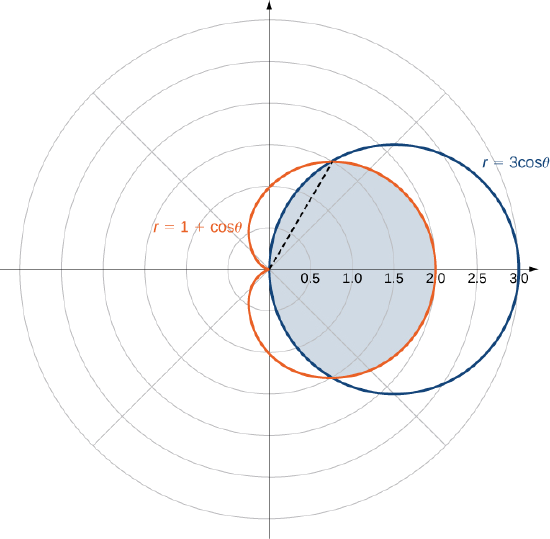

*Figure : Finding the area enclosed by both a circle and a cardioid.*

### 15.04:_Triple_Integrals

**15_04_fig_1.png**

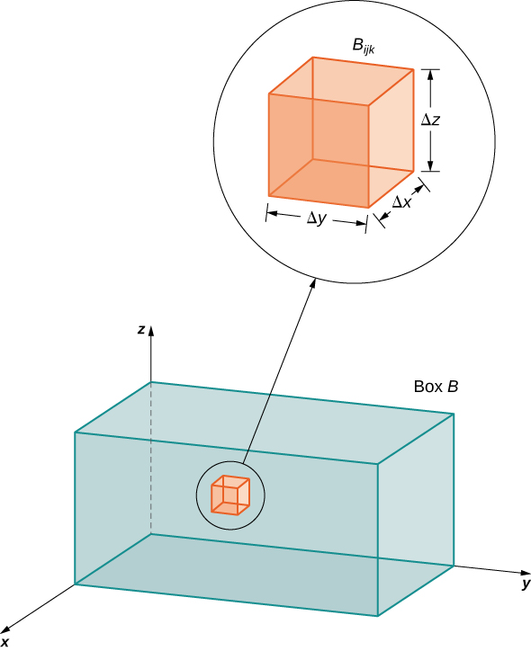

*Figure : A rectangular box in  divided into subboxes by planes parallel to the coordinate planes.*

**15_04_fig_2.png**

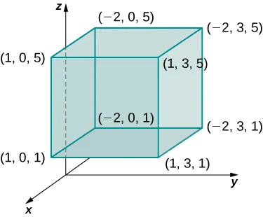

*Figure : Evaluating a triple integral over a given rectangular box.*

**15_04_fig_3.png**

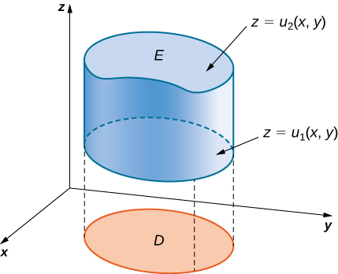

*Figure : We can describe region  as the space between  and  above the projection  of  onto the -plane.*

**15_04_fig_4.png**

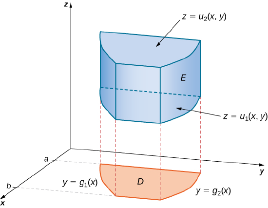

*Figure : A box  where the projection  in the -plane is of Type I.*

**15_04_fig_5.png**

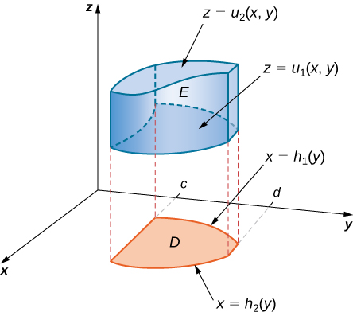

*Figure : A box  where the projection  in the -plane is of Type II.*

**15_04_fig_6.png**

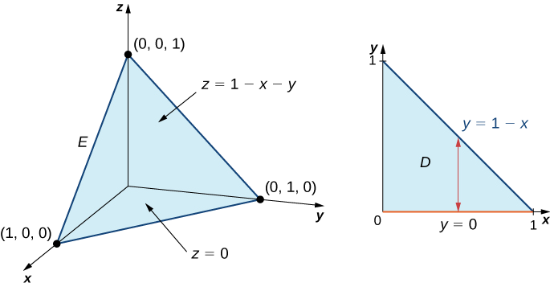

*Figure : The solid  has a projection  on the -plane of Type I.*

**15_04_fig_7.png**

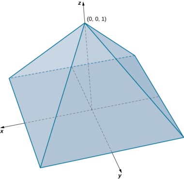

*Figure : Finding the volume of a pyramid with a square base.*

**15_04_fig_8.png**

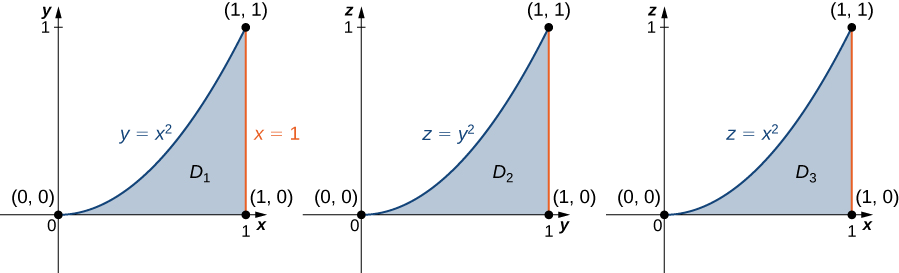

*Figure . The three cross sections of  on the three coordinate planes.*

**15_04_fig_9.png**

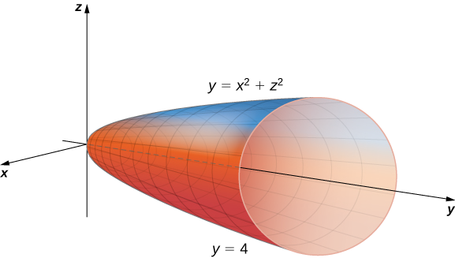

*Figure . Integrating a triple integral over a paraboloid.*

**15_04_fig_10.png**

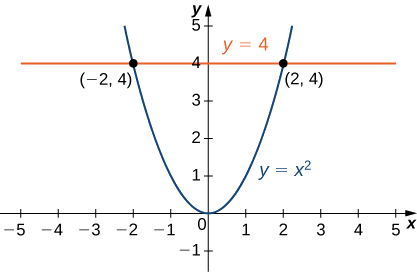

*Figure . Cross section in the -plane of the paraboloid in Figure .*

### 15.05:_Triple_Integrals_in_Cylindrical_and_Spherical_Coordinates

**15_05_fig_1.png**

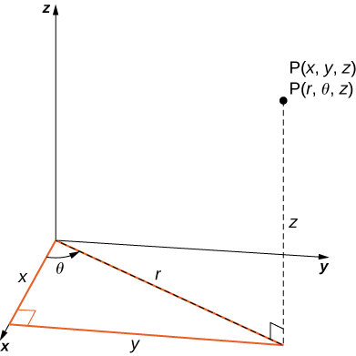

*Figure : Cylindrical coordinates are similar to polar coordinates with a vertical  coordinate added.*

**15_05_fig_2.png**

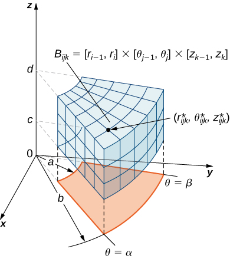

*Figure : A cylindrical box  described by cylindrical coordinates.*

**15_05_fig_3.png**

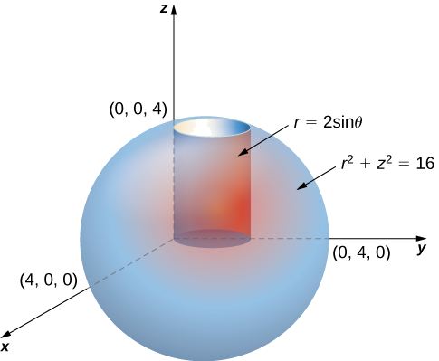

*Figure : Setting up a triple integral in cylindrical coordinates over a cylindrical region.*

**15_05_fig_4.png**

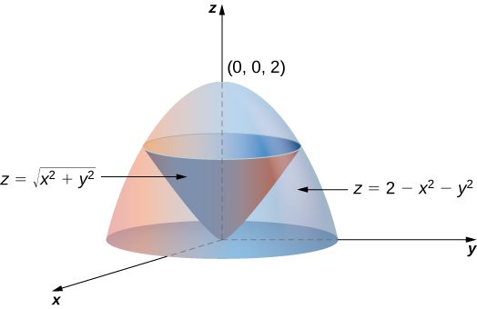

*Figure : Setting up a triple integral in cylindrical coordinates over a conical region.*

**15_05_fig_5.png**

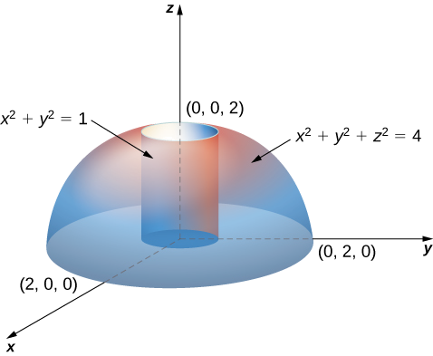

*Figure : Finding a cylindrical volume with a triple integral in cylindrical coordinates.*

**15_05_fig_6.png**

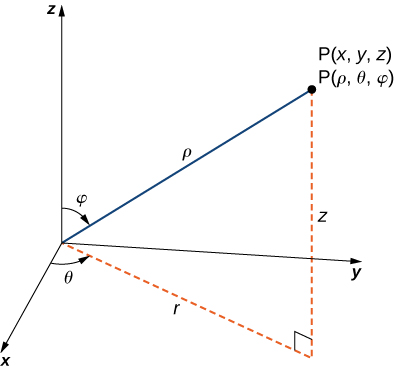

*Figure : The spherical coordinate system locates points with two angles and a distance from the origin.*

**15_05_fig_7.png**

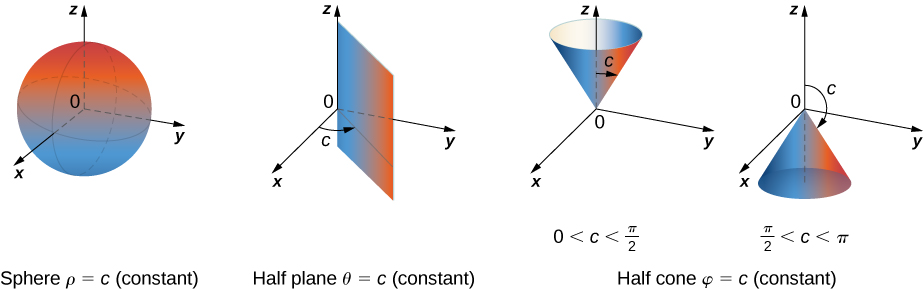

*Figure : Spherical coordinates are especially convenient for working with solids bounded by these types of surfaces. (The letter  indicates a constant.)*

**15_05_fig_8.png**

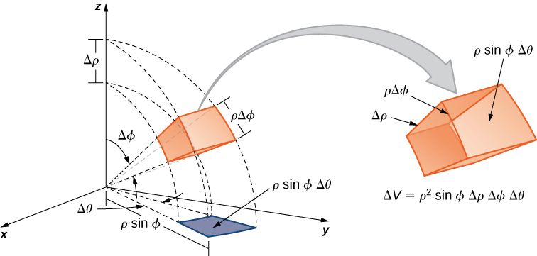

*Figure : The volume element of a box in spherical coordinates.*

**15_05_fig_9.png**

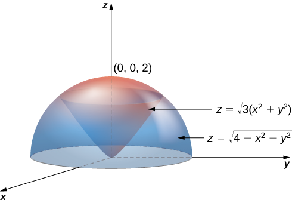

*Figure : A region bounded below by a cone and above by a hemisphere.*

**15_05_fig_10.png**

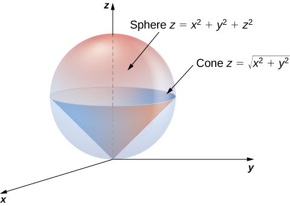

*Figure :. A region bounded below by a cone and above by a sphere.*

**15_05_fig_11.png**

*Figure : (credit: modification of work by Javier Yaya Tur, Wikimedia Commons)*

**15_05_fig_12.png**

*Figure : Balloons lift off at the  Albuquerque International Balloon Fiesta. (credit: David Herrera, Flickr)*

**15_05_fig_13.png**

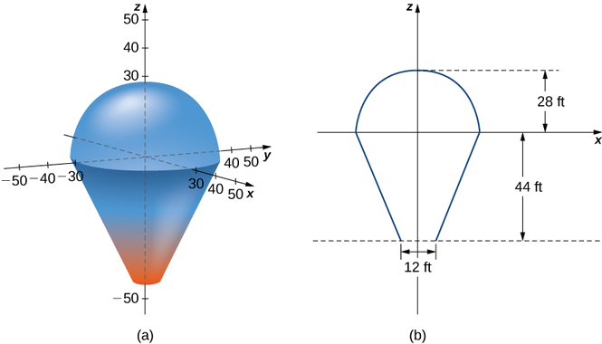

*Figure : (a) Use a half sphere to model the top part of the balloon and a frustum of a cone to model the bottom part of the balloon. (b) A cross section of the balloon showing its dimensions.*

**15_05_fig_14.png**

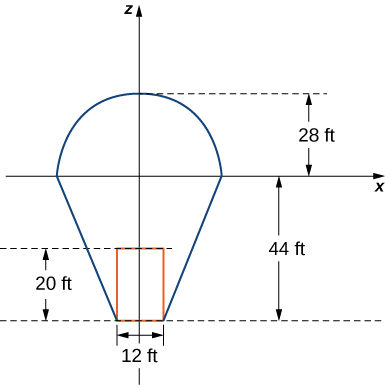

*Figure : Activating the burner heats the air in a -foot-high, -foot-wide column directly above the burner.*

### 15.06:_Calculating_Centers_of_Mass_and_Moments_of_Inertia

**15_06_fig_1.png**

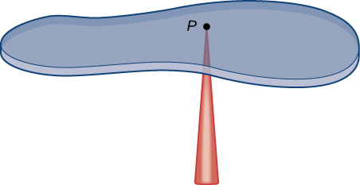

*Figure : A lamina is perfectly balanced on a spindle if the lamina’s center of mass sits on the spindle.*

**15_06_fig_2.png**

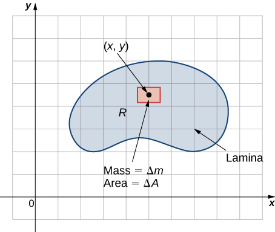

*Figure : The density of a lamina at a point is the limit of its mass per area in a small rectangle about the point as the area goes to zero.*

**15_06_fig_3.png**

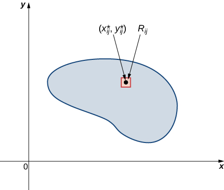

*Figure : Subdividing the lamina into tiny rectangles  each containing a sample point .*

**15_06_fig_4.png**

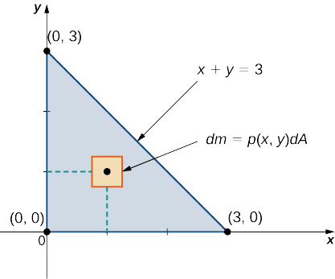

*Figure : A lamina in the -plane with density .*

**15_06_fig_5.png**

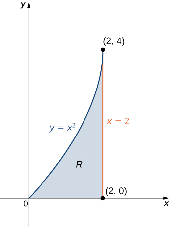

*Figure : Locating the center of mass of a lamina  with density .*

**15_06_fig_6.png**

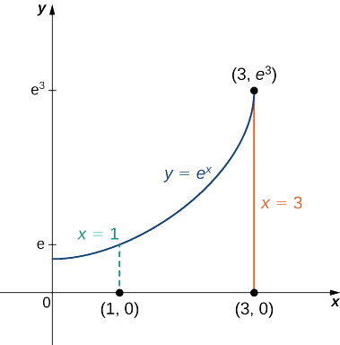

*Figure : Finding a centroid of a region below the curve .*

**15_06_fig_7.png**

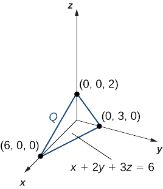

*Figure : Finding the mass of a three-dimensional solid .*

### 15.07:_Change_of_Variables_in_Multiple_Integrals

**15_07_fig_1.png**

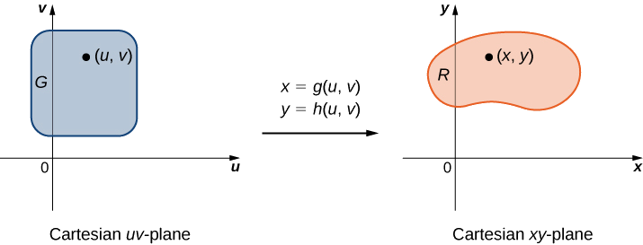

*Figure : The transformation of a region  in the -plane into a region  in the -plane.*

**15_07_fig_2.png**

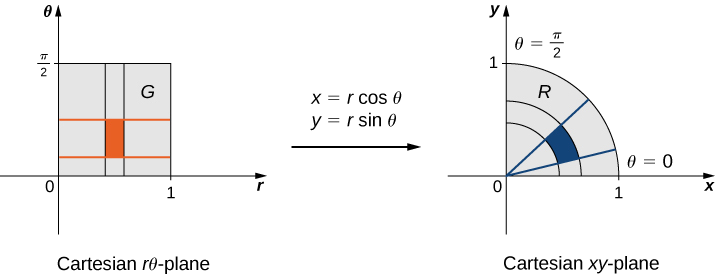

*Figure : A rectangle in the -plane is mapped into a quarter circle in the -plane.*

**15_07_fig_3.png**

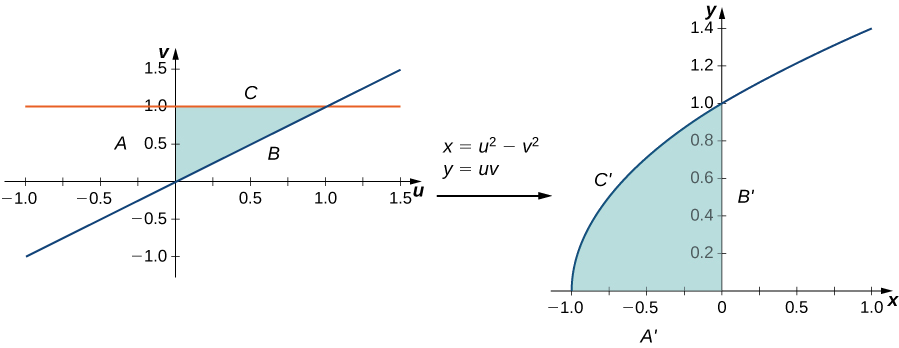

*Figure : A triangular region in the -plane is transformed into an image in the -plane.*

**15_07_fig_4.png**

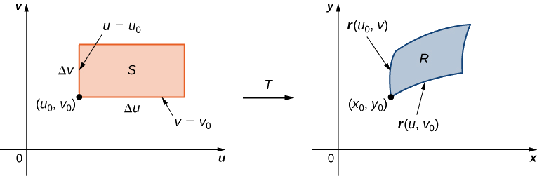

*Figure : A small rectangle  in the -plane is transformed into a region  in the -plane.*

**15_07_fig_5.png**

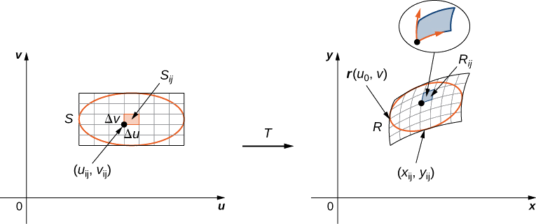

*Figure : The subrectangles  in the -plane transform into subrectangles  in the -plane.*

**15_07_fig_6.png**

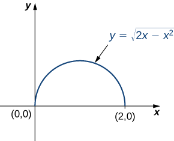

*Figure : Changing a region from rectangular to polar coordinates.*

**15_07_fig_7.png**

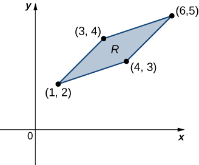

*Figure : The region of integration for the given integral.*

**15_07_fig_8.png**

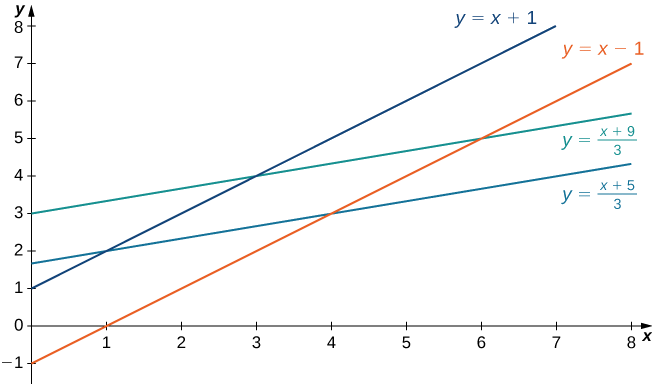

*Figure : A parallelogram in the -plane that we want to transform by a change in variables.*

**15_07_fig_9.png**

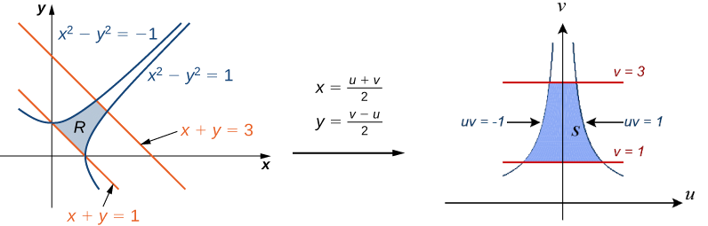

*Figure : Transforming the region  into the region  to simplify the computation of an integral.*

**15_07_fig_10.png**

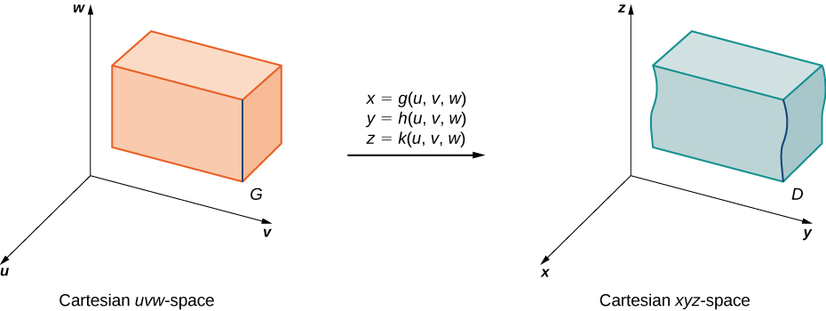

*Figure : A region  in -space mapped to a region  in -space.*

**15_07_fig_11.png**

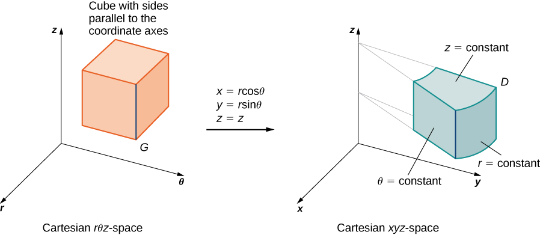

*Figure : The transformation from rectangular coordinates to cylindrical coordinates can be treated as a change of variables from region  in -space to region  in -space.*

**15_07_fig_12.png**

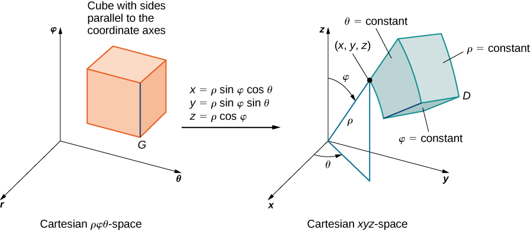

*Figure : The transformation from rectangular coordinates to spherical coordinates can be treated as a change of variables from region  in -space to region  in -space.*

**15_07_fig_13.png**

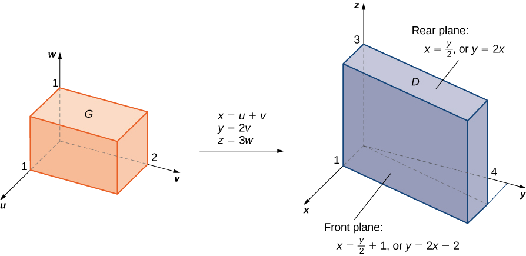

*Figure : The region  in -space is transformed to region  in -space.*

## 16:_Vector_Calculus

### 16.00:_Prelude_to_Vector_Calculus

**16_00_fig_1.png**

*Figure : Hurricanes form from rotating winds driven by warm temperatures over the ocean. Meteorologists forecast the motion of hurricanes by studying the rotating vector fields of their wind velocity. Shown is Cyclone Catarina in the South Atlantic Ocean in 2004, as seen from the International Space Station. (credit: modification of work by NASA)*

### 16.01:_Vector_Fields

**16_01_fig_1.png**

*Figure  (a) The gravitational field exerted by two astronomical bodies on a small object. (b) The vector velocity field of water on the surface of a river shows the varied speeds of water. Red indicates that the magnitude of the vector is greater, so the water flows more quickly; blue indicates a lesser magnitude and a slower speed of water flow.*

**16_01_fig_2.png**

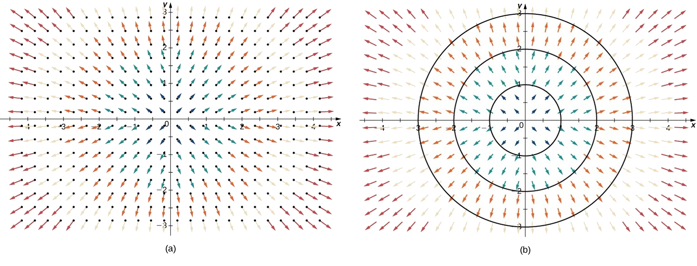

*Figure : (a) A visual representation of the radial vector field . (b) The radial vector field  with overlaid circles. Notice that each vector is perpendicular to the circle on which it is located.*

**16_01_fig_3.png**

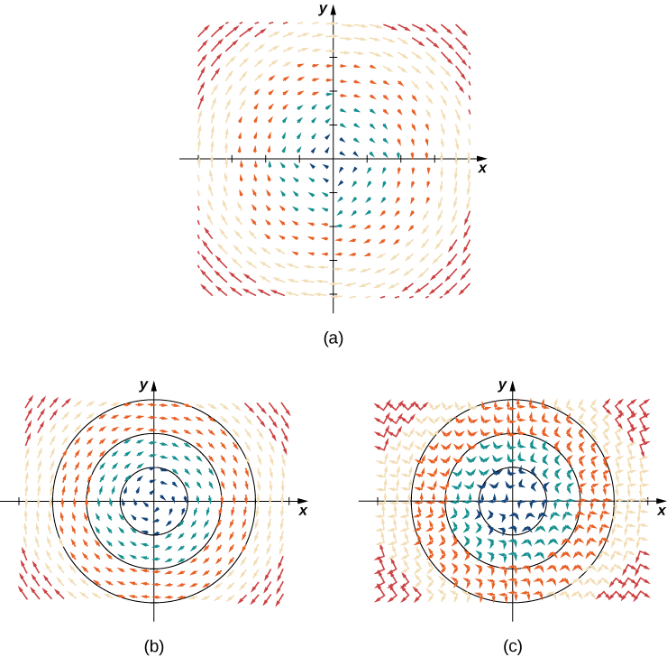

*Figure : (a) A visual representation of vector field . (b) Vector field  with circles centered at the origin. (c) Vector  is perpendicular to radial vector  at point .*

**16_01_fig_4.png**

*Figure : (credit: modification of work by NASA)*

**16_01_fig_5.png**

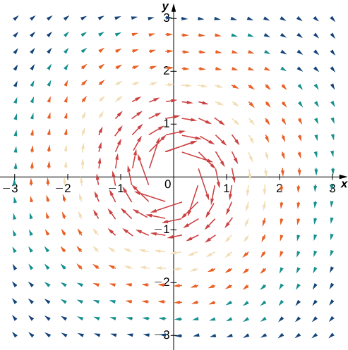

*Figure : A visual representation of vector field . This vector field could be used to model whirlpool motion of a fluid.*

**16_01_fig_6.png**

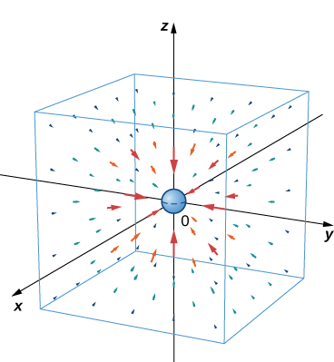

*Figure : A visual representation of gravitational vector field  for a large mass at the origin.*

**16_01_fig_7.png**

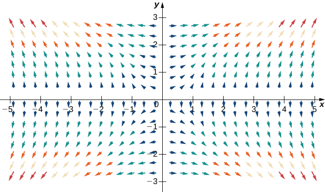

*Figure : The gradient vector field is , where .*

**16_01_fig_8.png**

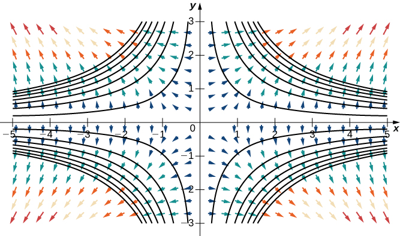

*Figure : The gradient field of  and several level curves of . Notice that as the level curves get closer together, the magnitude of the gradient vectors increases.*

**16_01_fig_9.png**

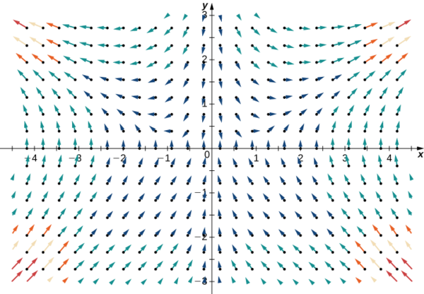

*Figure : Velocity field  has a potential function and is a conservative field.*

### 16.02:_Line_Integrals

**16_02_fig_1.png**

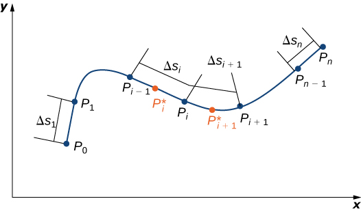

*Figure : Curve  has been divided into n pieces, and a point inside each piece has been chosen.*

**16_02_fig_2.png**

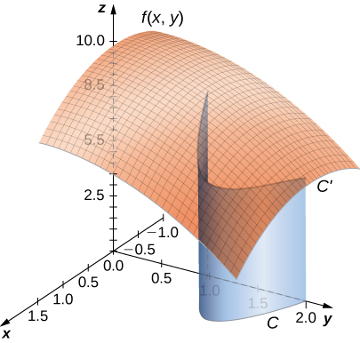

*Figure : The area of the blue sheet is .*

**16_02_fig_3.png**

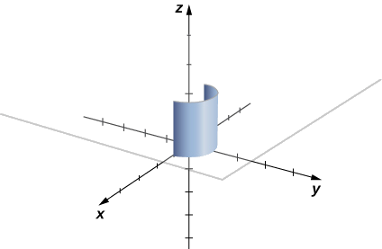

*Figure : The sheet that is formed by the upper half of the unit circle in a plane and the graph of .*

**16_02_fig_4.png**

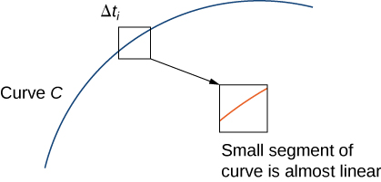

*Figure : If we zoom in on the curve enough by making  very small, then the corresponding piece of the curve is approximately linear.*

**16_02_fig_5.png**

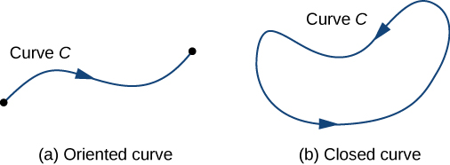

*Figure : (a) An oriented curve between two points. (b) A closed oriented curve.*

**16_02_fig_6.png**

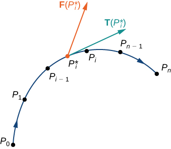

*Figure : Curve  is divided into n pieces, and a point inside each piece is chosen. The dot product of any tangent vector in the ith piece with the corresponding vector  is approximated by .*

**16_02_fig_7.png**

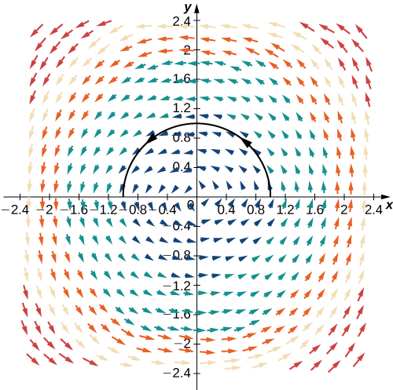

*Figure : This figure shows curve ,  in vector field .*

**16_02_fig_8.png**

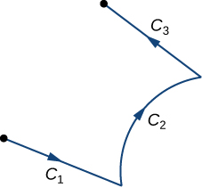

*Figure : The union of , ,  is a piecewise smooth curve.*

**16_02_fig_9.png**

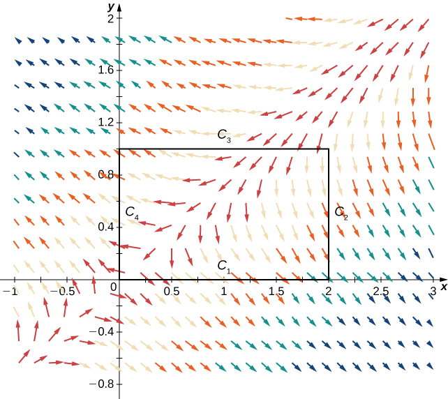

*Figure : Rectangle and vector field for Example .*

**16_02_fig_10.png**

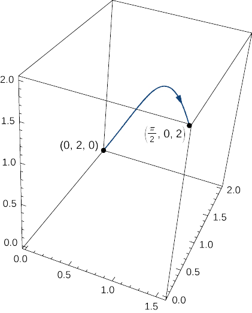

*Figure : The wire from Example .*

**16_02_fig_11.png**

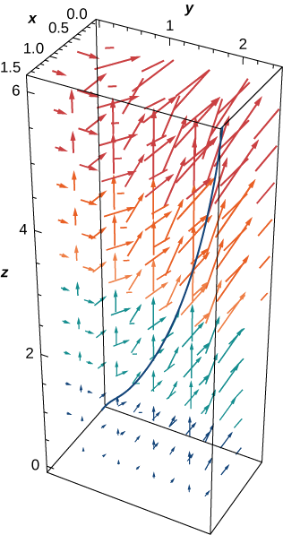

*Figure : The curve and vector field for Example .*

**16_02_fig_12.png**

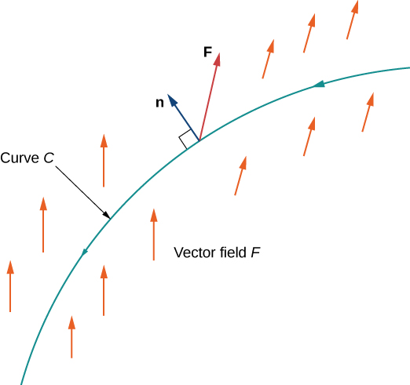

*Figure : The flux of vector field  across curve  is computed by an integral similar to a vector line integral.*

**16_02_fig_13.png**

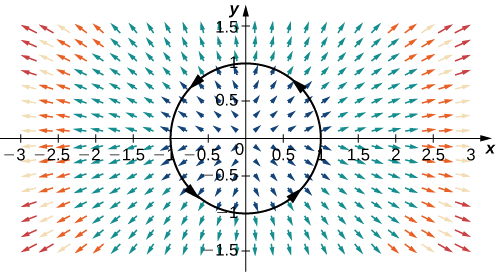

*Figure : A unit circle in vector field .*

### 16.03:_Conservative_Vector_Fields

**16_03_fig_1.png**

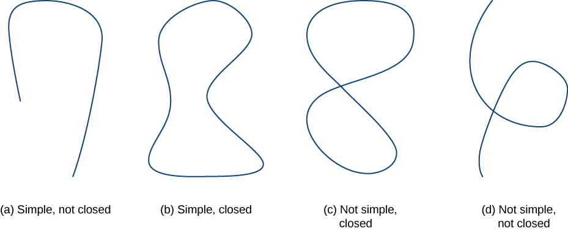

*Figure . Types of curves that are simple or not simple and closed or not closed.*

**16_03_fig_2.png**

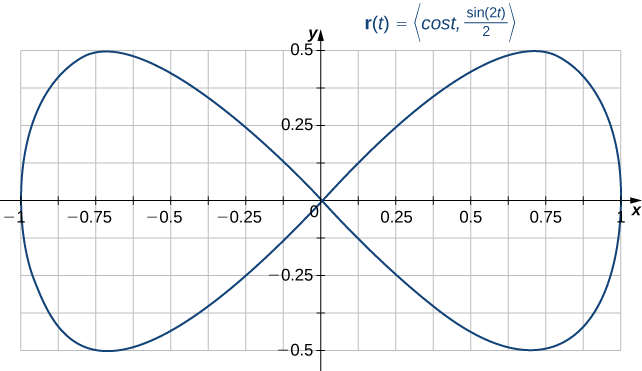

*Figure . A curve that is closed but not simple.*

**16_03_fig_3.png**

*Figure : Not all connected regions are simply connected. (a) Simply connected regions have no holes. (b) Connected regions that are not simply connected may have holes but you can still find a path in the region between any two points. (c) A region that is not connected has some points that cannot be connected by a path in the region.*

**16_03_fig_4.png**

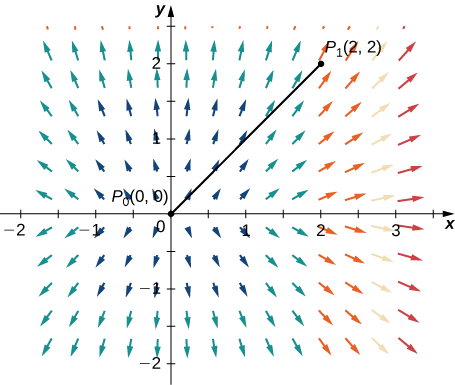

*Figure : The value of line integral  depends only on the value of the potential function of   at the endpoints of the curve.*

**16_03_fig_5.png**

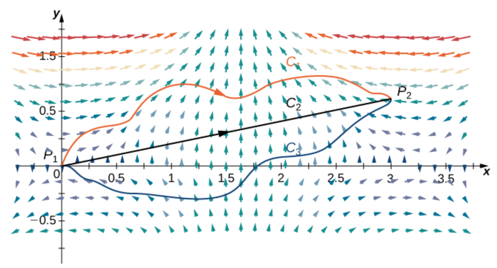

*Figure : The vector field is conservative, and therefore independent of path.*

**16_03_fig_6.png**

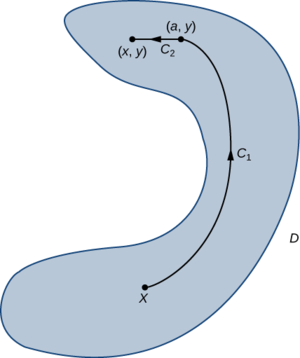

*Figure . Here,  is any path from  to  that stays inside , and  is the horizontal line segment from  to .*

**16_03_fig_7.png**

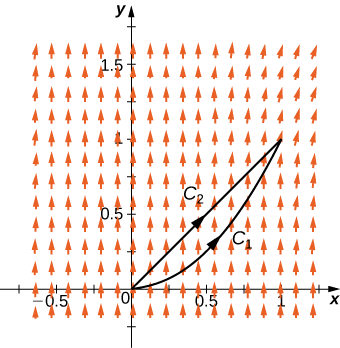

*Figure : Curves  and  are both oriented from left to right.*

### 16.04:_Greens_Theorem

**16_04_fig_1.png**

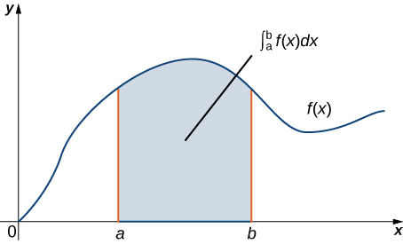

*Figure : The Fundamental Theorem of Calculus says that the integral over line segment  depends only on the values of the antiderivative at the endpoints of .*

**16_04_fig_2.png**

*Figure : The circulation form of Green’s theorem relates a line integral over curve  to a double integral over region .*

**16_04_fig_3.png**

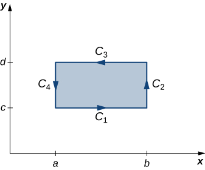

*Figure : Rectangle  is oriented counterclockwise.*

**16_04_fig_4.png**

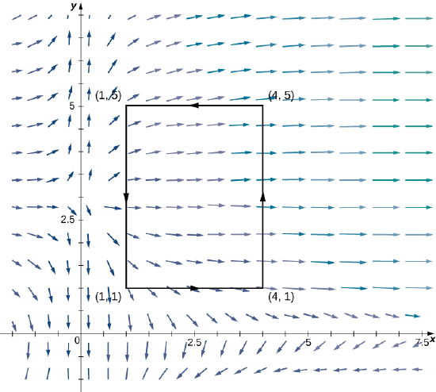

*Figure : The line integral over the boundary of the rectangle can be transformed into a double integral over the rectangle.*

**16_04_fig_5.png**

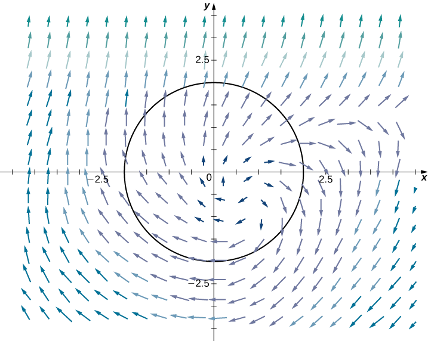

*Figure : The line integral over the boundary circle can be transformed into a double integral over the disk enclosed by the circle.*

**16_04_fig_6.png**

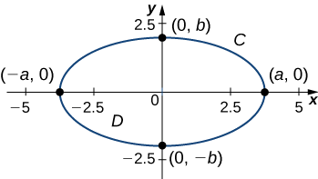

*Figure : Ellipse  is denoted by .*

**16_04_fig_7.png**

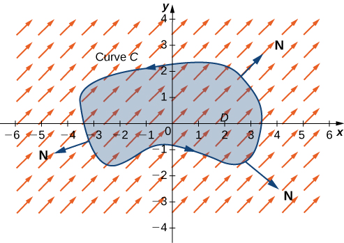

*Figure : The flux form of Green’s theorem relates a double integral over region  to the flux across curve .*

**16_04_fig_8.png**

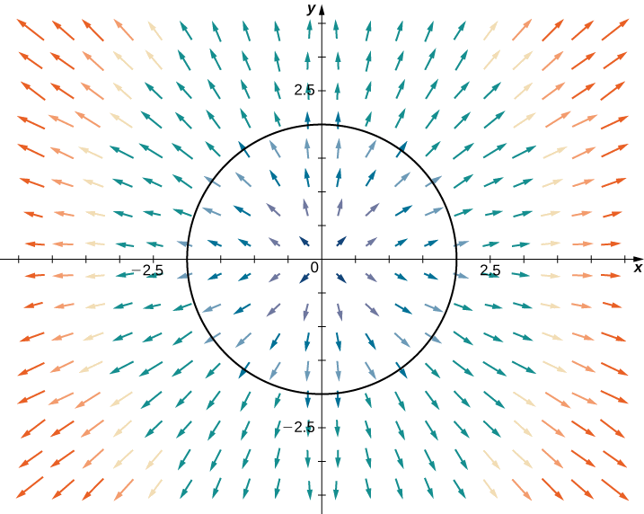

*Figure : Curve  is a circle of radius  centered at the origin.*

**16_04_fig_9.png**

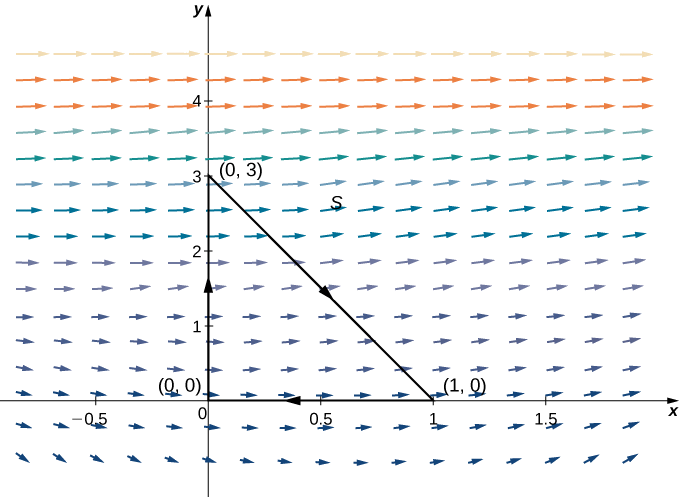

*Figure : Curve  is a triangle with vertices , , and  oriented clockwise.*

**16_04_fig_10.png**

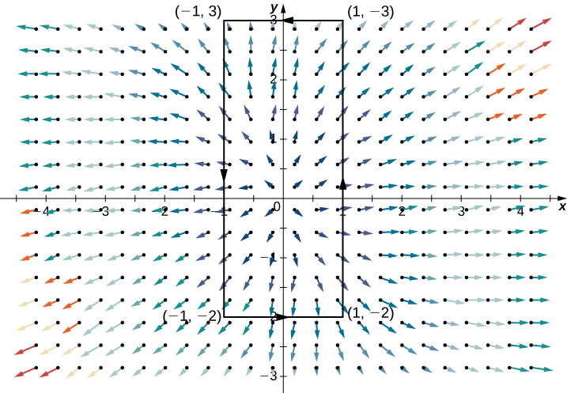

*Figure : Water flows across the rectangle with vertices , , ,and , oriented counterclockwise.*

**16_04_fig_11.png**

*Figure : (a) In this image, we see the three-level curves of  and vector field . Note that the  vectors on a given level curve are tangent to the level curve. (b) In this image, we see the three-level curves of  and vector field . The gradient vectors are perpendicular to the corresponding level curve. Therefore,  for any point in the domain of .*

**16_04_fig_12.png**

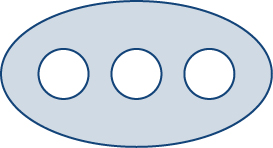

*Figure : Green’s theorem, as stated, does not apply to a nonsimply connected region with three holes like this one.*

**16_04_fig_13.png**

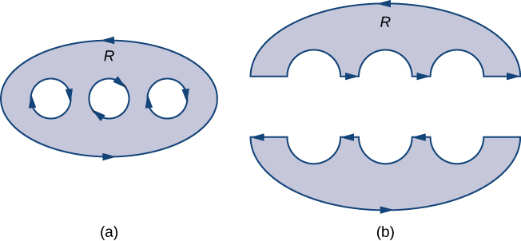

*Figure : (a) Region  with an oriented boundary has three holes. (b) Region  split into two simply connected regions has no holes.*

**16_04_fig_14.png**

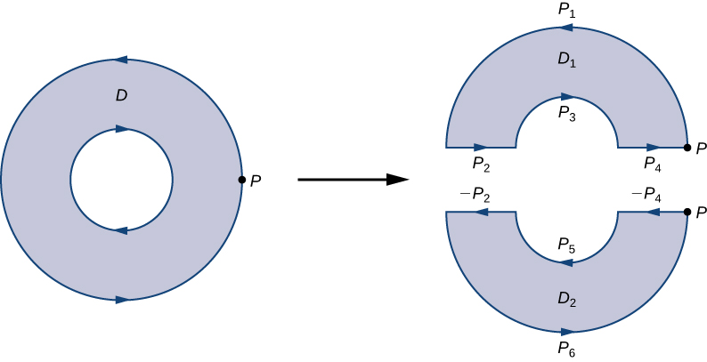

*Figure : Breaking the annulus into two separate regions gives us two simply connected regions. The line integrals over the common boundaries cancel out.*

**16_04_fig_15.png**

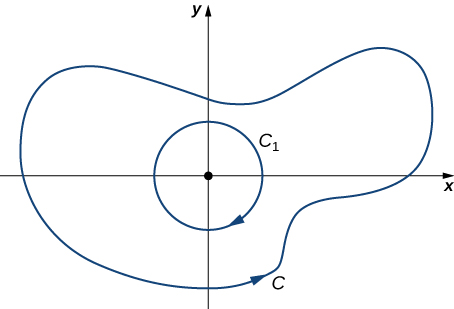

*Figure : Choose circle  centered at the origin that is contained entirely inside .*

**16_04_fig_16.png**

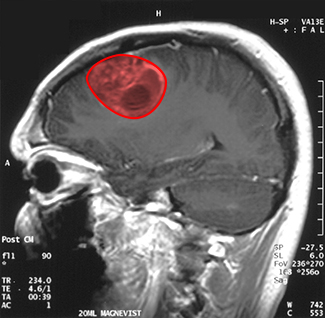

*Figure : This magnetic resonance image of a patient’s brain shows a tumor, which is highlighted in red. (credit: modification of work by Christaras A, Wikimedia Commons)*

**16_04_fig_17.png**

*Figure : (a) A rolling planimeter. The pivot allows the tracer arm to rotate. The roller itself does not rotate; it only moves back and forth. (b) An interior view of a rolling planimeter. Notice that the wheel cannot turn if the planimeter is moving back and forth with the tracer arm perpendicular to the roller.*

**16_04_fig_18.png**

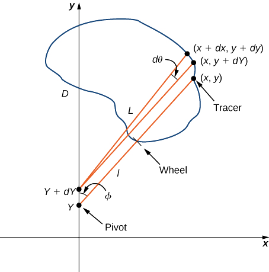

*Figure : Mathematical analysis of the motion of the planimeter.*

### 16.05:_Divergence_and_Curl

**16_05_fig_1.png**

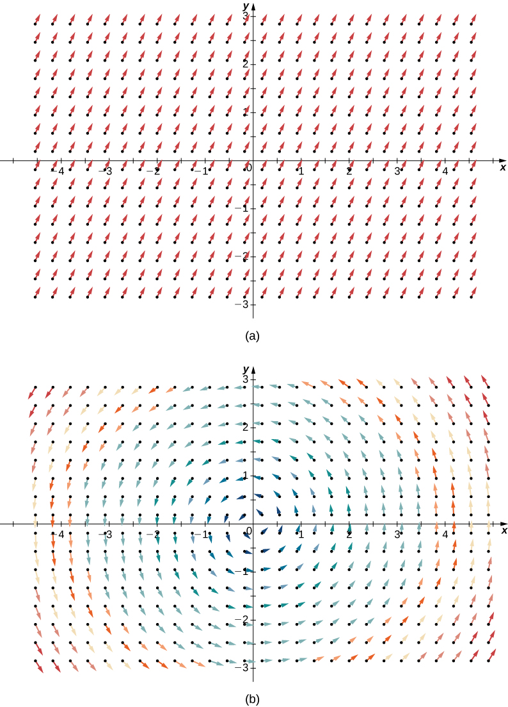

*Figure : (a) Vector field  has zero divergence. (b) Vector field  also has zero divergence.*

**16_05_fig_2.png**

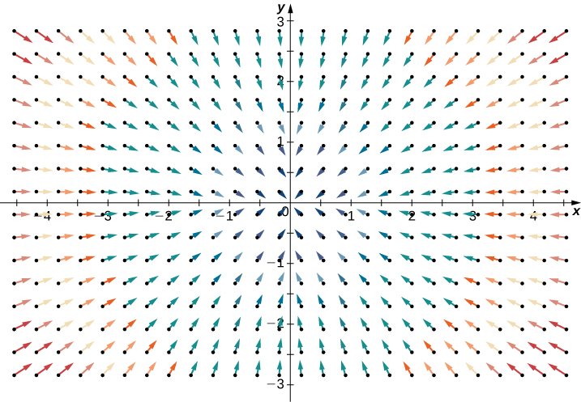

*Figure : This vector field has negative divergence.*

**16_05_fig_3.png**

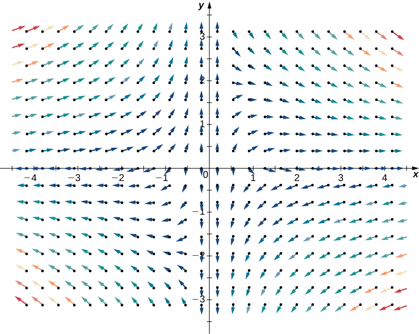

*Figure : The divergence of vector field  is one, so it cannot model a magnetic field.*

**16_05_fig_4.png**

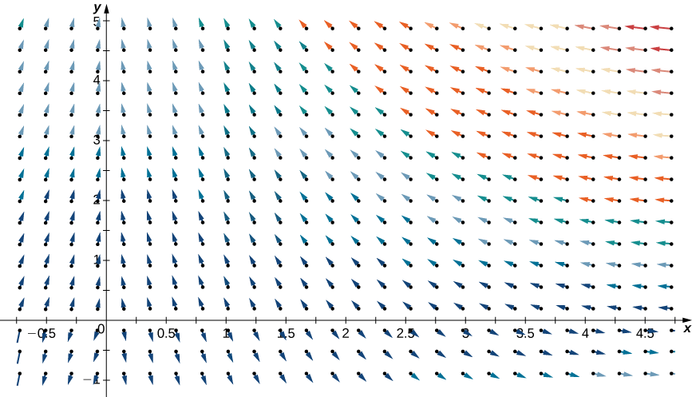

*Figure : Vector field  has negative divergence at*

**16_05_fig_5.png**

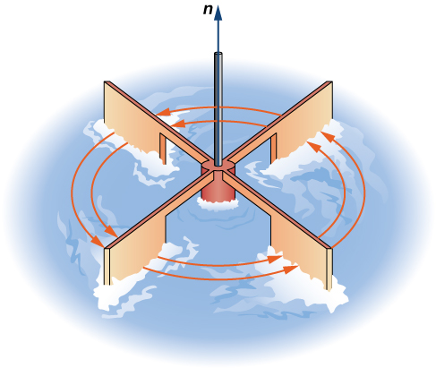

*Figure : To visualize curl at a point, imagine placing a small paddlewheel into the vector field at a point.*

**16_05_fig_6.png**

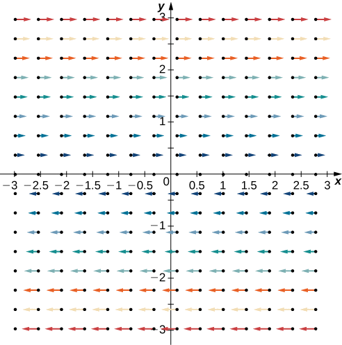

*Figure : Vector field  consists of vectors that are all parallel.*

**16_05_fig_7.png**

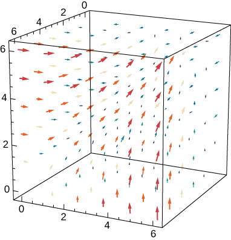

*Figure : The curl of vector field  is zero.*

### 16.06:_Surface_Integrals

**16_06_fig_1.png**

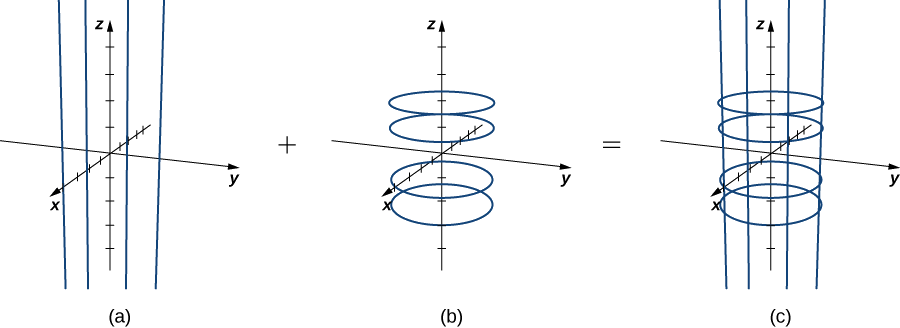

*Figure : (a) Lines  for , and . (b) Circles  for  and  (c) The lines and circles together. As  and  vary, they describe a cylinder.*

**16_06_fig_2.png**

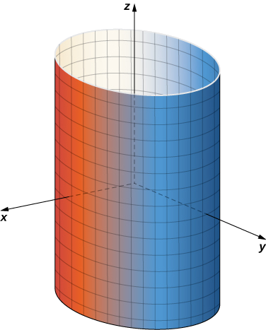

*Figure : Cylinder  has parameterization .*

**16_06_fig_3.png**

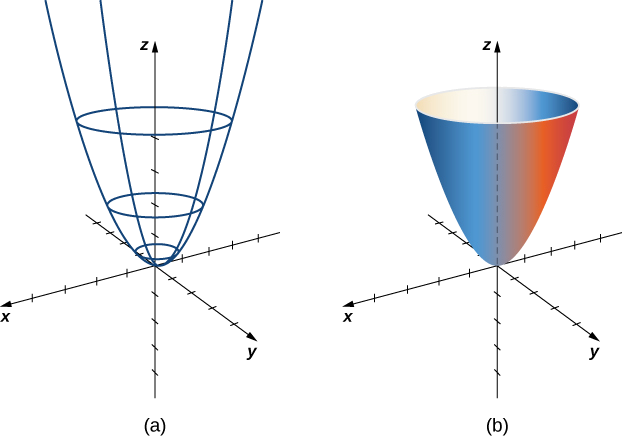

*Figure : (a) Circles arise from holding  constant; the vertical parabolas arise from holding  constant. (b) An elliptic paraboloid results from all choices of  and  in the parameter domain.*

**16_06_fig_4.png**

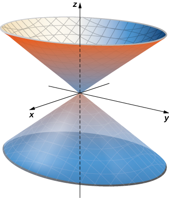

*Figure : Cone  has parametrization .*

**16_06_fig_5.png**

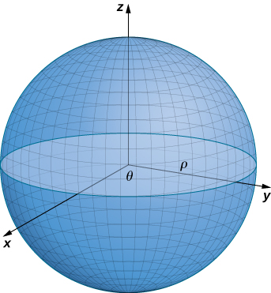

*Figure : The sphere of radius  has parameterization*

**16_06_fig_6.png**

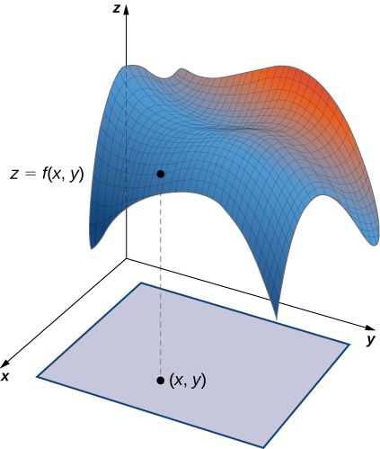

*Figure :  The simplest parameterization of the graph of a function is .*

**16_06_fig_7.png**

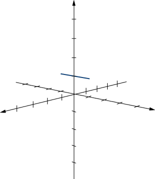

*Figure : The image of parameterization  is a line.*

**16_06_fig_8.png**

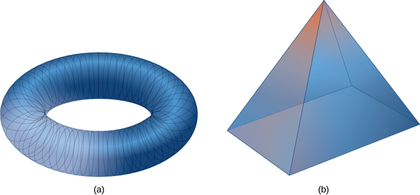

*Figure :  (a) This surface is smooth. (b) This surface is piecewise smooth.*

**16_06_fig_9.png**

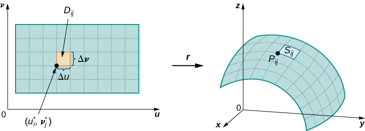

*Figure :  Grid lines on a parameter domain correspond to grid curves on a surface.*

**16_06_fig_10.png**

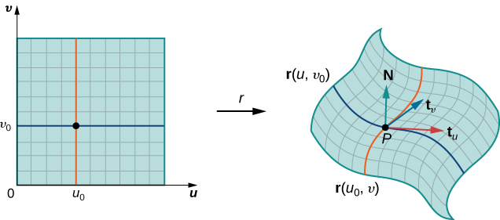

*Figure : If the cross product of vectors  and  exists, then there is a tangent plane.*

**16_06_fig_11.png**

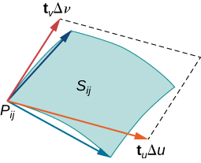

*Figure : The parallelogram spanned by  and  approximates the piece of surface .*

**16_06_fig_12.png**

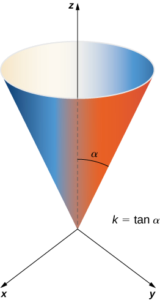

*Figure :  The right circular cone with radius  and height  has parameterization*

**16_06_fig_13.png**

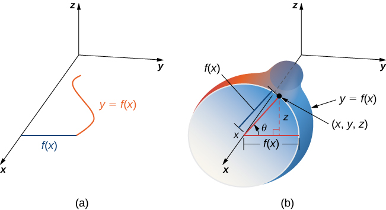

*Figure :  We can parameterize a surface of revolution by .*

**16_06_fig_14.png**

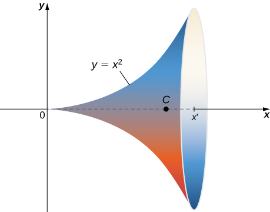

*Figure :  A surface integral can be used to calculate the surface area of this solid of revolution.*

**16_06_fig_15.png**

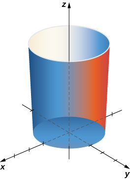

*Figure : Integrating function  over a cylinder.*

**16_06_fig_16.png**

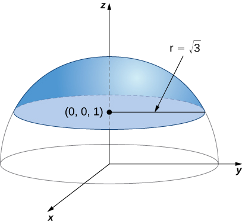

*Figure :  Calculating a surface integral over surface .*

**16_06_fig_17.png**

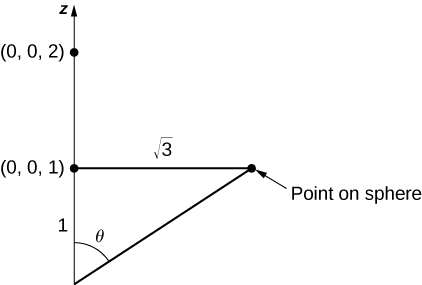

*Figure :  The maximum value of  has a tangent value of .*

**16_06_fig_18.png**

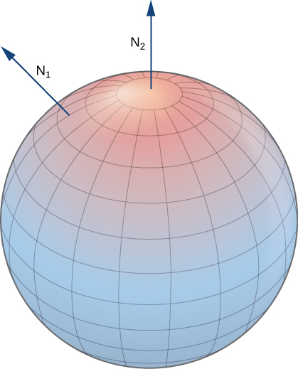

*Figure :  An oriented sphere with positive orientation.*

**16_06_fig_19.png**

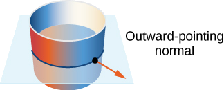

*Figure : If all the vectors normal to a cylinder point outward, then this is an outward orientation of the cylinder.*

**16_06_fig_20.png**

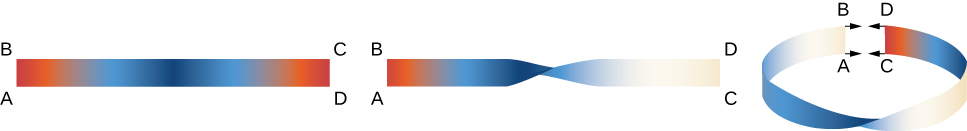

*Figure :  The construction of a Möbius strip.*

**16_06_fig_21.png**

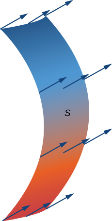

*Figure :  Fluid flows across a completely permeable surface .*

**16_06_fig_22.png**

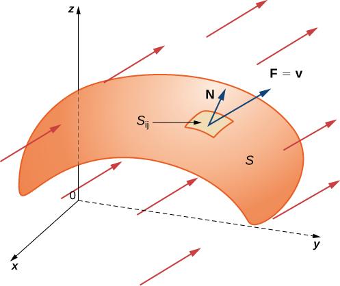

*Figure :  The mass of fluid per unit time flowing across  in the direction of  can be approximated by .*

### 16.07:_Stokes_Theorem

**16_07_fig_1.png**

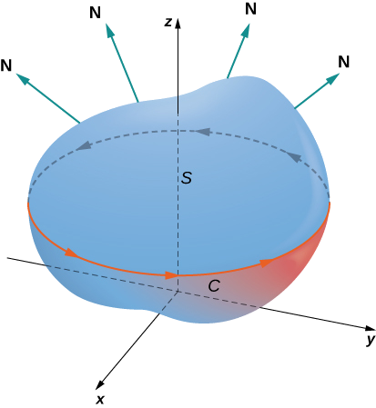

*Figure : Stokes’ theorem relates the flux integral over the surface to a line integral around the boundary of the surface. Note that the orientation of the curve is positive.*

**16_07_fig_2.png**

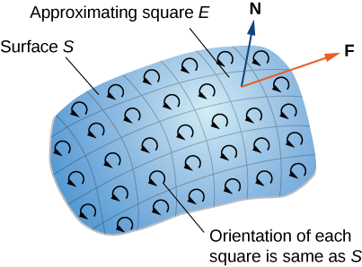

*Figure : Chop the surface into small pieces. The pieces should be small enough that they can be approximated by a square.*

**16_07_fig_3.png**

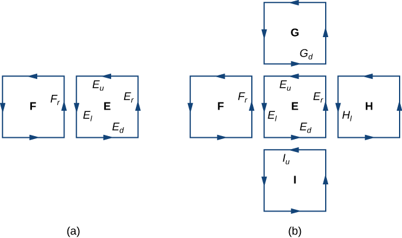

*Figure : (a) The line integral along  cancels out the line integral along  because . (b) The line integral along any of the sides of  cancels out with the line integral along a side of an adjacent approximating square.*

**16_07_fig_4.png**

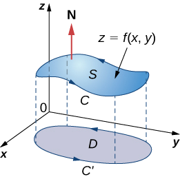

*Figure :  is the “shadow,” or projection, of  in the plane and  is the projection of .*

**16_07_fig_5.png**

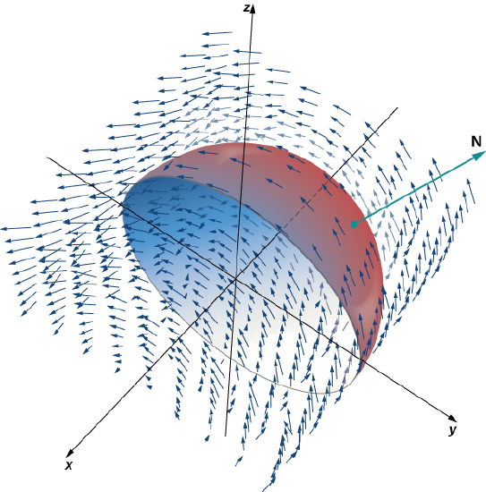

*Figure : Verifying Stokes’ theorem for a hemisphere in a vector field.*

**16_07_fig_6.png**

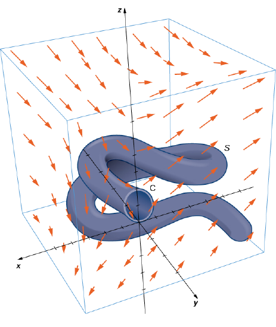

*Figure : A complicated surface in a vector field.*

**16_07_fig_7.png**

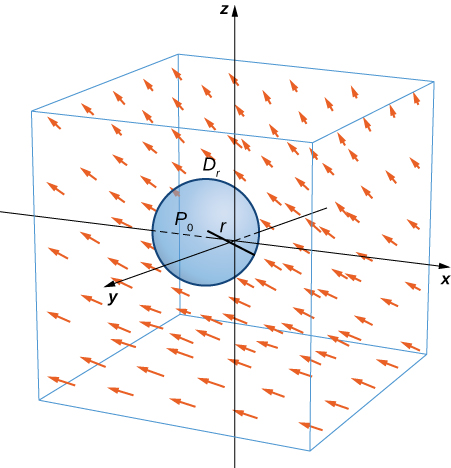

*Figure : Disk  is a small disk in a continuous vector field.*

**16_07_fig_8.png**

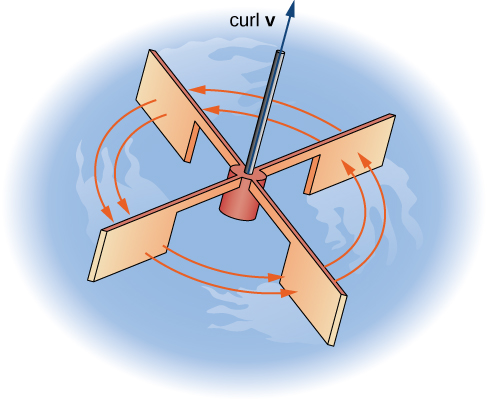

*Figure : To visualize curl at a point, imagine placing a tiny paddlewheel at that point in the vector field.*

### 16.08:_The_Divergence_Theorem

**16_08_fig_1.png**

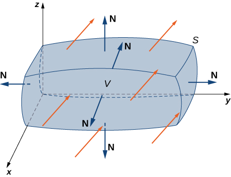

*Figure : The divergence theorem relates a flux integral across a closed surface  to a triple integral over solid  enclosed by the surface.*

**16_08_fig_2.png**

*Figure : (a) A small box  inside surface  has sides parallel to the coordinate planes. (b) Box  has side lengths, and  (c) If we look at the side view of , we see that, since  is the center of the box, to get to the top of the box we must travel a vertical distance of  up from . Similarly, to get to the bottom of the box we must travel a distance  down from .*

**16_08_fig_3.png**

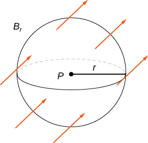

*Figure : Ball  of small radius  centered at .*

**16_08_fig_4.png**

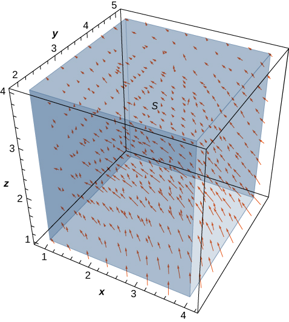

*Figure : Vector field .*

## 17:_Second-Order_Differential_Equations

### 17.00:_Prelude_to_Second-Order_Differential_Equations

**17_00_fig_1.png**

*Figure : A motorcycle suspension system is an example of a damped spring-mass system. The spring absorbs bumps and keeps the tire in contact with the road. The shock absorber damps the motion so the motorcycle does not continue to bounce after going over each bump. (credit: nSeika, Flickr)*

### 17.01:_Second-Order_Linear_Equations

### 17.02:_Nonhomogeneous_Linear_Equations

### 17.03:_Applications_of_Second-Order_Differential_Equations

**17_03_fig_1.png**

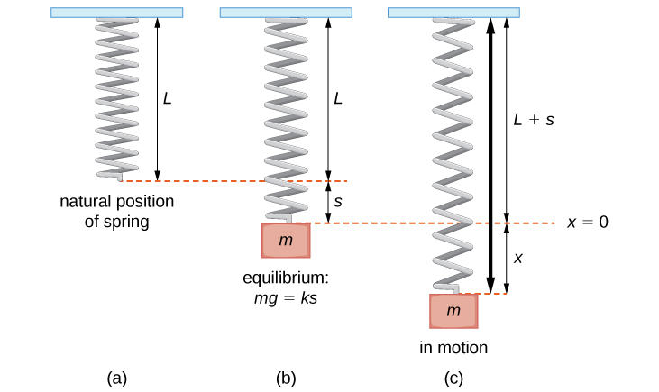

*Figure : A spring in its natural position (a), at equilibrium with a mass m attached (b), and in oscillatory motion (c).*

**17_03_fig_2.png**

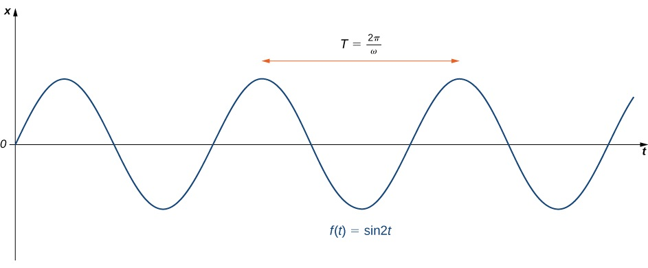

*Figure : A graph of vertical displacement versus time for simple harmonic motion.*

**17_03_fig_3.png**

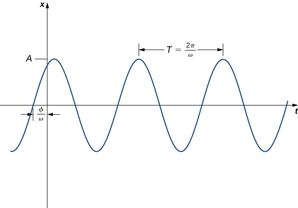

*Figure : A graph of vertical displacement versus time for simple harmonic motion with a phase change.*

**17_03_fig_4.png**

*Figure : A dashpot is a pneumatic cylinder that dampens the motion of an oscillating system.*

**17_03_fig_5.png**

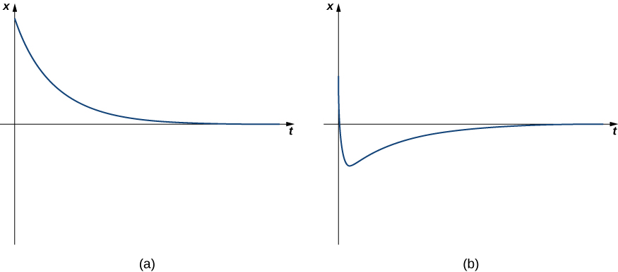

*Figure : Behavior of an overdamped spring-mass system, with no change in direction (a) and only one change in direction (b).*

**17_03_fig_6.png**

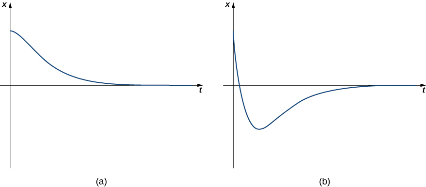

*Figure : Behavior of a critically damped spring-mass system. The system graphed in part (a) has more damping than the system graphed in part (b).*

**17_03_fig_7.png**

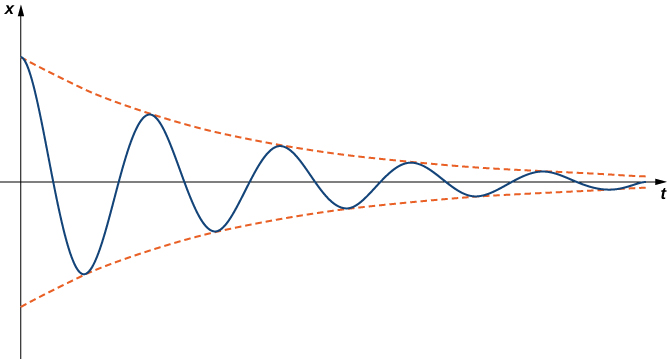

*Figure : Behavior of an underdamped spring-mass system.*

**17_03_fig_8.png**

*Figure : (credit: modification of work by nSeika, Flickr)*

**17_03_fig_9.png**

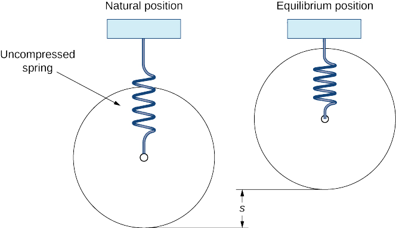

*Figure : We can use a spring-mass system to model a motorcycle suspension.*

**17_03_fig_10.png**

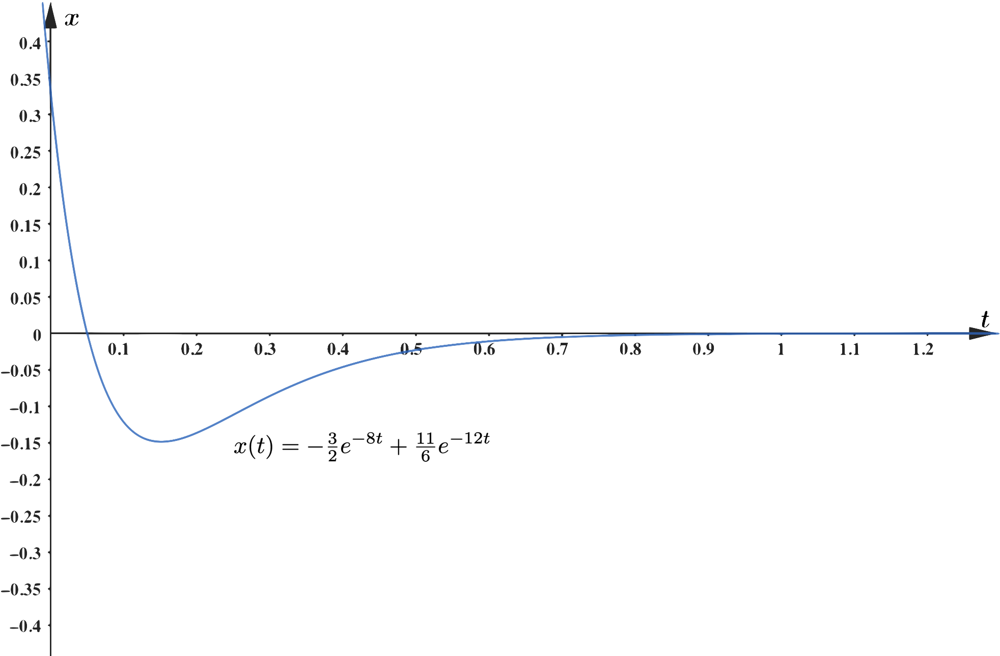

*Figure : Graph of the equation of motion over a time of one second.*

**17_03_fig_11.png**

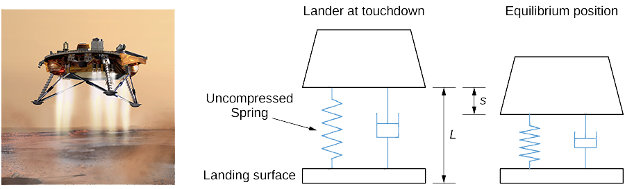

*Figure : The landing craft suspension can be represented as a damped spring-mass system. (credit “lander”: NASA)*

**17_03_fig_12.png**

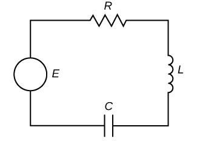

*Figure : An RLC series circuit can be modeled by the same differential equation as a mass-spring system.*

### 17.04:_Series_Solutions_of_Differential_Equations

## 10:_Power_Series

### 10.00:_Prelude_to_Power_Series

**10_00_fig_1.png**

*Figure \(\PageIndex{1}\): If you win a lottery, do you get more money by taking a lump-sum payment or by accepting fixed payments over time? (credit: modification of work by Robert Huffstutter, Flickr)*

### 10.01:_Power_Series_and_Functions

**10_01_fig_1.png**

*Figure \(\PageIndex{1}\): For a series \(\displaystyle \sum_{n=0}^∞c_n(x−a)^n\) graph (a) shows a radius of convergence at \(R=0\), graph (b) shows a radius of convergence at \(R=∞\), and graph (c) shows a radius of convergence at \(R\). For graph (c) we note that the series may or may not converge at the endpoints \(x=a+R\) and \(x=a−R\).*

**10_01_fig_2.png**

*Figure \(\PageIndex{2}\): The graph shows a function and three approximations of it by partial sums of a power series.*

### 10.02:_Properties_of_Power_Series

**10_02_fig_1.png**

*Figure \(\PageIndex{1}\): (credit: modification of work by Robert Huffstutter, Flickr)*

### 10.03:_Taylor_and_Maclaurin_Series

**10_03_fig_1.png**

*Figure \(\PageIndex{1}\): The function \(y=\ln x\) and the Taylor polynomials \(p_0,p_1,p_2\) and \(p_3\) at \(x=1\) are plotted on this graph.*

**10_03_fig_2.png**

*Figure \(\PageIndex{2}\):  The graph shows the function \(y=e^x\) and the Maclaurin polynomials \(p_0,\,p_1,\,p_2\) and \(p_3\).*

**10_03_fig_3.png**

*Figure \(\PageIndex{3}\):  The graph shows the function \(y=\sin x\) and the Maclaurin polynomials \(p_1,\, p_3\) and \(p_5\).*

**10_03_fig_4.png**

*Figure \(\PageIndex{4}\): The function \(y=\cos x\) and the Maclaurin polynomials \(p_0,p_2\) and \(p_4\) are plotted on this graph.*

**10_03_fig_5.png**

![Figure \(\PageIndex{5}\):  The graphs of \(f(x)=\sqrt[3]{x}\) and the linear and quadratic approximations \(p_1(x)\) and \(p_2(x)\)](./media/textbook/10_03_fig_5.png)

*Figure \(\PageIndex{5}\):  The graphs of \(f(x)=\sqrt[3]{x}\) and the linear and quadratic approximations \(p_1(x)\) and \(p_2(x)\)*

### 10.04:_Working_with_Taylor_Series

**10_04_fig_1.png**

*Figure \(\PageIndex{1}\): The third-order Maclaurin polynomial \( p_3(x)\) provides a good approximation for \( f(x)=\sqrt{1+x}\) for \( x\) near zero.*

**10_04_fig_2.png**

*Figure \(\PageIndex{2}\): If data values are normally distributed with mean \( μ\) and standard deviation \( σ\), the probability that a randomly selected data value is between \(a\) and \(b\) is the area under the curve \( y=\dfrac{1}{σ\sqrt{2π}}e^{−(x−μ)^2/(2σ^2)}\) between \( x=a\) and \( x=b\).*

**10_04_fig_3.png**

*Figure \(\PageIndex{3}\): This pendulum has length \( L\) and makes a maximum angle \( θ_{max}\) with the vertical.*

