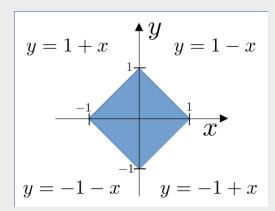
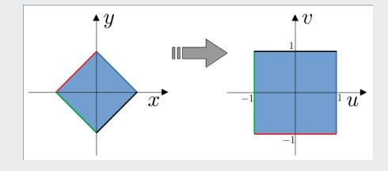

[15] 1. The temperature inside a volume C is given by  $T(x, y, z) = 20 + xz + x\sin(y)$ . If the volume C is a rectangular box, with  $x \in [0, 10]$ ,  $y \in [0, 10\pi]$ ,  $z \in [0, 2]$ , find the average value of the temperature  $T_{\text{avg}}$ ,

$$T_{\text{avg}} = \frac{1}{\text{Volume}(C)} \iiint_C T(x, y, z) dV.$$

5 pts for volume, 2 pts for setup, 2 pts for each integration [total 6], 2 pts final answer. If they mess up one integration, but carry on consistently, deduct only 2 pts.

Firstly, we compute the volume of domain. Because the domain is a rectangular prism, the volume is the product of the length of its sides, Volume(C) =  $10 \cdot 10\pi \cdot 2 = 200\pi$ . **5 pts** It remains to evaluate the triple integral. The easiest choice of integration order here is to pick the innermost integral to be over y,

$$\iiint_{C} T(x,y,z)dV = \int_{0}^{10} \int_{0}^{2} \int_{0}^{10\pi} \left( 20 + xz + x \sin(y) \right) dy dz dx \ \mathbf{2} \ \mathbf{pts}$$

$$= \int_{0}^{10} \int_{0}^{2} (20 + xz)y - x \cos(y) \Big|_{0}^{10\pi} dz dx \ \mathbf{2} \ \mathbf{pts}$$

$$= 10\pi \int_{0}^{10} \int_{0}^{2} (20 + xz) dz dx$$

$$= 10\pi \int_{0}^{10} z \left( 20 + \frac{xz}{2} \right) \Big|_{0}^{2} dx \ \mathbf{2} \ \mathbf{pts}$$

$$= 20\pi \int_{0}^{10} (20 + x) dx$$

$$= 200\pi \cdot 25 = 5000\pi. \ \mathbf{2} \ \mathbf{pts}$$

Finally, substituting the volume and the evaluated integral into the expression  $T_{\text{avg}}$ ,

$$T_{\text{avg}} = \frac{1}{200\pi} \cdot 200\pi \cdot 25 = 25$$
. 2 pts

- [15] 2. Consider the region  $\mathcal{R}$  determined by the inequality  $|x| + |y| \leq 1$ .
  - (a) Sketch the domain  $\mathcal{R}$  in the xy-plane.

## [4 pts]

(b) Make the change-of-variables u = x + y, v = y - x to show that

$$\iint\limits_{\mathcal{R}} f(x+y) \ dxdy = \int_{-1}^{1} f(u) \ du.$$

[6 pts] 2 pt for Jacobian, 2 pts for uv region, 2 pt for final result

The transformed variables are  $x = \frac{1}{2}(u+v)$  and  $y = \frac{1}{2}(u-v)$ ; the Jacobian of the transformation is,

$$J = \begin{vmatrix} \frac{1}{2} & \frac{1}{2} \\ \frac{1}{2} & -\frac{1}{2} \end{vmatrix} = \frac{1}{2},$$

and the region of integration is converted to a square in uv-space,  $u \in (-1,1), v \in (-1,1)$ .

Consequently, the integral is transformed as

$$\iint_{\mathcal{D}} f(x+y) \ dxdy = \int_{-1}^{1} \int_{-1}^{1} f(u) \frac{1}{2} dv du$$

The integral with respect to v cancels the  $\frac{1}{2}$  from the Jacobian,

$$\iint\limits_{\mathcal{R}} f(x+y) \ dx dy = \int_{-1}^{1} \int_{-1}^{1} f(u) \frac{1}{2} dv du = \left[ \int_{-1}^{1} f(u) \ du \right] \left[ \frac{1}{2} \int_{-1}^{1} \ dv \right] = \int_{-1}^{1} f(u) \ du. \checkmark$$

(c) Evaluate  $\iint_{\mathcal{R}} (x+y)e^{-(x+y)^2} dxdy$ .

[5 pts] 3 pts. for using (b), 2 pt for correct result Using part (b),

$$\iint_{\mathbb{R}} (x+y)e^{-(x+y)^2} dxdy = \int_{-1}^{1} ue^{-u^2} du$$

Either argue that the integrand is odd over the domain, or integrate directly to show that,

$$\int_{-1}^{1} u e^{-u^2} \ du = -\frac{1}{2} e^{-u^2} \bigg|_{-1}^{1} = 0$$

$$\ln(1+x) \approx x - \frac{x^2}{2} + \frac{x^3}{3} + \dots + \frac{(-1)^{N+1}x^N}{N}$$

provides a decent approximation of ln(1 + x) so long as x ≈ 0. Euler (1748) found a clever way to extend the domain of applicability.

(a) Determine the first two non-zero terms in the Taylor polynomial of f(x) = ln 1+x 1−x by using the properties of logarithms to simplify the quotient.

[6 pts] 2 pts for breaking up the logarithm, 2 pts for the Taylor series, 2 pts for result.

From the properties of logarithms,

$$\ln\left(\frac{1+x}{1-x}\right) = \ln(1+x) - \ln(1-x)$$
. 2 pts

Replacing the logarithms by their Taylor polynomials, the even powers cancel out,

$$\ln(1+x) - \ln(1-x) = \left[x - \frac{x^2}{2} + \frac{x^3}{3} - \dots\right] - \left[-x - \frac{x^2}{2} - \frac{x^3}{3} - \dots\right] \quad \mathbf{2} \text{ pts} = 2x + \frac{2x^3}{3} + \dots \quad \mathbf{2} \text{ pts}$$

(b) Choose an appropriate value of x in your series from part (a) to find a fraction that approximates the value of ln 7.

[4 pts] 2 pts for x = 3/4, 2 pts for fraction. -1 pt if not expressed as a fraction.

We need x so that,

$$\frac{1+x}{1-x} = 7.$$

That is, x = 3 4 2 pts. The first two terms in the series produce the estimate,

$$\ln 7 \approx 2 \left(\frac{3}{4}\right) + \frac{2}{3} \left(\frac{3}{4}\right)^3 = \frac{57}{32}$$
 2 pts

[10] 4. For each of the following series, determine whether it is conditionally convergent, absolutely convergent or divergent. You may simply write CC, AC or D for brevity.

You do not need to show your work; we will only grade your final answer. Because there are only three possible answers, there will be a penalty for incorrect answers:

correct: +2 / blank: 0 / incorrect: -2 (to minimum of zero on the question)

(a) 
$$\sum_{n=1}^{\infty} (-1)^{n-1} \frac{n!}{e^n}$$

Diverges

(b) 
$$\sum_{n=1}^{\infty} (-1)^n \frac{n}{\sqrt{n^3 + 2}}$$

Converges conditionally

(c) 
$$\sum_{n=1}^{\infty} (-1)^{n+1} \frac{n^2 2^n}{n!}$$

Converges absolutely

(d) 
$$\sum_{n=1}^{\infty} (-1)^n \frac{1}{n^4}$$

Converges absolutely

(e) 
$$\sum_{n=2}^{\infty} (-1)^n \frac{\sqrt{n}}{\ln n}$$

Diverges

## [15] 5. Evaluate the following limits using Taylor series and Big-O notation:

If they don't use Big-O notation, take off a max of 3 pts.

(a) 
$$\lim_{x \to 0} \frac{2\sin x - \sin(2x)}{2e^x - 2 - 2x - x^2}$$

[5 pts] 1 pt each for Taylor series, 2 pts for simplifying the numerator and denominator, 1 pt for the result.

Both the numerator and denominator go to 0 as  $x \to 0$ . Consider the following Taylor polynomials centered at x = 0, with the remainder characterized by the Big-O notation,

$$e^x = 1 + x + \frac{x^2}{2} + \frac{x^3}{3!} + O(x^4), \quad \mathbf{1} \text{ pt} \quad \sin x = x - \frac{x^3}{3!} + O(x^5) \quad \mathbf{1} \text{ pt}.$$

Replacing them into the limit,

$$\begin{split} &\lim_{x\to 0} \frac{2\sin x - \sin(2x)}{2e^x - 2 - 2x - x^2} \\ &= \lim_{x\to 0} \frac{2x - \frac{x^3}{3} - 2x + \frac{2^3x^3}{3!} + O(x^5)}{2 + 2x + x^2 + \frac{x^3}{3} - 2 - 2x - x^2 + O(x^4)} \\ &= \lim_{x\to 0} \frac{x^3 + O(x^5)}{\frac{x^3}{3} + O(x^4)} \ \mathbf{2} \ \mathbf{pts} \\ &= \lim_{x\to 0} \frac{1 + O(x^2)}{\frac{1}{3} + O(x)} = 3 \ \mathbf{1} \ \mathbf{pt} \end{split}$$

(b) 
$$\lim_{x\to 1} \frac{\ln x}{x^2-1}$$
 Hint: Begin with the substitution  $x=1+t$ .

[5 pts] 2 pts for Taylor series, 2 pts for simplifying the denominator, 1 pt for the result.

Both the numerator and denominator go to 0 as  $x \to 1$ . We perform the substitution x = 1+t, as hinted. Notice that  $x \to 1$  corresponds to  $t \to 0$ , and that the Taylor polynomial of  $\ln(1+t)$  at t = 0 is

$$\ln(1+t) = t + O(t^2)$$

Following these indications.

$$\lim_{x \to 1} \frac{\ln x}{x^2 - 1} = \lim_{t \to 0} \frac{\ln(1 + t)}{(1 + t)^2 - 1} = \lim_{t \to 0} \frac{t + O(t^2)}{2t + t^2} \quad \frac{\mathbf{2} \text{ pts}}{\mathbf{2} \text{ pts}} = \lim_{t \to 0} \frac{1 + O(t)}{2 + t} = \frac{1}{2} \quad \mathbf{1} \text{ pt}$$

(c) 
$$\lim_{x \to 0} \frac{1 - e^{x^3}}{x \ln(1 - x^2)}$$

[5 pts] 2 pts each for Taylor series, 1 pt for the result.

The Maclaurin series for  $e^u = 1 + u + \frac{u^2}{2} + \mathcal{O}(u^3)$  and  $\ln(1+u) = u - \frac{u^2}{2} + \mathcal{O}(u^3)$ , so that  $1 - e^{x^3} = -x^3 - \frac{x^6}{2} + \mathcal{O}(x^9)$  **2 pts** and  $x \ln(1-x^2) = -x^3 - \frac{x^5}{2} + \mathcal{O}(x^7)$  **2 pts**. With substitution into the limit,

$$\lim_{x \to 0} \frac{1 - e^{x^3}}{x \ln(1 - x^2)} = \lim_{x \to 0} \frac{-x^3 - \frac{x^6}{2} + \mathcal{O}(x^9)}{-x^3 - \frac{x^5}{2} + \mathcal{O}(x^7)} = 1 \quad \mathbf{1} \quad \mathbf{pt}$$

[15] 6. Find the shortest distance from the origin (x, y) = (0, 0) to the curve  $x^2y = 16$  using the method of Lagrange multipliers.

*Hint:* Find the points on the constraint curve for which the *square* of the distance,  $f(x,y) = x^2 + y^2$ , is minimum. These same points minimize the distance from the origin  $d(x,y) = \sqrt{x^2 + y^2}$ .

[15 pts] 3 pts for constraint, 2 pts for each gradient [4 pts total], 1 pt for each in the system of equations [3 pts total], 2 pts for  $y^3=8$ , 0.5 pts for each critical point [1 pt total], 2 pts for the final result. -3 pts if they don't use Lagrange multipliers but all is otherwise correct.

As indicated by the hint, we find the minima of  $f(x,y) = x^2 + y^2$  subject to the constraint  $g(x,y) = x^2y = 16$  3 pts, using the method of Lagrange multipliers.

$$\vec{\nabla} f = (2x, 2y)$$
 2 pts,  $\vec{\nabla} g = (2xy, x^2)$  2 pts.

Notice  $\nabla g \neq 0$  along the constraint curve. Then, the critical points satisfy  $\nabla f = \lambda \nabla g$  and g(x,y) = 16. The corresponding system of equations that we must solve is

$$2x = 2\lambda xy$$
,  $2y = \lambda x^2$ ,  $x^2y = 16$ . 3 pts

The equation  $2x = 2\lambda xy$  can be rewritten as  $2x(\lambda y - 1) = 0$ . Thus either x = 0 or  $\lambda = 1/y$ . However, x = 0 is inconsistent with  $x^2y = 16$ . Therefore,  $\lambda = 1/y$ . Substituting into  $2y = \lambda x^2$ , we get  $2y^2 = x^2$ , and thus  $x = \pm \sqrt{2}y$ . Finally, from the constraint,

$$16 = x^2y = 2y^3$$
, 2 pts

therefore y = 2. This leaves us with two critical points,  $(2\sqrt{2}, 2)$  and  $(-2\sqrt{2}, 2)$  **1 pt**. From the function  $y = 16/x^2$  is symmetric about x = 0, so there are two points closest to the origin. These are the critical points we found. Evaluating their distance to the origin,

$$d(2\sqrt{2}, 2) = \sqrt{(8+4)} = 2\sqrt{3}, \quad d(-2\sqrt{2}, 2) = \sqrt{(8+4)} = 2\sqrt{3}.$$

Therefore, the shortest distance from the curve  $x^2y = 16$  to the origin is  $2\sqrt{3}$  2 pts.

[15] 7. (a) Find the 2N+1 degree Taylor polynomial centered at x=0 of

$$f(x) = \int_0^x \frac{\sin t}{t} dt.$$

[6 pts] 2 pts for Taylor series, 2 pts for simplifying the integrand, 2 pts for integrating term-wise.

Substituting the polynomial for  $\sin t = \sum_{m=0}^{M} \frac{(-1)^m t^{2m+1}}{(2m+1)!}$  2 pts into the integral,

$$f(x) = \int_0^x \frac{\sin t}{t} dt = \int_0^x \sum_{m=0}^M (-1)^m \frac{t^{2m}}{(2m+1)!} dt \ \mathbf{2} \ \mathbf{pts} = \sum_{m=0}^M (-1)^m \frac{x^{2m+1}}{(2m+1)!(2m+1)} \ \mathbf{2} \ \mathbf{pts}.$$

Then, choosing N = M, this expression becomes the 2N+1 degree Taylor polynomial centered at x = 0 of f(x).

(b) Use Taylor's inequality to prove the that the error in the Taylor polynomial approximation  $P_{2M+1,0}(t)$  for sin t is bounded by

$$\left| \sin t - P_{2M+1,0}(t) \right| \le \frac{|t|^{2M+2}}{(2M+2)!}$$

[5 pts] 2 pts for Taylor's inequality + 1 pt for correctly identifying the constant K, 1 pt for  $K \ge 1$ , 1 pt for final result.

From Taylor's inequality,

$$|\sin t - P_{2M+1,0}(t)| \le K \frac{|t|^{2M+2}}{(2M+2)!}, \ \mathbf{2} \ \mathbf{pts}$$

where we need a K such that  $K \ge \left| \frac{d^{2M+2}}{dz^{2M+2}} \sin z \right|$  for z in between 0 and t **1 pt**. We know that because all the derivatives of  $\sin z$  are either  $\pm \sin z$  or  $\pm \cos z$ , then, for all  $z \in \mathbb{R}$ ,

$$\left| \frac{d^{2M+2}}{dt^{2M+2}} \sin z \right| \le 1. \quad \mathbf{1} \text{ pt}$$

Therefore, we can pick K = 1, and get

$$|\sin t - P_{2M+1,0}(t)| \le \frac{|t|^{2M+2}}{(2M+2)!}$$
. 1 pt

(c) Using the bound from (b) and the integral inequality:  $\left| \int_0^x g(t) \right| \leq \int_0^x |g(t)|$ , find a bound for the error in approximating f(x) by the Taylor polynomial you found in part (a). For simplicity, assume that  $x \geq 0$ .

[4 pts] 1 pt for error, 2 pts for using the inequality, 1 pt for final result.

Using (a), the error in the approximation that we are searching for can be expressed as:

$$|\text{error}| = \left| f(x) - \sum_{n=0}^{N} (-1)^n \frac{x^{2n+1}}{(2n+1)!(2n+1)} \right|$$
$$= \left| \int_0^x \frac{\sin t}{t} dt - \int_0^x \frac{P_{2N+1,0}(t)}{t} dt \right| = \left| \int_0^x \frac{\sin t - P_{2N+1,0}(t)}{t} dt \right| \quad \mathbf{1} \text{ pt}$$

Using the inequality given in the hint and then the result from (b), and because we are assuming that  $x \ge 0$ , we have  $t \in [0, x]$  allowing the replacement |t| = t,

$$|\text{error}| \le \int_0^x \frac{|\sin t - P_{2N+1,0}(t)|}{|t|} dt \le \int_0^x \frac{t^{2M+1}}{(2M+2)!} dt \ \mathbf{2} \ \mathbf{pts} = \frac{x^{2M+2}}{(2M+2)!(2M+2)} \ \mathbf{1} \ \mathbf{pt}.$$

$$xy''(x) + 2y'(x) + xy(x) = 0$$
,  $y(0) = 1$ ,  $y'(0) = 0$ .

Suppose that the solution can be represented as a power-series with a non-zero radius of convergence,

$$y(x) = \sum_{n=0}^{\infty} c_n x^n$$

(a) Use the differential equation and initial conditions to determine the coefficients  $c_0, c_1, c_2, c_3$ , and  $c_4$ . Use these to write down the  $4^{th}$ -degree Taylor polynomial  $P_{4,0}(x)$ .

## [4 pts] 0.5 pts for each derivative, 1 pt for each coefficient.

Let  $y(x) = c_0 + c_1 x + c_2 x^2 + c_3 x^3 + c_4 x^4$ , and then  $y'(x) = c_1 + 2c_2 x + 3c_3 x^2 + 4c_4 x^3$ . Using the initial conditions,

$$y(0) = 1 \implies c_0 = 1$$
  
 $y'(0) = 0 \implies c_1 = 0$ 

So, we have

$$y(x) = 1 + c_2x^2 + c_3x^3 + c_4x^4$$
  
 $y'(x) = 2c_2x + 3c_3x^2 + 4c_4x^3$  0.5 pts  
 $y''(x) = 2c_2 + 6c_3x + 12c_4x^2$  0.5 pts

Substituting y(x), y'(x) and y''(x) into the DE, we obtain

$$x\left(2c_2 + 6c_3x + 12c_4x^2\right) + 2\left(2c_2x + 3c_3x^2 + 4c_4x^3\right) + x\left(1 + c_2x^2 + c_3x^3 + c_4x^4\right) = 0$$

This gives

$$6c_2 + 1 = 0 \implies c_2 = -\frac{1}{6} = -\frac{1}{3!} \quad 1 \text{ pt}$$

$$12c_3 = 0 \implies c_3 = 0 \quad 1 \text{ pt}$$

$$20c_4 + c_2 = 0 \implies c_4 = -\frac{c_2}{20} = \frac{1}{5!} \quad 1 \text{ pt}$$

$$y(x) = 1 - \frac{x^2}{3!} + \frac{x^4}{5!}$$

(b) The pattern of the coefficients should be familiar. Write down the solution in closed-form by recognizing the function your series represents. What is the smallest positive value of x where y(x) = 0?

[1 pt] 0.5 pts for y(x), 0.5 pts for positive root  $x^*$ .

$$y(x) = \begin{cases} \frac{\sin x}{x}, & x \neq 0 \\ 1 & x = 0 \end{cases}$$
 **0.5 pts**

The first positive root is  $x^* = \pi$  **0.5 pts**.