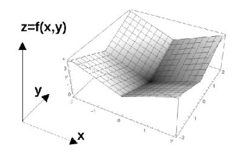

[15] 1. Evaluate the triple integral  $\iiint_E \sqrt{x^2 + z^2} \, dV$ , where E is the region bounded by the paraboloid  $y = x^2 + z^2$  and the plane y = 4.

The projection of the solid region E onto the xy-plane is the region bounded above by y=4 and below by the parabola  $y=x^2$ . Hence,

$$E = \left\{ (x, y, z) | -2 \le x \le 2, \ x^2 \le y \le 4, \ -\sqrt{y - x^2} \le z \le \sqrt{y - x^2} \right\}$$

The triple integral becomes

$$\iiint\limits_{E} \sqrt{x^2 + z^2} \, dV = \int_{x=-2}^{x=2} \int_{y=x^2}^{y=4} \int_{z=-\sqrt{y-x^2}}^{z=\sqrt{y-x^2}} \sqrt{x^2 + z^2} \, dz \, dy \, dx$$

This is difficult to compute, so we consider the projection of E onto the xz-plane. This is a circular disc  $x^2 + z^2 \le 4$ . Thus,

$$\iiint\limits_{E} \sqrt{x^{2} + z^{2}} \, dV = \int_{x=-2}^{x=2} \int_{z=-\sqrt{4-x^{2}}}^{z=\sqrt{4-x^{2}}} \int_{y=x^{2}+z^{2}}^{y=4} \sqrt{x^{2} + z^{2}} \, dy \, dz \, dx$$
$$= \int_{x=-2}^{x=2} \int_{z=-\sqrt{4-x^{2}}}^{z=\sqrt{4-x^{2}}} (4 - x^{2} - z^{2}) \sqrt{x^{2} + z^{2}} \, dz \, dx$$

We use the polar substitution  $x = r \cos(\theta)$ ,  $z = r \sin(\theta)$ , and  $dzdx = r dr d\theta$  in the xz-plane. This is similar to the polar coordinates in the xy-plane, except we are replacing y by z:

$$\iiint_{E} \sqrt{x^{2} + z^{2}} \, dV = \int_{\theta=0}^{\theta=2\pi} \int_{r=0}^{r=2} (4 - r^{2}) \, r \, (r dr \, d\theta)$$
$$= \int_{0}^{2\pi} \left[ \frac{4r^{3}}{3} - \frac{r^{5}}{5} \Big|_{0}^{2} \right] \, d\theta = \int_{0}^{2\pi} \frac{64}{15} \, d\theta = \frac{128\pi}{15}$$

- 2. For each of the following statements, determine whether it is true or false. Simply enter 'T' or 'F' in the space provided. Correct answers are worth 2, blanks are worth 0, and incorrect answers are worth -2.
  - (a) \_\_\_\_ The surface below corresponds to the function z = f(x, y) = |x| + |y|.

(b) \_\_\_\_ The function u(x,t) = f(x-c(x) t) is a solution of the partial differential equation

$$\frac{\partial^2 u}{\partial t^2} + c^2(x) \frac{\partial^2 u}{\partial x^2} = 0$$

for all differentiable functions c(x).

- (c) \_\_\_\_ The integral  $\iint_D dxdy$  is the area of the region D.
- (d) \_\_\_\_ The function  $f(x,y) = \sqrt{x^2 + y^2}$  does not have a tangent plane at (x,y) = (0,0).
- (e) \_\_\_\_ The following sum approximates  $e^{-1}$  with an absolute error less than  $\frac{1}{5!}$ ,

$$e^{-1} \approx \frac{1}{2!} - \frac{1}{3!} + \frac{1}{4!}$$

That is,

$$\left| e^{-1} - \left( \frac{1}{2!} - \frac{1}{3!} + \frac{1}{4!} \right) \right| \le \frac{1}{5!}$$

- (a) T
- (b) F (only c(x) constant)
- (c) T
- (d) T

[12] 3. Use the first three non-zero terms in the Maclaurin series (i.e. Taylor series centred at  $x_0 = 0$ ) expansion to estimate the integral  $\int_0^1 e^x \cos \sqrt{x} \, dx$ . Provide a bound on the error.

We have

$$\cos u = \sum_{n=0}^{\infty} \frac{(-1)^n u^{2n}}{(2n)!} \implies \cos \sqrt{x} = \sum_{n=0}^{\infty} \frac{(-1)^n x^n}{(2n)!} = 1 - \frac{x}{2!} + \frac{x^2}{4!} - \cdots$$

$$e^x = \sum_{n=0}^{\infty} \frac{x^n}{n!} = 1 + x + \frac{x^2}{2!} + \cdots$$

Multiplying these two series, we obtain

$$e^{x} \cos \sqrt{x} = \left(1 - \frac{x}{2} + \frac{x^{2}}{24} - \cdots\right) \left(1 + x + \frac{x^{2}}{2} + \cdots\right)$$

$$= 1 + x + \frac{x^{2}}{2} - \frac{x}{2} - \frac{x^{2}}{2} + \frac{x^{2}}{24} + \cdots$$

$$= 1 + \frac{x}{2} + \frac{x^{2}}{24} + \cdots$$

Thus, we have

$$\int_0^1 e^x \cos \sqrt{x} \, dx \approx \int_0^1 \left( 1 + \frac{x}{2} + \frac{x^2}{24} \right) dx = \left[ x + \frac{x^2}{4} + \frac{x^3}{72} \right]_0^1 = \frac{91}{72}$$

Any reasonable estimate of the error is acceptable. A few examples

• From the remainder theorem, over the interval  $x \in (0,1)$ ,  $e^x = 1 + x + \frac{x^2}{2} \pm \frac{3x^3}{3!} \le 1 + x + \frac{x^2}{2} \pm \frac{1}{2}$ . Similarly,  $\cos(\sqrt{x}) = 1 - \frac{x}{2} + \frac{x^2}{24} \pm \frac{x^3}{720} \le 1 - \frac{x}{2} + \frac{x^2}{24} \pm \frac{1}{720}$ . The error is then bounded by

$$|\text{error}| \le \frac{1}{2} \left| \int_0^1 \left( 1 - \frac{x}{2} + \frac{x^2}{24} \right) dx \right| + \frac{1}{720} \left| \int_0^1 \left( 1 + x + \frac{x^2}{2} \right) dx \right| + \frac{1}{1440} = \frac{1}{2} \frac{55}{72} + \frac{1}{720} \frac{5}{3} + \frac{1}{1440} = \frac{1}{2} \frac{55}{72} + \frac{1}{720} \frac{5}{3} + \frac{1}{1440} = \frac{1}{2} \frac{55}{72} + \frac{1}{720} \frac{5}{3} + \frac{1}{1440} = \frac{1}{2} \frac{55}{72} + \frac{1}{720} \frac{5}{3} + \frac{1}{1440} = \frac{1}{2} \frac{55}{72} + \frac{1}{720} \frac{5}{3} + \frac{1}{1440} = \frac{1}{2} \frac{55}{72} + \frac{1}{720} \frac{5}{3} + \frac{1}{1440} = \frac{1}{2} \frac{55}{72} + \frac{1}{720} \frac{5}{3} + \frac{1}{1440} = \frac{1}{2} \frac{55}{72} + \frac{1}{720} \frac{5}{3} + \frac{1}{1440} = \frac{1}{2} \frac{55}{72} + \frac{1}{720} \frac{5}{3} + \frac{1}{1440} = \frac{1}{2} \frac{55}{72} + \frac{1}{720} \frac{5}{3} + \frac{1}{1440} = \frac{1}{2} \frac{55}{72} + \frac{1}{720} \frac{5}{3} + \frac{1}{1440} = \frac{1}{2} \frac{55}{72} + \frac{1}{720} \frac{5}{3} + \frac{1}{1440} = \frac{1}{2} \frac{55}{72} + \frac{1}{720} \frac{5}{3} + \frac{1}{1440} = \frac{1}{2} \frac{55}{72} + \frac{1}{720} \frac{5}{3} + \frac{1}{1440} = \frac{1}{2} \frac{55}{72} + \frac{1}{720} \frac{5}{3} + \frac{1}{1440} = \frac{1}{2} \frac{55}{72} + \frac{1}{720} \frac{5}{3} + \frac{1}{1440} = \frac{1}{2} \frac{55}{72} + \frac{1}{720} \frac{5}{3} + \frac{1}{1440} = \frac{1}{2} \frac{55}{72} + \frac{1}{720} \frac{5}{3} + \frac{1}{1440} = \frac{1}{2} \frac{55}{72} + \frac{1}{720} \frac{5}{3} + \frac{1}{1440} = \frac{1}{2} \frac{55}{72} + \frac{1}{720} \frac{5}{3} + \frac{1}{1440} = \frac{1}{2} \frac{55}{72} + \frac{1}{720} \frac{5}{3} + \frac{1}{1440} = \frac{1}{2} \frac{55}{72} + \frac{1}{720} \frac{5}{3} + \frac{1}{1440} = \frac{1}{2} \frac{55}{72} + \frac{1}{720} \frac{5}{3} + \frac{1}{1440} = \frac{1}{2} \frac{55}{72} + \frac{1}{720} \frac{5}{3} + \frac{1}{1440} = \frac{1}{2} \frac{55}{72} + \frac{1}{720} \frac{5}{3} + \frac{1}{1440} = \frac{1}{2} \frac{55}{72} + \frac{1}{720} \frac{5}{3} + \frac{1}{1440} = \frac{1}{2} \frac{55}{72} + \frac{1}{720} \frac{5}{3} + \frac{1}{1440} = \frac{1}{2} \frac{55}{72} + \frac{1}{720} \frac{5}{3} + \frac{1}{1440} = \frac{1}{2} \frac{55}{72} + \frac{1}{720} \frac{5}{3} + \frac{1}{1440} = \frac{1}{2} \frac{55}{72} + \frac{1}{720} \frac{5}{3} + \frac{1}{1440} = \frac{1}{2} \frac{5}{72} + \frac{1}{720} \frac{5}{3} + \frac{1}{1440} = \frac{1}{2} \frac{5}{72} + \frac{1}{720} \frac{5}{3} + \frac{1}{720} = \frac{1}{2} \frac{5}{72} + \frac{1}{720} = \frac{1}{2} \frac{5}{72} + \frac{1}{720} = \frac{1}{2} \frac{5}{72} + \frac{1}{720} = \frac{1}{2} \frac{5}{72} + \frac{1}{720} = \frac{1}{2} \frac{5}{72} + \frac{1}{2} \frac{5}{72} + \frac{1}{2} \frac{5}{72} + \frac{1}{2} \frac{5}{72} + \frac{1}{2} \frac{5}{72} +$$

• The integral is bounded below by the minimums of  $e^x$  and  $\cos(\sqrt{x})$ , and above by their maximums. The minimum of  $\cos(1)$  is bounded below by  $\cos(\pi/3)$ . Altogether,

$$e^{0}\cos(\pi/3) \le e^{0}\cos(1) \le \int_{0}^{1} e^{x}\cos(\sqrt{x})dx \le e^{1}\cos(0) \le 3$$

or,

$$\frac{1}{2} \le \int_0^1 e^x \cos(\sqrt{x}) dx \le 3$$

The error can be estimated as  $|\text{error}| \leq \max(|\frac{91}{72} - \frac{1}{2}|, |\frac{91}{72} - 3|) = \frac{125}{72}$ 

[15] 4. For each of the following series, determine whether the given series converges absolutely, converges conditionally or diverges.

(a) 
$$\sum_{n=1}^{\infty} \frac{\sqrt{n}}{2n^2 - 1}$$

We use the limit comparison test. Let  $a_n = \frac{\sqrt{n}}{2n^2 - 1}$  and  $b_n = \frac{\sqrt{n}}{2n^2} = \frac{1}{2n^{3/2}}$ . We have

$$\lim_{n \to \infty} \frac{a_n}{b_n} = \lim_{n \to \infty} \frac{\sqrt{n}}{2n^2 - 1} \, \left( 2n^{3/2} \right) = 1$$

Since  $\sum_{n=1}^{\infty} b_n$  converges (*p*-series with p > 1, thus by the LCT  $\sum_{n=1}^{\infty} a_n$  converges too.

(b) 
$$\sum_{n=1}^{\infty} \frac{(-1)^n (\ln n)^{2n}}{n^n}$$

We use the root test

$$\lim_{n \to \infty} \sqrt[n]{|a_n|} = \lim_{n \to \infty} \frac{(\ln n)^2}{n} = 0 < 1 \quad (HR)$$

The series converges.

(c) 
$$\sum_{n=1}^{\infty} ne^{-n^2}$$

We use the integral test or the ratio test,

$$\lim_{n \to \infty} \left| \frac{a_{n+1}}{a_n} \right| = \lim_{n \to \infty} \left| \frac{(n+1)e^{-(n+1)^2}}{ne^{-n^2}} \right| = \lim_{n \to \infty} \frac{n+1}{n e^{2n+1}} = 0 < 1$$

So the series converges.

(d) 
$$\sum_{n=2}^{\infty} \frac{(2n)!}{(n!)^2}$$

We use the ratio test.

$$\lim_{n \to \infty} \left| \frac{a_{n+1}}{a_n} \right| = \lim_{n \to \infty} \left| \frac{(2(n+1)!)}{((n+1)!)^2} \frac{(n!)^2}{(2n)!} \right|$$

$$= \lim_{n \to \infty} \left| \frac{(2n+2)(2n+1)(2n)!}{(n+1)^2(n!)^2} \frac{(n!)^2}{(2n)!} \right|$$

$$= \lim_{n \to \infty} \left| \frac{(2n+2)(2n+1)}{(n+1)^2} \right| = 4 > 1$$

So the series diverges.

(e) 
$$\sum_{n=2}^{\infty} \frac{1}{\sqrt{n^2 + n \ln^2(n^3 + n^2 + n + 1)}}$$

For  $n \ge 2$ , we have  $\sqrt{n^2 + n} \ge n$  and  $n^3 + n^2 + n + 1 \ge n$ . This implies

$$\sqrt{n^2 + n} \ln^2(n^3 + n^2 + n + 1) \ge n \ln^2(n) \implies \frac{1}{\sqrt{n^2 + n} \ln^2(n^3 + n^2 + n + 1)} \le \frac{1}{n \ln^2(n)}$$

Let  $f(x) = \frac{1}{x \ln^2 x}$ , which is a continuous, positive, and decreasing function. Since  $\int_2^\infty \frac{1}{x \ln^2(x)} dx = \lim_{t \to \infty} \left( -\frac{1}{\ln(t)} + \frac{1}{\ln(2)} \right) < \infty$ , the integral test implies  $\sum_{n=2}^\infty \frac{1}{n \ln^2(n)}$  converges. Therefore, the given series converges by the comparison test.

[12] 5. Find the interval of convergence and radius of convergence of the power series.

(a) 
$$\sum_{n=1}^{\infty} \frac{(-1)^n x^n}{n^2 + 1}$$

Using the ratio test, we have

$$\lim_{n \to \infty} \left| \frac{x^{n+1}}{(n+1)^2 + 1} \frac{n^2 + 1}{x^n} \right| = |x| \lim_{n \to \infty} \frac{n^2 + 1}{(n+1)^2 + 1} = |x| < 1 \implies -1 < x < 1$$

The radius of convergence is R = 1. Next, we check the endpoints.

At 
$$x = -1$$
, we get  $\sum_{n=1}^{\infty} \frac{(-1)^{2n}}{n^2 + 1} = \sum_{n=1}^{\infty} \frac{1}{n^2 + 1}$ . Since  $\frac{1}{n^2 + 1} < \frac{1}{n^2}$  and the series  $\sum_{n=1}^{\infty} \frac{1}{n^2}$  is convergent (p-series with  $p = 2 > 1$ ), thus the series converges by the comparison test.

At x = 1, we get  $\sum_{n=1}^{\infty} \frac{(-1)^n}{n^2 + 1}$ . Since  $\frac{1}{n^2 + 1} \to 0$  as  $n \to \infty$  and the sequence  $\left\{\frac{1}{n^2 + 1}\right\}$ 

is decreasing, the series converges by the AST. Therefore the interval of convergence is

$$-1 \le x \le 1$$

(b) 
$$\sum_{n=0}^{\infty} \frac{(x+2)^n}{(n+1)4^n}$$

Using the ratio test, we have

$$\lim_{n \to \infty} \left| \frac{(x+2)^{n+1}}{(n+2)4^{n+1}} \frac{(n+1)4^n}{(x+2)^n} \right| = \frac{|x+2|}{4} \lim_{n \to \infty} \frac{n+1}{n+2} = \frac{|x+2|}{4} < 1 \implies |x+2| < 4 \implies -6 < x < 2$$

To determine the interval of convergence, we check the endpoints:

At x = 2:

$$\sum_{n=0}^{\infty} \frac{(2+2)^n}{(n+1)4^n} = \sum_{n=0}^{\infty} \frac{4^n}{(n+1)4^n} = \sum_{n=0}^{\infty} \frac{1}{n+1}$$

which diverges by the limit comparison test (compare with the harmonic series).

At x = -6:

$$\sum_{n=0}^{\infty} \frac{(-6+2)^n}{(n+1)4^n} = \sum_{n=0}^{\infty} \frac{(-4)^n}{(n+1)4^n} = \sum_{n=0}^{\infty} = \sum_{n=0}^{\infty} \frac{(-1)^n}{n+1}$$

which converges by the alternating series test (AST). Therefore the interval of convergence of this series is [-6, 2).

[14] 6. Determine the maximum possible error of the third-order Maclaurin series (i.e. Taylor series centred at  $x_0 = 0$ ) expansion of  $\sin(\sqrt{2}x)$  on the interval -1/2 < x < 0.

Let  $u = \sqrt{2}x$ . We notice that

$$-\frac{1}{2} < x < 0 \implies -\frac{\sqrt{2}}{2} < u < 0$$

We have,

$$\sin u = u - \frac{u^3}{3!} + R_3(u) \implies \sin(\sqrt{2}x) = \sqrt{2}x - \frac{(\sqrt{2}x)^3}{3!} + R_3(\sqrt{2}x)$$

The maximum possible error is given by

$$|R_3(u)| \le \frac{K|u|^4}{4!}$$
 ,  $|f^4(u)| \le K$ 

Since  $|(\sin u)^{(4)}| = |\sin u| \le 1$ , we have

$$|R_3(u)| \le \frac{(\sqrt{2}/2)^4}{4!} = \frac{1}{96}$$

Other reasonable estimates of the error are acceptable. For example, if they notice that *sine* has an alternating series, then

$$|\text{error}| \le \max \left| \frac{(\sqrt{2}x)^5}{5!} \right| = \frac{1}{480\sqrt{2}} = \frac{1}{2^{5/2} 5!} = \frac{\sqrt{2}}{960}$$

If they take four derivatives of  $\sin \sqrt{2}x$ , then  $|f^{(4)}(s)| = |4\sin 2u| \le 4$  and

$$R_3(x) \leq \frac{4x^4}{4!}$$

which is a maximum at x = -1/2, max  $R_4 = 1/96$ .

Notice the question does not ask for the Maclaurin polynoimial, so full marks if they simply derive the error (correctly).

[12] 7. Use Taylor polynomials to evaluate the following limits. For full-marks, make appropriate use of 'Big-O' notation.

(a) 
$$\lim_{x \to 0} \frac{\sin x - x}{x^3}$$

From the Taylor polynomial  $(x_0 = 0)$  for  $\sin x = x - \frac{x^3}{3!} + \frac{x^5}{5!} + \dots$ 

$$\lim_{x \to 0} \frac{\sin x - x}{x^3} = \lim_{x \to 0} \frac{\left(x - \frac{x^3}{3!} + \frac{x^5}{5!} + \mathcal{O}(x^7)\right) - x}{x^3}$$

$$= \lim_{x \to 0} \frac{-\frac{x^3}{3!} + \frac{x^5}{5!} + \mathcal{O}(x^7)}{x^3} = \lim_{x \to 0} -\frac{1}{3!} + \frac{x^2}{5!} + \mathcal{O}(x^4) = -\frac{1}{6}$$

(b) 
$$\lim_{x \to 0} \left( \frac{1}{x} - \frac{1}{e^x - 1} \right)$$

Combining the fractions by cross-multiplication,

$$\lim_{x \to 0} \left( \frac{1}{x} - \frac{1}{e^x - 1} \right) = \lim_{x \to 0} \frac{(e^x - 1) - x}{x (e^x - 1)} = \lim_{x \to 0} \frac{\frac{x^2}{2!} + \frac{x^3}{3!} + \mathcal{O}(x^4)}{x^2 + \frac{x^3}{2!} + \mathcal{O}(x^4)} = \lim_{x \to 0} \frac{\frac{1}{2!} + \frac{x}{3!} + \mathcal{O}(x^2)}{1 + \frac{x}{2!} + \mathcal{O}(x^2)} = \frac{1}{2}$$

(c) 
$$\lim_{x \to 0} \left( \frac{\ln(1+x)}{x^2} - \frac{1}{x} \right)$$

Combining the fractions by cross-multiplication,

$$\lim_{x \to 0} \frac{\ln(1+x) - x}{x^2} = \lim_{x \to 0} \frac{\left(x - \frac{x^2}{2} + \frac{x^3}{3} + \mathcal{O}(x^4)\right) - x}{x^2}$$

$$= \lim_{x \to 0} \frac{-\frac{x^2}{2} + \frac{x^3}{3} + \mathcal{O}(x^4)}{x^2} = \lim_{x \to 0} -\frac{1}{2} + \frac{x}{3} + \mathcal{O}(x^2) = -\frac{1}{2}$$

$$xy''(x) + 2y'(x) + xy(x) = 0$$
,  $y(0) = 1$ ,  $y'(0) = 0$ .

Suppose that the solution can be represented as a power-series with a radius of convergence R > 0,

$$y(x) = \sum_{n=0}^{\infty} c_n x^n$$

(a) Use the differential equation and initial conditions to determine the coefficients  $c_0, c_1, c_2, c_3$ , and  $c_4$ . Use these to write down the  $4^{th}$ -order Taylor polynomial  $P_{4,0}(x)$ .

Let  $y(x) = c_0 + c_1 x + c_2 x^2 + c_3 x^3 + c_4 x^4$ , and then  $y'(x) = c_1 + 2c_2 x + 3c_3 x^2 + 4c_4 x^3$ . Using the initial conditions,

$$y(0) = 1 \implies c_0 = 1$$
  
 $y'(0) = 0 \implies c_1 = 0$ 

So, we have

$$y(x) = 1 + c_2 x^2 + c_3 x^3 + c_4 x^4$$
  

$$y'(x) = 2c_2 x + 3c_3 x^2 + 4c_4 x^3$$
  

$$y''(x) = 2c_2 + 6c_3 x + 12c_4 x^2$$

Substituting y(x), y'(x) and y''(x) into the DE, we obtain

$$x\left(2c_2 + 6c_3x + 12c_4x^2\right) + 2\left(2c_2x + 3c_3x^2 + 4c_4x^3\right) + x\left(1 + c_2x^2 + c_3x^3 + c_4x^4\right) = 0$$

This gives

$$6c_2 + 1 = 0 \implies c_2 = -\frac{1}{6} = -\frac{1}{3!}$$

$$12c_3 = 0 \implies c_2 = 0$$

$$20c_4 + c_2 = 0 \implies c_4 = -\frac{c_2}{20} = \frac{1}{5!}$$

$$y(x) = 1 - \frac{x^2}{3!} + \frac{x^4}{5!}$$

(b) The pattern of the coefficients should be familiar. Write down the solution in closed-form by recognizing the function your series represents. What is the smallest positive value of x where y(x) = 0?

$$y(x) = \begin{cases} \frac{\sin x}{x}, & x \neq 0\\ 1 & x = 0 \end{cases}$$

The first positive root is  $x^* = \pi$ .