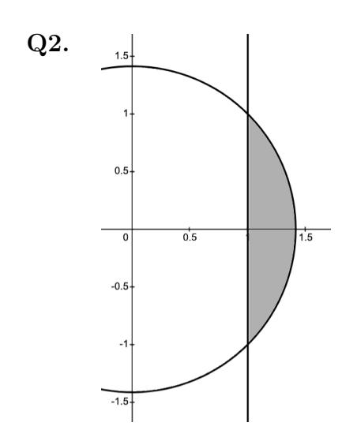
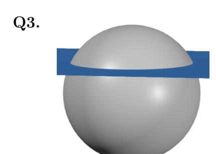
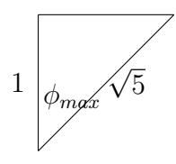

## Math 119 Exam Solutions

**Q1.** Let  $f(x,y) = 2x^2 + y^2 - 2y$ 

(a) [3 marks] Find and classify the critical points of f(x,y) using the Second Derivative Test.

**Solution:** We have that  $\nabla f = (4x, 2y-2)$ , and therefore the only critical point of f occurs at (0,1). To classify it, note that  $f_{xx} = 4$ ,  $f_{yy} = 2$ , and  $f_{xy} = 0$ , and therefore the Hessian is  $H(x,y) = f_{xx}f_{yy} - f_{xy}^2 = 8$ . So H(0,1) > 0. Since  $f_{xx}(0,1) > 0$  we conclude that (0,1) is a local minimum.

(b) [3 marks] Subject to the constraint  $x^2 + y^2 = 4$ , use the Method of Lagrange Multipliers to determine the points (x, y) for which the maximum and minimum values of f(x, y) occur.

**Solution:** Let  $g(x,y) = x^2 + y^2$ . Then  $\nabla g = (2x,2y)$ . Thus our Lagrange Equations are

$$4x = \lambda 2x$$
$$2y - 2 = \lambda 2y$$
$$x^{2} + y^{2} = 4$$

The first equation can be rewritten as  $2x(2-\lambda)=0$ , hence x=0 or  $\lambda=2$ . If  $\lambda=2$  then the second equation gives y=-1 and then the third equation gives  $x=\pm\sqrt{3}$ , hence we get the points  $(\pm\sqrt{3},-1)$ .

If x = 0 then the third equation immediately gives  $y = \pm 2$ , so we also get the points  $(0, \pm 2)$ .

(c) [2 marks] On the region  $x^2 + y^2 \le 4$  what are the maximum and minimum values of f(x, y)?

**Solution:** We make the evaluations

$$f(0,1) = -3$$

$$f(\pm\sqrt{3}, -1) = 9$$

$$f(0,2) = 0$$

$$f(0, -2) = 8$$

and so the maximum value is 9 and the minimum value is -3.

[6 marks] Consider the region  $\mathcal{D}$  defined by the inequalities  $x^2 + y^2 \le 2$  and  $x \ge 1$ . (The region  $\mathcal{D}$  is the shaded area shown.) By doing a double integral using polar coordinates, evaluate  $\iint_{\mathcal{D}} \frac{1}{(x^2 + y^2)^{3/2}} dA.$ 

**Solution:** The circle intersects the line at x=1 and  $y=\pm 1$  - therefore, on  $\mathcal{D}$ , we have that  $-\frac{\pi}{4} \leq \theta \leq \frac{\pi}{4}$ . For a fixed  $\theta$ , the smaller r value is determined by the line x=1 and the larger r value is determined by the circle. In polar coordinates, the line x=1 has equation  $r\cos\theta=1$ , so  $r=\frac{1}{\cos\theta}$ , and the largest r value us  $r=\sqrt{2}$ . Note that the function being integrated is  $\frac{1}{(r^2)^{3/2}}=\frac{1}{r^3}$ . We thus have that

$$\iint_{\mathcal{D}} \frac{1}{(x^2 + y^2)^{3/2}} dA = \int_{-\frac{\pi}{4}}^{\frac{\pi}{4}} \int_{r = \frac{1}{\cos \theta}}^{r = \sqrt{2}} \frac{1}{r^3} r \, dr d\theta$$

$$= -\int_{-\frac{\pi}{4}}^{\frac{\pi}{4}} \frac{1}{r} \Big|_{r = \frac{1}{\cos \theta}}^{r = \sqrt{2}} d\theta$$

$$= \int_{-\frac{\pi}{4}}^{\frac{\pi}{4}} [\cos \theta - \frac{1}{\sqrt{2}}] \, d\theta$$

$$= \left[\sin \theta - \frac{\theta}{\sqrt{2}}\right] \Big|_{-\frac{\pi}{4}}^{\frac{\pi}{4}}$$

$$= \sqrt{2} - \frac{\pi}{2\sqrt{2}}$$

[4 marks] Let  $\mathcal{D}$  be the region above the plane z=1 and inside the solid sphere  $x^2+y^2+z^2 \leq 5$ . Write down integrals, in each of cylindrical and spherical coordinates, that evaluate to the volume of  $\mathcal{D}$ . You do not need to evaluate these integrals. [Don't worry about 'simplifying' an expression with  $\sin^{-1}$  or  $\cos^{-1}$  appearing in it. ]

**Solution:** Certainly we have that  $0 \le \theta \le 2\pi$ . Check out this triangle - the bottom vertex is the center of the sphere, and the top edge is the plane z = 1, and the top-right vertex is the plane intersecting a point on the boundary of the sphere:

from which we see that  $\cos(\phi_{max}) = \frac{1}{\sqrt{5}}$ . For r, the largest value we ever take is  $\sqrt{5}$ , and for a fixed  $\phi$ , the smallest value we take it determined by the plane z = 1, i.e. by  $r \cos \phi = 1$ . Thus, in spherical coordinates,

$$Vol(\mathcal{D}) = \int_0^{2\pi} \int_0^{\cos^{-1}(\frac{1}{\sqrt{5}})} \int_{\frac{1}{\cos\phi}}^{\sqrt{5}} r^2 \sin\phi \, dr \, d\phi \, d\theta$$

Cylindrical? We have that  $0 \le \theta \le 2\pi$ . For r, z, they can be done in either way. For  $1 \le z \le \sqrt{5}$ , we have that  $r_{max}$  is determined by the sphere equation  $x^2 + y^2 + z^2 = 5$ , so  $z = \sqrt{5 - r^2}$ . Thus one way to write cylindrical coordinates is

$$Vol(\mathcal{D}) = \int_0^{2\pi} \int_1^{\sqrt{5}} \int_0^{\sqrt{5-z^2}} r \, dr \, dz \, d\theta$$

If we want to swap r and z, note that the largest value of r occurs where the boundary of the sphere hits the plane. Since z=1 here, it follows that  $1+x^2+y^2=5$ , and therefore r=2. For a fixed r, we have that  $1 \le z \le \sqrt{5-r^2}$ , and thus we also have that

$$Vol(\mathcal{D}) = \int_{0}^{2\pi} \int_{0}^{2} \int_{1}^{\sqrt{5-r^2}} r \, dz \, dr \, d\theta$$

**Q4.** [8 marks] For each of the following series, determine if it converges or diverges.

(a) 
$$\sum_{n=1}^{\infty} \frac{3n+1}{4n+119}$$

**Solution:** This diverges - lots of ways to do this, one way is the divergence test.

(b) 
$$\sum_{n=1}^{\infty} \frac{\sqrt{n+5}}{n^2 + 17n + \sin n}$$

Solution: Converges. Use LCT with  $b_n = \frac{\sqrt{n}}{n^2}$  - we have that  $\lim_{n \to \infty} \frac{a_n}{b_n} = 1$ , and we know that  $\sum_{n \ge 1} b_n$  converges by the *p*-series test.

(c) 
$$\sum_{n=1}^{\infty} \frac{(2n)!}{(n!)^2 \times 3^n}$$

**Solution:** We use the ratio test - let  $a_n = \frac{(2n)!}{(n!)^2 \times 3^n}$ . We have that

$$\lim_{n \to \infty} \frac{a_{n+1}}{a_n} = \lim_{n \to \infty} \frac{(2n+2)!}{((n+1)!)^2 3^{n+1}} \times \frac{(n!)^2 3^n}{(2n)!}$$

$$= \frac{1}{3} \lim_{n \to \infty} \frac{(2n+2)(2n+1)}{(n+1)^2}$$

$$= \frac{4}{3}$$

By the ratio test, the series diverges.

(d) 
$$\sum_{n=3}^{\infty} \frac{1}{n\sqrt{\ln n}}$$

**Solution #1** This diverges. We use the integral test. Let  $f(x) = \frac{1}{x\sqrt{\ln x}}$ . Then f(x) is continuous, positive, and decreasing, and  $f(n) = \frac{1}{n\sqrt{n}}$ . Thus the series converges if and only if  $\int_3^\infty \frac{1}{x\sqrt{x}} dx$  converges. Letting  $u = \ln x$ , so  $du = \frac{1}{x} dx$  we have that

$$\int_{3}^{\infty} \frac{1}{x\sqrt{x}} dx = \lim_{c \to \infty} \int_{\ln 3}^{c} \frac{1}{\sqrt{u}} du$$
$$= \lim_{c \to \infty} 2u^{1/2} \Big|_{\ln 3}^{c}$$
$$= 2 \lim_{c \to \infty} [\sqrt{c} - \sqrt{\ln 3}]$$
$$= \infty$$

The integral diverges, so the series does as well.

**Solution #2**: This is a bit sketchier, but think I'm OK with it. In class, I showed that  $\sum \frac{1}{n \ln n}$  diverged (by the integral test). If they say  $\frac{1}{n \ln n} \le \frac{1}{n \sqrt{\ln n}}$ , and quote the comparison test, that's fine.

**Q5.** [8 marks] Determine the radius of convergence and interval of convergence of the series  $\sum_{n=1}^{\infty} \frac{1}{3^n \times \sqrt{n}} (2x-4)^n$ .

**Solution:** Let  $a_n = \frac{2^n}{3^n \sqrt{n}}$ . Then we have that  $\sum_{n=1}^{\infty} \frac{1}{3^n \times \sqrt{n}} (2x-4)^n = \sum_{n=1}^{\infty} a_n (x-2)^n$ . We therefore have that

$$\begin{split} R &= \lim_{n \to \infty} \frac{a_n}{a_{n+1}} \\ &= \lim_{n \to \infty} \frac{2^n}{3^n \sqrt{n}} \times \frac{3^{n+1} \sqrt{n+1}}{2^{n+1}} \\ &= \frac{3}{2} \lim_{n \to \infty} \frac{\sqrt{n+1}}{\sqrt{n}} \\ &= \frac{3}{2} \end{split}$$

Our endpoints are  $2 \pm \frac{3}{2}$  which are  $\frac{1}{2}$  and  $\frac{7}{2}$ .

At  $\frac{1}{2}$  the series is

$$\sum_{n=1}^{\infty} \frac{1}{3^n \times \sqrt{n}} (2(\frac{1}{2}) - 4)^n = \sum_{n=1}^{\infty} \frac{(-1)^n}{\sqrt{n}}$$

which converges by the AST.

At  $\frac{7}{2}$  the series is

$$\sum_{n=1}^{\infty} \frac{1}{3^n \times \sqrt{n}} (2(\frac{7}{2}) - 4)^n = \sum_{n=1}^{\infty} \frac{1}{\sqrt{n}}$$

which diverges as it is a *p*-series with p < 1. In summary, the interval of ocnvergence is  $\left[\frac{1}{2}, \frac{7}{2}\right)$ .

**Q6.** Let  $f(x) = xe^{-2x}$ .

1. [4 marks] Determine  $T_{3,0}(x)$ , the third order Taylor Polynomial of f(x) centered at 0. (This is also known as the third order McLaurin Polynomial of f(x).)

**Solution:** We know that  $T_{2,0}$  for  $e^x$  is  $1 + x + \frac{x^2}{2}$ . Therefore  $T_{2,0}$  for  $e^{-2x}$  is  $1 - 2x + 2x^2$ . Therefore  $T_{3,0}$  for  $xe^{-2x}$  is  $x - 2x^2 + 2x^3$ .

2. [4 marks] Use Taylor's Inequality to determine an upper bound on the error associated with approximating  $f(\frac{1}{10})$  with  $T_{3,0}(\frac{1}{10})$ .

Solution #1: Begin by writing

$$e^x = 1 + x + \frac{x^2}{2} + R_{2,0}(x)$$

We then have that

$$xe^{-2x} = x - 2x^2 + 2x^3 + xR_{2,0}(-2x)$$

and thus we are looking for an upper bound on  $|\frac{1}{10}R_{2,0}(-\frac{2}{10})|$ . By Taylor's Inequality,  $|R_{2,0}(-\frac{2}{10})| \leq \frac{K}{6}|\frac{2}{10}-0|^3$  where  $|\frac{d^3}{dx^3}e^x| \leq K$  on  $[-\frac{2}{10},0]$ . We can thus take K=1, and so we finish with

$$|f(\frac{1}{10}) - T_{3,0}(\frac{1}{10})| = |\frac{1}{10}R_{2,0}(-\frac{2}{10})|$$

$$= \frac{1}{10}|R_{2,0}(-\frac{2}{10})|$$

$$\leq \frac{1}{10} \times \frac{1}{6} \times \frac{2^3}{10^3}$$

$$= \frac{4}{3 \times 10^4}$$

**Solution #2**: Same as soln 1 but you backtrack the interval from u = -2x - this gives  $[-\frac{1}{10}, 0]$  instead of  $[-\frac{2}{10}, 0]$ , but this doesn't change the answer, since the derivative function is increasing.

**Solution #3**: Directly calculate that

$$f^{(1)}(x) = e^{-2x} - 2xe^{-2x} = e^{-2x}(1 - 2x)$$

$$f^{(2)}(x) = -2e^{-2x}(1 - 2x) - 2e^{-2x} = e^{-2x}(4x - 4)$$

$$f^{(3)}(x) = -2e^{-2x}(4x - 4) + 4e^{-2x} = e^{-2x}(12 - 8x)$$

$$f^{(4)}(x) = -2e^{-2x}(12 - 8x) - 8e^{-2x} = e^{-2x}[16x - 32]$$

The function |16x-32| is decreasing and the function  $e^{-2x}$  is decreasing. Thus, on  $[0,\frac{1}{10}],$ 

$$|f^{(4)}(x)| \le |e^{-2(0)}| \times |[16(0) - 32]| = 32$$

Therefore, by Taylor's Inequality, on  $[0, \frac{1}{10}]$  we have that

$$|f(\frac{1}{10}) - T_{3,0}(\frac{1}{10})| \le \frac{32}{4!} \times \frac{1}{10^4}$$

which is a fine answer.

Solution #4: We have that

$$xe^{-2x} = x\sum_{n=0}^{\infty} \frac{(-1)^n 2^n}{n!} x^n = \sum_{n=0}^{\infty} \frac{(-1)^n 2^n}{n!} x^{n+1}$$

and therefore

$$\frac{1}{10}e^{-2/10} = \sum_{n=0}^{\infty} \frac{(-1)^n 2^n}{10^{n+1} n!}$$

By the ASET, the error in approximating the number with  $s_3$  is at most  $\frac{2^4}{10^5 4!}$ . Won't give this full marks since question said to use TI.

**Q7.** Let 
$$f(x) = \int_0^x \frac{t}{1 - \frac{t^2}{4}} dt$$
.

(i) [4 marks] Find the  $6^{th}$  order Taylor Polynomial of f(x) centered at 0. Solution: (Big O notation is not required to get full marks.) We have that

$$\frac{1}{1-u} = 1 + u + u^2 + \mathcal{O}(u^3)$$

and therefore

$$\frac{t}{1 - \frac{t^2}{4}} = t + \frac{t^3}{4} + \frac{t^5}{16} + \mathcal{O}(t^7)$$

and hence

$$f(x) = \frac{x^2}{2} + \frac{x^4}{16} + \frac{x^6}{96} + \mathcal{O}(x^8)$$

(ii) [2 marks] If f(x) was to be written as a power series centered at 0, what would its radius of convergence be?

**Solution:** We have that the TS of  $\frac{1}{1-u}$  at 0 converges if and only if |u| < 1. When replacing u with  $\frac{t^2}{4}$ , this converges when  $\left|\frac{t^2}{4}\right| < 1$ , i.e. when t < 2. Since multiplying by t and integrating doesn't change RoC, our new series would also have RoC 2.

(iii) [2 marks] Find a real number c such that  $f(c) = \sum_{n=0}^{\infty} \frac{1}{3^{n+1}4^n(2n+2)}$ .

Solution: We have that

$$f(x) = \int_0^x \frac{t}{1 - \frac{t^2}{4}} dt$$

$$= \int_0^x t \sum_{n=0}^\infty (\frac{t^2}{4})^n dt$$

$$= \int_0^x \sum_{n=0}^\infty \frac{1}{4^n} t^{2n+1} dt$$

$$= \sum_{n=0}^\infty \frac{1}{4^n \times (2n+2)} x^{2n+2}$$

from which we can observe that

$$\sum_{n=0}^{\infty} \frac{1}{3^{n+1}4^n(2n+2)} = f(\frac{1}{\sqrt{3}}) = f(-\frac{1}{\sqrt{3}})$$

- **Q8.** [6 marks] Evaluate the following limits. Properly use  $\mathcal{O}$  ('big O') notation to earn full marks.

(i)  $\lim_{x\to 0} \frac{\sin(2x^2) - 2x^2}{x^6}$  **Solution:** Note for all 3 of these, I've used more terms than are needed - that is fine. We have that  $\sin x = x - \frac{x^3}{6} + \frac{x^5}{120} + \mathcal{O}(x^6)$  (or  $\mathcal{O}(x^7)$ ). Therefore

$$\sin(2x^2) = 2x^2 - \frac{8x^6}{6} + \frac{2^5x^{10}}{120} + \mathcal{O}(x^{12}), \text{ and so}$$

$$\lim_{x \to 0} \frac{\sin(2x^2) - 2x^2}{x^6} = \lim_{x \to 0} \frac{2x^2 - \frac{8x^6}{6} + \frac{2^5x^{10}}{120} + \mathcal{O}(x^{12}) - 2x^2}{x^6}$$

$$= \lim_{x \to 0} \frac{-\frac{4}{3} + \mathcal{O}(x^4)}{1}$$

$$= -\frac{4}{3}$$

(ii) 
$$\lim_{x \to 0} \left( \frac{\ln(1+x)}{x^2} - \frac{1}{x} \right)$$

(ii)  $\lim_{x\to 0} \left(\frac{\ln(1+x)}{x^2} - \frac{1}{x}\right)$  **Solution:** Since  $\frac{d}{dx} \ln(1+x) = \frac{1}{1+x} = 1 - x + x^2 + \mathcal{O}(x^3)$ , we have that  $\ln(1+x) = C + x - \frac{x^2}{2} + \frac{x^3}{3} + \mathcal{O}(x^4)$ . Plugging in x = 0 gives C = 0. Therefore we have that

$$\lim_{x \to 0} \left( \frac{\ln(1+x)}{x^2} - \frac{1}{x} \right) = \lim_{x \to 0} \frac{\ln(1+x) - x}{x^2}$$

$$= \lim_{x \to 0} \frac{x - \frac{x^2}{2} + \frac{x^3}{3} + \mathcal{O}(x^4) - x}{x^2}$$

$$= \lim_{x \to 0} \frac{-\frac{x^2}{2} + \frac{x^3}{3} + \mathcal{O}(x^4)}{x^2}$$

$$= \lim_{x \to 0} \frac{-\frac{x^2}{2} + \frac{x^3}{3} + \mathcal{O}(x^4)}{x^2}$$

$$= \lim_{x \to 0} \frac{-\frac{1}{2} + \frac{x}{3} + \mathcal{O}(x^2)}{1}$$

$$= -\frac{1}{2}$$

(iii) 
$$\lim_{x\to 0} \frac{1-\sqrt{1+x^{100}}}{1-e^x}$$

Solution: We have that  $\sqrt{1+x^{100}} = (1+x^{100})^{\frac{1}{2}} = 1 + \frac{1}{2}x^{100} - \frac{1}{8}x^{200} + \mathcal{O}(x^{300}).$ Also,  $e^x = 1 + x + \frac{x^2}{2} + \mathcal{O}(x^3)$ , and so

$$\lim_{x \to 0} \frac{1 - \sqrt{1 + x^{100}}}{1 - e^x} = \lim_{x \to 0} \frac{1 - \left(1 + \frac{1}{2}x^{100} - \frac{1}{8}x^{200} + \mathcal{O}(x^{300})\right)}{1 - \left(1 + x + \frac{x^2}{2} + \mathcal{O}(x^3)\right)}$$

$$= \lim_{x \to 0} \frac{-\frac{1}{2}x^{100} + \mathcal{O}(x^{200})}{-x + \mathcal{O}(x^2)}$$

$$= \lim_{x \to 0} \frac{-\frac{1}{2}x^{99} + \mathcal{O}(x^{199})}{-1 + \mathcal{O}(x)}$$

$$= 0$$

**Q9.** These two questions are not related to each other.

(i) [4 marks] The series

$$\frac{2}{3} - \frac{3}{3^3} + \frac{4}{3^5} - \frac{5}{3^7} + \frac{6}{3^9} - \frac{7}{3^{11}} + \cdots$$

converges. What value does it converge to?

**Solution #1**: Call the series A. Then  $\frac{1}{9}A = \frac{2}{3^3} - \frac{3}{3^5} + \frac{4}{3^7} - \frac{5}{3^9} + \frac{6}{3^{11}} - \frac{7}{3^{13}} + \cdots$ . We then have that

$$A + \frac{1}{9}A = \frac{2}{3} - \frac{1}{3^3} + \frac{1}{3^5} - \frac{1}{3^7} + \cdots$$

$$= \frac{1}{3} + \frac{1}{3} \left[1 - \frac{1}{9} + \frac{1}{9^2} - \frac{1}{9^3} + \cdots\right]$$

$$= \frac{1}{3} + \frac{1}{3} \left[\frac{1}{1 + \frac{1}{9}}\right]$$

$$= \frac{19}{20}$$

So  $\frac{10}{9}A = \frac{19}{30}$ , and thus  $A = \frac{57}{100}$  and we are done.

**Solution #2**: Let  $f(x) = \frac{1}{3} \sum_{n=0}^{\infty} \frac{(n+2)(-1)^n}{9^n} x^{n+1}$ . Then we have that A = f(1), where A is the series we wish to determine. Note that

$$\int f(x) dx = \int \frac{1}{3} \sum_{n=0}^{\infty} \frac{(n+2)(-1)^n}{9^n} x^{n+1} dx$$

$$= \frac{1}{3} \sum_{n=0}^{\infty} \int \frac{(n+2)(-1)^n}{9^n} x^{n+1} dx$$

$$= \left(\frac{1}{3} \sum_{n=0}^{\infty} \frac{(-1)^n}{9^n} x^{n+2}\right) + C$$

$$= \left(\frac{x^2}{3} \sum_{n=0}^{\infty} \left(-\frac{x}{9}\right)^n\right) + C$$

$$= \frac{x^2}{3} \times \frac{1}{1 - (-\frac{x}{9})} + C$$

$$= \frac{3x^2}{9 + x} + C$$

Taking derivative, we have that  $f(x) = \frac{3x^2 + 54x}{(9+x)^2}$ , and therefore  $f(1) = \frac{57}{100}$ .

Solution #3: We want to compute

$$\sum_{i=0}^{\infty} \frac{(-1)^{i}(i+2)}{3^{2i+1}} = \sum_{i=2}^{\infty} \frac{(-1)^{i} \cdot i}{3^{2i-3}} = \sum_{i=2}^{\infty} (-1)^{i} \cdot i \cdot 3^{-2i+3}$$
$$= \sum_{i=2}^{\infty} (-1)^{i} \cdot i \cdot (3^{-2})^{i-1} \cdot 3 = -3 \sum_{i=2}^{\infty} i \cdot (-\frac{1}{9})^{i-1}.$$

Plugging 
$$x = -\frac{1}{9}$$
 into  $\frac{1}{(1-x)^2} = \sum_{i=1}^{\infty} ix^{i-1}$ , we have 
$$\sum_{i=0}^{\infty} \frac{(-1)^i(i+2)}{3^{2i+1}} = -3\sum_{i=2}^{\infty} i \cdot (-\frac{1}{9})^{i-1} = -3(\sum_{i=1}^{\infty} i \cdot (-\frac{1}{9})^{i-1} - 1)$$
$$= -3\left(\frac{1}{(1+\frac{1}{9})^2} - 1\right) = \frac{57}{100}.$$

(ii) [4 marks] Suppose that  $\sum_{n=0}^{\infty} a_n x^n$  has a radius of convergence R > 0 and that it converges to f(x) on it's interval of convergence. What function does  $\sum_{n=0}^{\infty} a_{2n}x^{2n+1}$  converge to? [Your answer will depend on f(x). For example, you would say that  $\sum_{n=0}^{\infty} 2a_n x^n$  converges to 2f(x).] **Solution:** We have that

$$f(x) = a_0 + a_1 x + a_2 x^2 + a_3 x^3 + \cdots$$
  
$$f(-x) = a_0 - a_1 x + a_2 x^2 - a_3 x^3 + \cdots$$

Therefore  $f(x) + f(-x) = 2a_0 + 2a_2x^2 + 2a_4x^4 + \cdots$ , and so

$$x(f(x) + f(-x)) = 2a_0x + 2a_2x^3 + 2a_4x^5 + \dots = 2\sum_{n=0}^{\infty} a_{2n}x^{2n+1}$$

and thus the desired series converges to  $\frac{1}{2}x(f(x)+f(-x))$ .