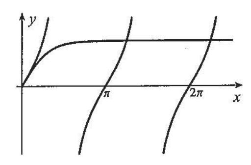

## Practice Problem Set 7

Topics: Root Finding, Interpolation, Taylor Polynomials

- 1. The root of the equation  $e^{-2x} = x 3$  is to be obtained to an accuracy of 0.0001 using the Bisection method. What is the maximum size of the initial interval  $[x_0, x_1]$  to be used if the iteration is to be stopped after 7 iterations? Find the root to 4 decimal places. **Answer:**  $x_1 x_0 = 0.0128$ , root  $\approx 3.0025$
- 2. Consider the equation  $x^2 \ln(x+3) = 0$ .
  - (a) Show, using the Intermediate Value Theorem, that there is a root in the interval (-1,0), and another one in the interval (1,2).
  - (b) Use Newton's method to approximate the root of the above equation between -1 and 0, accurate to six decimal places. **Answer:** Using  $x_0 = -1$ ,  $x_4 = -0.869648$
  - (c) Use Newton's method to approximate the root between 1 and 2, to six decimal places. **Answer:** Using  $x_0 = 1$ ,  $x_4 = 1.197724$
- 3. Write down the recursive sequence that Newton's method would generate for  $f(x) = x^2 a$  where  $a \in \mathbf{R}, a > 0$ ; that is, write the formula for  $x_{n+1}$  in terms of  $x_n$ . Use this formula to approximate  $\sqrt{7}$  to 3 decimal places with  $x_0 = 3$ .

**Answer:** 
$$x_{n+1} = \frac{1}{2} \left( x_n + \frac{a}{x_n} \right), x_3 = 2.64583 \approx \sqrt{7}$$

4. Oscillations of a horizontal beam fixed at one end occur at certain frequencies, which we call *natural frequencies*. It can be shown that those frequencies are proportional to the solutions of the equation

$$\tan x = \tanh x$$

for 
$$x > 0$$
.

(a) A sketch of the graphs of the functions appearing on both sides of this equation is shown below:

Use this sketch to estimate suitable "guess" values  $x_0$  for the two smallest natural frequencies. **Answer:**  $x_0 = 4$  and  $x_0 = 7$ 

1

(b) Use Newton's method with your guesses for  $x_0$  to find approximate values of the two smallest natural frequencies, to four decimal places.

**Answer:** Using  $x_0 = 4$ ,  $x_3 = 3.9266$  , Using  $x_0 = 7$ ,  $x_4 = 7.0686$ 

5. Find a polynomial of degree 4 passing through the five points given:

$$(2,10), (3,0), (4,-3), (5,1), (6,-2)$$

**Answer:**  $p_4(x) = -19 + \frac{187}{3}x - \frac{455}{12}x^2 + \frac{49}{6}x^3 - \frac{7}{12}x^4$ 

6. An important function in statistics is the so-called error function, erf(x), defined as:

$$\operatorname{erf}(x) = \frac{2}{\sqrt{\pi}} \int_0^x e^{-t^2} dt \ .$$

Verify that Lagrange interpolation and Newton interpolation yield the same estimate for erf(0.58) using all the tabulated values below:

| X      | 0.50   | 0.55   | 0.60   | 0.65   |
|--------|--------|--------|--------|--------|
| erf(x) | 0.5205 | 0.5633 | 0.6039 | 0.6420 |

**Answer:** To 3 decimals places erf(0.58) = 0.588

- 7. Let  $g(x) = x^4 + 1$ . Find the fourth-order Taylor polynomial of g(x) centered at  $x_0 = 1$  (that is, find  $T_{4,1}(x)$ ). **Answer:**  $T_{4,1}(x) = 2 + 4(x-1) + 6(x-1)^2 + 4(x-1)^3 + (x-1)^4$
- 8. Find the required Taylor polynomial,  $T_{n,x_0}(x)$  for each function below.

(a) 
$$f(x) = \tan(x)$$
,  $T_{3,0}(x)$ . **Answer:**  $T_{3,0}(x) = x + \frac{1}{3}x^3$ 

(b) 
$$g(x) = \sqrt{x}$$
,  $T_{2,4}(x)$ . **Answer:**  $T_{2,4}(x) = 2 + \frac{1}{4}(x-4) - \frac{1}{64}(x-4)^2$ 

(c) 
$$h(x) = 2^x$$
,  $T_{3,0}(x)$ . Answer:  $T_{3,0}(x) = 1 + (\ln 2)x + \frac{(\ln 2)^2}{2}x^2 + \frac{(\ln 2)^3}{6}x^3$ 

9. Determine the third order Maclaurin polynomial for  $f(x) = \frac{1}{x+1}$  (that is, find  $T_{3,0}(x)$ ). Then use shortcuts to find each Maclaurin polynomial below.

**Answer:**  $T_{3,0}(x) = 1 - x + x^2 - x^3$ 

- (a) The third order Maclaurin polynomial for  $g(x) = \frac{1}{5x+1}$ . Answer:  $T_{3,0}(x) = 1 - 5x + 25x^2 - 125x^3$
- (b) The second order Maclaurin polynomial for  $h(x) = \frac{1}{(x+1)^2}$ . **Answer:**  $T_{2,0}(x) = 1 - 2x + 3x^2$
- (c) The fourth order Maclaurin polynomial for  $k(x) = \ln(x+1)$ . **Answer:**  $T_{4,0}(x) = x - \frac{1}{2}x^2 + \frac{1}{2}x^3 - \frac{1}{4}x^4$

2

10. Let f(x) = sin(x 3 ). Calculate f (9)(0).

Hint: You do not need to calculate nine derivatives! Instead, use shortcuts to find the 9 th-degree Maclaurin polynomial for f(x). From here, is there an easy way to identify f (9)(0)?

Answer: f (9)(0) = − 9! 6 = −60480

## Other Suggested Problems

Guichard, pages 189-190, Exercises for §5.4.3, # 5.4.9, 5.4.11, 5.4.12 Guichard, pages 193-194, Exercises for §5.4.4, # 5.4.13, 5.4.14, 5.4.15