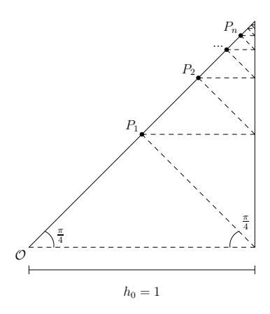
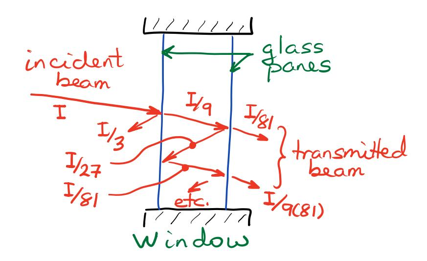

## Practice Problem Set 9

**Topics:** Geometric & Telescoping Series, Divergence & Integral Tests

1. Consider the series given by the formula

$$\sum_{n=1}^{\infty} \frac{1}{n^2 + n}.$$

Finding sums of series is usually hard, but this one is an exception; we just need to rewrite it using partial fractions:

$$\frac{1}{n^2+n} = \frac{1}{n(n+1)} = \frac{1}{n} - \frac{1}{n+1}.$$

Writing out the first few terms, this is what we see:

$$\sum_{n=1}^{\infty} \frac{1}{n^2 + n} = \sum_{n=1}^{\infty} \left( \frac{1}{n} - \frac{1}{n+1} \right) = \left( 1 - \frac{1}{2} \right) + \left( \frac{1}{2} - \frac{1}{3} \right) + \left( \frac{1}{3} - \frac{1}{4} \right) + \cdots$$

It appears that all of the terms after the initial one will cancel, so that the sum should be 1 (we call this a *telescoping* series). However, we should be careful not to jump to conclusions when working with infinite series, so let's consider the definition of convergence. The  $N^{\text{th}}$  partial sum  $s_N$  for this series is

$$s_N = \sum_{n=1}^{N} \left( \frac{1}{n} - \frac{1}{n+1} \right) = 1 - \frac{1}{N+1}.$$

By definition then, we have

$$\sum_{n=1}^{\infty} \frac{1}{n^2 + n} = \sum_{n=1}^{\infty} \left( \frac{1}{n} - \frac{1}{n+1} \right) = \lim_{N \to \infty} s_N = 1,$$

so we do indeed have a sum of 1.

Telescoping series won't always converge, however, so it's still wise not to jump to conclusions. Also, it won't always be immediately obvious that a series telescopes; we may be have to do a bit of rearrangement to discover the cancellations.

Use this technique to find the sums of the following series (if they exist):

1

(a) 
$$\sum_{n=2}^{\infty} \frac{1}{n^2 - 1}$$
 Answer:  $\frac{3}{4}$ 

(b) 
$$\sum_{n=1}^{\infty} \ln \left( \frac{n}{n+1} \right)$$
 Answer: Series diverges

(c) 
$$\sum_{n=2}^{\infty} \frac{1}{n(n+1)(n-1)}$$
 Answer:  $\frac{1}{4}$ 

- 2. Determine whether the following series converge or diverge. Justify your conclusions as thoroughly as you can.
  - (a)  $\sum_{n=2}^{\infty} \frac{(-3)^n}{2^{-n}5^{2n}}$  Answer:  $\frac{36}{775}$
  - (b)  $\sum_{n=0}^{\infty} ne^{-n^2}$  **Answer:** Series converges by Integral Test
  - (c)  $\sum_{n=1}^{\infty} \sin\left(\frac{1+n\pi}{4n}\right)$  Answer: Series diverges by Divergence Test
  - (d)  $\sum_{n=0}^{\infty} \frac{\pi^{2n-1}}{e^{\pi n+1}}$  Answer:  $\frac{e^{\pi-1}}{\pi(e^{\pi}-\pi^2)}$
  - (e)  $\sum_{n=1}^{\infty} \sqrt[n]{2^{n+1}}$  **Answer:** Series diverges by Divergence Test
  - (f)  $\sum_{n=3}^{\infty} \frac{1}{n \ln n \sqrt{\ln(\ln n)}}$  Answer: Series diverges by Integral Test
- 3. The same argument that justifies the Integral Test can be used to prove a theorem regarding error bounds:

Suppose  $\sum_{k=1}^{\infty} a_k$  can be shown to converge using the Integral Test, and let f(x) be the function used to do so (with  $f(k) = a_k$ ). If we use the nth partial sum  $s_n$  as an approximation to the sum s, then the error  $R_n = s - s_n$  satisfies the inequality

$$\int_{n+1}^{\infty} f(x)dx \le R_n \le \int_{n}^{\infty} f(x)dx$$

Estimate the sum of the series  $\sum_{n=1}^{\infty} \frac{1}{n^4}$ , using the first five terms. Then find upper and lower bounds on the sum by using this extension of the Integral Test.

**Answer:** 
$$\frac{1}{648} \le s - s_5 \le \frac{1}{375}$$
 Note: It can be shown that  $\sum_{n=1}^{\infty} \frac{1}{n^4} = \frac{\pi^4}{90}$ 

- 4. At what time between 1 pm and 2 pm is the minute hand of a clock exactly over the hour hand? **Answer:**  $1:05\frac{5}{11}$ pm
- 5. Show that  $\sum_{n=1}^{\infty} \frac{1}{n^2 + 4n} = \frac{25}{48}.$
- 6. Find the function, f(x), having the series representation given by:

$$f(x) = \sum_{n=1}^{\infty} \frac{5x^n}{3^n(1-2x)}$$
 for  $|x| < 3$  and  $x \neq \frac{1}{2}$ .

**Answer:** 
$$f(x) = \frac{5x}{(1-2x)(3-x)}$$

7. The dashed line shown in the diagram below represents an infinite zig-zag pattern where each segment is either horizontal or makes an angle of 45° with the horizontal. Prove that the total length of the pattern is equal to the perimeter of the right-angle triangle enclosing it.

8. A flashlight emits a beam of light with intensity I into a double-pane window shown below. If each glass pane reflects  $\frac{1}{3}$  of the beam, absorbs  $\frac{5}{9}$  of the beam, and transmits  $\frac{1}{9}$  of the beam, what fraction is transmitted to the other side of the window?

**Answer:**  $\frac{1}{72}$  of the beam's intensity I

9. Use a geometric series to express  $0.343434... = 0.\overline{34}$  as a fraction.

Answer:  $\frac{34}{99}$ 

- 10. Prove that if X∞ n=0 r n converges, then X∞ n=0 r n > 1 2 .
- 11. How many terms of the series X∞ n=1 n 2 e −n 3 would you need to use to guarantee the error in approximating the sum S by the partial sum Sk is less than 10−5 ?

Answer: 3 terms are needed

## Other Suggested Problems

Guichard, pages 350-351, Exercises for §9.2, # 9.2.1 - 9.2.9

Guichard, pages 355-356, Exercises for §9.3, # 9.3.1 - 9.3.12