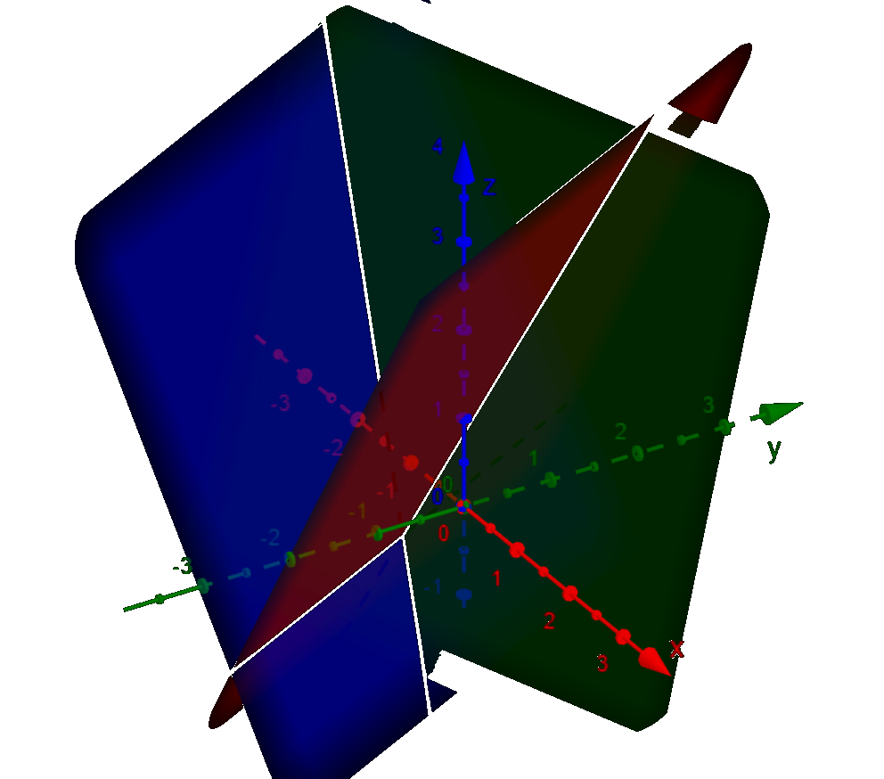

--- 

> [!abstract] Introduction
> ## Solving Equations

Solving equations is one of the most common tasks across multiple scientific disciplines. A lot of the time the equations are nonlinear, which do not have a general solution method. However, when they are **linear**, we can develop a systematic process to identify the solutions.

> [!quote] Definition
> ## Linear Equations

The expression $a_1x_1 + a_2x_2 + \cdots + a_nx_n = b$ is called a <u><strong style="color:#dab1da" >linear equation</u></strong> with $n$ variables.

- The values $a_i \in \mathbb{R}$ are called the <u><strong style="color:#dab1da" >coefficients</u></strong>.
- The variables $x_i \in \mathbb{R}$ are called the <u><strong style="color:#dab1da">unknowns</u></strong>.
- The value $b$ is called the <u><strong style="color:#dab1da">constant terms</u></strong>.

Whenever we have more than one such equation, we call them a **system of linear equations**.

> [!quote] Definition 
> ## Solution

Given a system of $m$ linear equations in $n$ unknowns:

The vector $\vec{s} = \begin{bmatrix} s_1\ \\ \vdots\ \\ s_n \end{bmatrix}$ is called a <u><strong style="color:#dab1da" >coefficients</u></strong> to the system if all $m$ equations satisfy $LS = RS$ when the <u><strong style="color:#dab1da" >unknowns</u></strong> are replaced by the values in $\vec{s}$.

The <u><strong style="color:#dab1da" >solution set</u></strong> is the set that contains all possible solutions to the system.

> [!fact] Theorem
> ## Possibilities for Solutions

For all linear systems, there are only 3 possibilities:
#### <u>Inconsistent</u>
The system has **NO** solution
#### <u>Consistent</u>
The system has **at least one** solution:
	- **Exactly ONE** solution, or
	- **Infinite Many** solutions

> [!hint] 
> ## Geometric Interpretation

As a graphical example, when working in $\mathbb{R}^3$ with the variables $x_1, x_2, x_3$, a linear equation represents a **plane**. A system of $m$ equations in $\mathbb{R}^3$ represents $m$ planes. Solving such a system would be attempting to find all points common to all planes.

[Insert graph: three intersecting planes in 3D space showing their intersection]

  

> [!info] 
> ## Matrix Representation

**Intro**

Generally speaking, all consistent linear systems can be solved by a repeated use of multiplication and elimination. For example, the system:

$$ 
\begin{cases}  
3x_1 - 2x_2 = 5 \quad (1)  \\ 
2x_1 + 6x_2 = 1 \quad (2) 
\end{cases}
$$

can be solved using the following steps:

$$
\begin{cases}
3 \times (1): \quad 9x_1 - 6x_2 = 15 \quad (3) \\
2 \times (1): \quad 2x_1 + 6x_2 = 1 \quad (4)
\end{cases}
$$
$$
\begin{cases}
2 \times (2): \quad 6x_1 - 4x_2 = 10 \quad (5) \\
3 \times (2): \quad 6x_1 + 18x_2 = 3 \quad (6)
\end{cases}
$$
$$
\begin{cases}
(3) + (4): \quad 11x_1 + 0x_2 = 16 \quad(7) \\
(6) - (5): \quad 0x_1 + 22x_2 = -7 \quad(8)
\end{cases}
$$

Therefore: $x_1 = \frac{16}{11}$, $x_2 = -\frac{7}{22}$

Note that throughout this process **we only manipulated the numbers**. We can therefore simplify our work by introducing the following:

Given a linear system:

$$
\left\{
\begin{array}{l}
a_{21}x_1 + a_{22}x_2 + \cdots + a_{2n}x_n = b_2 \\
\vdots \\
a_{m1}x_1 + a_{m2}x_2 + \cdots + a_{mn}x_n = b_m
\end{array}
\right.
$$

We define the following:

**The coefficient matrix** $A$: 
$$ 
A = \begin{bmatrix} a_{11} & a_{12} & \cdots & a_{1n} \\ \vdots & \vdots & & \vdots \\ a_{m1} & a_{m2} & \cdots & a_{mn} \end{bmatrix} 
$$

**The constant vector** $\vec{b}$: 
$$
\vec{b} = \begin{bmatrix}b_1 \\b_2 \\ \vdots \\ b_m\end{bmatrix} 
$$

**The augmented matrix** $[A|\vec{b}]$: 
$$
[A|\vec{b}] = \left[\begin{array}{cccc|c}
a_{11} & a_{12} & \cdots & a_{1n} & b_1\\
a_{21} & a_{22} & \cdots & a_{2n} & b_2\\
\vdots & \vdots &  & \vdots & \vdots \\ 
a_{m1} & a_{m2} & \cdots& a_{mn} & b_m
\end{array}\right]
$$
