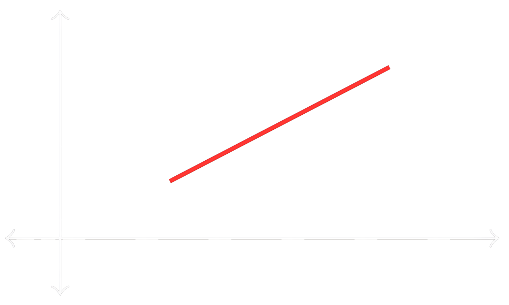

---

> [!fact] Theorem
> ## Intermediate Value Theorem (IVT)

Suppose that a function $f$ is continuous on the closed interval $[a, b]$.

If $f(a) < \alpha < f(b)$ or $f(b) < \alpha < f(a)$, then there exists a number $c$ in $(a, b)$ such that $f(c) = \alpha$.

![[./media/image13.1.png]]

**Key Points:**
- The value $\alpha$ is called an <u><strong style="color:#dab1da">intermediate value</u></strong> (between values $f(a)$ and $f(b)$)
- We need continuity on the closed interval to guarantee the existence of $c$
- The number $c$ may not be unique - the theorem only guarantees that there will be **at least one** such $c$ in the open interval $(a, b)$

> [!example] Example
> ## Proving Existence of a Root

Prove that the polynomial $p(x) = x^5 - 2x^3 - 2$ has a real root between $x = 1$ and $x = 2$.

> [!success]- Solution (Click to expand)
> 
> **Step 1:** Note that $p(x)$ is continuous on $\mathbb{R}$ since it is a polynomial. Therefore, $p(x)$ is continuous on the closed interval $[1, 2]$.
> 
> **Step 2:** We want to show that there is some $c$ in $(1, 2)$ such that $p(c) = 0$.
> 
> Calculate the function values at the endpoints:
> $$
> \begin{aligned}
> p(1) &= 1^5 - 2(1)^3 - 2 = -3 \\
> p(2) &= 2^5 - 2(2)^3 - 2 = 14
> \end{aligned}
> $$
> 
> **Step 3:** Since $-3 < 0 < 14$, the value $\alpha = 0$ is between the values $p(1)$ and $p(2)$.
> 
> **Step 4:** By the Intermediate Value Theorem, there exists a number $c$ in $(1, 2)$ such that $p(c) = 0$.
> 
> **Conclusion:** Therefore, $p(x)$ has a real root between $x = 1$ and $x = 2$.

> [!example] Example
> ## Practice Problems with IVT

**Problem 1:** Using a sketch and the IVT, show that the equation $\cos x = x$ has a solution in the interval $\left(0, \frac{\pi}{2}\right)$.

**Problem 2:** Find an open interval of length $1$ that contains a solution to the equation $\tan^{-1}(x) + x^3 = -1$.

*Hint: Test small values of $x$ for which $\tan^{-1}(x)$ can be easily calculated.*

> [!fact] Theorem
> ## Extreme Value Theorem (EVT)

If $f$ is continuous on a closed interval $[a, b]$, then $f$ attains a <u><strong style="color:#dab1da">maximum value</u></strong> and a <u><strong style="color:#dab1da">minimum value</u></strong> on the interval $[a, b]$.

This means that:
- There is some $c \in [a, b]$ for which $f(c) \leq f(x)$ for all $x \in [a, b]$ (minimum), and
- There is some $d \in [a, b]$ for which $f(d) \geq f(x)$ for all $x \in [a, b]$ (maximum)

**Note that for the EVT to guarantee both maximum and minimum values exist:**
1. The function must be **continuous** on the interval
2. The interval must be **closed** (includes both endpoints)

> [!example] Example
> ## EVT Applied to Specific Functions

**Example 1:** $f(x) = \sin(x)$ on $I = [-\pi, \pi]$   

 
As guaranteed by the EVT:

- **Maximum value** of $1$, occurs at $x = \frac{\pi}{2}$
- **Minimum value** of $-1$, occurs at $x = -\frac{\pi}{2}$

**Example 2:** $f(x) = \frac{1}{2}x$ on $I = [1, 3]$

As guaranteed by the EVT:
- **Maximum value** of $\frac{3}{2}$, occurs at $x = 3$
- **Minimum value** of $\frac{1}{2}$, occurs at $x = 1$

