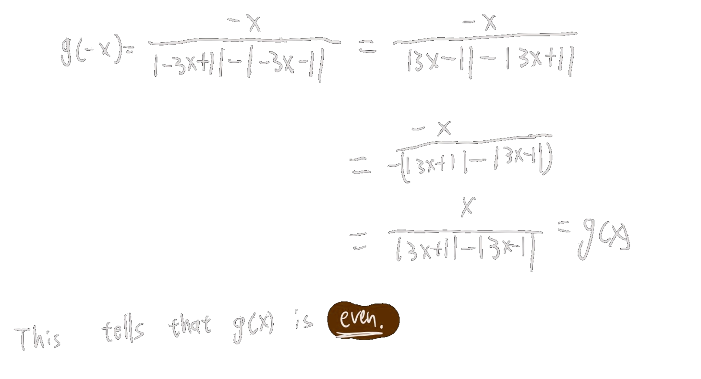

---
> [!example] Question 1
> 
> ## Piecewise Functions and Continuity
> 
> **Marks: 14 | Recommended Time: 35 minutes**

Consider the function
$$ g(x) = \frac{x}{|3x + 1| - |3x - 1|} $$

### (a) Even, Odd, or Neither [4 marks]

Determine if $g(x)$ is even, odd, or neither.

### (b) Piecewise Representation and Sketch [8 marks]

Represent $g(x)$ as a piecewise-defined function and sketch it.
![[2022.2.png]]

### (c) Limit at Zero [1 mark]

Evaluate $\lim_{x \to 0} g(x)$.

![[2022.3.png]]
### (d) Continuity Interval [1 mark]

On what interval is $g(x)$ continuous?

![[2022.4.png]]

> [!success]- Solution (Click to expand)
> 
> ### Part (a): Even, Odd, or Neither
> 
> We check $g(-x)$:
> 
> $$g(-x) = \frac{-x}{|-3x + 1| - |-3x - 1|}$$
> 
> Since $|-a| = |a|$, we have:
> 
> $$g(-x) = \frac{-x}{|3x - 1| - |3x + 1|}$$
> 
> Rearranging:
> 
> $$g(-x) = \frac{x}{|3x + 1| - |3x - 1|} = g(x)$$
> 
> Therefore, the function is **even**.
> 
> ---
> 
> ### Part (b): Piecewise Representation
> 
> We need to analyze different regions based on where the expressions inside the absolute values change sign:
> 
> - $3x + 1 = 0$ when $x = -\frac{1}{3}$
> - $3x - 1 = 0$ when $x = \frac{1}{3}$
> 
> **Case 1:** $x \geq \frac{1}{3}$
> 
> Both $3x - 1 \geq 0$ and $3x + 1 > 0$, so: $$g(x) = \frac{x}{(3x + 1) - (3x - 1)} = \frac{x}{2}$$
> 
> **Case 2:** $x \leq -\frac{1}{3}$
> 
> Both $3x - 1 < 0$ and $3x + 1 \leq 0$, so: $$g(x) = \frac{x}{-(3x + 1) - (-(3x - 1))} = \frac{x}{-3x - 1 + 3x - 1} = \frac{x}{-2} = \frac{-x}{2}$$
> 
> **Case 3:** $-\frac{1}{3} < x < \frac{1}{3}$, $x \neq 0$
> 
> Here $3x - 1 < 0$ and $3x + 1 > 0$, so: $$g(x) = \frac{x}{(3x + 1) - (-(3x - 1))} = \frac{x}{3x + 1 + 3x - 1} = \frac{x}{6x} = \frac{1}{6}$$
> 
> **Piecewise function:** $$g(x) = \begin{cases} \frac{-x}{2}, & x \leq -\frac{1}{3} \ \frac{1}{6}, & -\frac{1}{3} < x < 0 \ \text{undefined}, & x = 0 \ \frac{1}{6}, & 0 < x < \frac{1}{3} \ \frac{x}{2}, & x \geq \frac{1}{3} \end{cases}$$
> 
> **Graph:** [Insert graph: showing lines $y = -x/2$ for $x \leq -1/3$, horizontal line $y = 1/6$ for $-1/3 < x < 1/3$ (with hole at $x = 0$), and line $y = x/2$ for $x \geq 1/3$]
> 
> ---
> 
> ### Part (c): Limit at Zero
> 
> From the graph and piecewise definition, we see that: $$\lim_{x \to 0^-} g(x) = \frac{1}{6} \quad \text{and} \quad \lim_{x \to 0^+} g(x) = \frac{1}{6}$$
> 
> Therefore: $$\lim_{x \to 0} g(x) = \frac{1}{6}$$
> 
> ---
> 
> ### Part (d): Interval of Continuity
> 
> The function $g(x)$ is continuous everywhere except at $x = 0$ (where it is undefined).
> 
> **Answer:** $g(x)$ is continuous on $(-\infty, 0) \cup (0, \infty)$.

---
> [!example] Question 2
> 
> ## Inverse Functions and Heaviside Representation
> 
> **Marks: 13 | Recommended Time: 32 minutes**

### (a) Finding Inverse Function [5 marks]

Find $f^{-1}(x)$ for:
$$f(x) = \begin{cases} x^2 + 1, & x \geq 0 \\ x + 1, & x < 0 \end{cases}$$

![[2022.5.png]]
### (b) Heaviside Function Representation [8 marks]

$$g(x) = \begin{cases} e^x, & x < 0 \\ \frac{2}{\pi} \cos^{-1} x, & 0 \leq x < 1 \\ \ln x, & x \geq 1 \end{cases}$$
Sketch $g(x)$ and write $g(x)$ in terms of Heaviside functions.

![[2022.6.png]]

> [!success]- Solution (Click to expand)
> 
> ### Part (a): Finding the Inverse Function
> 
> We need to find the inverse for each piece of $f(x)$.
> 
> **For $x \geq 0$:** $y = x^2 + 1$
> 
> Solving for $x$: $$x^2 = y - 1$$ $$x = \sqrt{y - 1}$$
> 
> This is valid for $y \geq 1$ (since when $x \geq 0$, $f(x) = x^2 + 1 \geq 1$).
> 
> **For $x < 0$:** $y = x + 1$
> 
> Solving for $x$: $$x = y - 1$$
> 
> This is valid for $y < 1$ (since when $x < 0$, $f(x) = x + 1 < 1$).
> 
> **Inverse function:** $$f^{-1}(x) = \begin{cases} x - 1, & x < 1 \ \sqrt{x - 1}, & x \geq 1 \end{cases}$$
> 
> ---
> 
> ### Part (b): Sketch and Heaviside Representation
> 
> **Graph:** ![[2022.7.png]]
> 
> **Heaviside function representation:**
> 
> The <u><strong style="color:#dab1da">Heaviside function</strong></u> $H(x)$ is defined as: $$H(x) = \begin{cases} 0, & x < 0 \ 1, & x \geq 0 \end{cases}$$
> 
> We can write $g(x)$ as: $$g(x) = e^x + \left(\frac{2}{\pi}\cos^{-1}x - e^x\right)H(x) + \left(\ln x - \frac{2}{\pi}\cos^{-1}x\right)H(x - 1)$$
> 
> **Verification:**
> 
> - When $x < 0$: $H(x) = 0$ and $H(x-1) = 0$, so $g(x) = e^x$ ✓
> - When $0 \leq x < 1$: $H(x) = 1$ and $H(x-1) = 0$, so $g(x) = e^x + \frac{2}{\pi}\cos^{-1}x - e^x = \frac{2}{\pi}\cos^{-1}x$ ✓
> - When $x \geq 1$: $H(x) = 1$ and $H(x-1) = 1$, so $g(x) = e^x + \frac{2}{\pi}\cos^{-1}x - e^x + \ln x - \frac{2}{\pi}\cos^{-1}x = \ln x$ ✓

---
> [!example] Question 3
> 
> ## Partial Fractions and Trigonometric Form
> 
> **Marks: 14 | Recommended Time: 35 minutes**

### (a) Partial Fraction Decomposition [9 marks]

Decompose the following into partial fractions: $$f(x) = \frac{x^4 - 2x^2 + 4x + 1}{x^3 - x^2 - x + 1}$$

### (b) Trigonometric Form [5 marks]

Express the function: $$g(x) = \frac{5}{2}\cos x + \frac{5\sqrt{3}}{2}\sin x$$

in the form $A\cos(x - \alpha)$.

#### My Work

_[Paste your handwritten work here]_

> [!success]- Solution (Click to expand)
> 
> ### Part (a): Partial Fraction Decomposition
> 
> **Step 1: Long Division**
> 
> Since the degree of the numerator (4) is greater than the degree of the denominator (3), we perform long division:
> 
> $$\begin{array}{c|cc} & x & +1 \ \hline x^3 - x^2 - x + 1 & x^4 & +0x^3 & -2x^2 & +4x & +1 \ & x^4 & -x^3 & -x^2 & +x & \ \hline & & x^3 & -x^2 & +3x & +1 \ & & x^3 & -x^2 & -x & +1 \ \hline & & & & 4x & \end{array}$$
> 
> Therefore: $$f(x) = x + 1 + \frac{4x}{x^3 - x^2 - x + 1}$$
> 
> **Step 2: Factor the Denominator**
> 
> $$x^3 - x^2 - x + 1 = x^2(x - 1) - (x - 1) = (x - 1)(x^2 - 1) = (x - 1)^2(x + 1)$$
> 
> **Step 3: Partial Fraction Decomposition**
> 
> $$\frac{4x}{(x - 1)^2(x + 1)} = \frac{A}{x - 1} + \frac{B}{(x - 1)^2} + \frac{C}{x + 1}$$
> 
> Multiplying both sides by $(x - 1)^2(x + 1)$: $$4x = A(x - 1)(x + 1) + B(x + 1) + C(x - 1)^2$$
> 
> **Setting $x = 1$:** $$4 = 2B \implies B = 2$$
> 
> **Setting $x = -1$:** $$-4 = 4C \implies C = -1$$
> 
> **Setting $x = 0$:** $$0 = -A + B + C \implies A = B + C = 2 - 1 = 1$$
> 
> **Final Answer:** $$f(x) = x + 1 + \frac{1}{x - 1} + \frac{2}{(x - 1)^2} - \frac{1}{x + 1}$$
> 
> ---
> 
> ### Part (b): Trigonometric Form
> 
> We want to express: $$g(x) = \frac{5}{2}\cos x + \frac{5\sqrt{3}}{2}\sin x$$
> 
> in the form $A\cos(x - \alpha)$.
> 
> **Expanding the target form:** $$A\cos(x - \alpha) = A\cos x \cos \alpha + A\sin x \sin \alpha$$
> 
> **Matching coefficients:** $$\begin{cases} A\cos \alpha = \frac{5}{2} \ A\sin \alpha = \frac{5\sqrt{3}}{2} \end{cases}$$
> 
> **Finding $\alpha$:** $$\tan \alpha = \frac{A\sin \alpha}{A\cos \alpha} = \frac{5\sqrt{3}/2}{5/2} = \sqrt{3}$$
> 
> Therefore: $\alpha = \frac{\pi}{3}$ (assuming $\alpha$ is in the first quadrant)
> 
> **Finding $A$:** $$A^2 = (A\cos \alpha)^2 + (A\sin \alpha)^2 = \left(\frac{5}{2}\right)^2 + \left(\frac{5\sqrt{3}}{2}\right)^2 = \frac{25}{4} + \frac{75}{4} = \frac{100}{4} = 25$$
> 
> Therefore: $A = 5$ (taking the positive value)
> 
> **Final Answer:** $$g(x) = 5\cos\left(x - \frac{\pi}{3}\right)$$

---
> [!example] Question 4
> 
> ## Limit Evaluation (Without L'Hôpital's Rule)
> 
> **Marks: 9 | Recommended Time: 22 minutes**

Evaluate the following limits. **Using L'Hôpital's Rule is NOT allowed.**

### (a) Limit with Square Roots [4 marks]

$$\lim_{x \to 0^+} \frac{x - \sqrt{x}}{\sqrt{\sin x}}$$

### (b) Limit with Inverse Tangent [5 marks]

$$\lim_{x \to \infty} \frac{\tan^{-1} x}{x} \cos x$$

#### My Work

_[Paste your handwritten work here]_

> [!success]- Solution (Click to expand)
> 
> ### Part (a): Limit with Square Roots
> 
> **Step 1: Factor the numerator** $$\frac{x - \sqrt{x}}{\sqrt{\sin x}} = \frac{\sqrt{x}(\sqrt{x} - 1)}{\sqrt{\sin x}}$$
> 
> **Step 2: Rewrite** $$= \frac{\sqrt{x}}{\sqrt{\sin x}} \cdot (\sqrt{x} - 1) = \sqrt{\frac{x}{\sin x}} \cdot (\sqrt{x} - 1)$$
> 
> **Step 3: Apply limit laws** $$\lim_{x \to 0^+} \frac{x - \sqrt{x}}{\sqrt{\sin x}} = \lim_{x \to 0^+} \sqrt{\frac{x}{\sin x}} \cdot \lim_{x \to 0^+} (\sqrt{x} - 1)$$
> 
> We know that $\lim_{x \to 0} \frac{x}{\sin x} = 1$, so: $$= \sqrt{1} \cdot (0 - 1) = 1 \cdot (-1) = -1$$
> 
> **Answer:** $-1$
> 
> ---
> 
> ### Part (b): Limit with Inverse Tangent and Cosine
> 
> **Step 1: Apply the Squeeze Theorem**
> 
> We know that $-1 \leq \cos x \leq 1$ for all $x$.
> 
> Multiplying all sides by $\frac{\tan^{-1} x}{x}$ (which is positive for $x > 0$): $$-\frac{\tan^{-1} x}{x} \leq \frac{\tan^{-1} x}{x} \cos x \leq \frac{\tan^{-1} x}{x}$$
> 
> **Step 2: Find the limit of the bounds**
> 
> We know that $-\frac{\pi}{2} < \tan^{-1} x < \frac{\pi}{2}$ for all $x$.
> 
> Therefore: $-\frac{\pi}{2x} < \frac{\tan^{-1} x}{x} < \frac{\pi}{2x}$
> 
> As $x \to \infty$: $$\lim_{x \to \infty} \pm\frac{\pi}{2x} = 0$$
> 
> By the Squeeze Theorem: $$\lim_{x \to \infty} \frac{\tan^{-1} x}{x} = 0$$
> 
> **Step 3: Apply the Squeeze Theorem again**
> 
> Since $\lim_{x \to \infty} -\frac{\tan^{-1} x}{x} = 0$ and $\lim_{x \to \infty} \frac{\tan^{-1} x}{x} = 0$, by the Squeeze Theorem:
> 
> $$\lim_{x \to \infty} \frac{\tan^{-1} x}{x} \cos x = 0$$
> 
> **Answer:** $0$

---
> [!example] Question 5
> 
> ## Derivatives and Mean Value Theorem
> 
> **Marks: 9 | Recommended Time: 22 minutes**

### (a) Derivative from First Principles [5 marks]

Let $f(x) = 2 - \sqrt{x + 3}$. Use the <u><strong style="color:#dab1da">limit definition of the derivative</strong></u> to find $f'(1)$.

### (b) Application of Derivative Bounds [4 marks]

Let $g(x)$ be a continuous function with $g(0) = -5$ and $g'(x) \leq 2$ for all $x \in \mathbb{R}$.

Which statement is correct? **To receive full marks you must justify your answer.**

(i) $g(2) \geq 1$  
(ii) $g(2) \leq -1$  
(iii) $g(2) \leq -5$  
(iv) $g(2) \geq 5$

#### My Work

_[Paste your handwritten work here]_

> [!success]- Solution (Click to expand)
> 
> ### Part (a): Derivative from First Principles
> 
> The <u><strong style="color:#dab1da">limit definition of the derivative</strong></u> states: $$f'(a) = \lim_{h \to 0} \frac{f(a + h) - f(a)}{h}$$
> 
> **Step 1: Apply the definition at $x = 1$** $$f'(1) = \lim_{h \to 0} \frac{f(1 + h) - f(1)}{h}$$
> 
> **Step 2: Calculate $f(1)$ and $f(1 + h)$** $$f(1) = 2 - \sqrt{1 + 3} = 2 - \sqrt{4} = 2 - 2 = 0$$ $$f(1 + h) = 2 - \sqrt{(1 + h) + 3} = 2 - \sqrt{4 + h}$$
> 
> **Step 3: Substitute** $$f'(1) = \lim_{h \to 0} \frac{2 - \sqrt{4 + h} - 0}{h} = \lim_{h \to 0} \frac{2 - \sqrt{4 + h}}{h}$$
> 
> **Step 4: Rationalize the numerator** $$= \lim_{h \to 0} \frac{(2 - \sqrt{4 + h})(2 + \sqrt{4 + h})}{h(2 + \sqrt{4 + h})}$$
> 
> $$= \lim_{h \to 0} \frac{4 - (4 + h)}{h(2 + \sqrt{4 + h})}$$
> 
> $$= \lim_{h \to 0} \frac{-h}{h(2 + \sqrt{4 + h})}$$
> 
> **Step 5: Simplify and evaluate** $$= \lim_{h \to 0} \frac{-1}{2 + \sqrt{4 + h}} = \frac{-1}{2 + \sqrt{4}} = \frac{-1}{2 + 2} = -\frac{1}{4}$$
> 
> **Answer:** $f'(1) = -\frac{1}{4}$
> 
> ---
> 
> ### Part (b): Application of Derivative Bounds
> 
> **Given information:**
> 
> - $g(x)$ is continuous
> - $g(0) = -5$
> - $g'(x) \leq 2$ for all $x \in \mathbb{R}$
> 
> **Solution:**
> 
> Since $g'(x) \leq 2$, the function $g(x)$ increases at most at a rate of 2 units per unit increase in $x$.
> 
> Using the tangent line approximation (or thinking about the maximum possible slope): $$g(x) \approx g(0) + g'(0) \cdot x$$
> 
> Since $g'(0) \leq 2$: $$g(x) \leq g(0) + 2x = -5 + 2x$$
> 
> At $x = 2$: $$g(2) \leq -5 + 2(2) = -5 + 4 = -1$$
> 
> **Answer:** **(ii) $g(2) \leq -1$** is correct.
> 
> **Justification:** Since the derivative represents the rate of change and is bounded above by 2, starting from $g(0) = -5$, the maximum value $g(2)$ can reach after moving 2 units to the right is $-5 + 2 \times 2 = -1$.
