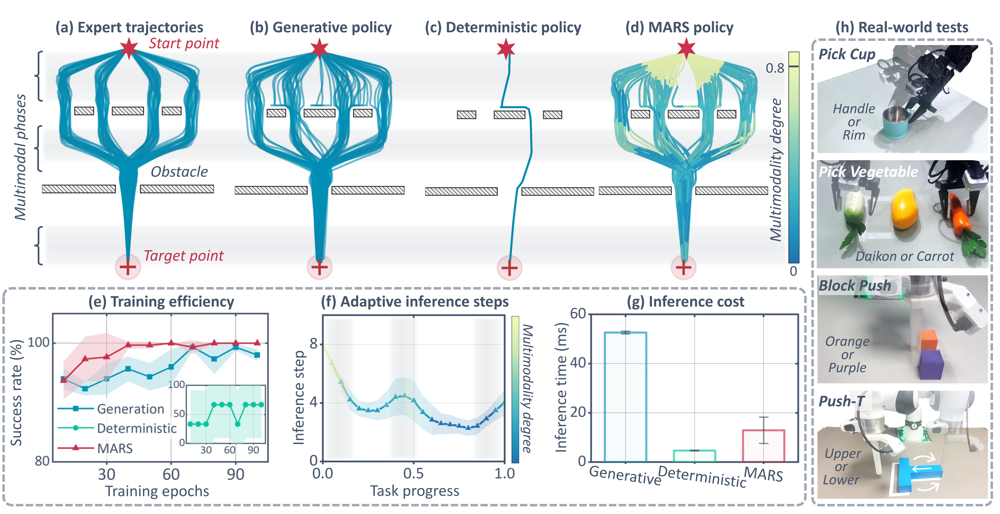
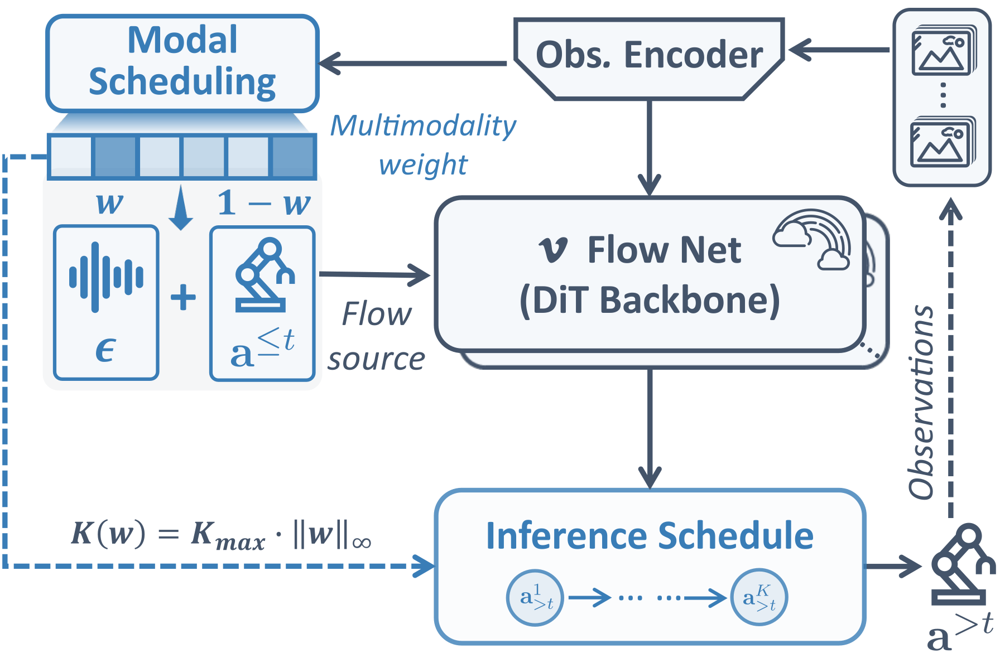
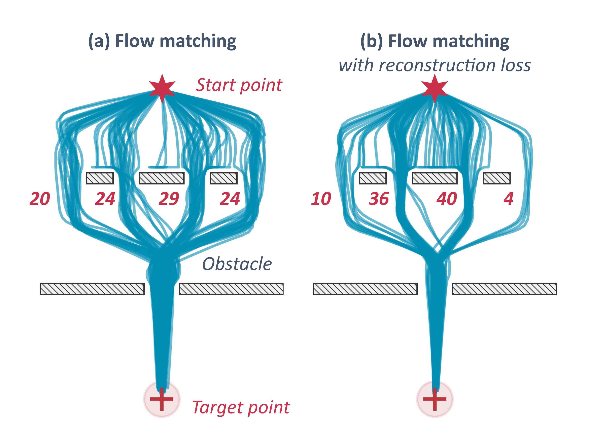
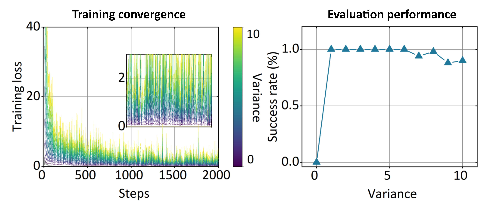
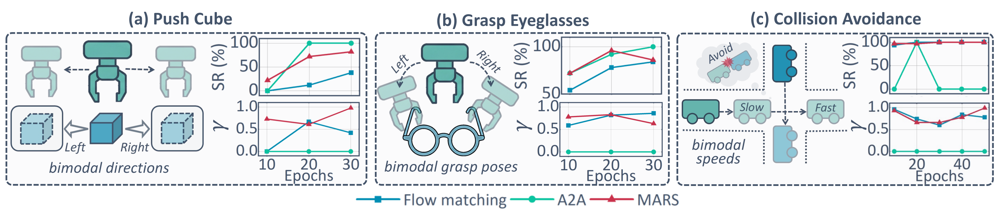
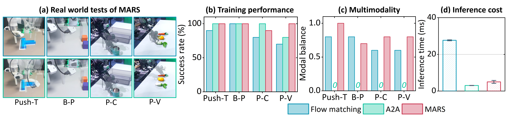
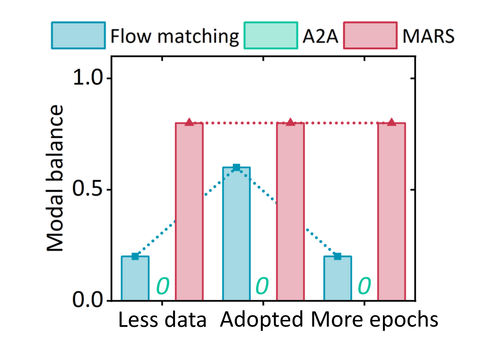
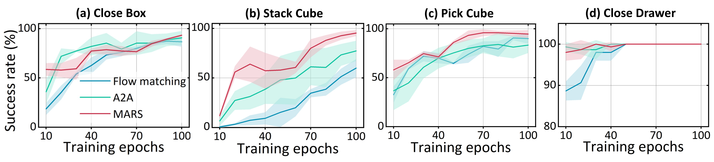

# A2A: Action-to-Action Flow Matching

> arXiv: [2602.07322](https://arxiv.org/abs/2602.07322) · Jindou Jia et al. · RSS 2026 · 2026-02-07
> Project: [A2A Flow Matching](https://lorenzo-0-0.github.io/A2A_Flow_Matching) · Source: [Paper.md](sources/A2AFlowMatching/Paper.md)

> [!abstract] Summary
> ## TL;DR — replace the source distribution, not the denoiser

A2A replaces the Gaussian source of a [[Literature Review on Flow-Based RL Policy|flow-matching policy]] with the robot's recent **executed** action chunk. A CNN embeds past actions into a $512$-D latent $mathbf{z}_0$; an AdaLN-MLP flow transports it to a future-action latent $mathbf{z}_1$, conditioned on recent images; a residual MLP decodes the next chunk. The claim is therefore stronger than “add proprioception”: past actions are the *initial distribution*, making the transport short enough for a lightweight model and one Euler step.

On five short manipulation tasks ($100$ demonstrations, $30$ epochs), A2A leads four tasks at six steps and reaches $0.56\,\mathrm{ms}$ per one-step sample on an RTX $5090$. Its strongest evidence is OOD visual robustness: six-step A2A retains $38$–$42\%$ across background, lighting, and camera shifts where its direct-regression twin falls to $3$–$5\%$. The counterweight is equally important: regression in the same latent architecture is *better in distribution* ($98\%$ vs. $92\%$), and A2A becomes history-sensitive under initial-state error. Small injected action noise repairs both this brittleness and its otherwise deterministic rollouts, but tuning that noise is now part of the method.

<div align="center"></div>

---

> [!fact] Methodology
> ## Action history as the source of a conditional flow

A2A assumes that sequential commands from a physically continuous robot are already close to the next action chunk. It separates the *source path* (executed actions) from the *condition path* (images), embeds both action chunks into one shared $512$-D space, then learns a conditional ODE from historical to future latents. The key inductive bias is not a new flow objective: it is choosing $mathbf{a}_{\leq t}$ rather than $mathcal{N}(\mathbf{0},\mathbf{I})$ as the source. At deployment, the controller rolls that latent ODE forward with Euler integration and decodes a future action chunk. The intended application regime is short-horizon, smooth control; the simulation suite spans Close Box, Pick Cube, Stack Cube, Open Drawer, and Pick-Place Bowl.

<div align="center"></div>

#### <u>Inputs, source, target</u>

$$
\mathbf{a}_{\leq t}
= \{\mathbf{a}_{t-n+1}, \ldots, \mathbf{a}_{t}\},
\qquad
\mathbf{I}_{\leq t}
= \{\mathbf{I}_{t-m+1}, \ldots, \mathbf{I}_{t}\},
\qquad
\mathbf{a}_{>t}
= \{\mathbf{a}_{t+1}, \ldots, \mathbf{a}_{t+n}\}.
$$

| $\mathbf{a}_{\leq t}$ | $\mathbf{I}_{\leq t}$ | $\mathbf{a}_{>t}$ | $n$ | $m$ |
| --- | --- | --- | --- | --- |
| Executed action history from proprioceptive feedback | Recent visual observations | Future action chunk to generate | Action horizon | Observation horizon |

$$
\mathbf{z}_0 = E_a(\mathbf{a}_{\leq t}),
\qquad
\hat{\mathbf{a}}_{>t} = D_a(\mathbf{z}_1),
\qquad
\mathbf{c} = \operatorname{MLP}(E_I(\mathbf{I}_{\leq t})).
$$

<div align="center"></div>

#### <u>Latent action-to-action transport</u>

$$
\mathbf{z}_{\tau}
= (1 - \tau)\mathbf{z}_0 + \tau\mathbf{z}_1,
\qquad
\tau \in [0,1].
$$

$$
\frac{d\mathbf{z}_{\tau}}{d\tau}
= \mathbf{v}_{\tau}(\mathbf{z}_{\tau}).
$$

| $\mathbf{z}_0$ | $\mathbf{z}_1$ | $\mathbf{z}_{\tau}$ | $\tau$ | $\mathbf{v}_{\tau}$ | $\mathbf{c}$ |
| --- | --- | --- | --- | --- | --- |
| Latent of the executed history | Latent of the future action chunk | Interpolated latent state | Flow time | Time-dependent vector field | Visual conditioning vector |

<div align="center"></div>

#### <u>Illustrative online controller</u>

```python
def infer_future_actions(
    image_history: Tensor,
    executed_action_history: Tensor,
    step_count: int,
) -> Tensor:
    '''
    image_history: Recent RGB observations.
    executed_action_history: Proprioceptive actions actually executed.
    step_count: Euler steps used to integrate the latent flow.
    returns: A decoded future action chunk.
    '''
    z = encode_action_history(executed_action_history)
    c = encode_image_history(image_history)
    for tau in euler_times(step_count):
        z = z + (1.0 / step_count) * flow_field(z, tau, c)
    return decode_future_actions(z)
```

#### <u>Training objective</u>

$$
\mathcal{L}_{FM}
= \mathbb{E}_{\tau \sim \mathcal{U}[0,1],\,\mathbf{z}_0,\,\mathbf{z}_1}
\left\|
f_{\theta}(\mathbf{z}_{\tau}, \tau, \mathbf{c})
- \mathbf{v}_{\tau}(\mathbf{z}_{\tau}, \tau, \mathbf{c})
\right\|^2.
$$

$$
\mathcal{L}_{AE}
= \mathbb{E}_{\mathbf{a}_{>t}}
\left\|
\mathbf{a}_{>t} - D_a(E_a(\mathbf{a}_{>t}))
\right\|_1.
$$

$$
\begin{aligned}
\mathcal{L}_{IC}
= {} & \mathbb{E}_{\hat{\mathbf{z}}_1,\,\mathbf{a}_{>t}}
\left\|
\hat{\mathbf{z}}_1 - E_a(\mathbf{a}_{>t})
\right\|_1 \\
& {} + \lambda_0
\mathbb{E}_{\hat{\mathbf{z}}_1,\,\mathbf{a}_{>t}}
\left\|
D_a(\hat{\mathbf{z}}_1) - \mathbf{a}_{>t}
\right\|_1.
\end{aligned}
$$

$$
\mathcal{L}_{\mathrm{total}}
= \lambda_1\mathcal{L}_{FM}
+ \lambda_2\mathcal{L}_{AE}
+ \lambda_3\mathcal{L}_{IC}.
$$

| $f_{\theta}$ | $E_a, D_a$ | $\hat{\mathbf{z}}_1$ | $\lambda_0$ | $\lambda_1, \lambda_2, \lambda_3$ |
| --- | --- | --- | --- | --- |
| Learned conditional vector field | Action encoder and decoder | Latent reached by ODE integration | Weight on decoded-action consistency | Weights for flow, autoencoder, and consistency losses |

<div align="center"></div>

> [!info] Implementation Tricks
> ## Details that make the source prior usable

- **Feedback, not commands.** $mathbf{a}_{\leq t}$ is reconstructed from executed proprioceptive feedback, so it absorbs low-level tracking error rather than assuming commands were achieved exactly.
- **Do not concatenate modalities.** Recent images pass through ResNet-$18$ and a linear projection; historical actions pass through three $1$-D CNN layers. The flow sees their latent source and condition separately, avoiding a small proprioceptive vector being submerged in vision features.
- **Expand before flowing.** The action sequence is encoded into a shared $512$-D space; the authors' raw-action ablation is substantially weaker even with a U-Net.
- **Keep inference grounded.** $
\mathcal{L}_{IC}$ supervises both the ODE endpoint and its decoded action, preventing a latent trajectory that looks valid but cannot reconstruct an executable chunk.
- **Noise is a deliberate escape hatch.** Gaussian noise with standard deviation $0.02$ on $mathbf{a}_{\leq t}$ improves Level-$1$ visual robustness from $20\%$ to $52\%$; standard deviation $0.1$ is used in the initial-state-uncertainty experiment. It restores stochasticity, but makes noise scale another task-dependent choice.
- **Shared settings.** All reported experiments use $n=m=8$, batch size $32$, and $(\lambda_0,\lambda_1,\lambda_2,\lambda_3)=(0.5,1,0.5,1)$.

---

> [!hint] Experiments & Findings
> ## Fast in distribution; most compelling under perturbation

#### <u>Benchmark scope and $30$-epoch simulation result</u>

All entries use $100$ demonstrations; the table compares nine methods at their listed sampling budgets. A2A is best on four of five tasks; VITA narrowly wins Pick-Place Bowl. The contrast with ACT is useful: direct regression gets $80$–$86\%$ on four tasks at one step, so short-horizon in-distribution success is not evidence that generation is necessary.

| Method | Steps | Close Box | Pick Cube | Stack Cube | Open Drawer | Pick-Place Bowl |
| --- | ---: | ---: | ---: | ---: | ---: | ---: |
| **A2A** | 6 | **92** | **92** | **86** | **92** | 90 |
| VITA | 6 | 88 | 88 | 80 | 90 | **92** |
| FM-UNet | 10 | 82 | 70 | 28 | 34 | 68 |
| FM-DiT | 10 | 58 | 88 | 26 | 28 | 84 |
| DDPM-UNet | 100 | 72 | 60 | 36 | 64 | 66 |
| DDPM-DiT | 100 | 58 | 58 | 16 | 14 | 68 |
| DDIM-UNet | 40 | 70 | 56 | 36 | 64 | 82 |
| Score-UNet | 100 | 36 | 36 | 12 | 0 | 4 |
| ACT | 1 | 82 | 86 | 32 | 80 | 60 |

#### <u>One-step budget and latency</u>

<div align="center"></div>

On Close Box, success rises sharply through four steps and then plateaus; with one step, it exceeds $90\%$ after epoch $32$. A2A's reported one-step sampling time is **$0.56\,\mathrm{ms}$** on an RTX $5090$, below $1\,\mathrm{ms}$ per sample. Treat this as a *model sampling* figure, not a measured end-to-end control-loop latency: the paper does not report camera acquisition, ResNet preprocessing, robot communication, or safety-stack time.

#### <u>Visual randomization is the core generalization result</u>

Training sees Level $0$ only (random box pose). Level $1$ randomizes backgrounds; Level $2$ adds lighting; Level $3$ adds camera extrinsics. Six-step A2A retains $38$–$42\%$ under all three held-out shifts; every baseline is $8\%$ or lower. One-step A2A remains ahead, but loses half the six-step OOD performance.

| Method | Level 0 | Level 1 | Level 2 | Level 3 |
| --- | ---: | ---: | ---: | ---: |
| A2A, 1 step | 100 | 20 | 16 | 22 |
| **A2A, 6 steps** | **100** | **38** | **42** | **38** |
| VITA | **100** | 4 | 2 | 2 |
| FM-UNet | 96 | 6 | 6 | 4 |
| DDPM-UNet | 92 | 2 | 4 | 2 |
| Score-UNet | 94 | 0 | 2 | 0 |
| ACT | 86 | 8 | 2 | 0 |

In the physical Pick Cube stress test, A2A reaches $100\%$ in distribution from $30$ trajectories and retains $80\%$ when the target becomes an unseen glowing block; DDPM-UNet and FM-UNet both score $0\%$. These are only $10$ trial evaluations, so the paper establishes a strong qualitative separation but not a precise estimate of the real-world gap.

#### <u>The ablation complicates the “generative beats regression” story</u>

<div align="center"></div>

- **Flow-latent $\rightarrow$ Reg-latent:** in-distribution Close Box rises from $92\%$ to $98\%$, but OOD Levels $1$–$3$ collapse from $38$–$42\%$ to about $3$–$5\%$.
- **Flow-latent $\rightarrow$ Flow-action-UNet:** success falls from $92\%$ to $70\%$.
- **Flow-latent $\rightarrow$ Flow-action-MLP:** success falls from $92\%$ to $56\%$.

This is the paper's cleanest causal result: its advantage is the combination of *latent* action-to-action transport and a flow objective under shift, not a universal in-distribution win for generation.

#### <u>History error, multimodality, and the video side experiment</u>

<div align="center"></div>

The premise has a corresponding failure mode: if the initial pose makes the executed history unrepresentative, clean A2A deteriorates more sharply than noise-sourced policies. Adding action noise with standard deviation $0.1$ makes the noised variant strongest across the tested initial-state offsets; with initial uncertainty $0.08\,\mathrm{rad}$, a modest noise level is best and excessive noise degrades performance. The $2$-D navigation qualitative result shows a second effect: without perturbation A2A collapses to a single route; small noise recovers both valid modes. Neither result yet demonstrates reliable multimodal long-horizon robot control.

Frames-to-Frames (F2F) ports the idea to video prediction: three past frames produce three future frames, using $100$ videos per five randomization levels, $500$ training epochs, and four unseen test scenes. It beats an otherwise identical regression baseline qualitatively, but the paper provides no PSNR, SSIM, MSE, or LPIPS values despite naming those metrics—so this is a plausibility demonstration, not a quantified scaling result.

#### <u>Limits and review caveats</u>

- The authors explicitly expect the continuity prior to help smooth control but not switch-like dimensions such as binary gripper open/close; hybrid continuous-discrete actions are left open.
- Four manually weighted loss terms and the injection-noise scale are tuned design choices, not learned quantities.
- The main simulations are five compact tabletop skills, with no long-horizon recovery, nonstationary dynamics, contact-rich binary control, or cross-embodiment evaluation.
- The tables report point success rates without simulated trial counts, seeds, confidence intervals, or a test of whether the latency advantage survives a full perception-and-actuation loop.

---

> [!fact] Reflection
> ## My Read


<br><br><br><br>

---

## MARS Policy — Multimodality Only When It Matters

> arXiv: [2605.29766v1](https://arxiv.org/abs/2605.29766v1) · Jindou Jia et al. · arXiv preprint · 2026-05-28
> [Project](https://lorenzo-0-0.github.io/MARS_Policy/) · [TeX-derived reading copy](sources/MARSPolicy/Paper.md) · [Main TeX](sources/MARSPolicy/tex/main_part.tex) · [Appendix TeX](sources/MARSPolicy/tex/appendix_part.tex)

> [!abstract] TL;DR
> ## From A2A to adaptive stochasticity

MARS extends [[A2A Flow Matching Literature Review|A2A]] by learning **where and how much stochasticity to introduce**. An observation-conditioned scheduler predicts a weight for each action dimension, blending historical actions with Gaussian noise. The same weights gate an endpoint reconstruction penalty and determine the number of flow-integration steps. A neighbor-based diversity loss prevents the easy history-to-action solution from eliminating stochasticity: it penalizes source dispersion that falls below the future-action dispersion of demonstrations with similar histories. The resulting policy allocates noise and computation to branching decisions while retaining a strong history prior elsewhere.

Across eight simulated and four physical tasks, MARS generally learns faster than Gaussian-source flow matching and preserves multiple behaviors that deterministic A2A loses. Physical inference is approximately $5\,\mathrm{ms}$, versus $28\,\mathrm{ms}$ for flow matching and $3\,\mathrm{ms}$ for A2A. The central caveats are small physical evaluations, added neighbor-computation cost, and a dispersion surrogate that does not itself guarantee correct mode coverage.

<br><br>

---

> [!fact] Methodology
> ## Source distribution → training constraints → inference budget


#### <u>1. Problem scope and phase-dependent modes</u>

<div align="center"></div>

<!-- Space for notes: which phases genuinely admit multiple valid actions? -->

<br><br><br>

#### <u>2. Architecture and learned flow source</u>

<div align="center"></div>

| Symbol | $\mathbf{a}^{\leq t}$ | $\mathbf{a}_0$ | $\mathbf{a}_1$ | $\mathbf{w}\in(\mathbf{0},\mathbf{1})^D$ | $\boldsymbol{\epsilon}$ | $\odot$ |
| :--- | :--- | :--- | :--- | :--- | :--- | :--- |
| Meaning | Measured historical action chunk | Initial flow source | Demonstrated future chunk | Per-dimension noise weight | Standard Gaussian noise | Elementwise product |

**Adaptive source — paper Eq. (3).**

$$
\boxed{\mathbf{a}_0=(\mathbf{1}-\mathbf{w})\odot\mathbf{a}^{\leq t}+\mathbf{w}\odot\boldsymbol{\epsilon}},\qquad
\mathbf{a}^{\leq t}\sim p_{\mathcal H},\quad
\boldsymbol{\epsilon}\sim\mathcal N(\mathbf{0},\mathbf{I}).
$$

<!-- Space for notes: source limits, dimensionwise weights, and observation conditioning. -->

<br><br><br>

#### <u>3. Transport objective and the A2A endpoint constraint</u>

| Symbol | $t$ | $\tau$ | $v_\theta$ | $p_{\mathcal N}$ | $p_{\mathcal H}$ | $p_{\mathcal T}$ | $\hat{\mathbf a}_1$ |
| :--- | :--- | :--- | :--- | :--- | :--- | :--- | :--- |
| Meaning | Robot time | Flow time in $[0,1]$ | Conditional velocity field | Gaussian source distribution | Historical-action distribution | Future-action distribution | ODE-predicted endpoint |

**Interpolation and ODE.** Observation conditioning is implicit in the paper's velocity notation. The ODE below uses $\tau$ consistently; the source text writes its derivative with respect to $t$.

$$
\mathbf a_\tau=(1-\tau)\mathbf a_0+\tau\mathbf a_1.
$$

<br><br>

$$
\frac{d\mathbf a_\tau}{d\tau}=v_\theta(\mathbf a_\tau,\tau).
$$

<br><br>

**Gaussian-source reference — paper Eq. (1).** MARS uses the same velocity-matching form with its adaptive source substituted for the Gaussian draw.

$$
\mathcal L_{\mathrm{fm}}=
\mathbb E_{\tau\sim\mathcal U(0,1),\,\mathbf a_0\sim p_{\mathcal N},\,\mathbf a_1\sim p_{\mathcal T}}
\left\|v_\theta(\mathbf a_\tau,\tau)-(\mathbf a_1-\mathbf a_0)\right\|^2.
$$

<br><br>

**Action-space A2A reference — paper Eq. (2).** This is the reformulation used in MARS, rather than the full latent-space objective in the original A2A paper.

$$
\begin{aligned}
\mathcal L_{\mathrm{A2A}}
&=\mathbb E_{\tau\sim\mathcal U(0,1),\,(\mathbf a_0,\mathbf a_1)\sim(p_{\mathcal H},p_{\mathcal T})}
\left\|v_\theta(\mathbf a_\tau,\tau)-(\mathbf a_1-\mathbf a_0)\right\|^2\\
&\quad+\lambda_{\mathrm{rec}}
\mathbb E_{(\mathbf a_0,\mathbf a_1)\sim(p_{\mathcal H},p_{\mathcal T})}
\left\|\hat{\mathbf a}_1-\mathbf a_1\right\|_1.
\end{aligned}
$$

<!-- Space for notes: why an endpoint penalty can favor one demonstrated target. -->

<br><br><br>

#### <u>4. Gated reconstruction and total objective</u>

**Joint objective — paper Eq. (4).**

$$
\mathcal L=\mathcal L_{\mathrm{fm}}
+\lambda_{\mathrm{rec}}\mathcal L_{\mathrm{rec}}
+\lambda_{\mathrm{div}}\mathcal L_{\mathrm{div}}.
$$

<br><br>

**Reconstruction gate — paper Eq. (5).** The multiplicative weight $(\mathbf1-\mathbf w)$ is detached; gradients may still reach the scheduler through the generated source and endpoint. The expectation subscript below preserves the paper's notation, although MARS actually initializes from the mixed source.

$$
\mathcal L_{\mathrm{rec}}=
\mathbb E_{(\mathbf a_0,\mathbf a_1)\sim(p_{\mathcal H},p_{\mathcal T})}
\left[\frac{1}{D}(\mathbf1-\mathbf w)^\top
\left|\hat{\mathbf a}_1-\mathbf a_1\right|\right].
$$

<div align="center"></div>

<!-- Space for notes: gradient paths and why the gate is detached. -->

<br><br><br>

#### <u>5. Neighbor-based diversity target</u>

| Symbol | $\mathcal M(i)$ | $m$ | $\mathbf a_{\mathrm{next}}$ | $\mathbf a_{\mathrm{curr}}$ | $\mathcal S_{\mathrm{next}}$ | $\mathcal S_{\mathrm{curr}}$ |
| :--- | :--- | :--- | :--- | :--- | :--- | :--- |
| Meaning | Neighbors of sample $i$ in historical-action space | Neighbor count | Demonstrated future chunk | Constructed mixed source | Target coordinatewise dispersion | Source coordinatewise dispersion |

**Offline target and online source dispersion — paper Eq. (7).** A dataset-wide BallTree supplies the neighbors. Reuse the anchor's current $\mathbf w^{(i)}$ to construct both its own source and each neighbor's source.

$$
\mathcal S_{\mathrm{next}}^{(i)}=
\frac1m\sum_{j\in\mathcal M(i)}
\left|\mathbf a_{\mathrm{next}}^{(i)}-\mathbf a_{\mathrm{next}}^{(j)}\right|.
$$

<br><br>

$$
\mathcal S_{\mathrm{curr}}^{(i)}=
\frac1m\sum_{j\in\mathcal M(i)}
\left|\mathbf a_{\mathrm{curr}}^{(i)}-\mathbf a_{\mathrm{curr}}^{(j)}\right|.
$$

<br><br>

**One-sided dispersion deficit — paper Eq. (6).**

$$
\boxed{\mathcal L_{\mathrm{div}}=
\mathbb E\left[\frac1D\mathbf1^\top
\operatorname{ReLU}\left(\mathcal S_{\mathrm{next}}-
\mathcal S_{\mathrm{curr}}\right)\right]}.
$$

<!-- Space for notes: competing gradients, excess dispersion, and mode coverage. -->

<br><br><br>

#### <u>6. Adaptive inference budget</u>

| Symbol | $K(\mathbf w)$ | $K_{\max}$ | $\|\mathbf w\|_\infty$ |
| :--- | :--- | :--- | :--- |
| Meaning | Per-sample integration budget | Maximum number of steps | Largest noise weight across dimensions |

**Published scheduling rule — §4.3.**

$$
K(\mathbf w)=K_{\max}\|\mathbf w\|_\infty.
$$

The text describes $1$–$10$ integer steps but does not specify rounding or minimum-step clamping. The illustrative implementation below explicitly chooses ceiling and a minimum of one; those choices are not verified author code.

```python
def sample_mars(
    observation: Tensor,
    history: Tensor,
    policy: MARSPolicy,
    k_max: int,
) -> Tensor:
    '''
    Illustrative single-sample inference, not executable repo code.
    history: action chunk; weights broadcast across its horizon.
    Returns a future action chunk using a fixed observation.
    '''
    condition = policy.encode(observation)
    weight = policy.schedule(condition).sigmoid()
    noise = randn_like(history)
    action = (1.0 - weight) * history + weight * noise
    steps = max(1, min(k_max, ceil(k_max * weight.max().item())))
    for step in range(steps):
        tau = step / steps
        velocity = policy.velocity(action, tau, condition)
        action = action + velocity / steps
    return action
```

<!-- Space for notes: batching, worst-case latency, and sensitivity to one noisy axis. -->

<br><br><br>

#### <u>7. Evidence for the noise–optimization tradeoff</u>

<div align="center"></div>

<!-- Space for notes: distinguish variance effects from causal evidence for the scheduler. -->

<br><br><br>

---

> [!info] Implementation Details
> ## Reproduction-critical choices

| Setting | Reported value / choice |
| :--- | :--- |
| Predicted chunk / historical horizon | $8$ / $8$ |
| Maximum integration steps $K_{\max}$ | $10$ |
| Neighbors $m$ | $20$ |
| $\lambda_{\mathrm{rec}}$ / $\lambda_{\mathrm{div}}$ | $1$ / $1$ |
| Batch size | $32$ |
| Conditioning / velocity backbone | ResNet-18 / DiT |
| Reconstruction gate | Detach only its multiplicative $(\mathbf1-\mathbf w)$ weight |
| Neighbor source construction | Use the anchor's weight for all its neighbors |
| Target dispersion | Precompute from demonstrated future actions |

The Franka uses joint commands in simulation and end-effector states in physical experiments; R1 Lite uses joint commands. For physical Push-T demonstrations, the robot visits a random point before returning to the common start pose, reducing a possible history cue to the demonstrated route. These choices matter when interpreting conditional multimodality and transferring the history prior.

<br><br>

---

> [!hint] Experiments & Findings
> ## Success, mode coverage, and computational cost

#### <u>Evaluation protocol and what counts as multimodality</u>

| Benchmark | Demonstrations | Training / evaluation details |
| :--- | :--- | :--- |
| 2D Navigation | $200$ | $100$ evaluation trials; overview and qualitative comparisons use $50$ epochs |
| Push Cube, Grasp Eyeglasses, Collision Avoidance | $100$ each | $50$ rollouts per task; modes vary by direction, grasp pose, or speed |
| Close Box, Stack Cube, Pick Cube | $100$ each | $50$ rollouts; unimodal learning curves show standard deviations over $3$ seeds |
| Close Drawer | $50$ | $50$ rollouts |
| Physical Push-T / Block Push | $100$ each, balanced $50+50$ | $100$ / $40$ epochs; $20$ trials per policy per task |
| Physical Pick Cup / Pick Vegetable | $200$ each, balanced $100+100$ | $500$ / $400$ epochs; $10$ trials per policy per task |

**Modal balance — appendix metric.** Counts include successful rollouts assigned to each of two modes.

$$
\gamma=\frac{2\min\{n_1,n_2\}}{n_1+n_2}.
$$

| Symbol | $n_1$ | $n_2$ | $\gamma$ |
| :--- | :--- | :--- | :--- |
| Meaning | Successful trials in mode 1 | Successful trials in mode 2 | Balanced coverage score; $1$ means equal counts |

Read $\gamma$ together with success rate: two successful trials split evenly score $1$, regardless of how many other trials fail. It is undefined if neither mode succeeds unless an implementation convention is added. Balanced modes are intentionally built into these datasets; the metric does not test fidelity to unequal expert mode probabilities.

<br><br>

#### <u>Multimodal simulation: retain branches without full-time noise</u>

<div align="center"></div>

MARS generally converges faster than flow matching while maintaining comparable modal balance. A2A may acquire one successful strategy quickly, but its success is unstable when averaging strategies leads into obstacles. The four-route navigation test provides a stronger branching example than a binary object choice; its scheduler allocates more steps near ambiguous route decisions.

<div align="center"></div>

**Design ablation:** adding an ungated reconstruction loss with $\lambda_{\mathrm{rec}}=1$ to flow matching changes four-passage counts from $20/24/29/24$ to $10/36/40/4$ in $100$ rollouts (Fig. S4). The counts sum to $97$ and $90$, respectively; they should not be mistaken for normalized mode probabilities over all trials.

<br><br>

#### <u>Physical tasks: latency and small-sample success</u>

<div align="center"></div>

| Policy | Approximate inference latency reported in §5.2 | Reported behavior |
| :--- | :--- | :--- |
| A2A | $3\,\mathrm{ms}$ | Fast, but collapses to a single mode |
| MARS | $5\,\mathrm{ms}$ | Preserves both modes; highest or tied success on three tasks in Fig. 4 |
| Flow matching | $28\,\mathrm{ms}$ | Slower; less balanced than MARS in three of four tasks |

The authors report an average success improvement of $16.67\%$ and latency reduction of $83.20\%$ relative to flow matching. These are the paper's aggregate claims, not percentage-point gains inferred from the rounded latency values. Physical timing is reported on an RTX $5080$; simulation timing uses an H200 and discards the first five predictions per run. The measured sampling latency does not establish complete camera-to-actuation latency or a worst-case control deadline.

**Figure versus prose:** Fig. 4(b) shows approximately $100\%$ success for A2A and $90\%$ for MARS on Pick Cup, contrary to the text's claim that MARS achieves optimal success across every physical benchmark. The visual comparison supports improved multimodal coverage on that task, not a success-rate win over A2A.

Each R1 Lite trial changes the raw success estimate by $10$ percentage points, and each Franka trial by $5$ points. The evidence supports feasibility and visible behavioral differences; precision about the gain is limited by those trial counts. The proposed explanation that adaptive noise resists nuisance-driven overfitting is a hypothesis, not an isolated causal result.

<div align="center"></div>

**Source inconsistency:** Fig. S9 describes the default Pick Cup setting as $200$ demonstrations and $400$ epochs; appendix §B.2 states $500$ epochs for Pick Cup. Keep this distinction when reproducing the overtraining comparison.

<br><br>

#### <u>Strategically unimodal tasks: stochasticity can still help</u>

<div align="center"></div>

On Stack Cube and Pick Cube, MARS can learn faster than A2A. The authors attribute this to modeling small trajectory variations and to input-noise regularization; the experiments do not separately identify those two mechanisms. Selected checkpoints below are transcribed from appendix Tables S2–S3, using $100$ demonstrations; entries are success percentages.

| Simulator | Policy | Steps | Epoch $20$ | Epoch $60$ | Epoch $100$ |
| :--- | :--- | :--- | ---: | ---: | ---: |
| MuJoCo | MARS | $1$–$10$ | 50 | 64 | 98 |
| MuJoCo | A2A | $1$ | 20 | 72 | 86 |
| MuJoCo | FM-DiT | $10$ | 4 | 16 | 58 |
| IsaacSim | MARS | $1$–$10$ | 50 | 60 | 90 |
| IsaacSim | A2A | $1$ | 44 | 72 | 84 |
| IsaacSim | FM-DiT | $10$ | 8 | 42 | 62 |

The advantage is not uniform: A2A leads at epoch $60$ in both simulators. MARS has higher final success in these tables, but epochs measure sample passes, not training wall time; the diversity computation adds work per update. These are separate simulator benchmarks, not evidence of a policy transferred between simulators.

<br><br>

#### <u>Limitations and unresolved comparisons</u>

- **Authors' stated limitation:** dataset-wide neighbor construction and online spread computation add cost that scales with data size and neighbor count; no scalable replacement is validated.
- **Review assessment — surrogate quality:** coordinatewise absolute dispersion measures spread rather than mode count, mode probabilities, or the joint geometry of valid trajectories. Satisfying the diversity loss does not guarantee multimodal action quality.
- **Review assessment — conditioning mismatch:** neighbors are selected using action histories, while the policy also sees images. Similar histories can accompany different scenes; future-action dispersion may therefore mix visual differences with true ambiguity under the same observation.
- **Review assessment — causal evidence:** the paper gives useful noise-variance and reconstruction comparisons, but no full MARS ablation table isolating removal of diversity loss, scalar versus per-dimension weights, or adaptive versus fixed steps at matched success. The contribution of each component remains uncertain.
- **Review assessment — baseline scope:** this study's A2A is reformulated in action space, so its results should not be equated directly with the original latent A2A architecture. One-step stochastic methods are discussed but are absent from the listed benchmark suite; superiority over fast generative policies is not established.
- **Review assessment — reproducibility:** the TeX does not specify integer scheduling, action normalization and history-distance scaling, or a complete optimizer/backbone configuration. These details affect the source blend and neighbor target. The project is linked above; code execution and independent replication are outside this review.
- **Review assessment — deployment scope:** the main evidence concerns compact manipulation skills with deliberately balanced alternatives. Long-horizon intent consistency, recovery after corrupted history, and broad scene-distribution shifts remain untested here.

<br><br><br>

---

> [!fact] Reflection
> ## My Read


<br><br><br><br>
