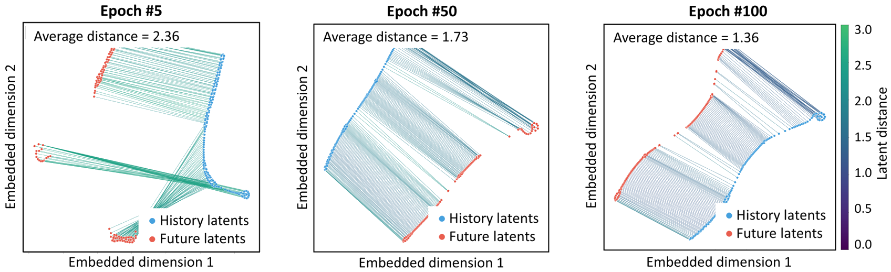

# A2A: Action-to-Action Flow Matching

> arXiv: [2602.07322](https://arxiv.org/abs/2602.07322) · Jindou Jia et al. · RSS 2026 · 2026-02-07
> Project: [A2A Flow Matching](https://lorenzo-0-0.github.io/A2A_Flow_Matching) · Source: [Paper.md](sources/A2AFlowMatching/Paper.md)

> [!abstract] Summary
> ## TL;DR — replace the source distribution, not the denoiser

A2A replaces the Gaussian source of a [[Literature Review on Flow-Based RL Policy|flow-matching policy]] with the robot's recent **executed** action chunk. A CNN embeds past actions into a $512$-D latent $mathbf{z}_0$; an AdaLN-MLP flow transports it to a future-action latent $mathbf{z}_1$, conditioned on recent images; a residual MLP decodes the next chunk. The claim is therefore stronger than “add proprioception”: past actions are the *initial distribution*, making the transport short enough for a lightweight model and one Euler step.

On five short manipulation tasks ($100$ demonstrations, $30$ epochs), A2A leads four tasks at six steps and reaches $0.56\,\mathrm{ms}$ per one-step sample on an RTX $5090$. Its strongest evidence is OOD visual robustness: six-step A2A retains $38$–$42\%$ across background, lighting, and camera shifts where its direct-regression twin falls to $3$–$5\%$. The counterweight is equally important: regression in the same latent architecture is *better in distribution* ($98\%$ vs. $92\%$), and A2A becomes history-sensitive under initial-state error. Small injected action noise repairs both this brittleness and its otherwise deterministic rollouts, but tuning that noise is now part of the method.

<div align="center"></div>

---

> [!fact] Methodology
> ## Action history as the source of a conditional flow

A2A assumes that sequential commands from a physically continuous robot are already close to the next action chunk. It separates the *source path* (executed actions) from the *condition path* (images), embeds both action chunks into one shared $512$-D space, then learns a conditional ODE from historical to future latents. The key inductive bias is not a new flow objective: it is choosing $mathbf{a}_{\leq t}$ rather than $mathcal{N}(\mathbf{0},\mathbf{I})$ as the source. At deployment, the controller rolls that latent ODE forward with Euler integration and decodes a future action chunk. The intended application regime is short-horizon, smooth control; the simulation suite spans Close Box, Pick Cube, Stack Cube, Open Drawer, and Pick-Place Bowl.

<div align="center"></div>

#### <u>Inputs, source, target</u>

$$
\mathbf{a}_{\leq t}
= \{\mathbf{a}_{t-n+1}, \ldots, \mathbf{a}_{t}\},
\qquad
\mathbf{I}_{\leq t}
= \{\mathbf{I}_{t-m+1}, \ldots, \mathbf{I}_{t}\},
\qquad
\mathbf{a}_{>t}
= \{\mathbf{a}_{t+1}, \ldots, \mathbf{a}_{t+n}\}.
$$

| $\mathbf{a}_{\leq t}$ | $\mathbf{I}_{\leq t}$ | $\mathbf{a}_{>t}$ | $n$ | $m$ |
| --- | --- | --- | --- | --- |
| Executed action history from proprioceptive feedback | Recent visual observations | Future action chunk to generate | Action horizon | Observation horizon |

$$
\mathbf{z}_0 = E_a(\mathbf{a}_{\leq t}),
\qquad
\hat{\mathbf{a}}_{>t} = D_a(\mathbf{z}_1),
\qquad
\mathbf{c} = \operatorname{MLP}(E_I(\mathbf{I}_{\leq t})).
$$

<div align="center"></div>

#### <u>Latent action-to-action transport</u>

$$
\mathbf{z}_{\tau}
= (1 - \tau)\mathbf{z}_0 + \tau\mathbf{z}_1,
\qquad
\tau \in [0,1].
$$

$$
\frac{d\mathbf{z}_{\tau}}{d\tau}
= \mathbf{v}_{\tau}(\mathbf{z}_{\tau}).
$$

| $\mathbf{z}_0$ | $\mathbf{z}_1$ | $\mathbf{z}_{\tau}$ | $\tau$ | $\mathbf{v}_{\tau}$ | $\mathbf{c}$ |
| --- | --- | --- | --- | --- | --- |
| Latent of the executed history | Latent of the future action chunk | Interpolated latent state | Flow time | Time-dependent vector field | Visual conditioning vector |

<div align="center"></div>

#### <u>Illustrative online controller</u>

```python
def infer_future_actions(
    image_history: Tensor,
    executed_action_history: Tensor,
    step_count: int,
) -> Tensor:
    '''
    image_history: Recent RGB observations.
    executed_action_history: Proprioceptive actions actually executed.
    step_count: Euler steps used to integrate the latent flow.
    returns: A decoded future action chunk.
    '''
    z = encode_action_history(executed_action_history)
    c = encode_image_history(image_history)
    for tau in euler_times(step_count):
        z = z + (1.0 / step_count) * flow_field(z, tau, c)
    return decode_future_actions(z)
```

#### <u>Training objective</u>

$$
\mathcal{L}_{FM}
= \mathbb{E}_{\tau \sim \mathcal{U}[0,1],\,\mathbf{z}_0,\,\mathbf{z}_1}
\left\|
f_{\theta}(\mathbf{z}_{\tau}, \tau, \mathbf{c})
- \mathbf{v}_{\tau}(\mathbf{z}_{\tau}, \tau, \mathbf{c})
\right\|^2.
$$

$$
\mathcal{L}_{AE}
= \mathbb{E}_{\mathbf{a}_{>t}}
\left\|
\mathbf{a}_{>t} - D_a(E_a(\mathbf{a}_{>t}))
\right\|_1.
$$

$$
\begin{aligned}
\mathcal{L}_{IC}
= {} & \mathbb{E}_{\hat{\mathbf{z}}_1,\,\mathbf{a}_{>t}}
\left\|
\hat{\mathbf{z}}_1 - E_a(\mathbf{a}_{>t})
\right\|_1 \\
& {} + \lambda_0
\mathbb{E}_{\hat{\mathbf{z}}_1,\,\mathbf{a}_{>t}}
\left\|
D_a(\hat{\mathbf{z}}_1) - \mathbf{a}_{>t}
\right\|_1.
\end{aligned}
$$

$$
\mathcal{L}_{\mathrm{total}}
= \lambda_1\mathcal{L}_{FM}
+ \lambda_2\mathcal{L}_{AE}
+ \lambda_3\mathcal{L}_{IC}.
$$

| $f_{\theta}$ | $E_a, D_a$ | $\hat{\mathbf{z}}_1$ | $\lambda_0$ | $\lambda_1, \lambda_2, \lambda_3$ |
| --- | --- | --- | --- | --- |
| Learned conditional vector field | Action encoder and decoder | Latent reached by ODE integration | Weight on decoded-action consistency | Weights for flow, autoencoder, and consistency losses |

<div align="center"></div>

> [!info] Implementation Tricks
> ## Details that make the source prior usable

- **Feedback, not commands.** $mathbf{a}_{\leq t}$ is reconstructed from executed proprioceptive feedback, so it absorbs low-level tracking error rather than assuming commands were achieved exactly.
- **Do not concatenate modalities.** Recent images pass through ResNet-$18$ and a linear projection; historical actions pass through three $1$-D CNN layers. The flow sees their latent source and condition separately, avoiding a small proprioceptive vector being submerged in vision features.
- **Expand before flowing.** The action sequence is encoded into a shared $512$-D space; the authors' raw-action ablation is substantially weaker even with a U-Net.
- **Keep inference grounded.** $
\mathcal{L}_{IC}$ supervises both the ODE endpoint and its decoded action, preventing a latent trajectory that looks valid but cannot reconstruct an executable chunk.
- **Noise is a deliberate escape hatch.** Gaussian noise with standard deviation $0.02$ on $mathbf{a}_{\leq t}$ improves Level-$1$ visual robustness from $20\%$ to $52\%$; standard deviation $0.1$ is used in the initial-state-uncertainty experiment. It restores stochasticity, but makes noise scale another task-dependent choice.
- **Shared settings.** All reported experiments use $n=m=8$, batch size $32$, and $(\lambda_0,\lambda_1,\lambda_2,\lambda_3)=(0.5,1,0.5,1)$.

---

> [!hint] Experiments & Findings
> ## Fast in distribution; most compelling under perturbation

#### <u>Benchmark scope and $30$-epoch simulation result</u>

All entries use $100$ demonstrations; the table compares nine methods at their listed sampling budgets. A2A is best on four of five tasks; VITA narrowly wins Pick-Place Bowl. The contrast with ACT is useful: direct regression gets $80$–$86\%$ on four tasks at one step, so short-horizon in-distribution success is not evidence that generation is necessary.

| Method | Steps | Close Box | Pick Cube | Stack Cube | Open Drawer | Pick-Place Bowl |
| --- | ---: | ---: | ---: | ---: | ---: | ---: |
| **A2A** | 6 | **92** | **92** | **86** | **92** | 90 |
| VITA | 6 | 88 | 88 | 80 | 90 | **92** |
| FM-UNet | 10 | 82 | 70 | 28 | 34 | 68 |
| FM-DiT | 10 | 58 | 88 | 26 | 28 | 84 |
| DDPM-UNet | 100 | 72 | 60 | 36 | 64 | 66 |
| DDPM-DiT | 100 | 58 | 58 | 16 | 14 | 68 |
| DDIM-UNet | 40 | 70 | 56 | 36 | 64 | 82 |
| Score-UNet | 100 | 36 | 36 | 12 | 0 | 4 |
| ACT | 1 | 82 | 86 | 32 | 80 | 60 |

#### <u>One-step budget and latency</u>

<div align="center"></div>

On Close Box, success rises sharply through four steps and then plateaus; with one step, it exceeds $90\%$ after epoch $32$. A2A's reported one-step sampling time is **$0.56\,\mathrm{ms}$** on an RTX $5090$, below $1\,\mathrm{ms}$ per sample. Treat this as a *model sampling* figure, not a measured end-to-end control-loop latency: the paper does not report camera acquisition, ResNet preprocessing, robot communication, or safety-stack time.

#### <u>Visual randomization is the core generalization result</u>

Training sees Level $0$ only (random box pose). Level $1$ randomizes backgrounds; Level $2$ adds lighting; Level $3$ adds camera extrinsics. Six-step A2A retains $38$–$42\%$ under all three held-out shifts; every baseline is $8\%$ or lower. One-step A2A remains ahead, but loses half the six-step OOD performance.

| Method | Level 0 | Level 1 | Level 2 | Level 3 |
| --- | ---: | ---: | ---: | ---: |
| A2A, 1 step | 100 | 20 | 16 | 22 |
| **A2A, 6 steps** | **100** | **38** | **42** | **38** |
| VITA | **100** | 4 | 2 | 2 |
| FM-UNet | 96 | 6 | 6 | 4 |
| DDPM-UNet | 92 | 2 | 4 | 2 |
| Score-UNet | 94 | 0 | 2 | 0 |
| ACT | 86 | 8 | 2 | 0 |

In the physical Pick Cube stress test, A2A reaches $100\%$ in distribution from $30$ trajectories and retains $80\%$ when the target becomes an unseen glowing block; DDPM-UNet and FM-UNet both score $0\%$. These are only $10$ trial evaluations, so the paper establishes a strong qualitative separation but not a precise estimate of the real-world gap.

#### <u>The ablation complicates the “generative beats regression” story</u>

<div align="center"></div>

- **Flow-latent $\rightarrow$ Reg-latent:** in-distribution Close Box rises from $92\%$ to $98\%$, but OOD Levels $1$–$3$ collapse from $38$–$42\%$ to about $3$–$5\%$.
- **Flow-latent $\rightarrow$ Flow-action-UNet:** success falls from $92\%$ to $70\%$.
- **Flow-latent $\rightarrow$ Flow-action-MLP:** success falls from $92\%$ to $56\%$.

This is the paper's cleanest causal result: its advantage is the combination of *latent* action-to-action transport and a flow objective under shift, not a universal in-distribution win for generation.

#### <u>History error, multimodality, and the video side experiment</u>

<div align="center"></div>

The premise has a corresponding failure mode: if the initial pose makes the executed history unrepresentative, clean A2A deteriorates more sharply than noise-sourced policies. Adding action noise with standard deviation $0.1$ makes the noised variant strongest across the tested initial-state offsets; with initial uncertainty $0.08\,\mathrm{rad}$, a modest noise level is best and excessive noise degrades performance. The $2$-D navigation qualitative result shows a second effect: without perturbation A2A collapses to a single route; small noise recovers both valid modes. Neither result yet demonstrates reliable multimodal long-horizon robot control.

Frames-to-Frames (F2F) ports the idea to video prediction: three past frames produce three future frames, using $100$ videos per five randomization levels, $500$ training epochs, and four unseen test scenes. It beats an otherwise identical regression baseline qualitatively, but the paper provides no PSNR, SSIM, MSE, or LPIPS values despite naming those metrics—so this is a plausibility demonstration, not a quantified scaling result.

#### <u>Limits and review caveats</u>

- The authors explicitly expect the continuity prior to help smooth control but not switch-like dimensions such as binary gripper open/close; hybrid continuous-discrete actions are left open.
- Four manually weighted loss terms and the injection-noise scale are tuned design choices, not learned quantities.
- The main simulations are five compact tabletop skills, with no long-horizon recovery, nonstationary dynamics, contact-rich binary control, or cross-embodiment evaluation.
- The tables report point success rates without simulated trial counts, seeds, confidence intervals, or a test of whether the latency advantage survives a full perception-and-actuation loop.

---

> [!fact] Reflection
> ## My Read
