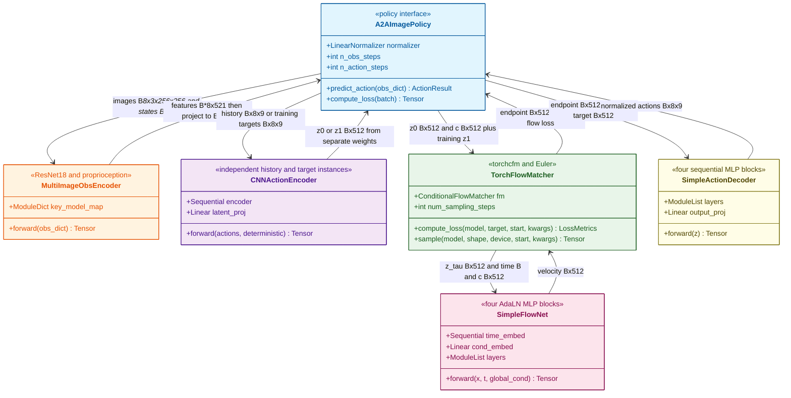

# A2A: Action-to-Action Flow Matching

> arXiv: [2602.07322](https://arxiv.org/abs/2602.07322) · Jindou Jia et al. · RSS 2026 · 2026-02-07
> Project: [A2A Flow Matching](https://lorenzo-0-0.github.io/A2A_Flow_Matching) · Source: [Paper.md](sources/A2AFlowMatching/Paper.md)

Follow-up: [[MARS Policy Literature Review|MARS Policy — Multimodality Only When It Matters]].

> [!abstract] Summary
> ## TL;DR — replace the source distribution, not the denoiser

A2A replaces the Gaussian source of a [[Literature Review on Flow-Based RL Policy|flow-matching policy]] with the robot's recent **executed** action chunk. A CNN embeds past actions into a $512$-D latent $mathbf{z}_0$; an AdaLN-MLP flow transports it to a future-action latent $mathbf{z}_1$, conditioned on recent images; a residual MLP decodes the next chunk. The claim is therefore stronger than “add proprioception”: past actions are the *initial distribution*, making the transport short enough for a lightweight model and one Euler step.

On five short manipulation tasks ($100$ demonstrations, $30$ epochs), A2A leads four tasks at six steps and reaches $0.56\,\mathrm{ms}$ per one-step sample on an RTX $5090$. Its strongest evidence is OOD visual robustness: six-step A2A retains $38$–$42\%$ across background, lighting, and camera shifts where its direct-regression twin falls to $3$–$5\%$. The counterweight is equally important: regression in the same latent architecture is *better in distribution* ($98\%$ vs. $92\%$), and A2A becomes history-sensitive under initial-state error. Small injected action noise repairs both this brittleness and its otherwise deterministic rollouts, but tuning that noise is now part of the method.

<div align="center"></div>

---

> [!fact] Methodology
> ## Action history as the source of a conditional flow

A2A assumes that sequential commands from a physically continuous robot are already close to the next action chunk. It separates the *source path* (executed actions) from the *condition path* (images), embeds both action chunks into one shared $512$-D space, then learns a conditional ODE from historical to future latents. The key inductive bias is not a new flow objective: it is choosing $mathbf{a}_{\leq t}$ rather than $mathcal{N}(\mathbf{0},\mathbf{I})$ as the source. At deployment, the controller rolls that latent ODE forward with Euler integration and decodes a future action chunk. The intended application regime is short-horizon, smooth control; the simulation suite spans Close Box, Pick Cube, Stack Cube, Open Drawer, and Pick-Place Bowl.

<div align="center"></div>

#### <u>Inputs, source, target</u>

$$
\mathbf{a}_{\leq t}
= \{\mathbf{a}_{t-n+1}, \ldots, \mathbf{a}_{t}\},
\qquad
\mathbf{I}_{\leq t}
= \{\mathbf{I}_{t-m+1}, \ldots, \mathbf{I}_{t}\},
\qquad
\mathbf{a}_{>t}
= \{\mathbf{a}_{t+1}, \ldots, \mathbf{a}_{t+n}\}.
$$

| $\mathbf{a}_{\leq t}$ | $\mathbf{I}_{\leq t}$ | $\mathbf{a}_{>t}$ | $n$ | $m$ |
| --- | --- | --- | --- | --- |
| Executed action history from proprioceptive feedback | Recent visual observations | Future action chunk to generate | Action horizon | Observation horizon |

$$
\mathbf{z}_0 = E_a(\mathbf{a}_{\leq t}),
\qquad
\hat{\mathbf{a}}_{>t} = D_a(\mathbf{z}_1),
\qquad
\mathbf{c} = \operatorname{MLP}(E_I(\mathbf{I}_{\leq t})).
$$

<div align="center"></div>

#### <u>Latent action-to-action transport</u>

$$
\mathbf{z}_{\tau}
= (1 - \tau)\mathbf{z}_0 + \tau\mathbf{z}_1,
\qquad
\tau \in [0,1].
$$

$$
\frac{d\mathbf{z}_{\tau}}{d\tau}
= \mathbf{v}_{\tau}(\mathbf{z}_{\tau}).
$$

| $\mathbf{z}_0$ | $\mathbf{z}_1$ | $\mathbf{z}_{\tau}$ | $\tau$ | $\mathbf{v}_{\tau}$ | $\mathbf{c}$ |
| --- | --- | --- | --- | --- | --- |
| Latent of the executed history | Latent of the future action chunk | Interpolated latent state | Flow time | Time-dependent vector field | Visual conditioning vector |

<div align="center"></div>

#### <u>Illustrative online controller</u>

```python
def infer_future_actions(
    image_history: Tensor,
    executed_action_history: Tensor,
    step_count: int,
) -> Tensor:
    '''
    image_history: Recent RGB observations.
    executed_action_history: Proprioceptive actions actually executed.
    step_count: Euler steps used to integrate the latent flow.
    returns: A decoded future action chunk.
    '''
    z = encode_action_history(executed_action_history)
    c = encode_image_history(image_history)
    for tau in euler_times(step_count):
        z = z + (1.0 / step_count) * flow_field(z, tau, c)
    return decode_future_actions(z)
```

#### <u>Training objective</u>

$$
\mathcal{L}_{FM}
= \mathbb{E}_{\tau \sim \mathcal{U}[0,1],\,\mathbf{z}_0,\,\mathbf{z}_1}
\left\|
f_{\theta}(\mathbf{z}_{\tau}, \tau, \mathbf{c})
- \mathbf{v}_{\tau}(\mathbf{z}_{\tau}, \tau, \mathbf{c})
\right\|^2.
$$

$$
\mathcal{L}_{AE}
= \mathbb{E}_{\mathbf{a}_{>t}}
\left\|
\mathbf{a}_{>t} - D_a(E_a(\mathbf{a}_{>t}))
\right\|_1.
$$

$$
\begin{aligned}
\mathcal{L}_{IC}
= {} & \mathbb{E}_{\hat{\mathbf{z}}_1,\,\mathbf{a}_{>t}}
\left\|
\hat{\mathbf{z}}_1 - E_a(\mathbf{a}_{>t})
\right\|_1 \\
& {} + \lambda_0
\mathbb{E}_{\hat{\mathbf{z}}_1,\,\mathbf{a}_{>t}}
\left\|
D_a(\hat{\mathbf{z}}_1) - \mathbf{a}_{>t}
\right\|_1.
\end{aligned}
$$

$$
\mathcal{L}_{\mathrm{total}}
= \lambda_1\mathcal{L}_{FM}
+ \lambda_2\mathcal{L}_{AE}
+ \lambda_3\mathcal{L}_{IC}.
$$

| $f_{\theta}$ | $E_a, D_a$ | $\hat{\mathbf{z}}_1$ | $\lambda_0$ | $\lambda_1, \lambda_2, \lambda_3$ |
| --- | --- | --- | --- | --- |
| Learned conditional vector field | Action encoder and decoder | Latent reached by ODE integration | Weight on decoded-action consistency | Weights for flow, autoencoder, and consistency losses |

<div align="center"></div>

> [!info] Implementation Tricks
> ## Details that make the source prior usable

- **Feedback, not commands.** $mathbf{a}_{\leq t}$ is reconstructed from executed proprioceptive feedback, so it absorbs low-level tracking error rather than assuming commands were achieved exactly.
- **Do not concatenate modalities.** Recent images pass through ResNet-$18$ and a linear projection; historical actions pass through three $1$-D CNN layers. The flow sees their latent source and condition separately, avoiding a small proprioceptive vector being submerged in vision features.
- **Expand before flowing.** The action sequence is encoded into a shared $512$-D space; the authors' raw-action ablation is substantially weaker even with a U-Net.
- **Keep inference grounded.** $
\mathcal{L}_{IC}$ supervises both the ODE endpoint and its decoded action, preventing a latent trajectory that looks valid but cannot reconstruct an executable chunk.
- **Noise is a deliberate escape hatch.** Gaussian noise with standard deviation $0.02$ on $mathbf{a}_{\leq t}$ improves Level-$1$ visual robustness from $20\%$ to $52\%$; standard deviation $0.1$ is used in the initial-state-uncertainty experiment. It restores stochasticity, but makes noise scale another task-dependent choice.
- **Shared settings.** All reported experiments use $n=m=8$, batch size $32$, and $(\lambda_0,\lambda_1,\lambda_2,\lambda_3)=(0.5,1,0.5,1)$.

---

> [!hint] Experiments & Findings
> ## Fast in distribution; most compelling under perturbation

#### <u>Benchmark scope and $30$-epoch simulation result</u>

All entries use $100$ demonstrations; the table compares nine methods at their listed sampling budgets. A2A is best on four of five tasks; VITA narrowly wins Pick-Place Bowl. The contrast with ACT is useful: direct regression gets $80$–$86\%$ on four tasks at one step, so short-horizon in-distribution success is not evidence that generation is necessary.

| Method | Steps | Close Box | Pick Cube | Stack Cube | Open Drawer | Pick-Place Bowl |
| --- | ---: | ---: | ---: | ---: | ---: | ---: |
| **A2A** | 6 | **92** | **92** | **86** | **92** | 90 |
| VITA | 6 | 88 | 88 | 80 | 90 | **92** |
| FM-UNet | 10 | 82 | 70 | 28 | 34 | 68 |
| FM-DiT | 10 | 58 | 88 | 26 | 28 | 84 |
| DDPM-UNet | 100 | 72 | 60 | 36 | 64 | 66 |
| DDPM-DiT | 100 | 58 | 58 | 16 | 14 | 68 |
| DDIM-UNet | 40 | 70 | 56 | 36 | 64 | 82 |
| Score-UNet | 100 | 36 | 36 | 12 | 0 | 4 |
| ACT | 1 | 82 | 86 | 32 | 80 | 60 |

#### <u>One-step budget and latency</u>

<div align="center"></div>

On Close Box, success rises sharply through four steps and then plateaus; with one step, it exceeds $90\%$ after epoch $32$. A2A's reported one-step sampling time is **$0.56\,\mathrm{ms}$** on an RTX $5090$, below $1\,\mathrm{ms}$ per sample. Treat this as a *model sampling* figure, not a measured end-to-end control-loop latency: the paper does not report camera acquisition, ResNet preprocessing, robot communication, or safety-stack time.

#### <u>Visual randomization is the core generalization result</u>

Training sees Level $0$ only (random box pose). Level $1$ randomizes backgrounds; Level $2$ adds lighting; Level $3$ adds camera extrinsics. Six-step A2A retains $38$–$42\%$ under all three held-out shifts; every baseline is $8\%$ or lower. One-step A2A remains ahead, but loses half the six-step OOD performance.

| Method | Level 0 | Level 1 | Level 2 | Level 3 |
| --- | ---: | ---: | ---: | ---: |
| A2A, 1 step | 100 | 20 | 16 | 22 |
| **A2A, 6 steps** | **100** | **38** | **42** | **38** |
| VITA | **100** | 4 | 2 | 2 |
| FM-UNet | 96 | 6 | 6 | 4 |
| DDPM-UNet | 92 | 2 | 4 | 2 |
| Score-UNet | 94 | 0 | 2 | 0 |
| ACT | 86 | 8 | 2 | 0 |

In the physical Pick Cube stress test, A2A reaches $100\%$ in distribution from $30$ trajectories and retains $80\%$ when the target becomes an unseen glowing block; DDPM-UNet and FM-UNet both score $0\%$. These are only $10$ trial evaluations, so the paper establishes a strong qualitative separation but not a precise estimate of the real-world gap.

#### <u>The ablation complicates the “generative beats regression” story</u>

<div align="center"></div>

- **Flow-latent $\rightarrow$ Reg-latent:** in-distribution Close Box rises from $92\%$ to $98\%$, but OOD Levels $1$–$3$ collapse from $38$–$42\%$ to about $3$–$5\%$.
- **Flow-latent $\rightarrow$ Flow-action-UNet:** success falls from $92\%$ to $70\%$.
- **Flow-latent $\rightarrow$ Flow-action-MLP:** success falls from $92\%$ to $56\%$.

This is the paper's cleanest causal result: its advantage is the combination of *latent* action-to-action transport and a flow objective under shift, not a universal in-distribution win for generation.

#### <u>History error, multimodality, and the video side experiment</u>

<div align="center"></div>

The premise has a corresponding failure mode: if the initial pose makes the executed history unrepresentative, clean A2A deteriorates more sharply than noise-sourced policies. Adding action noise with standard deviation $0.1$ makes the noised variant strongest across the tested initial-state offsets; with initial uncertainty $0.08\,\mathrm{rad}$, a modest noise level is best and excessive noise degrades performance. The $2$-D navigation qualitative result shows a second effect: without perturbation A2A collapses to a single route; small noise recovers both valid modes. Neither result yet demonstrates reliable multimodal long-horizon robot control.

Frames-to-Frames (F2F) ports the idea to video prediction: three past frames produce three future frames, using $100$ videos per five randomization levels, $500$ training epochs, and four unseen test scenes. It beats an otherwise identical regression baseline qualitatively, but the paper provides no PSNR, SSIM, MSE, or LPIPS values despite naming those metrics—so this is a plausibility demonstration, not a quantified scaling result.

#### <u>Limits and review caveats</u>

- The authors explicitly expect the continuity prior to help smooth control but not switch-like dimensions such as binary gripper open/close; hybrid continuous-discrete actions are left open.
- Four manually weighted loss terms and the injection-noise scale are tuned design choices, not learned quantities.
- The main simulations are five compact tabletop skills, with no long-horizon recovery, nonstationary dynamics, contact-rich binary control, or cross-embodiment evaluation.
- The tables report point success rates without simulated trial counts, seeds, confidence intervals, or a test of whether the latency advantage survives a full perception-and-actuation loop.

---

> [!fact] Reflection
> ## My Read


---

> [!hint] Codebase Analysis
> ## Codebase Status and Structure

**Verdict: A2A's core latent policy is released and inspectable, but reproducing the paper requires manual setup and resolving configuration and paper/code discrepancies.**

| Aspect | Assessment |
| :--- | :--- |
| **Completeness** | Base/noisy A2A, data conversion, training, and simulator evaluation are present, but two ablation modules and experiment checkpoints are absent from the inspected clone. |
| **Adaptation** | Author-provided simulation instructions exist, but demonstrations must be supplied or collected and independent community replication was not established by this static review. |
| **Dependency** | The end-to-end pipeline depends on RoboVerse/MetaSim task, observation, and simulator interfaces, while the latent policy components are more separable. |
| **Currency** | The inspected commit is dated 2026-06-01 and documents Isaac Sim 5.0.0, but conflicting Zarr/Hydra installation instructions prevent treating it as a locked environment. |

**Replication difficulty: Hard.** Collecting matching demonstrations, configuring the simulator/assets, reconciling default paths and dependencies, and recovering missing ablations make this more than a short command sequence. **Technique adaptation: Moderate.** The encoder–flow–decoder modules expose reusable boundaries, but a port must preserve state/action normalization, current-time target alignment, conditioning, and differentiable endpoint supervision.

**Snapshot and scope.** Inspected 2026-09-16 at [local clone](C:/Users/Liuyir/Documents/A2A_Flow_Matching), upstream [JIAjindou/A2A_Flow_Matching](https://github.com/JIAjindou/A2A_Flow_Matching), commit [a5792ec](https://github.com/JIAjindou/A2A_Flow_Matching/commit/a5792ecf4e7f8fa4d85fe66ea9a50618138f925c) (“Update README.md”). The clone had no reported working-tree changes and was not pulled; this is a dated snapshot assessment, not a claim about current upstream activity.

**Artifacts and documentation.** The [README](https://github.com/JIAjindou/A2A_Flow_Matching/blob/a5792ecf4e7f8fa4d85fe66ea9a50618138f925c/README.md) supplies simulation commands and real-robot integration advice; no A2A demonstrations, pretrained checkpoints, or dedicated A2A policy tests were found locally. General simulator tests are present, and the root license is Apache-2.0. These findings do not establish missing downloads elsewhere or a reproduced physical deployment.

#### <u>Data flow across the policy boundary</u>

The diagram maps the paper's encoder–flow–decoder arrows to actual classes; reciprocal edges show request and returned payloads, not startup order. The policy receives observation history and returns an unnormalized action chunk; during training it additionally receives the demonstrated action window and returns a scalar loss. The two CNN instances have independent weights. The observation projector belongs to the policy.

<!-- TODO: Convert the Mermaid below to Excalidraw and embed as ![[A2A Data Flow|100%]] -->



The class diagram was rendered successfully with Mermaid 10.9.3 in headless Edge before embedding; renderer files remain outside the vault and research clone.

#### <u>Layer-boundary APIs</u>

These are typed, illustrative signatures of the bound methods, with original names and parameter order; `self` and defaults are omitted. `Tensor` means `torch.Tensor`, and `Literal` is from `typing`. Shapes use batch size $B$ and specialize the default observation horizon $8$, action horizon $8$, action dimension $9$, and latent dimension $512$. Only the trace-free sampler path used for policy prediction and training is shown.

**Policy inference boundary — `A2AImagePolicy.predict_action`.** [GitHub](https://github.com/JIAjindou/A2A_Flow_Matching/blob/a5792ecf4e7f8fa4d85fe66ea9a50618138f925c/roboverse_learn/il/policies/a2a/a2a_policy.py#L225); local [roboverse_learn/il/policies/a2a/a2a_policy.py:225](C:/Users/Liuyir/Documents/A2A_Flow_Matching/roboverse_learn/il/policies/a2a/a2a_policy.py:225).

```python
def predict_action(
    obs_dict: dict[str, Tensor],
) -> dict[str, Tensor]:
    '''
    head_cam: (B, 8, 3, 256, 256) images in [0, 1].
    agent_pos: (B, 8, 9) measured, unnormalized state history.
    Returns action and action_pred, each shaped (B, 8, 9).
    Outputs are unnormalized commands starting at current time.
    Normalization, encoding, integration, and decoding occur here.
    '''
    ...
```

**Training boundary — `A2AImagePolicy.compute_loss`.** [GitHub](https://github.com/JIAjindou/A2A_Flow_Matching/blob/a5792ecf4e7f8fa4d85fe66ea9a50618138f925c/roboverse_learn/il/policies/a2a/a2a_policy.py#L141); local [roboverse_learn/il/policies/a2a/a2a_policy.py:141](C:/Users/Liuyir/Documents/A2A_Flow_Matching/roboverse_learn/il/policies/a2a/a2a_policy.py:141).

```python
def compute_loss(
    batch: dict[str, Tensor | dict[str, Tensor]],
) -> Tensor:
    '''
    batch["obs"]: head_cam and agent_pos for a sampled window.
    batch["action"]: (B, 16, 9) unnormalized commands.
    Uses the first 8 observation frames and action[:, 7:15].
    Returns the scalar flow, consistency, and reconstruction loss.
    Both action encoders, the flow, and decoder receive gradients.
    '''
    ...
```

The data adapter is `RobotImageDataset.postprocess` at [GitHub](https://github.com/JIAjindou/A2A_Flow_Matching/blob/a5792ecf4e7f8fa4d85fe66ea9a50618138f925c/roboverse_learn/il/datasets/robot_image_dataset.py#L130); local [roboverse_learn/il/datasets/robot_image_dataset.py:130](C:/Users/Liuyir/Documents/A2A_Flow_Matching/roboverse_learn/il/datasets/robot_image_dataset.py:130). It maps Zarr `head_camera/state/action` to `obs.head_cam/obs.agent_pos/action` and scales images by $1/255$; the policy applies its fitted normalizer. For rollout, `DefaultEvalRunner.predict_action` at [GitHub](https://github.com/JIAjindou/A2A_Flow_Matching/blob/a5792ecf4e7f8fa4d85fe66ea9a50618138f925c/roboverse_learn/il/runners/default_eval_runner.py#L104); local [roboverse_learn/il/runners/default_eval_runner.py:104](C:/Users/Liuyir/Documents/A2A_Flow_Matching/roboverse_learn/il/runners/default_eval_runner.py:104). stacks observation history, calls the policy, and transposes its returned action chunk to $8\times B\times9$.

**Observation features — `MultiImageObsEncoder.forward`.** [GitHub](https://github.com/JIAjindou/A2A_Flow_Matching/blob/a5792ecf4e7f8fa4d85fe66ea9a50618138f925c/roboverse_learn/il/utils/vision/multi_image_obs_encoder.py#L127); local [roboverse_learn/il/utils/vision/multi_image_obs_encoder.py:127](C:/Users/Liuyir/Documents/A2A_Flow_Matching/roboverse_learn/il/utils/vision/multi_image_obs_encoder.py:127).

```python
def forward(
    obs_dict: dict[str, Tensor],
) -> Tensor:
    '''
    head_cam: (B*8, 3, 256, 256), with policy normalization applied.
    agent_pos: (B*8, 9) normalized measured states.
    Returns (B*8, 521): 512 image features plus 9 state values.
    The policy reshapes to (B, 4168) and projects to (B, 512).
    '''
    ...
```

**Action encoding — `CNNActionEncoder.forward`.** [GitHub](https://github.com/JIAjindou/A2A_Flow_Matching/blob/a5792ecf4e7f8fa4d85fe66ea9a50618138f925c/roboverse_learn/il/policies/a2a/action_ae.py#L52); local [roboverse_learn/il/policies/a2a/action_ae.py:52](C:/Users/Liuyir/Documents/A2A_Flow_Matching/roboverse_learn/il/policies/a2a/action_ae.py:52).

```python
def forward(
    actions: Tensor,
    deterministic: bool,
) -> Tensor:
    '''
    actions: (B, 8, 9) normalized states or target actions.
    Returns (B, 512) after three temporal Conv1D stages.
    The policy owns separate history and target encoder instances.
    deterministic is accepted but unused; encoding is deterministic.
    '''
    ...
```

**Flow-training boundary — `TorchFlowMatcher.compute_loss`.** [GitHub](https://github.com/JIAjindou/A2A_Flow_Matching/blob/a5792ecf4e7f8fa4d85fe66ea9a50618138f925c/roboverse_learn/il/utils/flow/flow_matchers.py#L19); local [roboverse_learn/il/utils/flow/flow_matchers.py:19](C:/Users/Liuyir/Documents/A2A_Flow_Matching/roboverse_learn/il/utils/flow/flow_matchers.py:19).

```python
def compute_loss(
    model: SimpleFlowNet,
    target: Tensor,
    start: Tensor | None,
    **kwargs: Tensor,
) -> tuple[Tensor, dict[str, float]]:
    '''
    Compute the training loss using the flow matcher.

    Args:
        model: The flow network
            (e.g., ConditionalUnet1D or FlowTransformer).
        target: Target actions for training.

    Returns:
        Tuple of (loss tensor, dictionary of metrics).

    A2A passes target and start latents shaped (B, 512).
    kwargs contains global_cond, also shaped (B, 512).
    '''
    ...
```

**Integration boundary — `TorchFlowMatcher.sample`.** [GitHub](https://github.com/JIAjindou/A2A_Flow_Matching/blob/a5792ecf4e7f8fa4d85fe66ea9a50618138f925c/roboverse_learn/il/utils/flow/flow_matchers.py#L41); local [roboverse_learn/il/utils/flow/flow_matchers.py:41](C:/Users/Liuyir/Documents/A2A_Flow_Matching/roboverse_learn/il/utils/flow/flow_matchers.py:41).

```python
def sample(
    model: SimpleFlowNet,
    shape: tuple[int, int],
    device: torch.device,
    num_steps: int | None,
    return_traces: Literal[False],
    start: Tensor | None,
    **kwargs: Tensor,
) -> Tensor:
    '''
    Generate samples using the flow network.

    Args:
        model: The flow network.
        shape: Shape of the output tensor
            (batch_size, pred_horizon, action_dim).
        return_traces: If True, return trajectory
            and velocity histories.
        num_steps: Number of sampling steps.
            If None, use self.num_sampling_steps.
        start [IMPORTANT]: Optional flow source.
            If None, start from standard normal noise.

    Returns:
        Sampled actions, or (actions, (traj_history, vel_history))
        if return_traces is True.

    The generic docstring's action-shaped output is specialized here.
    A2A uses shape=(B, 512), start=(B, 512), and no traces.
    kwargs contains global_cond=(B, 512).
    Returns the integrated endpoint (B, 512).
    Six Euler steps by default; training retains the gradient graph.
    '''
    ...
```

**Velocity prediction — `SimpleFlowNet.forward`.** [GitHub](https://github.com/JIAjindou/A2A_Flow_Matching/blob/a5792ecf4e7f8fa4d85fe66ea9a50618138f925c/roboverse_learn/il/utils/models/flow_net.py#L278); local [roboverse_learn/il/utils/models/flow_net.py:278](C:/Users/Liuyir/Documents/A2A_Flow_Matching/roboverse_learn/il/utils/models/flow_net.py:278).

```python
def forward(
    x: Tensor,
    t: Tensor,
    global_cond: Tensor | None,
) -> Tensor:
    '''
    x: (B, 512) latent at the current flow time.
    t: (B,) flow times in [0, 1].
    global_cond: (B, 512) projected observation features.
    Returns latent velocity (B, 512), not physical joint velocity.
    '''
    ...
```

**Action decoding — `SimpleActionDecoder.forward`.** [GitHub](https://github.com/JIAjindou/A2A_Flow_Matching/blob/a5792ecf4e7f8fa4d85fe66ea9a50618138f925c/roboverse_learn/il/policies/a2a/action_ae.py#L158); local [roboverse_learn/il/policies/a2a/action_ae.py:158](C:/Users/Liuyir/Documents/A2A_Flow_Matching/roboverse_learn/il/policies/a2a/action_ae.py:158).

```python
def forward(
    z: Tensor,
) -> Tensor:
    '''
    Args:
        z: (B, latent_dim)
    Returns:
        actions: (B, pred_horizon, action_dim)

    Default dimensions: (B, 512) to normalized actions (B, 8, 9).
    The policy unnormalizes this result before returning commands.
    '''
    ...
```

#### <u>Architecture verified from the default configuration</u>

The implementation uses a single $512$-D vector per action chunk. The selected flow backbone has **no attention**; the separate `FlowTransformer` class in the same utility file is not instantiated by `A2AImagePolicy`.

| Stage | Actual default implementation |
| :--- | :--- |
| History input | Normalized `agent_pos`, shape $B\times8\times9$; measured state history supplies the source |
| History encoder | Three Conv1D + ReLU stages; channels $9\to512\to512\to512$, kernel $5$, stride $2$, padding $2$; temporal lengths $8\to4\to2\to1$, followed by a $512\to512$ linear projection |
| Target encoder | A **separate** CNN instance encodes the normalized target action chunk into $512$ dimensions; its weights are not shared with the history encoder |
| Observation condition | ResNet-18 uses GroupNorm and no pretrained weights, while each frame's $512$ image features are concatenated with its $9$ proprioceptive values; eight frames flatten to $4168$ features and project to $512$ |
| Flow network | Input projection, four residual AdaLN-MLP blocks of width $512$ and MLP expansion $512\to2048\to512$, then LayerNorm and output projection |
| Conditioning | Sinusoidal time embedding of width $256$, projected through $1024$ to $512$; a projected observation condition is added to it, and each block predicts a gate, scale, and shift |
| Decoder | $512\to512$ input projection, four sequential MLP blocks with $512$ hidden units, and a $512\to72$ output projection reshaped to $8\times9$, with **no decoder residual addition** |
| Sampling | Six explicit Euler steps by default; the same four-block flow network is reused at every step |

Sources: [policy and encoder construction](https://github.com/JIAjindou/A2A_Flow_Matching/blob/a5792ecf4e7f8fa4d85fe66ea9a50618138f925c/roboverse_learn/il/policies/a2a/a2a_policy.py#L75), [CNN and decoder](https://github.com/JIAjindou/A2A_Flow_Matching/blob/a5792ecf4e7f8fa4d85fe66ea9a50618138f925c/roboverse_learn/il/policies/a2a/action_ae.py), [flow blocks](https://github.com/JIAjindou/A2A_Flow_Matching/blob/a5792ecf4e7f8fa4d85fe66ea9a50618138f925c/roboverse_learn/il/utils/models/flow_net.py#L182), [observation concatenation](https://github.com/JIAjindou/A2A_Flow_Matching/blob/a5792ecf4e7f8fa4d85fe66ea9a50618138f925c/roboverse_learn/il/utils/vision/multi_image_obs_encoder.py#L167), and [A2A configuration](https://github.com/JIAjindou/A2A_Flow_Matching/blob/a5792ecf4e7f8fa4d85fe66ea9a50618138f925c/roboverse_learn/il/configs/policy_config/a2a.yaml).

**Paper versus code:** the paper description above uses one action-encoder symbol, visual conditioning, and a residual MLP decoder. The inspected code uses independently parameterized history/target encoders, includes proprioception in the condition as well as the source, and implements a sequential decoder. Thus the earlier "do not concatenate modalities" statement describes the paper's presentation, not the default released observation path.

#### <u>Training objective, alignment, and noise</u>

For the released default config, define $E_H$ and $E_T$ as the separate history and target encoders, $D_a$ as the decoder, and $\hat z_1$ as the integrated latent endpoint. The active objective is

| $E_H$ | $E_T$ | $D_a$ | $\hat z_1$ | $a_{\mathrm{target}}$ |
| :--- | :--- | :--- | :--- | :--- |
| History CNN | Target-action CNN | Action decoder | Integrated endpoint | Normalized current-time action chunk |

$$
\mathcal L_{\mathrm{code}}
=
\mathcal L_{\mathrm{FM}}
+\operatorname{MSE}(\hat z_1,E_T(a_{\mathrm{target}}))
+0.5\operatorname{MAE}(D_a(\hat z_1),a_{\mathrm{target}})
+0.5\operatorname{MAE}(D_a(E_T(a_{\mathrm{target}})),a_{\mathrm{target}}).
$$

Latent consistency is **MSE**, whereas the paper specifies an $L_1$ term. The Euler sampler remains differentiable during training, so endpoint losses backpropagate through the integration steps. Both optional contrastive weights are zero. The YAML contains `use_variational` and `kl_weight` fields, but this policy's encoder is deterministic and its loss contains no KL term. [Loss implementation](https://github.com/JIAjindou/A2A_Flow_Matching/blob/a5792ecf4e7f8fa4d85fe66ea9a50618138f925c/roboverse_learn/il/policies/a2a/a2a_policy.py#L141), [sampler](https://github.com/JIAjindou/A2A_Flow_Matching/blob/a5792ecf4e7f8fa4d85fe66ea9a50618138f925c/roboverse_learn/il/utils/flow/flow_matchers.py#L43).

**Time alignment:** with a $16$-frame sampled window, history is `state[:, 0:8]` and targets are `action[:, 7:15]`. Prediction therefore starts at the current command index, rather than the next index used in the paper notation. Preserve this dataset convention when porting the policy.

**Noise variant:** noise is added to *normalized* history states before encoding, during both training and inference. Its default standard deviation is $0.1$, although the README recommends $0.02$ for real-robot training. Moreover, `a2a_noise.yaml` selects `ExactOptimalTransportConditionalFlowMatcher`, while `a2a.yaml` selects ordinary `ConditionalFlowMatcher`. Comparing these defaults changes both source noise and the matching strategy, so it is not a controlled noise-only ablation. [Noise policy](https://github.com/JIAjindou/A2A_Flow_Matching/blob/a5792ecf4e7f8fa4d85fe66ea9a50618138f925c/roboverse_learn/il/policies/a2a/a2a_noise_policy.py#L149), [noise configuration](https://github.com/JIAjindou/A2A_Flow_Matching/blob/a5792ecf4e7f8fa4d85fe66ea9a50618138f925c/roboverse_learn/il/configs/policy_config/a2a_noise.yaml).

#### <u>Reproduction issues visible before running</u>

**Dataset defaults do not line up.** `collect_demo.sh` requests $50$ successful demonstrations and converts $25$; `il_run.sh` expects a dataset filename ending in `_100.zarr`. Align the collection count, conversion count, and training path first. [Collection script](https://github.com/JIAjindou/A2A_Flow_Matching/blob/a5792ecf4e7f8fa4d85fe66ea9a50618138f925c/roboverse_learn/il/collect_demo.sh#L15), [launcher](https://github.com/JIAjindou/A2A_Flow_Matching/blob/a5792ecf4e7f8fa4d85fe66ea9a50618138f925c/roboverse_learn/il/il_run.sh#L12).

**Two advertised ablation configs reference missing modules.** `a2a_mini.yaml` targets `policies.vita.a2a_mini_policy`, and `a2a_reg.yaml` targets `policies.vita.a2a_reg_policy`; neither module exists in this snapshot. The base `a2a` and `a2a_noise` modules are present.

**Horizon changes need an encoder fix.** The encoder sizes its final projection using integer floor division by $8$, while the padded strided convolutions produce a temporal length of $\lceil n/8\rceil$. The default $n=8$ works dimensionally; nonmultiples of $8$ can cause a projection-shape mismatch. [Encoder sizing](https://github.com/JIAjindou/A2A_Flow_Matching/blob/a5792ecf4e7f8fa4d85fe66ea9a50618138f925c/roboverse_learn/il/policies/a2a/action_ae.py#L45).

**Do not assume adaLN-Zero initialization.** Each flow block initially zeros its modulation output layer, but the enclosing `SimpleFlowNet` subsequently applies Xavier initialization to every linear layer, overwriting those zero weights. The residual modulation architecture is present; zero-gated initialization is not preserved. [Initialization order](https://github.com/JIAjindou/A2A_Flow_Matching/blob/a5792ecf4e7f8fa4d85fe66ea9a50618138f925c/roboverse_learn/il/utils/models/flow_net.py#L204).

**Environment and experiment settings require an explicit record.** Requirements pin Zarr $2.12.0$ and Hydra $1.2.0$, while `il_setup.sh` installs Zarr $2.16.1$ and upgrades Hydra. The launcher defaults to $200$ epochs, six sampling steps, and online W&B logging; these are not automatically the paper's $30$-epoch or one-step settings. [Requirements](https://github.com/JIAjindou/A2A_Flow_Matching/blob/a5792ecf4e7f8fa4d85fe66ea9a50618138f925c/roboverse_learn/il/policies/a2a/requirements.txt), [setup script](https://github.com/JIAjindou/A2A_Flow_Matching/blob/a5792ecf4e7f8fa4d85fe66ea9a50618138f925c/roboverse_learn/il/il_setup.sh), [runner config](https://github.com/JIAjindou/A2A_Flow_Matching/blob/a5792ecf4e7f8fa4d85fe66ea9a50618138f925c/roboverse_learn/il/configs/default_runner.yaml).

**Validation scope:** static source/configuration tracing and file-presence checks only; no research dependencies were installed and no training, checkpoint inference, simulator rollout, or latency benchmark was run. Diagram validation exercised the Mermaid renderer only. The environment's failed Python availability probe in the initial review is not an A2A runtime result.

#### <u>Use as a starting point for latent MARS</u>

This release exposes the necessary extension points: encoded history as an explicit flow source, a conditional latent vector field, and an action decoder. A learned noise scheduler could be inserted before or after history encoding. However, `a2a_noise` only adds fixed-scale noise; it does not implement MARS's learned mixture, diversity loss, gated reconstruction, or adaptive step budget. Those additions require explicit choices about noise scale and how latent weights gate action reconstruction. See [[MARS Policy Literature Review|the separate MARS review]] for the published action-space method; a latent variant remains a proposed extension.
