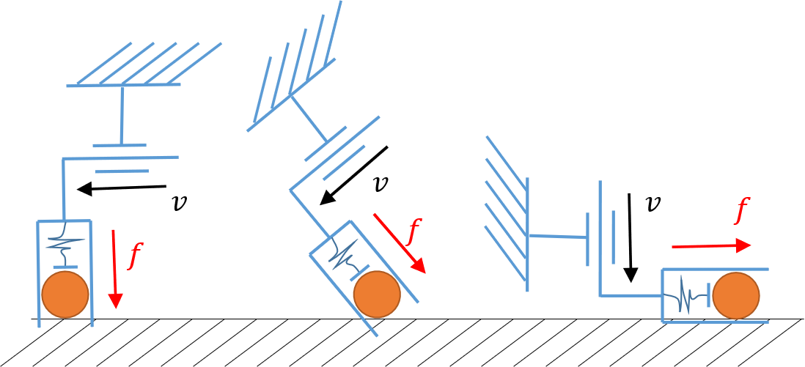
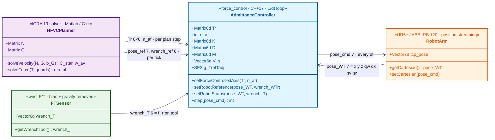

# force_control: 6-D Admittance and Hybrid Force-Velocity Controller

> Code: [yifan-hou/force_control](https://github.com/yifan-hou/force_control/tree/mainline) @ [`460bc3b`](https://github.com/yifan-hou/force_control/tree/460bc3bdc6036e7c531cbe7751692d05bb36052d) · Hou Y. · MIT · last commit 2025-07-17
> Paper: arXiv [1903.02715](https://arxiv.org/abs/1903.02715) · Hou Y. et al. · ICRA 2019 · 2019-03-07
> Source: [Paper.md](../sources/HybridForceVelocity/Paper.md) · local code: [code/](code/README.md) (snapshot of `460bc3b`)
> Theory: [[Admittance Control Literature Review]]

> [!abstract] Overview
> ## TL;DR — A Programmable Mass–Spring–Damper on a Stiff Position-Controlled Arm

`force_control` is one C++17 class, `AdmittanceController`, that turns a stiff position-controlled arm with a wrist F/T sensor into a 6-D Cartesian admittance controller, following the outer-loop design of Maples & Becker (1986).
Every tick it reads the measured tool pose, the measured tool wrench, a reference pose and a reference wrench, and returns the next pose command.
The 6-D tool twist space is re-expressed through an orthonormal $T_r$.
Along the first $n_{af}$ axes (**force-controlled**) the tool obeys virtual dynamics $M, D, K$ anchored at the reference pose, driven by the contact wrench plus a commanded wrench.
The remaining axes (**velocity-controlled**) are locked rigidly to the reference pose within one tick.
This is exactly the action space $(T, n_{af}, \eta_{af}, w_{av})$ of Hou & Mason's hybrid servoing (ICRA'19), and the library is its low-level executor.
It was run on an ABB IRB 120 in the paper and on a UR5e according to later commits.
Reviewing the code turned up a frame-order bug in axis switching (verified numerically) and a public `reset()` that is never defined.

---

> [!fact] Framework Details
> ## Methodology

One `step()` has three stages, all in the tool (body) frame $T$ and its rotated copy $T_r$.
**(1) Wrench:** the controller sums a spring on the pose error, the force error (commanded + contact), an optional PID on that force error, and damping on the internal velocity.
**(2) Velocity:** it applies Newton's law on a virtual inertia along the force axes only; along the velocity axes it substitutes the velocity that reaches the reference in one tick.
**(3) Pose:** it integrates the resulting twist from the *measured* pose into a pose command.
Every parameter therefore has a direct physical reading per force axis.
$M$ is the mass the environment or operator feels.
$D$ sets the glide decay and the free-space approach speed.
$K$ tethers the tool to the reference.
The stiction $s$ is a breakaway threshold.

#### <u>Frames, Signals and Conventions</u>

| $W$ | $T$ | $T_{ref}$ | $T_{adj}$ | $T_r$ | $g_{AB}$ | $V = [v;\ \omega]$ | $\mathcal{F} = [f;\ \tau]$ |
| --- | --- | --- | --- | --- | --- | --- | --- |
| World frame | Current tool frame (measured) | Reference tool frame | Reference + stored offset = spring anchor | Rotated axes, $n_{af}$ force axes first | Pose of $B$ in $A$, $\in SE(3)$ | Twist, linear first | Wrench, force first |

- Pose vector is `[x, y, z, qw, qx, qy, qz]`, **scalar-first** (built with `Eigen::Quaterniond(w, x, y, z)`).
- The input `wrench_T` must be the wrench exerted **on the tool by the environment**, in the tool frame at the TCP, with bias and tool gravity already removed; the library negates it internally ([L151](https://github.com/yifan-hou/force_control/blob/460bc3bdc6036e7c531cbe7751692d05bb36052d/src/admittance_controller.cpp#L151)).
  A flipped sign is the positive-feedback runaway the README warns about; the README's push test (the robot must follow your hand) checks it.
- The reference `wrench_WTr` is the wrench the tool should apply **on the environment**, in $T_r$ coordinates.
- $K$, $D$, $M$, the PID gains and the integral limit live in the tool frame $T$; the stiction lives in $T_r$.

#### <u>Stage 1 — Wrench on the Virtual Body</u>

Pose error of the spring anchor seen from the current tool:

$$ g_{TT_{adj}} = g_{WT}^{-1}\; g_{WT_{ref}}\; g_{T_{ref}T_{adj}} $$

$$ e = \begin{bmatrix} p_{TT_{adj}} \\ \log\!\big(R_{TT_{adj}}\big)^{\vee} \end{bmatrix} \in \mathbb{R}^6 $$

$$ \mathcal{F}_{spring} = \operatorname{clip}(K e), \qquad \|f_{spring}\| \le f_{max}, \quad \|\tau_{spring}\| \le \tau_{max} $$

$e$ is the code's "spt": the target's position plus its rotation vector, both in the current tool frame.
The code multiplies by a Jacobian `Jac_v_spt`, but [`JacobianSpt2BodyV(R)`](https://github.com/yifan-hou/cpplibrary/blob/e01dc4ccd68363a571e1f6a3c8cd3ba6dbec130c/src/spatial_utilities.cpp#L824-L835) only evaluates column dot-products of a rotation matrix, so it is $I_6$ for every valid $R$ (checked to $10^{-15}$ over 1000 random rotations).
The rotational spring is therefore $K$ times the rotation vector.
This is exact for isotropic rotational stiffness, because the rotation vector is an eigenvector (eigenvalue 1) of the $SO(3)$ Jacobian, and first-order otherwise.
The clip rescales the force (torque) vector as a whole, keeping its direction; a cap of $0$ disables it.
Physically, the spring's pull saturates beyond a deflection of $f_{max}/K$, so a large reference jump yields a bounded, constant pull.

Force error, PID and stiction:

$$ e_F = T_r^{-1}\mathcal{F}_{ref} + \mathcal{F}_{ext} $$

$$ \mathcal{F}_{PID}[k] = K_P\, e_F[k] + K_I \sum_{j \le k} e_F[j] + K_D\big(e_F[k] - e_F[k-1]\big) $$

$$ \tilde e_{F,i} = \begin{cases} 0, & |(T_r e_F)_i| < s_i \\ (T_r e_F)_i, & \text{otherwise} \end{cases} $$

$$ \mathcal{F}_{Tr} = S_f\Big(T_r\mathcal{F}_{spring} + \tilde e_F + T_r\mathcal{F}_{PID} - T_r D\, V_b\Big) $$

$e_F$ is zero exactly when the environment pushes back with $-\mathcal{F}_{ref}$, i.e. when the tool applies $\mathcal{F}_{ref}$.
With $\mathcal{F}_{ref} = 0$ it is simply the contact wrench, which is plain admittance (hand-guiding).
The error enters twice: once with unit gain (the admittance path) and once through the PID.
The error sum is clamped element-wise to $\pm$`I_limit` (default $0$, which disables the integral), and gains are split into translational and rotational halves.
The stiction dead-zone zeros only the unit-gain path, and only below the threshold; above it the full error passes, so it is a breakaway threshold, not Coulomb friction.
Damping acts on $V_b$, the controller's own previous twist, not a measured velocity.
$S_f$ discards everything on the velocity axes.

| $e$ | $e_F$ | $\mathcal{F}_{ext}$ | $\mathcal{F}_{ref}$ | $K,\ D,\ M$ | $s$ | $K_P,\ K_I,\ K_D$ | $f_{max},\ \tau_{max}$ | $S_f,\ S_v$ | $V_b$ |
| --- | --- | --- | --- | --- | --- | --- | --- | --- | --- |
| Pose error to anchor (spt) | Force error | Wrench on tool by environment | Wrench to apply on environment ($T_r$ coords) | Stiffness, damping, inertia (tool frame) | Stiction thresholds ($T_r$) | Force-error PID gains, per tick | Spring force / torque caps | Force / velocity axis selectors | Previous commanded twist in current tool frame |

#### <u>Stage 2 — Newton's Law and Axis Selection</u>

$$ \dot V_{Tr} = \big(T_r M T_r^{-1}\big)^{-1}\mathcal{F}_{Tr} $$

$$ V_{Tr}[k+1] = S_f\big(T_r V_b[k] + \Delta t\,\dot V_{Tr}\big) + S_v T_r\,\frac{e}{\Delta t} $$

$$ S_f = \operatorname{diag}(\underbrace{1,\dots,1}_{n_{af}},0,\dots,0), \qquad S_v = I - S_f $$

Force axes carry a velocity state (virtual momentum) from tick to tick: the previous commanded twist, re-expressed in the current tool frame.
Velocity axes carry no state.
Their velocity is whatever closes the whole pose error in one tick (deadbeat), so along them the command *is* the reference, and stiffness comes from the robot's own position servo.
Contact forces along velocity axes are ignored entirely, so nothing limits them if the reference pushes into an obstacle.
$M$ is a body-frame inertia with no gyroscopic $\omega\times M\omega$ term.

#### <u>Stage 3 — Pose Command</u>

$$ V_s = \mathrm{Ad}_{g_{WT}}\, T_r^{-1}\, V_{Tr}[k+1] $$

$$ g_{cmd} = \big(I_4 + \widehat{V_s}\,\Delta t\big)\, g_{WT} $$

This is a first-order update, not the exponential map, and the quaternion is re-normalized on output.
It starts from the **measured** pose, so the position state resets to reality every tick while the velocity stays internal.
Tracking lag therefore shows up as lost displacement, not as windup.

| $\mathrm{Ad}_{g}$ | $\widehat{V}$ | $\Delta t$ | $g_{cmd}$ |
| --- | --- | --- | --- |
| Adjoint of $g$: maps a body twist to a spatial twist | $4\times4$ matrix form of a twist | `dt`, the assumed loop period | Pose sent to the robot |

```python
def step(self) -> Pose:
    '''
    One tick of AdmittanceController::step().
    Jac_v_spt is dropped: it is identically I.
    g_*: (4, 4) homogeneous poses. Vectors are 6-D
    [linear; angular]; kp, ki, kd are 6-D
    [trans x3, rot x3] and multiply element-wise.
    '''
    # stage 1: wrench on the virtual body, tool frame T
    g_err: Mat4 = inv(self.g_WT) @ self.g_WTref @ self.g_off
    e: Vec6 = np.r_[g_err[:3, 3], log_SO3(g_err[:3, :3])]
    V_b: Vec6 = Ad(inv(self.g_WT)) @ self.V_s
    f_spring: Vec6 = clip_norms(self.K @ e,
                                self.f_max, self.tau_max)

    e_F: Vec6 = self.Tr_inv @ self.F_ref + self.F_ext
    self.e_sum = np.clip(self.e_sum + e_F,
                         -self.i_limit, self.i_limit)
    f_pid: Vec6 = (self.kp * e_F + self.ki * self.e_sum
                   + self.kd * (e_F - self.e_prev))
    self.e_prev = e_F

    # stiction: dead-zone on the unit-gain path only
    e_Tr: Vec6 = self.Tr @ e_F
    e_Tr[np.abs(e_Tr) < self.stiction] = 0.0

    F_Tr: Vec6 = self.S_f @ (self.Tr @ f_spring + e_Tr
                             + self.Tr @ f_pid
                             - self.Tr @ self.D @ V_b)

    # stage 2: Newton on force axes, deadbeat elsewhere
    M_Tr: Mat6 = self.Tr @ self.M @ self.Tr_inv
    acc: Vec6 = np.linalg.solve(M_Tr, F_Tr)
    V_Tr: Vec6 = self.S_f @ (self.Tr @ V_b + self.dt * acc)
    V_Tr += self.S_v @ self.Tr @ e / self.dt

    # stage 3: integrate from the MEASURED pose
    self.V_s = Ad(self.g_WT) @ self.Tr_inv @ V_Tr
    g_cmd: Mat4 = (np.eye(4) + hat(self.V_s) * self.dt) \
        @ self.g_WT
    return to_pose_wxyz(g_cmd)
```

#### <u>Parameters in Physical Terms</u>

Take an axis-aligned $T_r$ (a permutation that does not mix translation and rotation), diagonal parameters, no clipping or stiction, and perfect position tracking.
Each force axis then reduces to:

$$ M\dot v = K\,(x_{adj} - x) - D\,v + (1 + K_P)\big(\mathcal{F}_{ref} + \mathcal{F}_{ext}\big) + K_I\sum e_F + K_D\,\Delta e_F $$

With $K_I = K_D = 0$ this is the virtual admittance $Y_v$ of [[Admittance Control Literature Review]]:

$$ Y_v(s) = \frac{v}{\mathcal{F}_{ext}} = \frac{1 + K_P}{M s + D + K/s} $$

So $K_P$ adds nothing new; it is equivalent to dividing $M$, $D$ and $K$ by $1 + K_P$.

| Symbol | Config key | Units (trans / rot) | Physical effect on a force axis |
| --- | --- | --- | --- |
| $M$ | `compliance6d.inertia` | kg / kg·m² | Mass felt when pushed; with $D$ sets the glide time constant $M/D$. |
| $D$ | `compliance6d.damping` | N·s/m / N·m·s/rad | Viscous drag; with $K = 0$ it sets the free-space approach speed $(1+K_P)\mathcal{F}_{ref}/D$. |
| $K$ | `compliance6d.stiffness` | N/m / N·m/rad | Spring to the reference pose; biases the contact force by $K(x_{adj}-x)/(1+K_P)$. |
| $s$ | `compliance6d.stiction` | N / N·m | Force errors below $s$ produce no acceleration, which kills drift from F/T bias. |
| $f_{max},\ \tau_{max}$ | `max_spring_force_magnitude`, `max_spring_torque_magnitude` | N / N·m | Caps the spring pull (norm); 0 disables. |
| $K_P$ | `direct_force_control_gains.P_*` | – | Same as scaling $M, D, K$ down by $1+K_P$. |
| $K_I$ | `I_*` + `direct_force_control_I_limit` | per tick | Zeroes the steady force error by cancelling up to $K_I\cdot$`I_limit` of spring force. |
| $K_D$ | `D_*` | per tick | Responds to the per-tick change of force error; amplifies F/T noise. |
| $\Delta t$ | `dt` | s | Integration step *and* the deadbeat horizon of velocity axes; must equal the true loop period. |

Rest points (set $\dot v = v = 0$):

- **Free space, $K > 0$:** the tool rests at $x = x_{adj} + (1+K_P)\mathcal{F}_{ref}/K$, i.e. displaced past the anchor along the push.
- **Rigid contact, $K_I = 0$:** the tool applies $\mathcal{F}_{ref} + K\,(x_{adj}-x)/(1+K_P)$, so the spring biases the force unless $K = 0$ or the anchor sits on the surface.
- **Rigid contact, $K_I > 0$:** the integral drives $e_F \to 0$, so the applied force is exactly $\mathcal{F}_{ref}$ while $|K(x_{adj}-x)| \le K_I\cdot$`I_limit`.
- **Free space, $K = 0$:** the tool approaches at the terminal speed $v_\infty = (1+K_P)\mathcal{F}_{ref}/D$ with time constant $M/D$.
  With the README's $D = 2$ N·s/m, a $5$ N press means a $2.5$ m/s approach, so size $D$ on a pure force axis from the approach speed you accept (e.g. $500$ N·s/m for $1$ cm/s).

Second-order character and the README example config:

$$ \omega_n = \sqrt{K/M}, \qquad \zeta = \frac{D}{2\sqrt{KM}} $$

| Axis group | $K$ | $D$ | $M$ | $\omega_n$ (rad/s) | $\zeta$ | $M/D$ (s) |
| --- | --- | --- | --- | --- | --- | --- |
| Translation | 100 N/m | 2 N·s/m | 5 kg | 4.47 (0.71 Hz) | 0.045 | 2.5 |
| Rotation | 1 N·m/rad | 0.2 N·m·s/rad | 0.005 kg·m² | 14.1 (2.25 Hz) | 1.41 | 0.025 |

The translational example is nominally very underdamped, while the rotational one is overdamped.
With perfect tracking, the update is semi-implicit (symplectic) Euler: velocity first, then position with the new velocity.
Its per-axis stability limits are:

$$ \frac{D\,\Delta t}{M} < 2, \qquad \omega_n\,\Delta t < 2 $$

Both are loose at $\Delta t = 2$ ms ($\le 0.08$ for the example).
They bind only when $M$ is made tiny, e.g. a rotational $M = 10^{-4}$ with $D = 0.2$ gives $4$.
On a real arm, the binding limit is the lag of the position loop instead, which is the $m_v \gtrsim m_r$ result of [[Admittance Control Literature Review]]; the README's "inertia ≈ actual robot mass (2–5 kg)" is that rule.

#### <u>Hybrid Axes: $T_r$ and $n_{af}$</u>

Rows of $T_r$ are the new axes written in tool-twist coordinates; rows $1..n_{af}$ are force-controlled and the rest velocity-controlled.
Twist and wrench are mapped by the *same* matrix ($V_{Tr} = T_r V$, $\mathcal{F}_{Tr} = T_r\mathcal{F}$).
Power $V^\top\mathcal{F}$ is therefore preserved only if $T_r^{-\top} = T_r$, which is why the header demands an orthonormal $T_r$; the library never checks it.

This is the ICRA'19 action parameterization:

$$ w = T v, \qquad \eta = T f, \qquad T = \operatorname{diag}(I_u, R_a), \qquad R_a = \begin{bmatrix} \mathrm{Null}(R_{C^*})^\top \\ R_{C^*} \end{bmatrix} $$

Force rows come first and velocity rows last, so $T_r \leftrightarrow R_a$ and $\mathcal{F}_{ref}[1..n_{af}] \leftrightarrow \eta_{af}$.
The planned velocity $w_{av}$ must be integrated into the reference pose, since the library tracks poses, not velocities.
The paper allows any invertible $R_a$, and its velocity rows are only "as orthogonal as possible".
The $\mathrm{Null}(\cdot)$ rows are already orthogonal to them, so Gram–Schmidt within the velocity block makes $R_a$ orthonormal without changing the constrained velocity subspace.

<div align="center"></div>

**Switching axes** keeps the motion continuous by re-placing the anchor.
The component of the pose error along the new velocity axes is projected out, so the anchor lands on the current pose there (no jump) while the spring deflection along force axes is kept:

$$ e' = \big(I - A^{+}A\big)\,e, \qquad A = S_v T_r $$

$$ g_{T_{ref}T_{adj}} \leftarrow g_{WT_{ref}}^{-1}\; g_{WT}\; g(e') $$

Here $g(\cdot)$ builds a pose from translation + rotation vector (`spt2SE3`), and $A^{+}$ is the pseudo-inverse.
The force-error integral and previous error are projected onto the force axes as well.
The second line is the intended update; the code multiplies in a different order (see Findings).
Because the projection uses the $e$ from the last `step()`, the required call order is `setRobotReference` → `step` → `setForceControlledAxis`.
`init()` ends with $n_{af} = 0$, so every axis is rigid until the first `setForceControlledAxis`.

---

> [!info] Implementation Tricks
> ## Discrete Design Decisions

- **Measured position, internal velocity.** Each tick integrates from the measured pose but carries the commanded twist as state; damping acts on that commanded twist.
- **Velocity axes are deadbeat pose tracking**, not velocity control: $v = e/\Delta t$ closes the full error in one tick.
- **Rotation spring on the rotation vector.** The "Jacobian" is the identity, see Stage 1.
- **PID gains are per tick.** $K_I^{code} = K_I^{cont}\,\Delta t$ and $K_D^{code} = K_D^{cont}/\Delta t$, so changing `dt` changes the controller unless the gains are rescaled; the unit-gain admittance path is `dt`-independent.
- **Stiction XOR PID.** The dead-zone covers only the unit-gain path, so any PID gain would bypass it; [`deserialize()`](https://github.com/yifan-hou/force_control/blob/460bc3bdc6036e7c531cbe7751692d05bb36052d/src/config_deserialize.cpp#L95-L109) rejects the combination, but a config built directly in C++ skips every check.
- **Diagonal-only YAML.** `stiffness`, `damping`, `inertia` are 6-vectors promoted to diagonals; a full 6×6 $K$ or $D$ is only reachable through `setStiffnessMatrix` / `setDampingMatrix`, and there is no runtime inertia setter.
- **No filtering, no gravity compensation.** F/T data are used raw; tool weight and sensor bias must be removed upstream.
- **Fixed `dt`.** The timer only feeds logs and the overrun alert; loop jitter time-scales the virtual dynamics.
- **NaN blocks the loop.** On a NaN pose the controller prints its states and waits on `getchar()`, so the robot stops receiving commands.

Background on admittance vs. impedance is in Hou's [compliance-control lecture notes](https://www.dropbox.com/scl/fi/4xg3notqen0wrbkyk59i1/Intro_to_compliance_control.pdf?rlkey=qrm58807j5q4irl2viyrp2df7&e=2&dl=0) and [[Admittance Control Literature Review]]; the torque-level counterpart is in [[VAIRO and VAISI Literature Review]].

---

> [!hint] Experimental Results
> ## Experiments & Findings

#### Paper experiments (ICRA'19)

The robot was an ABB IRB 120 with a 250 Hz position interface and 25 ms latency, plus an ATI Mini-40 F/T sensor at 1 kHz.
The inner loop was the 2019 version of this controller: Maples & Becker style, extended to arbitrary axes.
The HFVC solver runs once per plan step: 35 ms (tilting) and 25 ms (levering) in C++ with $N_s = 3$ initial guesses; Matlab is about 10× slower.

<div align="center"></div>

| Task | Runs | Success | Failure cause (authors) |
| --- | --- | --- | --- |
| Block tilting (15 steps each) | 50 | 47 | 3 stopped by a ~25 N force alarm: "bad solution … or the instability of our force control implementation" |
| Tile levering-up | ~20, varied objects | ~2/3 | Unexpected sticking/slipping; commanded normal force tracked with large error (slow low-level force control) |

The authors acknowledge that the low-level force response is slow and that failures drop when the robot moves slower.
Beyond that, the controller itself is never evaluated: there is no force-tracking error, bandwidth or stability margin, and only the planner is assessed.
The code has also changed since 2019 (pimpl refactor 2024, stiction and split force/torque caps 2025), so the paper's numbers do not describe the current library.

#### Code-review findings

**1 — The axis-switch offset uses the wrong multiplication order** ([L178](https://github.com/yifan-hou/force_control/blob/460bc3bdc6036e7c531cbe7751692d05bb36052d/src/admittance_controller.cpp#L178)).
`step()` applies the offset on the right, $g_{WT_{adj}} = g_{WT_{ref}}\,g_{T_{ref}T_{adj}}$.
`setForceControlledAxis` instead solves for a left (world-frame) offset, $g_{WT}\,g(e')\,g_{WT_{ref}}^{-1}$.
The two agree only when $g_{WT_{ref}}$ commutes with the new anchor $g_{WT}\,g(e')$.
That holds when the anchor coincides with the reference, as right after `init()` (which is why the README flow works), or when every orientation is the identity; it fails for a typical downward-pointing tool with any offset or tracking error.
I re-implemented the case in NumPy with the tool rotated 180° about $x$ and 30° about $z$, the reference 5 mm ahead of the current pose, and a stored 10 mm offset:

| Case | Anchor / error intended | Library result |
| --- | --- | --- |
| $n_{af}=3$, offset along tool $z$ | anchor $z = 0.29$ m | anchor $z = 0.31$ m (spring force reverses) |
| $n_{af}=1$, offset along tool $x$ | 0 mm error on velocity axes | 9.7 mm error on tool $y$, closed in one 2 ms tick |

The fix is `SE3Inv(SE3_WTref) * SE3_WT * spt2SE3(spt_TTadj_new)`.

**2 — The projection uses the previous $T_r$.** `m_anni` and the integrator projection are computed before `Tr = Tr_new`, so they are correct only when $n_{af}$ changes and $T_r$ does not.

**3 — The public `reset()` is declared ([header L151](https://github.com/yifan-hou/force_control/blob/460bc3bdc6036e7c531cbe7751692d05bb36052d/include/force_control/admittance_controller.h#L151)) but never defined.** Calling it fails at link time; only `Implementation::reset()` exists.

**4 — The constrained dynamics are approximate when $T_r$ mixes translation and rotation.** The velocity-axis wrench is zeroed and then the full $(T_rMT_r^{-1})^{-1}$ applied.
The effective force-axis inertia is then the Schur complement $\big[(T_rMT_r^{-1})^{-1}\big]_{ff}^{-1} \le (T_rMT_r^{-1})_{ff}$, so the tool feels lighter than configured.
This is irrelevant whenever $T_rMT_r^{-1}$ stays diagonal, e.g. a permutation $T_r$ with diagonal $M$.

#### Against the Keemink et al. guidelines

| Guideline ([[Admittance Control Literature Review]]) | Status in `force_control` |
| --- | --- |
| G1 feed-forward / force gain $G_f$ | Impossible through a position interface; $K_P$ only rescales the virtual model and cannot lower the physical apparent inertia. |
| G2 avoid force filtering | Followed: raw F/T in, no filter. |
| G3 post-sensor inertia compensation | Absent; tool mass beyond the sensor adds to the felt inertia. |
| G4 some virtual damping | $D$; the README starts small and raises it when the arm shakes. |
| G6 inner-loop bandwidth | Fixed by the robot's position servo and interface latency (25 ms on the paper's ABB). |
| Passivity bound $m_v \gtrsim m_r$ | README: set inertia to "the same magnitude as the actual robot mass". |

---

> [!fact] Reflection
> ## My Read

---

> [!hint] Codebase Analysis
> ## Codebase Status and Structure

**Verdict:** a small, readable, hardware-proven single-class controller that is usable as-is on Linux with any stiff position-streaming arm.
You bring the robot driver, the F/T calibration and the gravity compensation, and should patch finding 1 before switching axes mid-motion.

| Aspect | Assessment |
| --- | --- |
| **Completeness** | One class (~600 lines) plus a YAML loader and a log-plotting script; no drivers, example binaries or tests. |
| **Adaptation** | 111 stars / 18 forks and a README with a safety procedure and example YAML; issues are mostly usage questions. |
| **Dependency** | The author's own [`cpplibrary`](https://github.com/yifan-hou/cpplibrary) (SE(3) math, Linux timer) plus Eigen ≥ 3.4 and yaml-cpp; Linux-only via `timer_linux`. |
| **Currency** | C++17; last code change 2025-03-24, last commit 2025-07-17 (README), maintained by the author. |

**Replication difficulty: Moderate.** Building is `cmake && make install` for `cpplibrary`, then for this repo.
A running controller also needs your own pose-streaming interface at $1/\Delta t$ (e.g. UR `servoL` over RTDE), a calibrated F/T stream, and gravity/bias compensation.
**Adapting the key technique: Easy.** The math is about 100 lines over SE(3) utilities, and the binding below avoids even that.

### Pipeline breakdown

Data crosses four boundaries.
The HFVC planner sets the axes once per plan step and the references every tick.
The arm and the F/T sensor feed pose and wrench every tick.
The controller returns one pose command per tick.

#### Data flow diagram

<!-- TODO: Convert the Mermaid below to Excalidraw and embed as ![[force_control Data Flow|100%]] -->



#### Python binding (proposed)

The binding is a thin pybind11 layer.
`pybind11/eigen.h` converts `Vector7d`, `Vector6d` and `Matrix6d` to and from float64 NumPy arrays (small copies, microseconds).
The C++ surface maps as follows:

| C++ ([header](https://github.com/yifan-hou/force_control/blob/460bc3bdc6036e7c531cbe7751692d05bb36052d/include/force_control/admittance_controller.h)) | Python | Change |
| --- | --- | --- |
| `deserialize(node, cfg)` | `AdmittanceConfig.from_yaml(path)` | Raises `ValueError` instead of returning `false`. |
| `init(time0, config, pose)` | `AdmittanceController(config, pose)` | `time0` taken internally; it only feeds logs. |
| `setRobotStatus` / `setRobotReference` | `set_robot_status` / `set_robot_reference` | None. |
| `setForceControlledAxis(Tr, n_af)` | `set_force_controlled_axis(Tr, n_af)` | Validates orthonormality and $0 \le n_{af} \le 6$. |
| `setStiffnessMatrix` / `setDampingMatrix` | `set_stiffness` / `set_damping` | None. |
| `step(Vector7d&) -> int` | `step() -> Pose` | Returns the pose; NaN raises instead of blocking on `getchar()`. |
| `reset()` (undefined) | `reset(pose_WT)` | Binds `Implementation::reset()` and re-seeds status and reference like `init()`. |
| `displayStates()` | `states() -> dict` | Data instead of stdout. |

`reset` takes the current pose because a bare `Implementation::reset()` sets $g_{WT} = g_{WT_{ref}} = I$.
One `step()` before re-seeding would command the world origin on every (rigid) axis.

```python
import numpy as np
from numpy.typing import NDArray
from dataclasses import dataclass, field

# aliases only; shapes are given in each docstring
Pose = NDArray[np.float64]
Wrench = NDArray[np.float64]
Vec6 = NDArray[np.float64]
Mat6 = NDArray[np.float64]


@dataclass
class Compliance:
    '''
    Virtual dynamics, all in the TOOL frame T, SI units.
    stiffness: (6, 6) K  [N/m] x3, [N m/rad] x3
    damping:   (6, 6) D  [N s/m] x3, [N m s/rad] x3
    inertia:   (6, 6) M  [kg] x3, [kg m^2] x3
    stiction:  (6,)   s  [N] x3, [N m] x3, per Tr axis
    A (6,) array for K, D or M is promoted to a
    diagonal, matching the YAML loader.
    '''
    stiffness: Mat6
    damping: Mat6
    inertia: Mat6
    stiction: Vec6


@dataclass
class ForcePID:
    '''
    Extra PID on the force error e_F, tool frame.
    Gains are per control tick: no dt inside.
    i_limit: (6,) clamp on the accumulated error;
             0 on an axis disables I there.
    Must stay all-zero while any stiction > 0.
    '''
    p_trans: float = 0.0
    i_trans: float = 0.0
    d_trans: float = 0.0
    p_rot: float = 0.0
    i_rot: float = 0.0
    d_rot: float = 0.0
    i_limit: Vec6 = field(
        default_factory=lambda: np.zeros(6))


@dataclass
class AdmittanceConfig:
    '''
    Mirrors AdmittanceControllerConfig.
    dt: control period [s]; integration step AND the
        one-tick horizon of the velocity axes.
    max_spring_force / max_spring_torque: norm caps
        on the spring wrench; 0 disables.
    log_file: None disables logging.
    '''
    dt: float
    compliance: Compliance
    max_spring_force: float = 0.0
    max_spring_torque: float = 0.0
    force_pid: ForcePID = field(default_factory=ForcePID)
    log_file: str | None = None
    alert_overrun: bool = False

    @classmethod
    def from_yaml(cls, path: str,
                  key: str = "admittance_controller"
                  ) -> "AdmittanceConfig":
        '''
        Wraps deserialize() and its checks: dt > 0,
        K, D >= 0, M > 0, stiction XOR PID.
        Raises ValueError on any violation.
        '''
        ...

    def validate(self) -> None:
        '''
        Same checks for configs built in Python; the
        C++ struct path skips them.
        '''
        ...
```

```python
class AdmittanceController:
    '''
    One instance per arm; movable, not copyable (pimpl).
    Pose:   (7,) [x, y, z, qw, qx, qy, qz], scalar-first
            (scipy uses [x, y, z, w]).
    Wrench: (6,) [fx, fy, fz, tx, ty, tz].
    '''

    def __init__(self, config: AdmittanceConfig,
                 pose_WT: Pose) -> None:
        '''
        Wraps init(). Leaves n_af = 0: every axis is
        rigid and the command equals the reference.
        '''
        ...

    def set_robot_status(self, pose_WT: Pose,
                         wrench_T: Wrench) -> None:
        '''
        pose_WT:  measured tool pose in world.
        wrench_T: wrench exerted ON the tool BY the
                  environment, tool frame at the TCP,
                  bias and tool gravity removed.
        '''
        ...

    def set_robot_reference(self, pose_WT: Pose,
                            wrench_WTr: Wrench) -> None:
        '''
        pose_WT:    reference pose; spring anchor on
                    force axes, exact target on
                    velocity axes.
        wrench_WTr: wrench the tool applies ON the
                    environment, Tr coordinates; only
                    the first n_af entries act.
        '''
        ...

    def set_force_controlled_axis(self, Tr: Mat6,
                                  n_af: int) -> None:
        '''
        Tr:   (6, 6) orthonormal; rows are axes in tool
              twist coordinates, force axes first.
        n_af: number of force-controlled axes, 0..6.
        Order: set_robot_reference -> step -> this.
        Raises ValueError if Tr @ Tr.T != I.
        '''
        ...

    def set_stiffness(self, K: Mat6) -> None:
        ''' (6, 6) K in the tool frame, next tick. '''
        ...

    def set_damping(self, D: Mat6) -> None:
        ''' (6, 6) D in the tool frame, next tick. '''
        ...

    def step(self) -> Pose:
        '''
        One tick; returns the (7,) pose command.
        Raises FloatingPointError on NaN.
        '''
        ...

    def update(self, pose_WT: Pose, wrench_T: Wrench,
               pose_ref: Pose,
               wrench_ref: Wrench) -> Pose:
        '''
        Binding-only: status + reference + step in a
        single Python -> C++ crossing per tick.
        '''
        ...

    def reset(self, pose_WT: Pose) -> None:
        '''
        Implementation::reset() (zero velocity,
        integral and offset; Tr = I, n_af = 0), then
        status and reference re-seeded at pose_WT
        with zero wrench, as in init().
        '''
        ...

    def states(self) -> dict[str, NDArray[np.float64]]:
        '''
        Replaces displayStates(): e, e_F, each wrench
        term, V_s, g_TrefTadj, ... as arrays.
        '''
        ...
```

Usage: press 5 N along tool $z$ while tracking a trajectory rigidly in the other five axes.

```python
cfg = AdmittanceConfig.from_yaml("config.yaml")
ctrl = AdmittanceController(cfg, robot.tcp_pose())

# Tr rows = [tool z, tool x, tool y, rx, ry, rz];
# only tool z is force-controlled
Tr: Mat6 = np.eye(6)[[2, 0, 1, 3, 4, 5]]
ctrl.set_force_controlled_axis(Tr, n_af=1)

# pure force on tool z: no spring there, and D from
# the approach speed: 5 N / 500 N s/m = 1 cm/s
ctrl.set_stiffness(np.diag([100., 100, 0, 1, 1, 1]))
ctrl.set_damping(np.diag([2., 2, 500, .2, .2, .2]))
F_ref: Wrench = np.array([5., 0, 0, 0, 0, 0])

while running:
    pose_cmd: Pose = ctrl.update(
        robot.tcp_pose(), ft.wrench_on_tool(),
        traj.pose(clock.now()), F_ref)
    robot.servo_pose(pose_cmd)
    rate.sleep()
```

Because `dt` is fixed inside the controller, Python scheduling jitter at 500 Hz stretches the virtual dynamics in time.
If that matters, run the loop in a C++ thread and expose only the setters and `states()` to Python.
