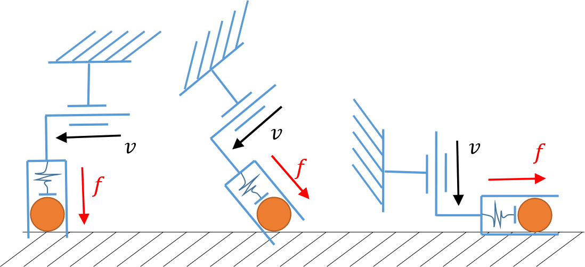

> Code: [yifan-hou/force_control](https://github.com/yifan-hou/force_control) · local snapshot [code/](code/README.md) (`460bc3b`) · MIT
> Paper: arXiv [1903.02715](https://arxiv.org/abs/1903.02715) · Hou Y. et al. · ICRA 2019 · 2019-03-07 · Source: [Paper.md](../sources/HybridForceVelocity/Paper.md)
> Theory: [[Admittance Control Literature Review]]

> [!abstract] Overview
> ## What the Controller Does

`AdmittanceController` is an outer loop for a stiff, position-controlled arm with a wrist F/T sensor.
Every tick it takes the measured TCP pose and contact wrench, plus a reference pose and a reference wrench, and returns the next pose command.
The six tool axes (three translations, three rotations about the TCP) are split into two kinds:

- **Compliant (force-controlled) axes** behave like a virtual mass–spring–damper $M, D, K$, anchored at the reference pose and pushed by the contact wrench plus the reference wrench.
- **Rigid (velocity-controlled) axes** follow the reference pose exactly, as stiff as the robot's own position servo, and ignore contact forces.

The split is an orthonormal $6\times6$ axis matrix $T_r$ plus the number $n_{af}$ of compliant axes, and it can change at runtime.
$n_{af}=6$ is ordinary 6-D admittance control (hand guiding, compliant tracking); $n_{af}=0$ is a pass-through position controller.
The ICRA'19 paper is the theory for choosing that split for a contact task; this library is the executor it ran on.

You supply pose streaming at $1/\Delta t$ (500 Hz by default) and a wrench at the TCP with bias and tool gravity already removed.
The library does no filtering and no gravity compensation.

---

> [!fact] Control Law
> ## One Tick of `step()`

With a diagonal $K, D, M$ and a $T_r$ that only permutes axes, every axis is an independent 1-D system.
Along a compliant axis $i$:

$$ M_i\,\dot v_i = \operatorname{clip}\big(K_i\,e_i\big) - D_i\,v_i + \operatorname{dz}_{s_i}\big(f_{ext,i} + f_{ref,i}\big) + \text{PID}_i\big(f_{ext,i} + f_{ref,i}\big) $$

Along a rigid axis $j$:

$$ v_j = \frac{e_j}{\Delta t} $$

Then both kinds of axis are integrated from the **measured** pose:

$$ x_{cmd} = x_{meas} + v\,\Delta t $$

| Symbol | Meaning |
|---|---|
| $e$ | Pose error from the current tool to the spring anchor: position, then rotation vector, in the tool frame |
| $v$ | Controller's internal twist (the virtual body's velocity), carried from tick to tick |
| $f_{ext}$ | Measured wrench **on the tool by the environment** |
| $f_{ref}$ | Wrench the tool should apply **on the environment** |
| $\operatorname{clip}$ | Norm cap on the spring force and spring torque ($f_{max}$, $\tau_{max}$) |
| $\operatorname{dz}_s$ | Dead-zone: zero if $\lvert\cdot\rvert < s$, unchanged otherwise |

Consequences worth remembering:

- $f_{ext} + f_{ref} = 0$ exactly when the tool applies $f_{ref}$ on the environment, so the force term is a force *error*.
- The damper acts on the tool's absolute velocity $v$, not its velocity relative to the reference.
- Position resets to the measurement every tick, while velocity lives inside the controller; the virtual dynamics hold only as long as the arm tracks each command.
- A rigid axis closes its whole error in one tick (deadbeat), so a jump in the reference becomes a jump in the command.

In the general case the axes couple through $\dot V_{T_r} = (T_r M T_r^{-1})^{-1} S_f\,\mathcal{F}_{T_r}$, where $S_f$ selects the first $n_{af}$ rows.
The code is [admittance_controller.cpp:242-382](code/src/admittance_controller.cpp).

---

> [!quote] Definition
> ## Tunable Parameters

| Symbol | Config key | Units (trans / rot) | Physical meaning | README |
|---|---|---|---|---|
| $M$ | `compliance6d.inertia` | kg / kg·m² | Virtual mass that contacts and your hand feel | 5 / 0.005 |
| $D$ | `compliance6d.damping` | N·s/m / N·m·s/rad | Viscous drag on the tool's absolute velocity | 2 / 0.2 |
| $K$ | `compliance6d.stiffness` | N/m / N·m/rad | Spring pulling the tool back to the reference pose | 100 / 1 |
| $s$ | `compliance6d.stiction` | N / N·m | Force errors smaller than $s$ are ignored | 0 |
| $f_{max}$, $\tau_{max}$ | `max_spring_force_magnitude`, `max_spring_torque_magnitude` | N / N·m | Cap on the spring's pull; 0 means no cap | 50 / 4 |
| $K_P$ | `direct_force_control_gains.P_trans`, `P_rot` | – | Extra proportional gain on the force error | 0 |
| $K_I$, $I_{lim}$ | `I_trans`, `I_rot`, `direct_force_control_I_limit` | per tick / N | Integral of force error, with its running sum clamped to $\pm I_{lim}$ | 0 |
| $K_D$ | `D_trans`, `D_rot` | per tick | Gain on the tick-to-tick change of force error | 0 |
| $\Delta t$ | `dt` | s | Assumed loop period used to integrate the virtual dynamics | 0.002 |
| $T_r$, $n_{af}$ | runtime | – | Axis directions; the first $n_{af}$ rows are compliant | $I$, 0 |
| $x_{ref}$ | runtime | pose | Spring anchor on compliant axes, exact target on rigid axes | – |
| $f_{ref}$ | runtime | N / N·m | Wrench to apply on the environment, in $T_r$ coordinates | 0 |

- $K$, $D$, $M$ are $6\times6$ matrices in the tool frame. The YAML file only holds diagonals; `setStiffnessMatrix` and `setDampingMatrix` take full matrices at runtime. **$M$ cannot be changed after `init()`.**
- Every rotation is about the TCP, so **the TCP is the centre of compliance**. With the TCP at the contact point (a peg tip), a sideways push translates the tool; with the TCP at the flange, the same push also tilts it.
- At lever arm $r$, a rotational value feels like the translational value $X_{rot}/r^2$ (for $K$, $D$ and $M$ alike). The README's $K_{rot}/K = 0.01$ matches its translational stiffness at $r = 10$ cm.
- PID gains are per tick: the continuous equivalents are $K_I/\Delta t$ and $K_D\,\Delta t$, so changing `dt` changes the PID. The YAML loader rejects any nonzero PID gain combined with nonzero stiction.

---

> [!fact] Behavior
> ## Physical Behavior Under the Parameters

Assume the arm tracks commands perfectly and one compliant axis stands alone.
It is then the mass–spring–damper

$$ M\ddot x + D\dot x + K\,(x - x_{ref}) = f_{ext} + f_{ref} $$

with the characteristic numbers

$$ \omega_n = \sqrt{K/M}, \qquad \zeta = \frac{D}{2\sqrt{KM}}, \qquad \tau = M/D $$

#### <u>Free Space, No Spring: Hand Guiding</u>

- A steady push $F$ drives the tool at $v_\infty = F/D$, reached with time constant $\tau = M/D$.
- $M$ is how heavy the tool feels when starting and stopping; $D$ is how thick the "fluid" around it feels.
- After release, the tool coasts a further $v\,M/D$ before stopping.
- An uncorrected sensor bias $b$ makes the tool creep at $b/D$ with nobody touching it, so set $s$ just above the bias plus noise level.
- The README's first-test values ($M = 5$, $D = 0.1$) give $\tau = 50$ s, which is nearly frictionless; they are only for checking signs.
  Something like $D = 50$ N·s/m is easier to guide: a 10 N push moves the tool at 0.2 m/s, with $\tau = 0.1$ s.

#### <u>Spring to a Reference: Compliant Holding and Tracking</u>

- A steady push deflects the tool by $\Delta x = F/K$; on release it springs back and rings at $\omega_n$ if $\zeta < 1$. Critical damping is $D = 2\sqrt{KM}$.
- A moving reference is tracked with a lag of $D\,v/K$ (Situation 1 below).
- The spring cap bounds the pull at $f_{max}$. A far-away reference is then approached at no more than $f_{max}/D$, and an obstacle between the tool and the reference is pressed with no more than $f_{max}$ (plus $f_{ref}$).
- A jump in the reference on a compliant axis is smoothed by the mass–spring–damper, with bandwidth about $\omega_n$.

| README axis group | $\omega_n$ | $\zeta$ | Behavior |
|---|---|---|---|
| Translation ($K=100$, $D=2$, $M=5$) | 4.5 rad/s (0.7 Hz) | 0.045 | Very soft; rings for ~5 s after release |
| Rotation ($K=1$, $D=0.2$, $M=0.005$) | 14 rad/s (2.3 Hz) | 1.41 | Overdamped; no ringing |

#### <u>Pressing on a Surface: Force Regulation</u>

Put a compliant axis along the contact normal and set $f_{ref}$ to the desired push.

- **Approach.** In free space the tool moves toward the surface at $f_{ref}/D$ (with $K = 0$), so $D$ sets the approach speed. With the README's $D = 2$, a 5 N target means 2.5 m/s; $D = 500$ gives 1 cm/s.
- **Steady state.** In contact the tool applies

$$ f_{applied} = f_{ref} + K\,(x_{ref} - x) $$

Any spring therefore biases the force.
Either set $K = 0$ on that axis (pure force control), or anchor the reference a depth $\delta$ inside the surface and let $f = K\delta$ (stiffness control).

- **Stiction** stops correcting once the error is below $s$, which leaves a force error of up to $s$. Also, an $f_{ref}$ smaller than $s$ does nothing in free space.
- **Integral** ($K_I$, $I_{lim}$) removes a residual error from $K$ or friction, but only up to $K_I\,I_{lim}$.
- **$K_P$** only scales the force error by $(1 + K_P)$, which is the same as dividing $M$, $D$ and $K$ by $(1+K_P)$. Tune $M$ and $D$ directly instead.

#### <u>Contact Stability: Why the Virtual Mass Cannot Be Small</u>

In contact with a surface of stiffness $k_e$ (tool, sensor and arm flex included), the virtual mass and the surface form a new oscillator:

$$ \omega_c = \sqrt{k_e / M}, \qquad \zeta_c = \frac{D}{2\sqrt{k_e M}} $$

Hitting the surface at speed $v$ gives, in the undamped worst case,

$$ f_{peak} = f_{ref} + \sqrt{f_{ref}^2 + k_e M v^2} $$

so even a touch at $v = 0$ overshoots to $2f_{ref}$.
For a 5 N target on a rubber tip ($k_e = 10^4$ N/m) with $M = 5$ kg, touching down at 1 cm/s peaks at 10.5 N; at 10 cm/s it peaks at 28 N.

The arm executes each command only after its interface latency $t_d$, which costs $\omega_c t_d$ of phase at the contact frequency; 25 ms is already 90° at 10 Hz.
The contact rings or chatters unless $\omega_c$ is well below $1/t_d$.
A hard contact ($k_e \sim 10^5$ N/m) with $M = 5$ kg puts $\omega_c$ at 22 Hz, far too fast for that.
The fixes, from most to least effective:

1. Add passive compliance at the contact (rubber tip, foam, soft finger) to lower $k_e$.
2. Raise $M$ and $D$ on the contact axis.
3. Approach more slowly.

The paper's setup fits this reading: it used 2 mm of cloth on the table and a rubber-tipped rod "to introduce some passive compliance," on an ABB IRB 120 with 25 ms latency.
It blames most levering failures on "the slow response of the low level force control."

The discrete-time limits $D\Delta t/M < 2$ and $\omega_n\Delta t < 2$ rarely bind; they matter only for a very small $M$, such as a rotational $M = 10^{-4}$ with $D = 0.2$.

#### <u>Rigid Axes</u>

- A rigid axis follows the reference with the arm's full servo stiffness. Contact forces along it are ignored, so nothing limits the force if the reference drives into an obstacle.
- It is deadbeat: feed rigid-axis references interpolated at the control rate, never raw low-rate waypoints.

> [!hint] Behavior
> ## Situation Bavior under Ideal Parameters

Assuming parameters are tuned to ideal setting, ignore control delay,set tool impedance to be ($k_e = 10^4$ N/m).

| Axis role | $M$ | $K$ | $D$ | $f_{max}$ | Character |
|---|---|---|---|---|---|
| Tracking axis (Example 2) | 5 kg | 800 N/m | 126 N·s/m | 30 N | $\omega_n = 12.6$ rad/s (2 Hz), $\zeta = 1$ |
| Force axis (Example 3) | 5 kg | 0 | 500 N·s/m | – | Approach at $f_{ref}/D$; $\zeta_c = 1.1$ on the rubber tip |

#### <u>Situation 1: Tracking a Moving Goal, No Contact</u>

Set $f_{ref} = 0$ on every axis.
A nonzero $f_{ref}$ in free space is only a constant push that offsets the tool by $f_{ref}/K$.
The tool rests at $x_0$ when the goal starts moving at a constant $v$, $x_{ref}(t) = x_0 + vt$, so the tracking error $e = x_{ref} - x$ obeys

$$ M\ddot e + D\dot e + K e = D\,v, \qquad e(0) = 0, \quad \dot e(0) = v $$

At steady speed the spring must exactly balance the damper ($Ke = Dv$), so the tool trails the goal by

$$ x - x_{ref} = -\frac{D\,v}{K} = -\frac{2v}{\omega_n} $$

At $v = 0.1$ m/s:

- The tool starts with zero acceleration, because the spring has to stretch before it pulls. It reaches $v$ without overshoot in 0.47 s ($\approx 5.8\sqrt{M/K}$).
- The lag rises steadily to 15.8 mm and stays there. This is the distance the goal covers in $D/K = 0.16$ s, and it does not depend on $M$.
- The top speed is $f_{max}/D = 0.24$ m/s. A faster goal is never caught, and the lag grows without bound.
- The arm's latency $t_d$ adds a further $v\,t_d$ of real lag, and an uncompensated 1 kg tool sags by $mg/K = 12$ mm.
- The feedforward $f_{ref} = D\,v + M\,a$ (tool frame, larger than $s$) makes the damper act on the velocity error and removes the steady lag. If the tool is blocked, the feedforward becomes extra contact force.

#### <u>Situation 2: Hitting an Obstacle While Tracking</u>

The setup is Situation 1 at 0.1 m/s, and the goal keeps moving after the tool is blocked.
At contact the spring is already stretched by the lag and pulls with $Dv = 12.6$ N.

| Contact | Impact | Afterwards |
|---|---|---|
| Rubber tip, $10^4$ N/m | Rises to 25 N within 50 ms, no bounce | Follows the spring as it stretches at $Kv = 80$ N/s; holds 30 N from 0.3 s |
| Hard, $10^5$ N/m | 73 N spike at 12 ms, above $f_{max}$; bounces off twice within 0.1 s | Holds 30 N from 0.3 s |

- However far the goal runs, the steady force is $f_{max}$. The spring cap is what bounds a blocked tracking axis; the impact spike comes from the virtual mass's momentum, so the cap does not limit it.
- The stretched spring stores the goal's head start. If the obstacle gives way, the tool lunges toward the goal at up to $f_{max}/D = 0.24$ m/s.
- On a slanted obstacle, the sideways part of the spring slides the tool along it.
- On a rigid axis the contact force is ignored, and the servo pushes with full stiffness until the robot's own protective stop trips.

A software guard watches $\lVert f_{ext}\rVert$; past a threshold, it pauses the trajectory and re-anchors the reference to the measured pose, which unloads the spring.
Merely freezing the reference keeps the tool pressing with $Ke$.

#### <u>Situation 3: Moving Slowly While Regulating a Force</u>

Make the axis along the contact normal a force axis ($K_n = 0$, $D_n = 500$) and set $f_{ref} = 5$ N into the surface, larger than $s$.
Keep the sliding directions and rotations rigid, as in Example 3.
When the motion is slow enough that acceleration is negligible, the balance along the normal gives

$$ f_{applied} = f_{ref} - D_n\,v_n $$

where $v_n$ is the tool's speed along the normal, positive into the surface.

- **Approach and touchdown.** The tool descends at $f_{ref}/D_n = 1$ cm/s. The touchdown on the rubber tip is overdamped ($\zeta_c = 1.1$), so the force rises to 5 N with no overshoot. On a hard $10^5$ N/m contact ($\zeta_c = 0.35$), it peaks at 8.1 N before settling at 5 N.
- **Flat surface.** $v_n = 0$, so $f_{applied} = f_{ref}$ to within $\pm s$ from stiction; an integral gain removes that residual.
- **Tilted surface.** Following a slope $\alpha$ at sliding speed $v_t$ needs $v_n = v_t\tan\alpha$, which the damper resists. The force drops going downhill and rises going uphill.

| Sliding speed on a 20° slope | Uphill force | Downhill force |
|---|---|---|
| 0.5 cm/s | 5.9 N | 4.1 N |
| 2 cm/s | 8.6 N | 1.4 N |
| Above 2.7 cm/s | Above 10 N | 0: contact is lost, since the tool cannot descend faster than 1 cm/s |

The error shrinks in proportion to the sliding speed, which matches the paper's note that failures were rarer when the robot moved slower.

---

> [!info] Axis Selection
> ## Choosing Compliant and Rigid Axes

Rows of $T_r$ are directions in tool-twist coordinates $[v_x, v_y, v_z, \omega_x, \omega_y, \omega_z]$, compliant rows first.
$T_r$ must be orthonormal, because the same matrix maps both twists and wrenches; the library does not check this.

The paper's rules for choosing the split:

- Put a compliant axis along each direction the environment blocks. A rigid axis pointing into a constraint fights it and is infeasible (figure, right).
- Put rigid axes along the directions the task must execute precisely; they are immune to force noise and to friction.
- A rigid axis does not have to be perpendicular to the constraint (figure, middle), but the closer it is to perpendicular, the more robust the motion.
- Use as few rigid axes as the goal needs; that leaves the system less likely to jam.

<div align="center"></div>

| Task | $n_{af}$ | Compliant axes | $f_{ref}$ | Spring on compliant axes |
|---|---|---|---|---|
| Hand guiding, kinesthetic demos | 6 | all | 0 | $K = 0$ |
| Compliant tracking of a trajectory or policy | 6 | all | 0 | $K > 0$, sized from $\omega_n$ |
| Wiping, polishing, drawing | 1 | $z$ | push along $z$ | $K_z = 0$ |
| Following a surface while staying flush | 3 | $z$, $\omega_x$, $\omega_y$ | push along $z$ | $K = 0$ |
| Peg-in-hole | 5 | $x$, $y$, $z$, $\omega_x$, $\omega_y$ | push along $z$ | small $K$ laterally |
| Pure position control | 0 | none | – | – |

For each plan step, the paper's planner (from a contact model) outputs exactly this controller's inputs:

| Paper | Controller |
|---|---|
| $R_a$ (robot block of $T$, force rows first) | $T_r$, after Gram–Schmidt on the velocity rows; the force rows are already orthogonal to them |
| $n_{af}$ | $n_{af}$ |
| $\eta_{af}$ | the first $n_{af}$ entries of $f_{ref}$ |
| $w_{av}$ | integrated into $x_{ref}$ over the step, since the controller tracks poses, not velocities |

The paper's examples model a point hand, so $R_a$ fills the translational block of $T_r$; it is written in the world frame, so rotate it into the tool frame first.
Its results are 47/50 on block tilting and about 2/3 of ~20 levering runs.
It never evaluates the force controller on its own.

---

> [!info] Python
> ## Using the Controller from Python

The binding is designed for Python, not as a one-to-one copy of the C++ class.
It hides the C++ ordering and frame conventions that are easy to get wrong:

- Poses are $4\times4$ homogeneous matrices. The C++ `Vector7d` is `[x y z qw qx qy qz]`, scalar-first, while SciPy's quaternions are scalar-last.
- Wrenches are in the tool frame. The binding converts the target wrench to $T_r$ coordinates, and it can move the measured wrench from the sensor frame to the TCP.
- Axes are given by name or direction, and the binding builds and checks the orthonormal $T_r$.
- An axis change is queued and applied right after the next C++ `step()`, which is the order C++ requires.
- Errors raise exceptions instead of returning `false` or blocking on `getchar()`.

| Python | Meaning |
|---|---|
| `Compliance(stiffness, damping, inertia, stiction)` | Each is a (6,) diagonal or a (6, 6) matrix on tool axes `[x y z rx ry rz]`, SI units |
| `Compliance.isotropic(stiffness=(k, k_rot), ...)` | The same, built from (translational, rotational) pairs |
| `Config(dt, compliance, max_spring_force=0, max_spring_torque=0, force_pid=None, sensor_in_tool=None)` | Validated on construction and raises `ValueError`; `sensor_in_tool` is $X_{TS}$ for the wrench transform |
| `Config.from_yaml(path)` | Reads the README's YAML layout |
| `Axes.compliant("z", "rx", ...)` | The named tool axes are compliant and the rest rigid; `Axes.compliant()` is fully rigid |
| `Axes.compliant_along(d1, d2, ...)` | Arbitrary (6,) twist directions, orthonormalized and completed to a full $T_r$ |
| `Axes.from_matrix(Tr, n_af)` | A raw $T_r$, checked for orthonormality |
| `RIGID`, `ALL` | No compliant axes, and all six compliant |
| `AdmittanceController(config, X_WT, axes=RIGID)` | Wraps `init()`; the reference starts at `X_WT` and the target wrench at zero |
| `ctrl.step(X_WT, wrench) -> X_cmd` | One tick: measured TCP pose and wrench **on the tool by the environment** in, pose command out |
| `ctrl.reference` | (4, 4) world pose: spring anchor on compliant axes, target on rigid axes |
| `ctrl.target_wrench` | (6,) wrench the tool applies **on the environment**, tool frame |
| `ctrl.axes` | Assigning queues the switch for the next tick |
| `ctrl.stiffness`, `ctrl.damping` | (6,) or (6, 6), applied from the next tick |
| `ctrl.reset(X_WT)` | Re-runs `init()` at `X_WT`, with axes back to `RIGID` (the C++ `reset()` is not linkable) |

In the examples, `arm`, `ft` and `rate` stand in for your robot driver, F/T driver and a fixed-rate timer at $1/\Delta t$.

#### <u>Example 1: Hand Guiding for Demonstrations</u>

```python
cfg = Config(
    dt=0.002,
    compliance=Compliance.isotropic(
        stiffness=(0.0, 0.0),
        # 10 N -> 0.2 m/s; 1 N m -> 1 rad/s
        damping=(50.0, 1.0),
        inertia=(5.0, 0.01),
        # just above sensor noise: no drift
        stiction=(1.0, 0.1),
    ),
)
ctrl = AdmittanceController(cfg, arm.tcp_pose(), axes=ALL)

demo: list[Mat4] = []
while teaching:
    X = arm.tcp_pose()
    arm.servo(ctrl.step(X, ft.wrench()))
    demo.append(X)
    rate.sleep()

# freeze in place: re-anchor BEFORE going rigid
ctrl.reference = arm.tcp_pose()
ctrl.axes = RIGID
```

#### <u>Example 2: Compliant Tracking of a Low-Rate Policy</u>

```python
cfg = Config(
    dt=0.002,
    compliance=Compliance.isotropic(
        # w_n = sqrt(800/5) = 12.6 rad/s (2 Hz)
        stiffness=(800.0, 10.0),
        # zeta = 1; lag at 0.1 m/s = 16 mm
        damping=(126.0, 0.63),
        inertia=(5.0, 0.01),
    ),
    # bounds the push if the policy aims into things
    max_spring_force=30.0,
    max_spring_torque=3.0,
)
ctrl = AdmittanceController(cfg, arm.tcp_pose(), axes=ALL)

t0 = rate.now()
while running:
    # policy at ~10 Hz; sample its spline at 500 Hz
    ctrl.reference = traj.pose_at(rate.now() - t0)
    arm.servo(ctrl.step(arm.tcp_pose(), ft.wrench()))
    rate.sleep()
```

#### <u>Example 3: Touch Down and Wipe with 5 N</u>

The tool $z$ axis points into the table; everything else stays rigid and follows the path.

```python
def tick() -> None:
    arm.servo(ctrl.step(arm.tcp_pose(), ft.wrench()))
    rate.sleep()

# cfg fixes M_z: heavy enough for this contact
ctrl = AdmittanceController(cfg, arm.tcp_pose())

# only the z entries matter; the rest is rigid.
# K_z = 0: pure force. D_z = 500: 5 N -> 1 cm/s
ctrl.stiffness = np.zeros(6)
ctrl.damping = np.array([0, 0, 500.0, 0, 0, 0])
ctrl.target_wrench = np.array([0, 0, 5.0, 0, 0, 0])
ctrl.axes = Axes.compliant("z")

# approach is the same mode: descend until contact
while ft.wrench()[2] > -4.0:
    tick()

# wipe: rigid x, y and orientation follow the path,
# which must start at the touchdown pose (deadbeat);
# z keeps regulating 5 N (reference z is ignored)
for X_ref in wipe_path.sample(dt=cfg.dt):
    ctrl.reference = X_ref
    tick()

# lift off: drop the force, re-anchor, go rigid
ctrl.target_wrench = np.zeros(6)
ctrl.reference = arm.tcp_pose()
ctrl.axes = RIGID
```

For a plan from the paper's solver, set `ctrl.axes = Axes.from_matrix(Tr, n_af)` and `ctrl.target_wrench = Tr.T @ eta` once per plan step (`eta` holds $\eta_{af}$, zero-padded to 6).
Then stream the integrated $w_{av}$ motion through `reference` every tick.

`dt` is fixed inside the controller, so Python timing jitter makes the effective $M$ and $D$ fluctuate (see Pitfalls).
If the loop cannot hold its rate, use `dt = 0.004` (250 Hz), or run the loop in a C++ thread and expose only the property setters to Python.

---

> [!warning] Pitfalls
> ## Pitfalls and Code Defects

**Operational**

- The wrench passed to `setRobotStatus` must be the wrench **on the tool by the environment**, in the tool frame, about the TCP. A flipped sign is positive feedback, and the arm runs away. Use the README's first test: make one translational axis compliant, push it by hand, and check that it follows.
- `dt` must equal the real loop period $T$. If $T > \Delta t$, the tool feels heavier and more damped: effectively $M(T/\Delta t)^2$ and $D\,T/\Delta t$. Rigid axes are unaffected, because their $\Delta t$ cancels.
- Rigid axes are deadbeat and ignore force (see Behavior).
- Validation runs only in the YAML loader, so a config built in code is unchecked; the binding should run the same checks.
- There is no runtime inertia setter, and YAML accepts diagonal $K$, $D$, $M$ only.

**Defects in the snapshot** (found by reading the code; defect 1 also checked numerically)

1. **Switching axes can make the arm jump.** `setForceControlledAxis` composes the new anchor offset in the wrong order (`src/admittance_controller.cpp:178`). `step()` applies it on the right of the reference ($X_{ref}\,\Delta$), but the setter solves for it on the left.
   The two agree when the reference equals the current pose, which is why the README flow (switch right after `init()`) works.
   In a NumPy replay, the tool pointed down and was hand-guided 5 cm in $y$ and 20 cm in $z$ away from an unchanged reference, then switched to `RIGID`. The next `step()` saw a 0.41 m error, which rigid axes close in one tick.
   The workaround is the one in the examples: set `reference` to the measured pose on the tick before switching. The fix:

   ```cpp
   SE3_TrefTadj = RUT::SE3Inv(SE3_WTref) * SE3_WT *
                  RUT::spt2SE3(spt_TTadj_new);
   ```

2. **The axis-switch projection uses the old $T_r$.** `m_anni` and the integrator projection (lines 174–182) are computed before `Tr = Tr_new` (line 184). When $T_r$ itself changes, not just $n_{af}$, error is left on the new rigid axes and closed in one tick. The fix is to move the `Tr`/`Tr_inv` assignment to the top of the function.
3. **The public `reset()` is declared but never defined.** Only `Implementation::reset()` exists, so calling or binding it fails at link time. The binding re-runs `init()` instead.
4. **A NaN blocks the thread.** `step()` and `setForceControlledAxis()` wait on `getchar()` when a NaN appears, so the arm stops receiving commands. Remove the wait (return `false` or throw) before binding.
