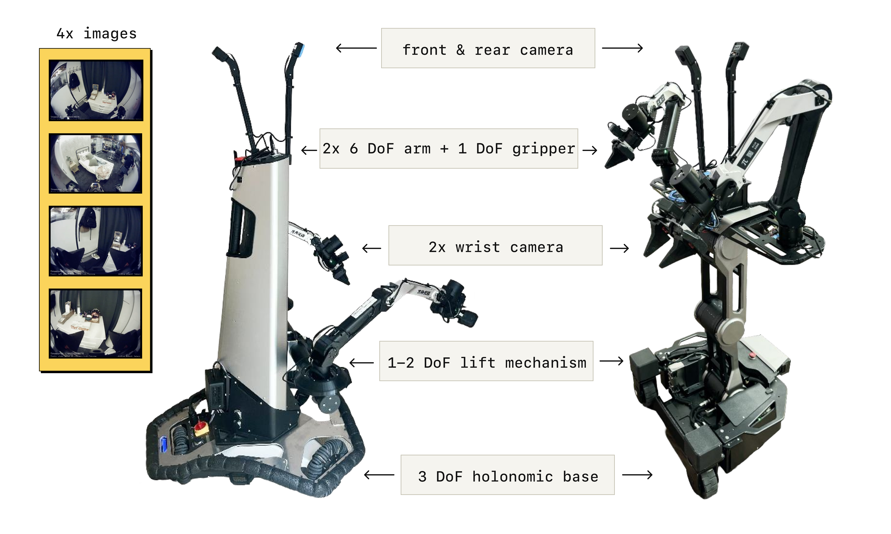

# π0.5: Boundary of a Generalist VLA — A Capability Cheat Sheet

> arXiv: [2504.16054](https://arxiv.org/abs/2504.16054) · Physical Intelligence (Black, Brown, Levine et al.) · arXiv preprint · 2025-04
> Project: [pi.website/blog/pi05](https://pi.website/blog/pi05) · Source: [Paper.md](sources/Pi0.5/Paper.md)

> [!abstract] Cheat Sheet
> ## TL;DR — Where π0.5's Ability Ends

π0.5 is a **flow-matching VLA co-trained on heterogeneous data** so a *single frozen checkpoint* generalizes to **entirely new homes** — kitchens/bedrooms never in training — and runs 10–15 min multi-stage cleaning tasks from a high-level prompt. The generalization is real but **bounded on four axes**, and this note is about those four boundaries:

| Question | Short answer |
| --- | --- |
| **Benchmark-aware?** (LIBERO / RoboCasa / RoboTwin) | **No.** π0.5 is trained on Physical Intelligence's own real-robot + web data. The benchmark checkpoints ($\pi_{\text{RLinf}}$, RLDX-1, LingBot-VLA) are *separate re-trainings on those embodiments* — base π0.5 does not run on a LIBERO Franka out of the box. |
| **New env, new objects, same embodiment, follow language?** | **Yes, zero-shot** — this is the headline. New homes need **no per-environment fine-tune**; new object *categories* are handled via web-data co-training (~94% OOD object-follow rate). |
| **Per-environment or per-task fine-tune?** | **Neither, within its embodiment.** But reaching that generality *required* ~100 training environments + the full co-training mixture. A **new embodiment** (different arm/robot) needs a fresh **post-training** stage on that platform's data. |
| **How complex can the instruction be?** | Hierarchical: it decomposes moderately abstract commands ("clean the kitchen") into *known* subtasks. Prompt complexity is **capped by annotation diversity** — self-admitted "relatively simple prompts," no complex preferences, conditional logic, or memory. |

The one-line takeaway: **π0.5 removed the *per-scene* fine-tuning boundary, not the *per-embodiment* one.** Its native body is a mobile bimanual manipulator; everything the harness/steering papers do with "$\pi_{0.5}$" is on a *re-trained* checkpoint for a different robot.

---

> [!fact] Framework Details
> ## Architecture & Recipe — the parts that *set* the boundary

Only the design decisions that determine what π0.5 can/can't do are worth keeping; the flow-matching backbone itself is inherited from $\pi_0$ — see [[Literature Review on Flow-Based RL Policy]] and the [[SAPS Literature Review]] (which steers this same $\pi_{0.5}$ family at the action level).

Symbols:

| $\mathbf{o}_t=[\mathbf{I}^1_t,\dots,\mathbf{I}^n_t,\mathbf{q}_t]$ | $\ell$ | $\hat{w}$ | $\mathbf{a}_{t:t+H}$ | $\tau$ | $\omega$ |
| --- | --- | --- | --- | --- | --- |
| Observation: all camera images + robot config (joints, gripper, torso lift, base velocity) | High-level task prompt ("put away the dishes") | Predicted **semantic subtask** text ("pick up the plate") | Action chunk, horizon $H$ | Flow-matching time index | Noise sample $\sim\mathcal{N}(0,\mathbf{I})$ |

#### <u>Hierarchical Inference — the key factorization</u>

The whole model is one transformer, but its distribution factorizes so the **action head never sees the raw prompt** — only the predicted subtask:

$$
\boxed{\;\pi_\theta(\mathbf{a}_{t:t+H},\,\hat{w}\mid \mathbf{o}_t,\ell)=\underbrace{\pi_\theta(\mathbf{a}_{t:t+H}\mid \mathbf{o}_t,\hat{w})}_{\text{low-level, embodiment-bound}}\;\cdot\;\underbrace{\pi_\theta(\hat{w}\mid \mathbf{o}_t,\ell)}_{\text{high-level, semantic}}\;}
$$

At runtime: autoregressively decode $\hat{w}$ (like chain-of-thought), then **10 denoising steps** of flow matching produce $\mathbf{a}_{t:t+H}$ conditioned on $\hat{w}$. This split is *why* the two boundaries differ — semantic grounding lives in the high-level text channel (benefits from web data), while low-level control is tied to the training embodiment.

#### <u>Hybrid Discrete + Continuous Actions</u>

Pre-training represents actions as **discrete FAST tokens** (fast, scalable next-token training); post-training adds a **flow-matching action expert** for fine-grained, real-time control. The two representations are masked from attending to each other. The combined objective jointly minimizes cross-entropy on text/FAST tokens and the flow-matching MSE:

$$
\mathbb{E}_{\mathcal{D},\tau,\omega}\Big[\,H\big(x_{1:M},f^\ell_\theta(\mathbf{o}_t,\ell)\big)+\alpha\big\|\omega-\mathbf{a}_{t:t+H}-f^a_\theta(\mathbf{a}^{\tau,\omega}_{t:t+H},\mathbf{o}_t,\ell)\big\|^2\Big]
$$

Setting $\alpha=0$ gives pure-VLM pre-training (280k steps); $\alpha=10$ turns on the action expert in post-training (80k steps). The paper credits the **discrete-token pre-training for π0.5's strong language-following** over pure-diffusion $\pi_0$.

#### <u>The Co-training Mixture — 97.6% is *not* the target task</u>

The boundary is set by what's in the data. Six sources; only the first is the deployment target:

- **MM** — Mobile Manipulator household data: ~**400 hours**, ~100 homes. *Only 2.4% of phase-1 examples.*
- **ME** — Multi-Environment non-mobile arms (different embodiment, wider scene diversity).
- **CE** — Cross-Embodiment lab data (single/dual-arm, static/mobile) + OXE.
- **HL** — High-Level subtask annotations (decompose "clean the bedroom" → "pick up pillow").
- **WD** — Web Data: captioning, VQA, object localization/bounding boxes.
- **VI** — Verbal Instructions (post-training only): humans "teleoperate with language," demonstrating good subtask outputs.

---

> [!hint] Experimental Results
> ## What It Can Do · What It Needs · Where It Breaks

#### Can generalize to new homes — *without* per-environment data

Evaluated in **three real homes never seen in training** (plus reproducible mock rooms), π0.5 completes multi-stage tasks — dishes in sink, items in drawer, laundry basket, make bed — from a single high-level prompt, with the high-level channel autonomously emitting subtasks. This is the core claim: **the per-scene fine-tuning boundary is gone.**

#### But generalization *scales with environment count* — and needs the full recipe

Task progress climbs from **~14% (3 locations) → ~86% (104 locations)**, *matching* a control trained directly on the test homes (green dashed). Critically, the two **no-pre-training** baselines collapse (~39% and ~5%) — so the generalization is **not** from mobile data volume alone; it *requires* the cross-embodiment + web co-training. The boundary here: you need **breadth of environments** and the mixture, not just more of the target task.

#### Follows language & handles novel objects — web data carries the OOD

On a 5-object counter where a non-understanding policy scores ~20%, full π0.5 hits **~86% in-distribution / ~94% OOD** object-selection. **Web data is what buys OOD object categories** (removing it hits OOD specifically); ME/CE data matter across the board (removing ME drops OOD follow to ~33%). So the "different objects, same arm, follow the prompt" question is a **yes** — and the mechanism is web-data semantic transfer into the high-level channel.

#### High-level inference is the semantic ceiling — and robot-tuned beats GPT-4

Ablating the high-level policy (all share the full low-level): full π0.5 HL **beats even a human "oracle" HL**; the second-best is **implicit HL** (HL data in training but no explicit inference at runtime) — so most of the benefit is already in the *co-training*, not the runtime decomposition. **Zero-shot GPT-4 as HL is the *worst*** — a general LLM without robot grounding underperforms, and the small **VI set (~11% of HL mobile examples) is critical**. Boundary implication: the semantic planner *must* be trained on robot data; you can't bolt on a frontier LLM and match it. (Contrast this with the [[RPent Literature Review|Harness VLA]] approach, which does exactly the opposite — a frozen frontier LLM plans, the frozen VLA only does contact.)

#### vs. $\pi_0$

π0.5 significantly outperforms $\pi_0$ and an enhanced $\pi_0$-FAST+Flow on the mock-home tasks, holding even when $\pi_0$ trains to 300k steps — FAST-token training is more compute-efficient than pure diffusion.

> [!info] Implementation Tricks
> ## Discrete Design Decisions

- **Action head is prompt-blind by construction.** $\mathbf{a}$ depends only on the *predicted subtask* $\hat{w}$, never on $\ell$. This is what lets the high-level channel absorb all semantic generalization (web data) while the low-level stays a stable embodiment specialist.
- **Discrete pre-train → continuous post-train.** The action expert is randomly initialized and only added at post-training; pre-training is pure next-token FAST — credited for the language-following edge.
- **Language as a supervision modality (VI).** Experts "teleoperate with language," labeling good subtasks for a *trained* low-level policy — a cheap, high-leverage way to fix the high-level channel.
- **Fixed max action dimension, zero-padded.** All embodiments share one action vector sized to the largest; smaller robots zero-pad — the mechanism that makes cross-embodiment co-training possible in one model.

Exact hyperparameters, data proportions, and per-task rubrics: see [arXiv HTML §IV–V and appendices](https://arxiv.org/html/2504.16054v1).

#### Where the limit sits (paper's own + flagged)

- **Prompt complexity is data-bounded.** The authors state π0.5 "processes relatively simple prompts"; complexity is set by annotation diversity — **no complex preferences, conditional/multi-step logic**, and only short high-level commands.
- **No memory / thin context.** Struggles with tasks needing cross-room navigation or remembering where things are stored.
- **Partial observability & physical hard cases.** Occluded targets (arm hiding a spill), unfamiliar drawer handles, physically hard cabinets; high-level inference can get **distracted** (opening/closing a drawer repeatedly).
- **Embodiment lock-in (the boundary for benchmark work).** Native body is an 18–19 DoF mobile bimanual manipulator. Any single-arm tabletop benchmark (LIBERO, RoboCasa, RoboTwin) needs a **re-trained checkpoint** — which is precisely why the harness/steering papers use $\pi_{\text{RLinf}}$/RLDX-1/LingBot-VLA, *not* the released π0.5.
- **Reproducibility caveat.** The real-home evaluation data and the full training mixture are **proprietary/unreleased** — the generalization headline cannot be independently reproduced, though base weights are available via `openpi`.

---

> [!fact] Reflection
> ## My Read

---
