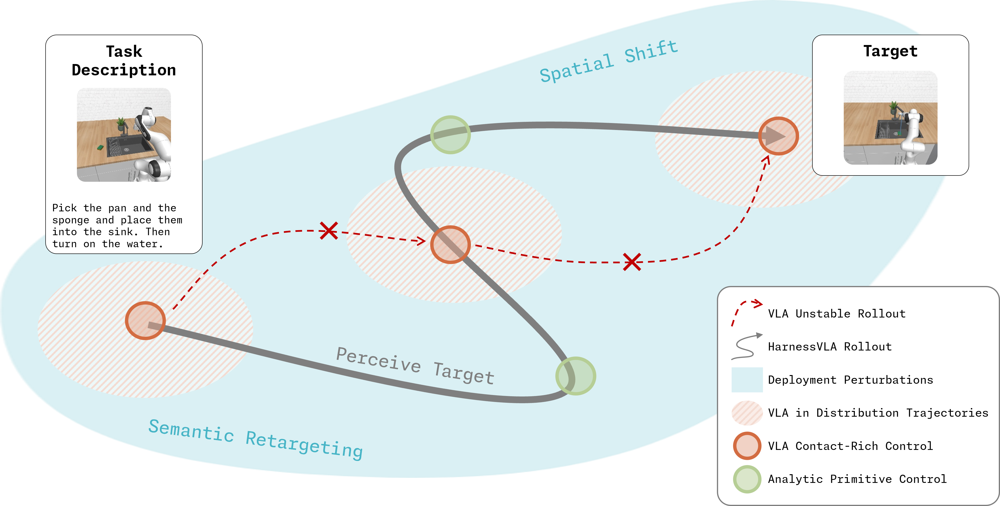
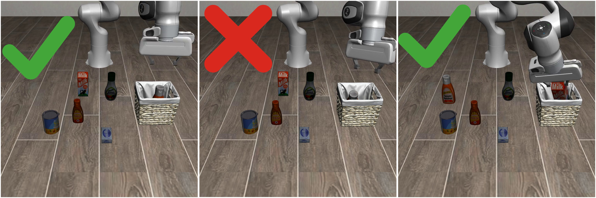
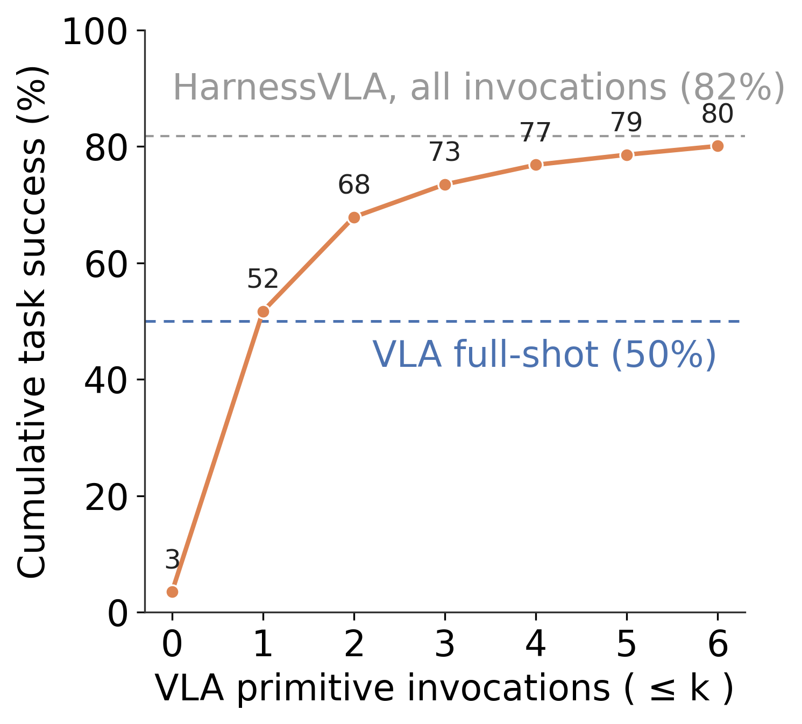
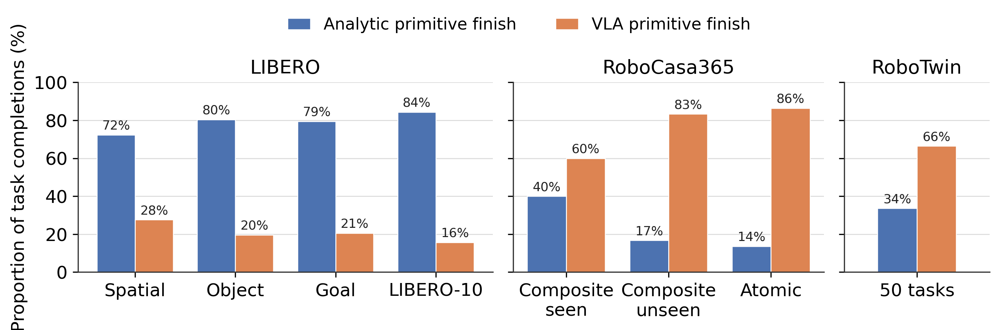

# Harness VLA: Steering Frozen VLAs into Reliable Manipulation Primitives via Memory-Guided Agents

> arXiv: [2607.08448](https://arxiv.org/abs/2607.08448) · Yixian Zhang, Huanming Zhang et al. · arXiv preprint · 2026-07
> Project: [harnessvla.github.io](https://harnessvla.github.io/) · Code: [RLinf/RPent](https://github.com/RLinf/RPent)
> Source: [Paper.md](sources/RPent/Paper.md)

> [!abstract] Overview
> ## TL;DR — A Frozen VLA as One Retryable Primitive

Harness VLA wraps a **frozen** VLA as a single contact-rich primitive, <u><strong style="color:#a0399f">vla_act</strong></u>, and lets an LLM planner compose it with a small **fixed** library of analytic primitives (move, rotate, grip, release, navigate). Semantic re-grounding, transport, staging, and re-staging move up to the planner; the VLA is invoked only for local contact-rich phases. Two memory modules — per-task success traces and a global rule/failure store — teach the planner *how to orchestrate* the fixed primitives rather than expanding the skill set. Without any VLA fine-tuning, it beats the strongest baselines by $38.6$ and $25.4$ points on LIBERO-Pro and RoboCasa365, and reaches $58.4\%$ on RoboTwin C2R.

<div align="center"></div>

---

> [!info] Introduction
> ## The Wrong-Responsibility Problem

Two paradigms attack language-conditioned manipulation from opposite ends, and each overloads the wrong component. **End-to-end VLAs** absorb language grounding, long-horizon composition, and low-level control into one policy — strong at contact, brittle when instructions are redirected, goals re-bound, or layouts shifted. **LLM coding agents** reason well but realize physical contact through hand-designed analytic APIs that fail at irregular grasping and articulated objects. 

Harness VLA's response: keep the primitive library **fixed and small**, use analytic primitives to traverse the perturbed non-contact space, and invoke the frozen VLA *only* inside local contact-rich regions where its training distribution is informative.

<div align="center"></div>

---

> [!fact] Framework Details
> ## Methodology

The system is an autoregressive, turn-based loop between a planner $\Pi$ and a physics engine. Every low-level mechanism — the frozen VLA $f_\theta$ *and* all deterministic operational-space controllers — is unified into one predefined primitive library $\mathcal{P}$; the planner never emits torques or action chunks, only a primitive choice with bound arguments.

Symbols:

| $\mathcal{E}$                  | $o_t=(I_t^{\text{rgb}},I_t^{\text{d}},q_t)$        | $\ell$        | $\mathcal{G}$               | $\Pi$                     | $f_\theta$            | $\mathcal{P}$     | $c_t$                            | $\tau$                           | $\pi_{\text{RLinf}}$                                |
| ------------------------------ | -------------------------------------------------- | ------------- | --------------------------- | ------------------------- | --------------------- | ----------------- | -------------------------------- | -------------------------------- | --------------------------------------------------- |
| Environment (MuJoCo/Robosuite) | Observation: RGB, co-aligned depth, proprioception | Task language | Binary completion predicate | Agentic planner (the LLM) | Frozen pretrained VLA | Primitive library | Primitive invocation at turn $t$ | `vla_act` early-return predicate | Frozen $\pi_{0.5}$ checkpoint used inside `vla_act` |

#### <u>Agentic Execution Loop</u>

At each turn the planner reads the observation, task language, and retrieved memory, then emits one JSON primitive; the engine runs it to its internal post-condition and returns the next observation. The loop is, schematically:

$$
c_t=\Pi\!\left(o_t,\;\ell,\;\text{TSM},\;\text{GM}\right),\qquad
o_{t+1}=\mathcal{E}(c_t),\qquad
\text{until } \mathcal{G}=1 \text{ or budget exhausted}
$$

where $\text{TSM}$ is Task Specific Memory and $\text{GM}$ is Global Memory. The planner sees only serialized observations — never privileged simulator state or oracle object poses — which keeps every rollout auditable.

#### <u>The vla_act Contact Primitive</u>

`vla_act` is the sole learned call. The planner supplies a task-conditioned prompt and an early-return predicate $\tau$; the frozen $f_\theta$ then emits action chunks until $\tau$ fires or the chunk budget is hit:

$$
\texttt{vla\_act}(\text{prompt},\tau):\quad f_\theta \text{ emits chunks } A_1, A_2, \ldots \text{ until } \tau=1 \ \lor\ \text{chunks}=\text{max\_chunks}
$$

This keeps the VLA a **local contact specialist** (grasping, constrained placement, fixture actuation) while grounding, spatial re-binding, navigation, and long-horizon composition stay with the planner. The full JSON contract exposes six analytic primitives plus `vla_act` (RoboCasa365 adds two mobile-base primitives):

```json
{"action": "move_to",      "xyz": [x, y, z]}
{"action": "move_pose",    "xyz": [x, y, z], "pose": "orientation"}
{"action": "rotate_wrist", "target_yaw": 0.0}
{"action": "set_gripper",  "gripper": "open|close"}
{"action": "release"}
{"action": "vla_act",      "prompt": "grasp the black bowl", "max_chunks": 2, "stop": "predicate"}
```

#### <u>Primitive Coordinates are World-Frame Metres</u>

A crucial and easily-missed detail: the `xyz` in `move_to` / `move_pose` is a <u><strong style="color:#a0399f">world-frame metric target</strong></u> $(x,y,z)$ **in metres** — *not* a pixel or camera-frame $(\text{col},\text{row},\text{depth})$. The scripted servo computes `diff = target − eef_pos` against the proprioceptive end-effector position $q_t[{:}3]$ ([`robots/libero/tools.py:304`](https://github.com/catr1xLiu/RPent/blob/06bbb24/robots/libero/tools.py#L304)), so primitive targets and $q_t$ share **one frame**: robot/world metres. All rotation primitives match — `rotate_wrist` is world $z$-yaw, `rotate_pitch` is world $x$-axis.

But the planner never *reasons* in metres. It perceives in **pixels** and crosses the gap with an explicit deprojection:

$$
\underbrace{(\text{col},\text{row})}_{\text{camera pixel}} \;\xrightarrow{\;\texttt{back\_project}\;(K^{-1},\,\text{depth},\,\text{calib})\;}\; \underbrace{(x,y,z)}_{\text{world metres}}
$$

So the JSON `xyz` is always the *output* of `back_project` on a chosen pixel — segment an object → pick pixels → back-project through depth+calibration → feed the world point to `move_to`. 

#### <u>Two-Phase Agent Lifecycle</u>

The heart of the method is not exposing `vla_act` but *learning when and how to use it* — done by populating memory during a bootstrapping phase, then executing under a strict regime. Note that "**learn**" here means **memory population from a single reference seed**, not any gradient update — no parameters are trained. Expressed as fake Python:

```python
def bootstrap(task: Task, env: Env) -> None:
    '''
    Exploratory phase. The reset primitive is ENABLED and the
    wall-clock budget is generous. The planner trials staging
    orders, pre-contact poses, vla_act timing, and early-return
    thresholds, correcting course after each observed failure.
    '''
    while not solved:
        c: Command = planner.propose(obs, task, TSM, GM)
        obs = env.execute(c)
        planner.observe(obs)
    # On success, abstract the run into the two memories.
    # TSM stores a JSONL trace with concrete xyz replaced by
    # symbolic perception queries; GM appends success rules and
    # failure models such as empty-grasp detection.
    TSM.write(parameterize(trace))
    GM.append(success_rules, failure_models)


def deploy(task: Task, env: Env) -> None:
    '''
    Evaluation phase. The reset primitive is DISABLED and the step
    budget is short. The planner retrieves the stored skeleton and
    re-grounds every spatial argument from the live RGB-D frame.
    '''
    trace: list[Command] = TSM.retrieve(task)
    for step in trace:
        c: Command = planner.reground(step, obs, GM)
        obs = env.execute(c)
```

Task Specific Memory stores a **parameterized** JSONL trace — a task-level *solution skeleton* (primitive ordering and VLA-invocation points), with concrete coordinates replaced by symbolic perception queries so it re-grounds across layouts. Global Memory holds cross-task <u><strong style="color:#a0399f">success rules</strong></u> and <u><strong style="color:#a0399f">failure models</strong></u> (e.g. "if the gripper closes but the object does not move, treat as an empty grasp and re-stage"; "do not terminate from visual proximity alone — check the benchmark success signal").

> [!info] Implementation Tricks
> ## Discrete Design Decisions

Project-specific choices that are not standard practice, and that shape the results:

- **Symbolic re-grounding of traces.** Stored coordinates are treated as reference-scene bindings only; the deployment planner is explicitly told *not to reuse reference `xyz` values* and must re-ground from the current observation. This is what lets one reference seed generalize across spatial perturbations.
- **Asymmetric phase privileges.** The `reset` primitive exists **only** during bootstrapping and is fully disabled at deployment; the step budget is also sharply shortened at deployment. Reported numbers come only from the strict phase.
- **Failure models as negative memory.** Empty-grasp and false-success detections are stored as explicit constraints, not just discarded — the planner is steered away from known pitfalls across tasks.
- **Sparse, retryable VLA bursts.** `vla_act` runs in short chunk-bounded bursts with an early-return predicate rather than as a continuous controller, making each contact attempt individually re-stageable.

Hyperparameters, seed protocols, and per-benchmark splits are not reproduced here — see [arXiv appendices C–F](https://arxiv.org/abs/2607.08448).

Related methods are linked rather than re-explained: flow-matching VLA backbones ($\pi_0$/$\pi_{0.5}$) — see [[Literature Review on Flow-Based RL Policy]]; policy-steering / shared-autonomy framing — see [[SAPS Literature Review]] (which steers the same $\pi_{0.5}$ family at the action level); Code-as-Policies program synthesis ([Liang et al. 2023](https://arxiv.org/abs/2209.07753)); and the coding-agent harness lineage (SWE-agent, OpenHands, CodeAct).

---

> [!hint] Experimental Results
> ## Experiments & Key Findings

Two regimes: **few-shot** (bootstrap on one reference seed, store to TSM, re-ground under perturbations) and **zero-shot** (no target-setting memory retrieval). `vla_act` is instantiated with a benchmark-specific frozen policy behind a unified interface: $\pi_{\text{RLinf}}$ for LIBERO/LIBERO-Pro, RLDX-1 for RoboCasa365, LingBot-VLA for RoboTwin C2R. **CC** = Claude Code planner; **Codex** = Codex planner (same harness, different backbone).

#### Headline Benchmark Results

| Benchmark | Metric | Strongest baseline | Harness (Codex) | Harness (CC) | Gain |
| --- | --- | --- | --- | --- | --- |
| **Standard LIBERO** | overall SR | $\pi_{\text{RLinf}}$ $95.3$ | — | $96.0$ | preserves (+0.7) |
| **LIBERO-Pro** | overall SR | RATS $43.8$ | $72.1$ | $\mathbf{82.4}$ | **+38.6** vs RATS |
| **RoboCasa365** | task-weighted SR | RLDX-1 $30.0$ | $\mathbf{55.4}$ | $48.6$ | **+25.4** vs RLDX-1 |
| **RoboTwin C2R** | SR (zero-shot transfer) | LingBot-VLA $50.4$ | $58.0$ | $\mathbf{58.4}$ | +8.0 |

The direct $\pi_{\text{RLinf}}$ baseline reaches only $50.0\%$ on LIBERO-Pro under the same protocol, so the LIBERO-Pro gain is **not** from a stronger backbone — the same frozen checkpoint is exposed through `vla_act`. Note the headline gains cherry-pick the better planner per benchmark (CC for LIBERO-Pro, Codex for RoboCasa365); the two backbones are not uniformly ranked. Also, RATS and Cap-X report only $6$ of $8$ perturbation cells (no LIBERO-10), so the $+38.6$ compares against a reduced-cell average — not strictly like-for-like.

#### Zero-shot ablation: what memory buys

On LIBERO-Pro **Goal**, dropping Task Specific Memory retrieval isolates online reasoning from bootstrapped memory:

$$
\text{Goal-T (instruction redirect):}\ 87.0\%\ \text{few-shot} \to 79.0\%\ \text{zero-shot} \quad(\text{small drop})
$$
$$
\boxed{\text{Goal-S (position swap):}\ 87.0\%\ \text{few-shot} \to 31.0\%\ \text{zero-shot} \quad(\text{collapse})}
$$

**Semantic re-binding survives without memory; spatial perturbation does not.** Task Specific Memory's parameterized primitive organization is what carries spatially-perturbed tasks — the planner can re-bind *what* to act on from language alone, but needs the stored staging/transport skeleton to recover *where*.

#### Key Finding 1 — Planner-level re-grounding restores task-conditioned behavior

The gap over end-to-end VLAs comes without touching the backbone. $\pi_{\text{RLinf}}$ solves the *standard* tasks but is weakly conditioned on the instruction/scene binding: under instruction redirection it repeats the training-time behavior; under layout swaps it moves toward the training-time region. The planner makes grounding explicit — parse $\ell$, resolve the target from live RGB-D, stage with analytic primitives, invoke `vla_act` only for the contact phase.

<div align="center"></div>

#### Key Finding 2 — Planner-staged invocation + retry improves frozen-policy reliability

The VLA is not a one-shot black box. Each call is a planner-chosen local attempt: **stage** the robot into a VLA-compatible pre-contact configuration, invoke, inspect the contact outcome, and **re-stage/retry** if unstable — localizing a brittle contact failure instead of letting it derail a monolithic rollout. Success rises sharply after the first few invocations then saturates, confirming the VLA is used *sparsely* but retry is central.

<div align="center"></div>

#### Key Finding 3 — Analytic primitives isolate non-contact from contact-rich control

Analytic primitives handle the non-contact structure around each contact phase (transport, staging, reorientation, retreat, repositioning), reserving `vla_act` for grasping/placement/fixture actuation. Attribution of the *final* completion predicate shows LIBERO-Pro tasks usually finish on an analytic primitive (after the VLA established contact), whereas RoboCasa365/RoboTwin more often finish inside the VLA (terminal contact-rich operations).

<div align="center"></div>

**Stated limitations (paper's own):** open feedback loop between planner and VLA; no joint fine-tuning via environmental reward / human preference (future RL, e.g. GRPO); no fine-grained image captioning, limiting reasoning in dense clutter. Worth adding: the method leans heavily on strong frontier LLM planners, and the "learning" is memory curation from one seed rather than optimization — robustness to a weaker planner backbone is untested here.

---

> [!fact] Reflection
> ## My Read

#### Is an intermediate work towards RL 

The research team is **RLinf**, and the entire tool suite + robot/simulator is considered environment $\mathcal{E}$. These are strong signals that the research team is aiming for reinforcement learning on the planner VLM. Of course, the current bottleneck is that the models powerful enough to *learn from past experience* are currently proprietary models.

#### Adaptation needs effort but manageable 

The key APIs for the execution environment are clear: `reset()`, `chunk_step(actions)`. This run-loop should differ slightly for a real robot. Implementation for a real robot is not uploaded yet, but the repo is actively being updated. 

#### Is a great baseline to improve on

This is likely the **SOTA** VLA inference stack available to the public, given that Physical Intelligence's training-based harness system is closed source. The methodology of using VLM for planning and experience learning is reasonable, and the benchmark results are convincing. 

#### A few details to explore

- **Stronger VLM back-end models**: such as Gemini Robotics 1.6, which has better visual understanding capability
-  **Real-world capability on unseen scenarios**: the shared challenge of all embodied AI. Assessment on slightly different hardware (UR10e) and unseen scenarios is the ultimate test of the effectiveness of this paper, as this will likely challenge the VLM planner to recover from errors. 

---

> [!example] Potential Directions
> ## Potential Directions for Further Research

#### <u>Bridge with deterministic 3D object positioning methods</u>

I think this is the most promising direction for future work, because the model currently relies on a $(\text{col}, \text{row}, \text{depth}) \rightarrow (x, y, z)$ projection tool. *This is probably inefficient for VLM agents.*

An alternative approach would be to use solid 3D object positioning methods, such as [Neural Memory Object (NeMO)](https://arxiv.org/html/2602.04343v1), which maps the exact 6-DoF position of an object after few-shot learning. ![[NeMO.png]]

We can adapt a simple motion planner and create more powerful tools for the VLM using some basic motion planning, such as `{"action": "move_to_known_object",  "object_identifier": "YELLOW_PLATE", "relative_pose" : "grabbing_pose"}`, after recognizing objects and recording different relative transformations $T^{\text{OBJ}}_{\text{EF}}$ (the end-effector pose expressed in the object's frame) for grabbing, pulling, etc. This will free up the mental effort of the VLM to determine the exact position.

The trade is a one-time ~5–10 min human enrollment per scenario, not runtime compute: (1) a few phone shots of each key object so NeMO learns it; (2) hand the object into the gripper and close on it at several steady grasp angles. Each angle yields a $T^{\text{OBJ}}_{\text{EF}}$ *for free* — NeMO solves the object pose from depth, and the end-effector pose is always known from forward kinematics, so $T^{\text{OBJ}}_{\text{EF}} = (T^{\text{world}}_{\text{OBJ}})^{-1} \cdot T^{\text{world}}_{\text{EF}}$. At runtime the primitive just re-composes $T^{\text{world}}_{\text{EF}} = T^{\text{world}}_{\text{OBJ}} \cdot T^{\text{OBJ}}_{\text{EF}}$ against NeMO's live object pose.

Measurement error is handled by the invariance itself: because a steady grasp keeps $T^{\text{OBJ}}_{\text{EF}}$ constant, we move the arm-object system around the workspace and re-measure — like a human fiddling with an unseen object. Averaging the samples cuts the random error, and their spread gives an empirical tolerance for that grasp. When the spread exceeds what the task needs (e.g. a tight insertion), that is the signal to fall back to `vla_act` — keeping the deterministic primitive for well-enrolled rigid objects and the frozen VLA for the tight-tolerance contact it is meant for. 

#### <u>Bridge with Shared Autonomy</u>


---

> [!hint] Codebase Analysis
> ## Codebase Status and Structure

**Verdict:** the released [`RLinf/RPent`](https://github.com/RLinf/RPent) repo is the clean, well-documented **harness/planner layer** only; the simulators, primitive backends, and VLA serving live in a **forked branch of RLinf** that must be cloned alongside it. The full LIBERO/$\pi_{0.5}$ path is reproducible; the RoboCasa365 (RLDX-1) and RoboTwin (LingBot-VLA) paths behind two of the three headline numbers are not fully wired in the public release.

| Aspect           | Assessment                                                                                                                                                                                                                                             |
| ---------------- | ------------------------------------------------------------------------------------------------------------------------------------------------------------------------------------------------------------------------------------------------------ |
| **Completeness** | Ships the harness, three planner backends, the LIBERO env client, dashboard, and prompts — but the analytic and `vla_act` primitives are registered in the RLinf fork, not here.                                                                       |
| **Adaptation**   | Community-facing with Sphinx docs, an [adding-a-new-environment](https://rpent.readthedocs.io/en/latest/rst_source/extending/new_env.html) guide, and a HuggingFace checkpoint, though the integration surface to reimplement lives in the RLinf fork. |
| **Dependency**   | Heavy and partly niche — a forked RLinf branch, `uv`, `openpi`, LIBERO (+ perturbation patch), frontier-LLM SDKs with API keys, and a CUDA GPU for the VLA server.                                                                                     |
| **Currency**     | Modern stack (Python 3.11, `uv`, current LLM SDKs) under active development, last commit 2026-07-20.                                                                                                                                                   |

**Reproducibility gap:** only the LIBERO / $\pi_{0.5}$ path is marked working in the feature matrix; the RoboCasa365 (RLDX-1) and RoboTwin (LingBot-VLA) backends behind two of the three headline numbers are unchecked, so those results are not reproducible from public code yet.

**Paper↔code mismatch:** the paper frames the harness as a "file-mediated REPL" (`command.json`, `state_NN.json`), but the code realizes that contract through in-process pydantic-ai tool calls (`api`), an HTTP-MCP bridge (`codex`), socket RPC to `env_server`, and HTTP to `vla_server` — the file abstraction is a mental model, not the literal transport.

**Replication difficulty: Moderate.** Not one command — requires cloning the RLinf fork side-by-side, building an openpi+LIBERO venv, downloading the HF checkpoint, applying the LIBERO-Pro patch, and supplying LLM API keys. No single hard blocker for the LIBERO path, but many manual steps. **Adapting the key technique: Moderate–Hard** — the reusable idea (planner + fixed primitive contract + `vla_act`) is simple, but the concrete primitive/VLA interfaces you'd graft onto are in the RLinf fork, not this repo.

### Pipeline breakdown

Data flows across four boundaries. The planner only ever sees serialized observations and a JSON tool schema; the toolkit fans out to a socket-RPC **env server** (analytic primitives) and an HTTP **VLA server** (`vla_act`).

#### Data flow diagram

![[RPent DataFlow|100%]]


#### Layer-boundary API signatures

**1. Planner ↔ Toolkit** — the agent loop. ([`cerebrum/base.py:64`](https://github.com/catr1xLiu/RPent/blob/06bbb24/rpent/cerebrum/base.py#L64))

```python
def solve(self, *, system_prompt: str, user_message: str,
          toolkit: Toolkit, max_turns: int) -> CerebrumResult:
    '''
    Run the multi-turn agent loop until completion or budget.
    Backends derive tools_spec via toolkit.get_tools_spec() and
    dispatch calls via toolkit.execute_tool(). Returns a
    CerebrumResult with finish status, transcript, token stats,
    and optional error.
    '''
    ...
```

**2. Toolkit — the single action interface.** ([`tools/toolkit.py:136`](https://github.com/catr1xLiu/RPent/blob/06bbb24/rpent/tools/toolkit.py#L136))

```python
def get_tools_spec(self) -> list[dict[str, Any]]:
    ''' JSON schemas for every registered primitive. '''
    ...

def execute_tool(self, name: str,
                 input_dict: dict[str, Any]) -> ToolResult:
    '''
    Dispatch one primitive invocation {"action": name, ...},
    execute it in the environment, and return a ToolResult with
    the refreshed observation and status content blocks.
    '''
    ...
```

**3. Toolkit → Env server** (analytic primitives, socket RPC). ([`robots/libero/env_client.py:70`](https://github.com/catr1xLiu/RPent/blob/06bbb24/robots/libero/env_client.py#L70))

```python
def chunk_step(self, actions: np.ndarray,
               *, return_all_frames: bool | None = None
               ) -> tuple[dict, float, bool, bool, np.ndarray]:
    '''
    Step the env with an action chunk of shape (chunk,
    action_dim). Returns (obs, reward, done, truncated, frames);
    obs carries main_images, wrist_images, and proprio states.
    '''
    ...

def raw_obs(self) -> dict[str, Any]:
    ''' Latest observation: main_images, states, and more. '''
    ...
```

**4. Toolkit(`vla_act`) → VLA server** (frozen policy, HTTP `/predict`). ([`utils/vla_client.py:98`](https://github.com/catr1xLiu/RPent/blob/06bbb24/rpent/utils/vla_client.py#L98))

```python
def predict_action_batch(self, env_obs: dict[str, Any],
                         mode: str = "eval"
                         ) -> tuple[np.ndarray, dict[str, Any]]:
    '''
    Send one observation to the frozen VLA server and receive an
    action chunk. env_obs holds main_images (H, W, 3), optional
    wrist_images, states (state_dim,), and task_descriptions. It
    POSTs {instruction, images{main:{png, b64}}, state, mode} to
    /predict and returns actions of shape (chunk, action_dim),
    batch dim stripped.
    '''
    ...
```

The action chunk returned by the VLA server is then pushed into the env via `chunk_step` — so `vla_act` is the one primitive that touches *both* servers per call.
