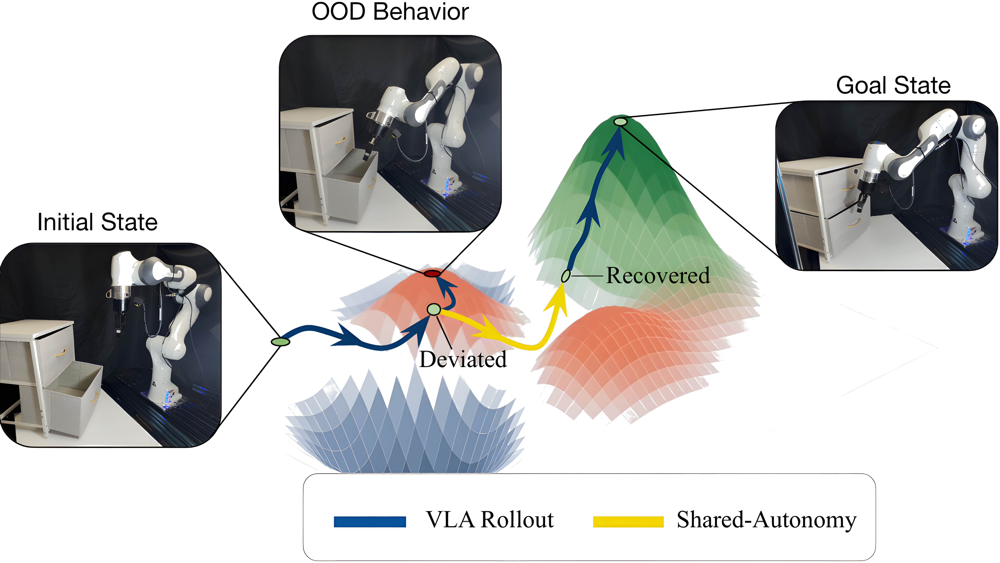
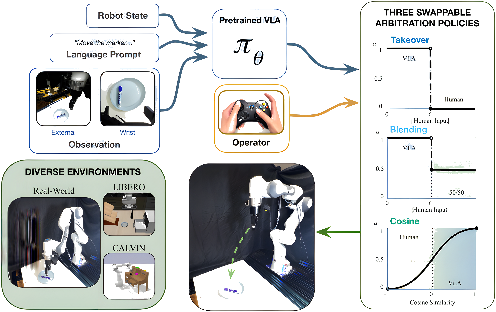
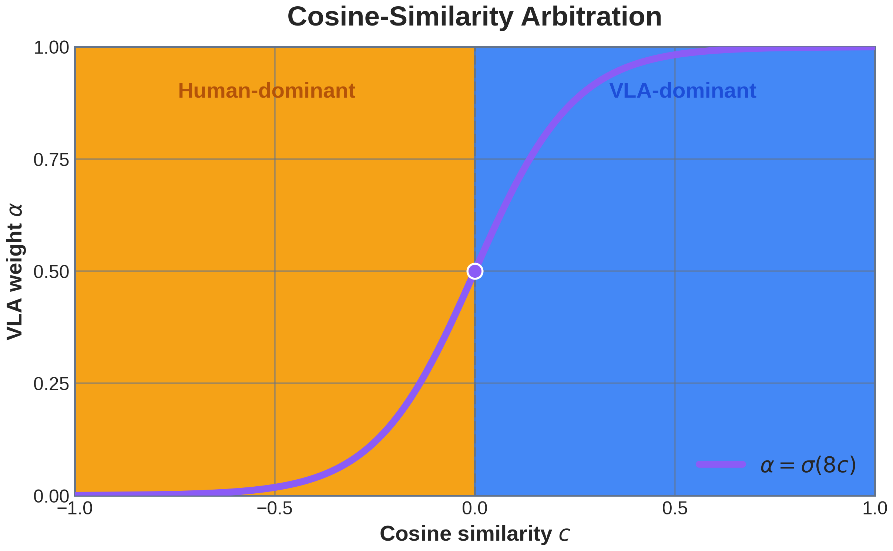
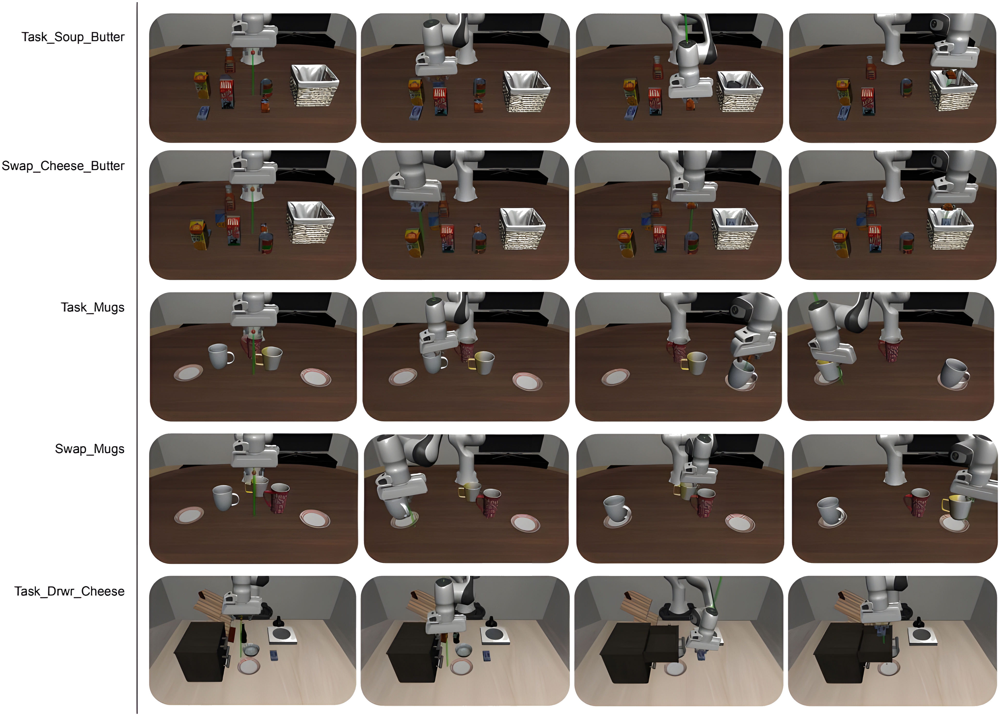
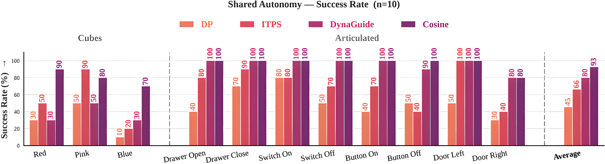
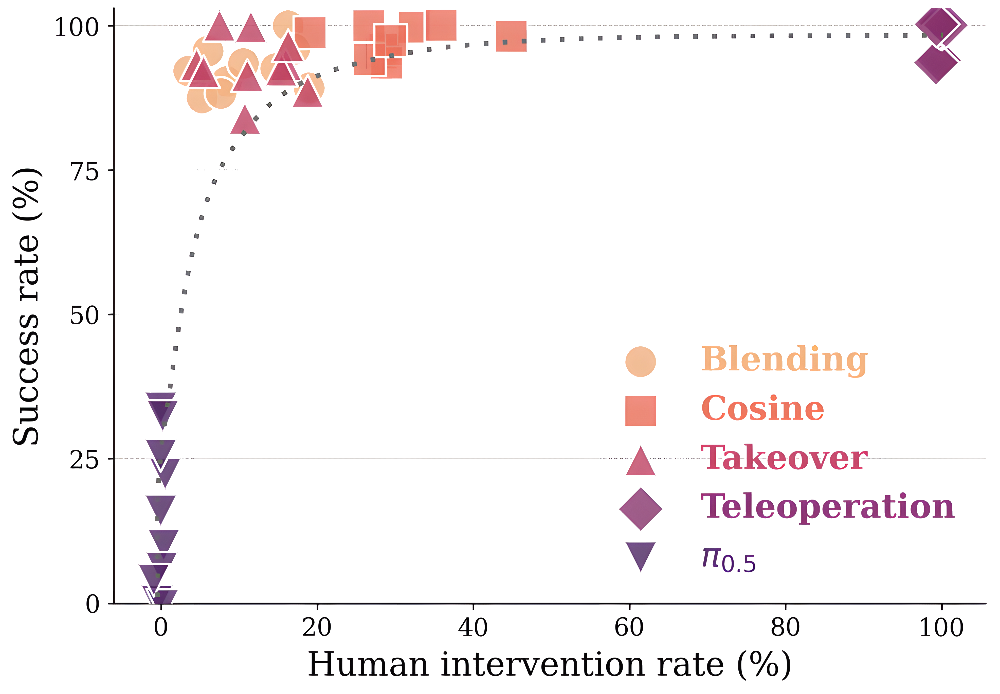
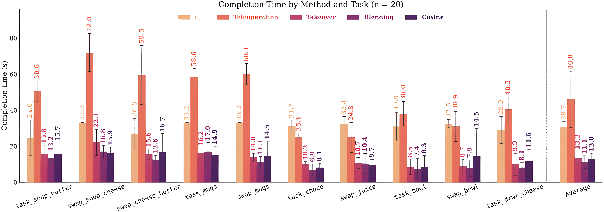
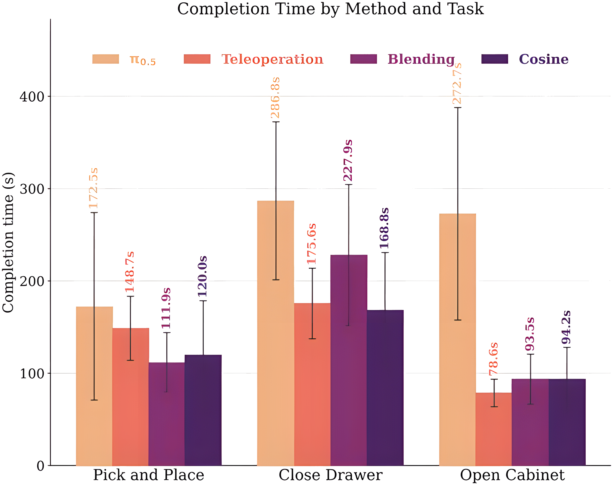

# Shared Autonomy for Policy Steering by Blending Teleoperation with a Pretrained VLA

> [!abstract] Overview
> ## TL;DR - The Benefit of Shared Autonomy 

Shared autonomy provides a "best of both worlds" approach by blending human intent with a robot's learned behaviors. SAPS **significantly improves task success rates** and robustness against out-of-distribution (OOD) scenarios compared with pure autonomous execution while requiring fewer active-control timesteps than pure teleoperation. In simulation, it also completes tasks faster than both baselines by relying on the policy for nominal low-level motion and on the human for corrective steering.

The paper does **not** directly establish a reduction in cognitive workload. It measures the fraction of timesteps containing human commands, not attention, fatigue, vigilance, or perceived workload. On real hardware, the completion-time advantage over teleoperation is also task-dependent rather than universal.

---

> [!info] Introduction
> ## Overview of SAPS

Vision-Language-Action (VLA) models have strong zero-shot capabilities but are brittle under spatial or semantic perturbations (e.g., changed object placement or appearance). To address this, the authors propose <u><strong style="color:#dab1da">SAPS</strong></u> (Shared Autonomy for Policy Steering), a model-agnostic framework that blends real-time human teleoperation commands with pretrained VLA actions.

Unlike prior policy steering methods, SAPS operates at the action level and requires:

- **No** policy retraining
- **No** auxiliary dynamics models
- **No** modifications to diffusion samplers or architectural changes

---

> [!fact] Framework Details
> ## Methodology

Symbols:

| $\mathbf{a}_{\mathrm{expert}}$ | $\mathbf{a}_{\mathrm{VLA}}$ | $\mathbf{a}_{\mathrm{blended}}$ | $a_{\mathrm{final}}^{(7)}$ | $\alpha$      | $\epsilon$              | $\theta$ | $\sigma$         |
| ------------------------------ | --------------------------- | ------------------------------- | -------------------------- | ------------- | ----------------------- | -------- | ---------------- |
| Human Action                   | VLA Action                  | Remixed Output                  | Claw Output                | Weight of VLA | Dead-band of Controller | Angle    | Sigmoid function |

#### <u>Shared Autonomy Arbitration</u>

We define the action output of the expert and the VLA as:
$$
\mathbf{a}_{\mathrm{expert}},\mathbf{a}_{\mathrm{VLA}}\in\mathbb{R}^{7}: \quad \langle v_x, v_y, v_z, \omega_x, \omega_y, \omega_z, \text{Claw} \rangle
$$
Use linear interpolation of a weight $\alpha$: 
$$
\mathbf{a}_{\mathrm{blended}}^{(1:6)}
=\alpha\mathbf{a}_{\mathrm{VLA}}^{(1:6)}
+(1-\alpha)\mathbf{a}_{\mathrm{expert}}^{(1:6)}
$$
A threshold is imposed on the expert:
$$
\left\lVert\mathbf{a}_{\mathrm{expert}}^{(1:6)}\right\rVert_2\le\epsilon
\implies\alpha=1
$$
Claw handled separately: 
$$ a^{(7)}_\text{final} = \max(a^{(7)}_\text{VLA}, a^{(7)}_\text{expert}) $$
#### <u>Takeover Arbitration</u>

Human overrides VLA output entirely:
$$
\alpha=
\begin{cases}
0, & \left\lVert\mathbf{a}_{\mathrm{expert}}^{(1:6)}\right\rVert_2>\epsilon, \\
1, & \left\lVert\mathbf{a}_{\mathrm{expert}}^{(1:6)}\right\rVert_2\le\epsilon.
\end{cases}
$$

#### <u>Equal Blending Between Policy and Teleoperation</u>

Human steers the VLA output using a fixed weight:
$$
\alpha=
\begin{cases}
0.5, & \left\lVert\mathbf{a}_{\mathrm{expert}}^{(1:6)}\right\rVert_2>\epsilon, \\
1, & \left\lVert\mathbf{a}_{\mathrm{expert}}^{(1:6)}\right\rVert_2\le\epsilon.
\end{cases}
$$

#### <u>Cosine Similarity Confidence-Based Blending</u>

Cosine similarity compares the **directional agreement** between human and policy action, which then decides how much weight given to human.
![[Cosine Blending|100%]]
Measure the directional agreement using:
$$
c=\cos(\theta)
=\frac{\mathbf{a}_{\mathrm{expert}}^{(1:6)}\cdot\mathbf{a}_{\mathrm{VLA}}^{(1:6)}}
{\left\lVert\mathbf{a}_{\mathrm{expert}}^{(1:6)}\right\rVert_2
\left\lVert\mathbf{a}_{\mathrm{VLA}}^{(1:6)}\right\rVert_2}
$$
Scale it through the **sigmoid function**: (see notes: [[2 - Neural Network with Pytorch#Step 3 Apply Sigmoid (Squishification)|Sigmoid Function]])
$$
\alpha=\sigma\!\left(8\cos(\theta)\right)
$$

  

[See interactive demo written by Codex](saps-action-arbitration-demo.html).

---

> [!hint] Experimental Results
> ## Experiments &  Key Findings

#### Benchmarks

SAPS was evaluated in:
- **simulation benchmarks** including: LIBERO, LIBERO-PRO, CALVIN
- **real robot**:Franka arm

Simulation tasks include object replacement and swapping, sorting mugs, and opening a drawer to place an object inside.

#### 1. Near-Perfect Success Rate

SAPS recovers near-teleoperation success even when the policy $\pi_{0.5}$ is old and the autonomous fails frequently. 

#### 2. ~30% Human Step-in

In LIBERO-PRO, it needs human input on only $10.8$-$30.0\%$ of timesteps; in the main CALVIN evaluation, Cosine needs $13.7\%$.

  

#### 3. Surprisingly, Faster than Human? 

In simulation, SAPS is faster than both autonomy and teleoperation.

#### 4. Not that Impressive on Real Robot

On hardware, it achieves $93.3$-$98.3\%$ mean success with human input for roughly half to two-thirds of the rollout, but is not consistently faster than teleoperation.

  

---

> [!fact] Reflection
> ## My Read

#### 1. The Method is Highly Adaptable

There is no required

#### 2. On the Benefit of Shared Autonomy 

Intervention rate measures controller activity, **not cognitive workload or attention**

#### 3. Worth Exploring: Will force VLA benefit from this 

#### <u>Question 1: What is the Application of Shared Autonomy?</u>

The paper reports active-input rates, but does not measure cognitive load, fatigue, or sustained attention. Your autopilot analogy is reasonable: SAPS reduces manual control, but the operator may still need to monitor continuously. Whether one person could supervise multiple robots remains unanswered.

#### <u>Question 2: What Is the Paper's Contribution?</u>

Pure teleoperation **is** included as a baseline. SAPS approaches its reliability with much less active input. The algorithm is simple; the main contribution is showing that post-inference action blending works across several benchmarks and real hardware without retraining or modifying the VLA.

#### <u>Question 3: How Was Human Input Obtained?</u>

They use a keyboard or gamepad; Cosine uses the gamepad because continuous joystick commands make directional comparison smoother. The paper does not provide the control mapping or discuss Haply devices. My inference is that SAPS only needs coarse corrective direction—the VLA supplies the fine motion—so a high-fidelity spatial controller was unnecessary for this experiment.

> [!fact] Aside
> ## The policy moves faster, after being corrected

For `swap_soup_cheese`:

$$ T_H = 22.1(0.107)=2.365\text{ s} $$

Assuming the human always moves at the $0.2\mathrm{m/s}$ cap:

$$ L_H \leq 2.365(0.2)=0.473\text{ m} $$

Therefore, during policy-controlled timesteps:

$$ T_\pi=22.1-2.365=19.735\text{ s} $$
$$ L_\pi \geq 3.56-0.473=3.087\text{ m} $$
$$ \bar v_{\pi,\mathrm{SAPS}}\geq\frac{3.087}{19.735} =0.1564\text{ m/s} $$

Compared with autonomous execution:

$$ \bar v_{\pi,\mathrm{alone}} =\frac{3.37}{33.2} =0.1015\text{ m/s} $$

So the policy-controlled portions of SAPS achieve at least approximately:

$$ \boxed{54\% \text{ higher effective motion speed}} $$
