# SAPS: Shared Autonomy for Policy Steering by Blending Teleoperation with a Pretrained VLA

### Crystal Zhou∗

1

Carnegie Mellon University Pittsburgh, PA, USA crystalz@andrew.cmu.edu

### Jehan Yang∗

Carnegie Mellon University Pittsburgh, PA, USA jehan@cmu.edu

# Douglas J. Weber†

Carnegie Mellon University Pittsburgh, PA, USA dweber2@andrew.cmu.edu

Zackory Erickson† Carnegie Mellon University Pittsburgh, PA, USA zackory@cmu.edu

Abstract: Recent advancements in Vision-Language-Action (VLA) models have demonstrated impressive generalist capabilities in robot manipulation, yet these policies can be brittle under out-of-distribution spatial and semantic perturbations. While human teleoperation offers reliable recovery, it can demand high cognitive load and precise manual control, and existing policy steering methods often require auxiliary models or sampler modifications. In this work, we introduce Shared Autonomy for Policy Steering (SAPS), a framework that blends real-time human teleoperation commands with pretrained policy actions at the action level. SAPS requires no policy retraining, auxiliary dynamics models, or architectural modifications. We propose and evaluate three arbitration strategies to balance human and VLA policy control, including a dynamic Cosine-similarity arbitration strategy that computes the geometric agreement between human and policy actions. Across evaluations in simulation (LIBERO, LIBERO-PRO, CALVIN) and on real-world robot hardware, SAPS improves task success rates over autonomous execution by up to 82% in both simulation and the real world. Furthermore, our approach drastically reduces human intervention compared to pure teleoperation, while simultaneously achieving faster task completion times than both autonomous execution and pure teleoperation. These results demonstrate that action-level shared autonomy is a practical, model-agnostic approach for reliably deploying generalist robot policies in real-world contexts involving a human operator, with promising applications in assistive teleoperation and scalable data collection.

Keywords: Policy steering, human-in-the-loop, shared autonomy, teleoperation

# 1 Introduction

Recent Vision-Language-Action (VLA) models have accelerated robotic manipulation by enabling generalist policies trained on large datasets to perform diverse tasks [\[1,](#page-9-0) [2,](#page-9-0) [3,](#page-9-0) [4,](#page-9-0) [5\]](#page-9-0). Despite strong zero-shot capabilities and benefits from multimodal language labels [\[6,](#page-9-0) [7\]](#page-9-0), these models remain brittle under out-ofdistribution (OOD) perturbations in object placement, appearance, and task specification [\[8\]](#page-9-0). In these settings, autonomous policies can fail by executing incorrect tasks or stalling in inefficient recovery behaviors.

∗These authors contributed equally to this work. † These authors advised equally for this work. This material is based upon work supported by the National Science Foundation under Grant No. 2341352.

Recent work addresses these failures through inference-time policy steering for pretrained models [\[9,](#page-10-0) [10,](#page-10-0) [11,](#page-10-0) [12\]](#page-10-0). However, these methods require auxiliary dynamics models, modifications to diffusion samplers, or explicit reasoning modules, and can still fall short of human teleoperators who can recover from task failures [\[13,](#page-10-0) [14,](#page-10-0) [15\]](#page-10-0). Pure teleoperation improves robustness, but requires continuous precise control and high user workload. This motivates shared autonomy [\[16,](#page-10-0) [17\]](#page-10-0), which combines the manipulation proficiency of foundation models with sparse corrective input from a user.

We introduce SAPS (Shared Autonomy for Policy Steering), a model-agnostic

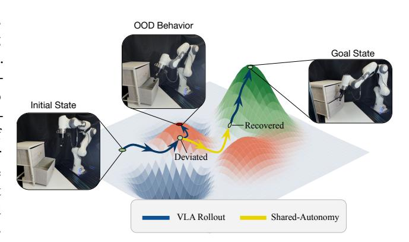

Figure 1: During VLA rollout, the policy frequently executes actions that lead the policy out of distribution, or cause the policy to perform the wrong task. Through SAPS, the user introduces a guiding perturbation that leads the VLA back within distribution to perform the task.

framework that blends real-time human teleoperation commands with pretrained VLA actions. Unlike prior steering methods, SAPS operates post-inference at the action level, requiring no architectural modifications, auxiliary models, or policy retraining. With simple arbitration strategies, sparse human corrections guide the policy through OOD states, after which the VLA can resume autonomous task completion, as shown in Figure 1.

Our contributions are as follows:

- We introduce SAPS, a lightweight shared-autonomy framework that steers pretrained robot policies and VLAs by blending policy actions with human teleoperation commands, without requiring retraining, auxiliary models, or sampler modification.
- We propose and evaluate three arbitration strategies for balancing human and policy control: fixed blending, full takeover, and a dynamic cosine-similarity strategy that scales policy autonomy based on the geometric agreement between human and policy actions.
- We show that SAPS significantly improves robustness across LIBERO, LIBERO-PRO, CALVIN, and a real Franka robotic arm, increasing task success rates over autonomous execution while reducing continuous human intervention and task completion times relative to pure teleoperation.

# 2 Related Works

# 2.1 Robot Foundation Models

Recent generalist robot policies scale toward vision–language–action (VLA) models conditioned on language, vision, and proprioception. RT-2 [\[5\]](#page-9-0) adapts pretrained vision-language models for robot control by representing actions as tokens, OpenVLA [\[3\]](#page-9-0) trains an open-source VLA on large-scale robot demonstrations, and Octo [\[18\]](#page-10-0) introduces a transformer-based generalist policy with a diffusion action head. NVIDIA's GR00T [\[2\]](#page-9-0) targets humanoid manipulation at scale, Toyota Research Institute's Large Behavior Models [\[6,](#page-9-0) [7\]](#page-9-0) study co-training strategies for multi-task manipulation, and Physical Intelligence's π0 [\[4\]](#page-9-0) and π0.5 [\[1\]](#page-9-0) pair vision-language backbones with flow-matching action experts. Despite this progress, state-of-the-art VLAs can remain brittle under language and visual perturbations, as shown in LIBERO-PRO [\[8\]](#page-9-0). This combination of strong autonomous capability and persistent out-of-distribution failure motivates our use of shared autonomy.

### 2.2 Policy Steering

Policy steering modifies a base policy's behavior at inference time to satisfy goals or constraints not fully captured during training. ITPS [9] steers diffusion-policy sampling toward a human-specified spatial target, DynaGuide [19] uses an auxiliary dynamics model to guide denoising toward likely future image-embedding states, VLS [10] uses vision-language models to synthesize trajectory-differentiable rewards for diffusion and flow-matching policies, FOREWARN [11] uses predicted latent action outcomes with VLM reasoning for runtime steering, and  $\pi_{0.7}$  [20] extends the  $\pi_0$  family with inference-time verbal coaching. Many of these methods assume that steering can be injected inside the policy's sampler, denoising process, or decoding loop. In contrast, SAPS steers policies after all inference through action-level shared autonomy.

### 2.3 Shared Autonomy

Shared autonomy combines human commands with assistive policy actions to recover from operator error or accelerate task completion. Javdani et al. [21] formalized assistance through goal-belief inference and expected cost-to-go minimization, while recent learned-policy approaches include LAMS [16] for LLM-driven control-mode switching, ILSA [17] for incremental policy improvement from user interaction, Real-to-Sim-to-Real Shared Autonomy [22] for training a residual copilot from a digital twin and human surrogate, and To the Noise and Back [23] for transforming user actions through partial diffusion.

Assistive-teleoperation systems have also shown how foundation models can be modularized within real-home autonomy stacks, using open-vocabulary vision models as perception modules for object-level assistance while retaining user control through teleoperation interfaces [13, 14]. In contrast to methods requiring intent posteriors, auxiliary copilots, or sampler modifications, SAPS uses action-level blending between a frozen pretrained policy and human teleoperation commands.

### 3 Methodology

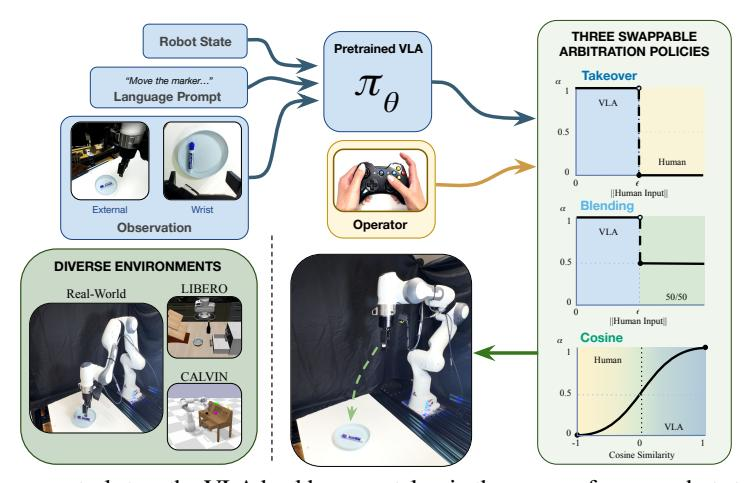

Figure 2: At every control step, the VLA backbone  $\pi_{\theta}$  takes in the camera frames, robot state, and language prompt to propose an autonomous action. In parallel, the operator may supply a teleoperation action. We compare three VLA-operator arbitration methods that produce  $\alpha$ : a Takeover arbitrator, a Blending arbitrator outputting a 50/50 blend, and a Cosine-similarity-weighted sigmoid driven by the two actions.

#### 3.1 Policies

Experiments use pretrained  $\pi_{0.5}$  Vision-Language-Action (VLA) policies finetuned on the LIBERO, CALVIN, and DROID datasets. For CALVIN, to compare with previous baselines in Du and Song [19] and Wang et al. [9], we also evaluate a diffusion policy (DP) released with open-source weights in previous work [19]. The policies receive RGB observations from both a third-person camera and a wrist-mounted camera along with proprioceptive robot state information. At each replan step,  $\pi_{0.5}$  and DP predict an

action chunk of future actions, from which the first N actions are executed before replanning. We provide more details on the evaluation environment for both simulation and the real world in Appendix Section A1.

### 3.2 Shared Autonomy Arbitration

Various shared autonomy arbitration methods are evaluated across simulation and hardware. Let:

$$\mathbf{a}_{expert}, \mathbf{a}_{VLA} \in \mathbb{R}^7,$$

denote the expert and policy actions, respectively, where the first 6 dimensions correspond to translational and rotational end-effector motion and the final dimension controls the gripper state. The final blended action executed is computed as:

$$\mathbf{a}_{blended}^{(1:6)} = \alpha \mathbf{a}_{V\!L\!A}^{(1:6)} + (1 - \alpha) \mathbf{a}_{expert}^{(1:6)}$$

where  $\alpha \in [0,1]$  determines the degree of autonomy. When no human input is detected, corresponding to the L2 norm of the expert action falling below a threshold  $\epsilon = 0.001$ , the robot policy retains full control with  $\alpha = 1$ . The gripper state is handled separately:

$$a_{\textit{final}}^{(7)} = \max\left(a_{\textit{VLA}}^{(7)}, a_{\textit{expert}}^{(7)}\right),$$

allowing either the operator or the policy to initiate grasping. This prevents interference between opposing gripper commands during shared control, with an overriding bias toward closing the gripper.

#### 3.2.1 Takeover Arbitration

Takeover arbitration allows the human operator to completely override the VLA policy whenever active intervention is detected. Similar to blending-based methods, intervention is determined using the magnitude of the expert command:

$$\alpha = \begin{cases} 0.0, & \left| \mathbf{a}_{expert}^{(1:6)} \right| > \epsilon, \\ 1.0, & \left| \mathbf{a}_{expert}^{(1:6)} \right| \le \epsilon. \end{cases}$$

where  $\epsilon = 1e - 3$  is used as the small activity threshold.

Unlike continuous blending approaches, Takeover uses hard switching between autonomous and human control, allowing the operator to fully correct undesired policy behavior during execution.

### 3.2.2 Equal Blending Between Policy and Teleoperation

Blending performs continuous arbitration between the VLA policy and expert teleoperation, allowing shared autonomy. During active human intervention, a fixed arbitration coefficient of  $\alpha=0.5$  is used, producing equal contribution from both the VLA and expert. When no expert input is detected, the controller transitions to full autonomy with  $\alpha=1.0$ .

Detection of intervention uses the magnitude of the expert command, such that

$$\alpha = \begin{cases} 0.5, & \left| \mathbf{a}_{expert}^{(1:6)} \right| > \epsilon, \\ 1.0, & \left| \mathbf{a}_{expert}^{(1:6)} \right| \le \epsilon. \end{cases}$$

#### 3.2.3 Cosine Similarity Confidence-Based Blending

This method uses a dynamic  $\alpha$ , rather than a fixed blending coefficient, to adapt the autonomy level based on policy confidence c. Specifically, c depends on the directional agreement between the expert and policy actions. At each step, we measure directional agreement via Cosine similarity:

$$c\!=\!\cos(\theta)\!=\!\frac{\mathbf{a}_{human}^{(1:6)}\!\cdot\!\mathbf{a}_{V\!IA}^{(1:6)}}{\|\mathbf{a}_{human}^{(1:6)}\|,\|\mathbf{a}_{V\!IA}^{(1:6)}\|}.$$

The Cosine similarity is assigned an agreement score g ∈ [0,1] through a logistic transformation that increases sensitivity near regions of disagreement while saturating for highly aligned actions:

$$\gamma = \sigma(k\cos(\theta)) = \frac{1}{1 + e^{-k\cos(\theta)}}, \quad k = 6.$$

The agreement score determines the arbitration coefficient, α = γ. This formulation enables smooth, continuous transitions between human and autonomous control, allowing corrective intervention while preserving stable behavior. This formulation also allows for other confidence-based metrics c to replace cos(θ) in future work for arbitration.

### 3.3 Task Setups

### 3.3.1 LIBERO

For the standard LIBERO evaluation [\[24\]](#page-11-0), we use a controlled perturbation study on a single pick-and-place task from the LIBERO object suite: picking up the cream cheese and placing it in the basket. The position of the target object is systematically shifted away from the original training-distribution layout, illustrated in Appendix Figure [A1](#page-1-0) with the exact perturbation positions enumerated in Appendix Table [A1.](#page-6-0) These offsets create out-of-distribution spatial configurations while preserving the same object identity, language instruction, and manipulation objective. Blending and Cosine are evaluated on the same perturbed task configurations as π0.5, using the keyboard interface for Blending and the gamepad controller for Cosine.

### 3.3.2 LIBERO-PRO

LIBERO-PRO is an extended LIBERO perturbation benchmark with 4 perturbation variations for each task [\[8\]](#page-9-0). In this work, we select 10 tasks due to the cost of human-in-the-loop evaluations and focus on two perturbations: task and swap. We choose these because they introduce the largest changes to object identity, placement, and task specification. Task perturbations alter the language-conditioned goal, requiring the policy to bind the correct object and instruction. Swap perturbations change the positions of relevant objects with other objects present in the scene, requiring the policy to recover from spatial shifts. The selected tasks include long-horizon, pick-and-place, and mug manipulation tasks. More information on the selected tasks can be found in Appendix Section [A6.](#page-14-0)

### 3.3.3 CALVIN

CALVIN evaluates language-conditioned manipulation in a Franka tabletop kitchen environment. In the long-horizon π0.5 setting, 34 skills are composed into five-subtask chains with persistent environment state, so failures or imprecise motions can carry over to later subtasks. This chaining procedure is performed in the original CALVIN benchmark [\[25\]](#page-11-0).

For evaluating a lower-capacity DP on single subtasks, we use two skill families for a total of 11 subtasks in the same way the original DynaGuide [\[19\]](#page-10-0) was evaluated: cube manipulation, where the robot must lift the red, pink, or blue block, and articulated-object manipulation, where the robot must open or close a drawer, switch a light on or off, press a button on or off, or move a sliding door left or right. We use the same DP model as in DynaGuide [\[19\]](#page-10-0).

### 3.3.4 Real-World

Evaluations use a Franka robot arm controlled by a π0.5 policy trained on the DROID dataset. The hardware experiments evaluate three tabletop manipulation tasks: picking up and placing the marker off the plate, closing a drawer, and opening the left door on a cabinet. These tasks cover object transport, contact-rich pushing, and articulated-object manipulation. Each task is evaluated across π0.5, Teleoperation, and shared autonomy execution using Blending and Cosine arbitration.

# 4 Experiments

### 4.1 LIBERO

In the controlled LIBERO perturbation study, π0.5 performs well during testing when the target object remains close to the original task layout, whereas π0.5's performance decreases as the perturbation distance increases. Exact perturbation details can be found in Appendix Section [A4.](#page-13-0) This suggests that the policy retains useful manipulation behavior but is sensitive to spatial shifts in object placement. In several perturbed configurations, the policy appears to act as though the object remains near its original training-distribution location, causing incorrect reaching behavior or inefficient recovery attempts (details in Appendix Section [A2\)](#page-12-0).

Shared autonomy addresses these failure modes by using sparse human input as an online correction signal, allowing the system to recover from perturbed object placements without retraining the policy or modifying its inference procedure. As shown in Figure 3, π0.5 success is strongly tied to pertur-

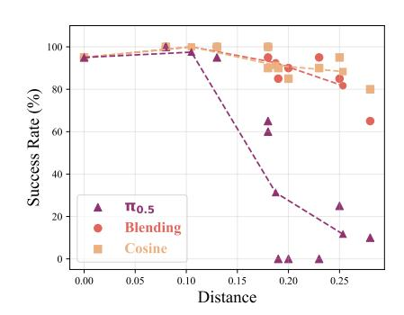

Figure 3: π0.5 task success rate across 8 perturbed task setups (n = 20) in LIBERO. Perturbation distance is detailed in Section [3.3.1.](#page-4-0) Dashed trendlines show the performance trend across perturbation distance.

bation distance, decreasing as distance increases (Pearson: r = -0.800, Two-tailed: p = 0.005). This trend is most visible at larger perturbations: for distances greater than or equal to 0.15, π0.5 drops to 22.9% success, while Blending and Cosine remain at 87.9% and 90.0%, respectively. Overall, Blending and Cosine significantly outperform π0.5 (Pearson: p = 0.004, Two-tailed: p = 0.003), showing that shared autonomy recovers from spatial generalization failures more efficiently. This controlled study motivates the broader LIBERO-PRO evaluation, where the same shared autonomy idea is tested across structured task and scene perturbations.

### 4.1.1 LIBERO-PRO

We use LIBERO-PRO to evaluate whether SAPS improves zero-shot robustness under structured task and swap perturbations. Across the 10 selected tasks (details in Appendix Section [A5\)](#page-14-0), autonomous π0.5 achieves only 15.0% mean success, indicating that the policy is highly sensitive to outof-distribution changes in object layout and task specification. In contrast, all shared-autonomy methods recover high performance: Blending reaches 92.6%, Takeover reaches 93.2%, and Cosine reaches 97.4%, approaching Teleoperation at 98.8%. All shared-autonomy methods significantly improve success over π0.5 using a one-sided Wilcoxon signedrank test, with p=9.77×10−4 for each method. These results suggest that π0.5 maintains useful low-level manipulation behavior, but corrective human guidance is needed to maintain correct task behavior under perturbations.

Completion-time results in Figure [5](#page-6-0) show that this improvement does not come at the cost of slower execution. π0.5 often enters incorrect or inefficient recovery behaviors, while

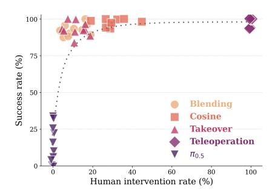

Figure 4: LIBERO-PRO Human Intervention vs Success Rate. With SAPS methods, we find that similar success rates to pure Teleoperation are achieved for a fraction of the effort from an operator. The dashed trendline summarizes that a small fraction of human intervention produces large gains in performance over π0.5.

human operators under Teleoperation must manually control the full manipulation sequence with limited depth perception in simulation. SAPS avoids both failure modes: human input guides task direction, while the policy continues supplying low-level manipulation behavior. Across the 10 tasks, Blending, Cosine, and Takeover reduce mean completion time to 11.1s, 13.0s, and 13.2s, respectively, compared to 30.7s for π0.5 and 46.0s for Teleoperation. All three shared-autonomy methods are significantly faster than both baselines using a one-sided paired Wilcoxon signed-rank test, with p<0.001 for each comparison.

Human intervention rates show that SAPS improves performance without reverting to continuous manual control. Across LIBERO-PRO tasks, Blending, Takeover, and Cosine only require low intervention rates (10.8%, 11.7%, and 30.0% mean), which remain far below Teleoperation (100%, p<0.0001). Intervention

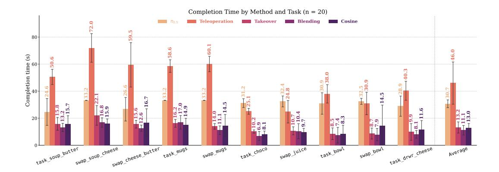

Figure 5: Completion time across LIBERO-PRO simulation tasks for  $\pi_{0.5}$ , Teleoperation, Takeover, Blending, and Cosine. Shared-autonomy methods reduce completion time relative to  $\pi_{0.5}$  and Teleoperation across all tasks with p < 0.0001.

rates show no significant correlation with task order (p > 0.09), suggesting that SAPS relies on targeted corrections rather than continuous operator control.

#### 4.2 CALVIN

We evaluate our shared-autonomy methods with  $\pi_{0.5}$  [1], trained on CALVIN ABC and tested on CALVIN D. For CALVIN evaluations, we evaluate shared autonomy with Cosine because it had the highest success rates in LIBERO-PRO. The unguided  $\pi_{0.5}$  baseline is strong, completing 91.27% of attempted subtasks and all five subtasks in 63.33% of chains due to the fast timeout of CALVIN. Teleoperation performs much worse, averaging only 0.900 subtasks per chain and never completing all five due to the low timeout. To account for the low success rate, we reevaluate Teleoperation while tripling the timeout, showing Teleoperation (3x) reaches 86.78% success, similar to the LIBERO Teleoperation evaluations shown in Figure 5. Cosine-similarity shared autonomy outperforms both components, reaching 94.85% subtask success and a 76.67% five-in-a-row rate while using human input on only 13.7% of environment steps, with the positive gap in success increasing when the horizon gets longer.

The ITPS and DynaGuide policy-steering baselines do not transfer cleanly to  $\pi_{0.5}$ : ITPS reduces subtask success by 1.84%, while DynaGuide reduces subtask success by 5.7 percentage points and the five-in-a-row rate by 16.7 points. We attribute this in part to headroom: these methods were validated on lower-performing DP policies, with Du and Song [19] reporting the largest DynaGuide gains when unguided success was below 50%. In contrast,  $\pi_{0.5}$  already completes 91.27% of attempted subtasks. With this high-performing policy, a steering signal must be tightly aligned with the policy's actual failure modes; otherwise, it is more likely to perturb correct trajectories than repair failures.

Table 1: Results for policy steering of baseline  $\pi_{0.5}$  on CALVIN n=30 long-horizon chains (5 subtasks each). Subtask success rate (ST-SR) is reported in the 2nd column, while mean number of successful tasks per chain of 5 (Mean / 5) is reported in the 3rd column. ST-X is used to report success rate of subtask X. Human % = fraction of steps with user input above the activity threshold.

| Method                     | ST-SR (†) | Mean / 5 (†) | ST-1 (†) | ST-2 (†) | ST-3 (†) | ST-4 (†) | ST-5 (†) | EE Path (m) $(\downarrow)$ | Timesteps (↓) | Human % |
|----------------------------|-----------|--------------|----------|----------|----------|----------|----------|----------------------------|---------------|---------|
| $\pi_{0.5}$                | 91.27%    | 3.833        | 90.00%   | 83.33%   | 73.33%   | 73.33%   | 63.33%   | 0.717                      | 116.8         | 0.00%   |
| Teleoperation              | 47.37%    | 0.900        | 53.33%   | 26.67%   | 6.67%    | 3.33%    | 0.00%    | 1.809                      | 299.7         | 100.00% |
| Teleoperation (3x Timeout) | 86.78%    | 3.500        | 93.33%   | 80.00%   | 76.67%   | 53.33%   | 46.67%   | 1.182                      | 484.8         | 100.00% |
| ITPS                       | 89.43%    | 3.667        | 93.33%   | 83.33%   | 70.00%   | 63.33%   | 56.67%   | 0.633                      | 116.7         | 6.67%   |
| DynaGuide                  | 85.59%    | 3.167        | 86.67%   | 73.33%   | 60.00%   | 50.00%   | 46.67%   | 0.767                      | 131.3         | 0.00%   |
| Cosine                     | 94.85%    | 4.300        | 96.67%   | 90.00%   | 83.33%   | 83.33%   | 76.67%   | 0.615                      | 112.1         | 13.73%  |

To compare Cosine-arbitration directly against the policies on which the prior methods were validated, we additionally evaluate Cosine on a lower-parameter DP baseline for a single subtask, following the same evaluation performed in Du and Song [19]. Despite the simpler action-level arbitration formulation,

Cosine shared autonomy outperforms the autonomous DP baseline, ITPS, and DynaGuide on all 11 CALVIN subtasks, averaging 93% success compared to 45%, 66%, and 80%, respectively, with individual subtask success rates in Figure 6. Additional details, including the per-method steering mechanisms, intervention rates, end-effector path length, completion time, and qualitative rollouts, are provided in Appendix Section A7.

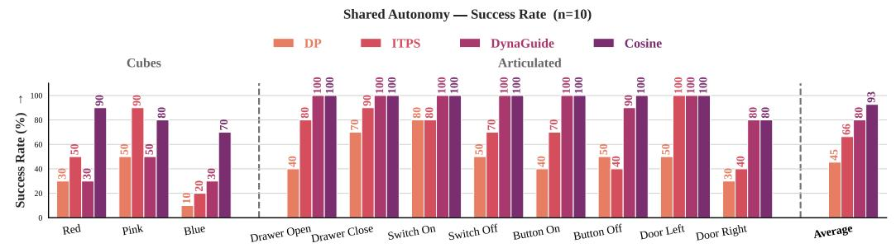

Figure 6: Subtask success rate across four autonomy / shared-autonomy methods on 11 single CALVIN subtasks (3 block-lift, 8 articulated; n=10 episodes per task) for policy steering of baseline DP policy. Cosine-similarity shared autonomy attains high success on every subtask, reaching 100% on all eight articulated tasks and 70–90% on the harder block-lift subtasks.

#### 4.3 Real World

We perform real-world evaluations to test whether SAPS transfers from simulation to hardware. As seen in Table 2,  $\pi_{0.5}$  struggles across real-world tasks, achieving 50% success on Pick and Place, 25% success on Close Drawer, and 5% success on Open Cabinet (with task pictures shown in Figure A15). Shared autonomy substantially improves real-world reliability, with Cosine achieving an average success rate of 98.3% across all three tasks, and Blending achieving 93.3%. Additional success-rate details can be found in Table 2. This supports that  $\pi_{0.5}$  has learned useful real-world manipulation behavior from DROID, but remains brittle under the specific task layouts and object configurations, while corrective human input helps recover from these failures.

Table 2: Hardware evaluation (n = 20) by task success rate.

| Task                  | $\pi_{0.5}$ | Teleoperation | Blending | Cosine |
|-----------------------|-------------|---------------|----------|--------|
| Pick and Place        | 50%         | 100%          | 100%     | 100%   |
| Close the Drawer      | 25%         | 100%          | 80%      | 100%   |
| Open the Left Cabinet | 5%          | 100%          | 100%     | 95%    |

Completion-time results in Figure A14 further show that shared autonomy improves task efficiency relative to  $\pi_{0.5}$ . Using pairwise Mann–Whitney U tests, both Cosine and Blending significantly reduce completion time relative to  $\pi_{0.5}$  across all three tasks ( $p \le 0.0212$ ), indicating that shared autonomy not only improves success but also reduces inefficient autonomous recovery behavior. However, completion-time results compared to Teleoperation are task-dependent: both Cosine and Blending are significantly faster on the Marker Plate (Cosine: p = 0.0002; Blending: p = 0.0005), but neither method is significantly different from Teleoperation on Close Drawer or Open Cabinet. This differs from the simulation setting, where Teleoperation is slower, and likely reflects that real-world operators have direct depth perception and can execute some tasks quickly under full manual control, although continuous human input is required.

Finally, Table A5 shows that shared autonomy preserves its main advantage over Teleoperation by substantially reducing human input: both Cosine and Blending reduce intervention by 30-50% relative to Teleoperation across all three hardware tasks (p < 0.0001 for all comparisons). Together, these results show that the simulation trend transfers to hardware: shared autonomy improves reliability and efficiency relative to autonomous  $\pi_{0.5}$  while reducing the amount of continuous human control required.

# 5 Limitations

SAPS requires a human operator at test time, so performance depends on operator timing, skill, and the teleoperation interface. Because SAPS uses blending with the policy rather than explicit task progress, intent, uncertainty, contact, or safety estimates, it can fail when the policy is confidently wrong. We alleviate this effect with Cosine similarity and Takeover, because the user can take over when the policy action differs from the user's intended action. Our evaluation is limited to a finite set of simulated and real manipulation tasks; broader LIBERO coverage, more operators (details on operators in Appendix Section [A3\)](#page-12-0), additional embodiments, additional policy backbones, and more real-world tasks would better characterize improvement using SAPS.

# 6 Conclusion

We introduced SAPS, a lightweight shared-autonomy framework that steers pretrained robot policies and VLAs by blending policy actions with human teleoperation commands. Across LIBERO, LIBERO-PRO, CALVIN, and real Franka hardware, SAPS improves robustness over autonomous execution while reducing human intervention relative to pure teleoperation. These results suggest that shared autonomy is a practical complement to robot foundation models. Coarse human input can guide policies through out-of-distribution failures while preserving their learned manipulation behavior. This improvement with shared autonomy is seen both in simulation environments, where teleoperation can be difficult due to the lack of depth perception, and in the real world, where shared autonomy can reduce human effort and completion time for tasks requiring precise movements.

### Acknowledgments

If a paper is accepted, the final camera-ready version will (and probably should) include acknowledgments. All acknowledgments go at the end of the paper, including thanks to reviewers who gave useful comments, to colleagues who contributed to the ideas, and to funding agencies and corporate sponsors that provided financial support.

# References

- [1] K. Black, N. Brown, J. Darpinian, K. Dhabalia, D. Driess, A. Esmail, M. Equi, C. Finn, N. Fusai, M. Y. Galliker, D. Ghosh, L. Groom, K. Hausman, B. Ichter, S. Jakubczak, T. Jones, L. Ke, D. LeBlanc, S. Levine, A. Li-Bell, M. Mothukuri, S. Nair, K. Pertsch, A. Z. Ren, L. X. Shi, L. Smith, J. T. Springenberg, K. Stachowicz, J. Tanner, Q. Vuong, H. Walke, A. Walling, H. Wang, L. Yu, and U. Zhilinsky. π0.5: A vision-language-action model with open-world generalization. In *Proceedings of the 9th Conference on Robot Learning*, volume 305 of *Proceedings of Machine Learning Research*, pages 17–40. PMLR, 2025. URL <https://proceedings.mlr.press/v305/black25a.html>.
- [2] NVIDIA, J. Bjorck, F. Castaneda, N. Cherniadev, X. Da, R. Ding, L. Fan, Y. Fang, D. Fox, F. Hu, ˜ S. Huang, J. Jang, Z. Jiang, J. Kautz, K. Kundalia, L. Lao, Z. Li, Z. Lin, K. Lin, G. Liu, E. Llontop, L. Magne, A. Mandlekar, A. Narayan, S. Nasiriany, S. Reed, Y. L. Tan, G. Wang, Z. Wang, J. Wang, Q. Wang, J. Xiang, Y. Xie, Y. Xu, Z. Xu, S. Ye, Z. Yu, A. Zhang, H. Zhang, Y. Zhao, R. Zheng, and Y. Zhu. GR00T N1: An open foundation model for generalist humanoid robots. *arXiv preprint arXiv:2503.14734*, 2025. URL <https://arxiv.org/abs/2503.14734>.
- [3] M. J. Kim, K. Pertsch, S. Karamcheti, T. Xiao, A. Balakrishna, S. Nair, R. Rafailov, E. Foster, G. Lam, P. Sanketi, Q. Vuong, T. Kollar, B. Burchfiel, R. Tedrake, D. Sadigh, C. Finn, and P. Liang. OpenVLA: An open-source vision-language-action model. In *Proceedings of the Conference on Robot Learning*, 2024. URL <https://arxiv.org/abs/2406.09246>.
- [4] K. Black, N. Brown, D. Driess, A. Esmail, M. Equi, C. Finn, N. Fusai, L. Groom, K. Hausman, B. Ichter, S. Jakubczak, T. Jones, S. Levine, A. Li-Bell, M. Mothukuri, S. Nair, K. Pertsch, A. Z. Ren, L. X. Shi, L. Smith, J. T. Springenberg, K. Stachowicz, J. Tanner, Q. Vuong, H. Walke, A. Walling, H. Wang, L. Yu, and U. Zhilinsky. π0: A vision-language-action flow model for general robot control. *arXiv preprint arXiv:2410.24164*, 2024. URL <https://arxiv.org/abs/2410.24164>.
- [5] B. Zitkovich, T. Yu, S. Xu, P. Xu, T. Xiao, F. Xia, J. Wu, P. Wohlhart, S. Welker, A. Wahid, Q. Vuong, V. Vanhoucke, H. T. Tran, R. Soricut, J. Singh, P. S. Singh, P. Sanketi, G. Salazar, M. S. Ryoo, K. Reymann, K. Rao, K. Pertsch, G. Penedo, A. Padalkar, V. K. Manjunath, A. Maddukuri, S. Levine, K.-H. Lee, T.-W. E. Lee, I. Leal, Y. Kuang, S. Karamcheti, D. Hsu, A. Herzog, K. Hausman, K. Gopalakrishnan, C. Fu, P. Florence, C. Finn, A. Dubey, D. Driess, T. Ding, J. Devlin, C. David, A. Cruz, Y. Chebotar, C. Byrne, A. Brohan, N. Brown, K. Bousmalis, J. Bohg, V. Blukis, R. Arenas, and M. Ahn. RT-2: Vision-language-action models transfer web knowledge to robotic control. In *Conference on Robot Learning*, 2023. URL <https://arxiv.org/abs/2307.15818>.
- [6] TRI LBM Team, J. Barreiros, A. Beaulieu, A. Bhat, R. Cory, E. Cousineau, H. Dai, C.-H. Fang, K. Hashimoto, M. Z. Irshad, M. Itkina, H. Nishimura, C. Xu, M. Zhang, R. Tedrake, et al. A careful examination of large behavior models for multitask dexterous manipulation. *arXiv preprint arXiv:2507.05331*, 2025. URL <https://arxiv.org/abs/2507.05331>.
- [7] F. Lin, K. Arora, J. Mercat, H. Nishimura, P. Shah, C. Xu, M. Zhang, M. Zolotas, M. Angeles, O. Pfannenstiehl, A. Beaulieu, and J. Barreiros. A systematic study of data modalities and strategies for co-training large behavior models for robot manipulation. *arXiv preprint arXiv:2602.01067*, 2026. URL <https://arxiv.org/abs/2602.01067>.
- [8] X. Zhou, Y. Xu, G. Tie, Y. Chen, G. Zhang, D. Chu, P. Zhou, and L. Sun. LIBERO-PRO: Towards robust and fair evaluation of vision-language-action models beyond memorization. *arXiv preprint arXiv:2510.03827*, 2025. URL <https://arxiv.org/abs/2510.03827>.

- [9] Y. Wang, L. Wang, Y. Du, B. Sundaralingam, X. Yang, Y.-W. Chao, C. Perez-D'Arpino, D. Fox, and J. Shah. Inference-time policy steering through human interactions. In *IEEE International Conference on Robotics and Automation*, 2025. URL <https://arxiv.org/abs/2411.16627>.
- [10] S. Liu, I. S. Singh, Y. Xu, J. Duan, and R. Krishna. VLS: Steering pretrained robot policies via vision-language models. *arXiv preprint arXiv:2602.03973*, 2026. URL [https://arxiv.org/abs/](https://arxiv.org/abs/2602.03973) [2602.03973](https://arxiv.org/abs/2602.03973).
- [11] Y. Wu, R. Tian, G. Swamy, and A. Bajcsy. From foresight to forethought: VLM-in-the-loop policy steering via latent alignment. *Robotics: Science and Systems*, 2025. URL [https://arxiv.org/](https://arxiv.org/abs/2502.01828) [abs/2502.01828](https://arxiv.org/abs/2502.01828).
- [12] Y. Wu, A. Li, T. Hermans, F. Ramos, A. Bajcsy, and C. Perez-D'Arpino. Do what you say: Steering ´ vision-language-action models via runtime reasoning-action alignment verification. *arXiv preprint arXiv:2510.16281*, 2025. URL <https://arxiv.org/abs/2510.16281>.
- [13] A. Padmanabha, J. Gupta, C. Chen, J. Yang, V. Nguyen, D. Weber, C. Majidi, and Z. Erickson. Independence in the home: A wearable interface for a person with quadriplegia to teleoperate a mobile manipulator. In *ACM/IEEE International Conference on Human-Robot Interaction*, 2024. URL <https://arxiv.org/abs/2312.15071>.
- [14] J. Yang, E. Hodgson, C. Sun, Z. Erickson, and D. J. Weber. Bimanual high-density EMG control for in-home mobile manipulation by a user with quadriplegia. *arXiv preprint arXiv:2602.02773*, 2026. URL <https://arxiv.org/abs/2602.02773>.
- [15] Z. Hu, R. Wu, N. Enock, J. Li, R. Kadakia, Z. Erickson, and A. Kumar. Rac: Robot learning for long-horizon tasks by scaling recovery and correction, 2025. URL [https://arxiv.org/abs/](https://arxiv.org/abs/2509.07953) [2509.07953](https://arxiv.org/abs/2509.07953).
- [16] Y. Tao, J. Yang, D. Ding, and Z. Erickson. LAMS: LLM-driven automatic mode switching for assistive teleoperation. In *ACM/IEEE International Conference on Human-Robot Interaction*, 2025. URL <https://arxiv.org/abs/2501.08558>.
- [17] Y. Tao, G. Qiao, D. Ding, and Z. Erickson. Incremental learning for robot shared autonomy. In *IEEE/RSJ International Conference on Intelligent Robots and Systems*, 2025. URL [https:](https://arxiv.org/abs/2410.06315) [//arxiv.org/abs/2410.06315](https://arxiv.org/abs/2410.06315).
- [18] Octo Model Team, D. Ghosh, H. Walke, K. Pertsch, K. Black, O. Mees, S. Dasari, J. Hejna, C. Xu, J. Luo, T. Kreiman, Y. Tan, L. Y. Chen, P. Sanketi, Q. Vuong, T. Xiao, D. Sadigh, C. Finn, and S. Levine. Octo: An open-source generalist robot policy. In *Proceedings of Robotics: Science and Systems*, Delft, Netherlands, 2024.
- [19] M. Du and S. Song. Dynaguide: Steering diffusion policies with active dynamic guidance. In *Proceedings of the 39th Conference on Neural Information Processing Systems (NeurIPS)*, 2025.
- [20] P. Intelligence, B. Ai, A. Amin, R. Aniceto, A. Balakrishna, G. Balke, K. Black, G. Bokinsky, S. Cao, T. Charbonnier, et al. π0.7: a steerable generalist robotic foundation model with emergent capabilities. *arXiv preprint arXiv:2604.15483*, 2026.
- [21] S. Javdani, S. S. Srinivasa, and J. A. Bagnell. Shared autonomy via hindsight optimization. *Robotics science and systems: online proceedings*, 2015:10–15607, 2015.
- [22] S. Sha, Y. Wang, B. Huang, A. Loquercio, and Y. Li. Efficient and reliable teleoperation through real-to-sim-to-real shared autonomy. *arXiv preprint arXiv:2603.17016*, 2026.
- [23] T. Yoneda, L. Sun, G. Yang, B. C. Stadie, and M. R. Walter. To the noise and back: Diffusion for shared autonomy. In *Robotics: Science and Systems XIX, Daegu, Republic of Korea, July 10-14, 2023*, 2023.

- [24] B. Liu, Y. Zhu, C. Gao, Y. Feng, Q. Liu, Y. Zhu, and P. Stone. Libero: Benchmarking knowledge transfer for lifelong robot learning. *Advances in Neural Information Processing Systems*, 36:44776– 44791, 2023.
- [25] O. Mees, L. Hermann, E. Rosete-Beas, and W. Burgard. Calvin: A benchmark for languageconditioned policy learning for long-horizon robot manipulation tasks. *IEEE Robotics and Automation Letters (RA-L)*, 7(3):7327–7334, 2022.
- [26] C. Yu, Y. Wang, Z. Guo, H. Lin, S. Xu, H. Zang, Q. Zhang, Y. Wu, C. Zhu, J. Hu, et al. Rlinf: Flexible and efficient large-scale reinforcement learning via macro-to-micro flow transformation. *arXiv preprint arXiv:2509.15965*, 2025.

# Appendix

# A1 Evaluation Environment

Simulation experiments are conducted using the LIBERO benchmark in Robosuite and CALVIN with a Franka Panda manipulator controlled through an operational-space pose controller. Observations include RGB images from a third-person agent-view camera and an eye-in-hand wrist camera, together with endeffector pose and gripper state. Actions are represented as 7-DOF commands consisting of 3D translation, 3D orientation, and gripper actuation. The environment operates at 20 Hz. Human teleoperation was provided through either keyboard or gamepad input, depending on the arbitration method and evaluation setting. Cosine used a gamepad controller for all simulation and hardware evaluations, as the continuous joystick input provided smoother directional commands for agreement-based arbitration. In simulation, Blending and Takeover were evaluated with keyboard input, where operator commands were used as corrective interventions. For the real-world hardware experiments, the Blending interface was transferred to the gamepad to provide smoother control during physical robot execution.

The LIBERO, LIBERO-PRO and Real-world evaluations used the π0.5 model checkpoints released by [\[1\]](#page-9-0) trained on either the LIBERO or DROID dataset. CALVIN used a π0.5 model checkpoint released by RLinf [\[26\]](#page-11-0) finetuned on CALVIN ABC. CALVIN also uses a DP model checkpoint released in DynaGuide [\[19\]](#page-10-0).

# A2 Discussion on Baseline Task Completion

In this work, π0.5 and Teleoperation were used as baselines to evaluate shared-autonomy methods for policy steering. The low task success of π0.5 under perturbations suggests that the policy was sensitive to changes in the initial scene configuration. In simulation, this was likely caused by overfitting to the training distribution, where the policy may rely on memorized object positions or narrow visual cues rather than a generalizable task strategy. Therefore, large positional perturbations can move the scene outside the training distribution, causing incorrect actions, poor recovery, or wrong task completion.

Similar issues can occur in hardware, where object appearance, scale, lighting, camera viewpoint, and contact dynamics may differ from the data used to train the policy. These real-world variations can cause π0.5 to misinterpret the scene or produce actions that are only valid for familiar object placements and appearances. This highlights a key limitation of using the pretrained VLA policy alone: strong nominal behavior does not necessarily imply robustness to perturbations or real-world variation.

Teleoperation exhibited a different limitation. In simulation, teleoperation was difficult because the operator had limited depth perception from camera observations, making it harder to judge object distance, gripper alignment, and contact timing. In real-world evaluations, the operator had direct depth perception of the workspace, which made task execution faster. These baseline limitations motivate shared autonomy, where the policy handles nominal behavior while limited human corrections help recover from out-of-distribution states or difficult portions of the task.

# A3 Additional Details on Human-in-the-Loop

Two operators performed the teleoperation evaluations, including one operator with no prior experience in teleoperating robots. Neither operator required training before using the gamepad or keyboard interface, suggesting that the human-in-the-loop setup can be used with little to no prior experience in robot control. In practice, both gamepad and keyboard interfaces were intuitive enough for operators to provide corrective input during task execution.

Across each benchmark, the same operator was used for all human-in-the-loop methods in that benchmark, including Teleoperation and all SAPS variants, so comparisons within a benchmark are not confounded by changing operators across methods. Results are therefore not averaged across multiple operators; each benchmark reports repeated trials from the corresponding single operator. LIBERO, LIBERO-PRO, and

real-world evaluations used the same operator without prior robot control experience, while CALVIN used an operator with prior robot arm control experience. We chose this protocol to keep human-input behavior consistent across methods within each benchmark, but broader multi-operator evaluation remains an important direction for future work.

For safety and consistency in all trials, the maximum teleoperation speed was limited to approximately 0.2m/s. This speed limit helped prevent abrupt robot motions while still allowing the operator to make meaningful corrections during shared-autonomy rollouts.

# A4 Distance-Based Perturbation Task Setup for LIBERO

We perturb the distance of the cream cheese object from the original location in the Libero-10 task, which we illustrate in Figure [A1.](#page-1-0) We find that while the base policy decreases in performance, our shared autonomy method can retain performance across different distances for task perturbations. The exact changes in position are listed in Table [A1.](#page-6-0)

Figure [A1](#page-1-0) visualizes the controlled LIBERO object-displacement evaluation used in our distance-based perturbation study. Starting from the original cream-cheese placement, we shift the target object to multiple new positions while keeping the same task instruction and scene setup. These perturbations are designed to isolate spatial generalization failures by changing object position without changing the manipulation objective.

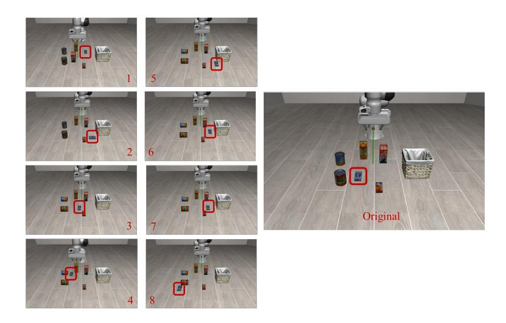

Figure A1: Libero task setups for positional perturbations of the cream cheese object with varying distances from the original position.

Table [A1](#page-6-0) reports the exact displacement values used for each perturbation. The perturbations span both axis-aligned and diagonal shifts, allowing us to evaluate whether policy performance degrades smoothly as the object moves farther from the original training-distribution location. Together, Figure [A1](#page-1-0) and Table [A1](#page-6-0) define the controlled spatial OOD setting used for the LIBERO results in the main paper.

Table A1: Distance (m) perturbations of LIBERO evaluations of target object: cream cheese.

| Distance | 0.08 | 0.13 | 0.18 | 0.18 | 0.20 | 0.20 | 0.23 | 0.26 | 0.29 |
|----------|------|------|------|------|------|------|------|------|------|
| dX       | 0.00 | 0.10 | 0.00 | 0.18 | 0.13 | 0.05 | 0.06 | 0.20 | 0.08 |
| dY       | 0.08 | 0.08 | 0.18 | 0.05 | 0.15 | 0.23 | 0.23 | 0.16 | 0.28 |

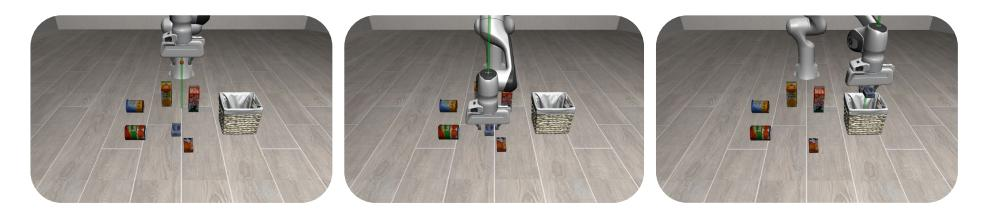

Figure A2: LIBERO task progress for successful task completion on cream cheese perturbations.

# A5 Perturbation Task Setup for LIBERO-PRO

Table [A2](#page-7-0) summarizes the 10 LIBERO-PRO perturbation tasks used in our evaluation. The selected tasks include task perturbations, which change the language-conditioned goal or target object, and swap perturbations, which alter the spatial arrangement of relevant objects in the scene. These settings test whether the policy can maintain correct task grounding when object identity, target placement, or task specification become OOD.

We select these tasks to cover a range of manipulation behaviors, including pick-and-place, mug rearrangement, articulated-object interaction, and object substitution. This task set therefore evaluates whether shared autonomy can recover failures that arise not only from spatial displacement, but also from incorrect object binding and task-level confusion.

Table A2: LIBERO task specifications used for the original and perturbed task variants.

| Task Name          | Task Specification    | Original Task                                                                   | Perturbed Task                                                               |
|--------------------|-----------------------|---------------------------------------------------------------------------------|------------------------------------------------------------------------------|
| task soup butter   | libero 10 task 6      | Place the cream cheese and butter on plate                                      | Replace the cream cheese with soup                                           |
| swap soup cheese   | libero 10 swap 4      | Place the soup and cream cheese on plate                                        | Swap the target locations of the soup and cream cheese                    |
| swap cheese butter | libero 10 task 6      | Place the cream cheese and butter on plate                                      | Replace the cream cheese with soup                                           |
| task mugs          | libero 10 task 7      | Place the white mug on the left plate and the yellow mug on the right plate. | Put the white mug on the right plate and the yellow mug on the left plate |
| swap mugs          | libero 10 swap 7      | Place the white mug on the left plate and the yellow mug on the right plate  | Swap the position of the yellow mug                                          |
| task choc          | libero object task 7  | Place the orange juice in the basket                                            | Replace the orange juice with chocolate                                      |
| swap juice         | libero object swap 7  | Place the orange juice in the basket                                            | Swap the orange juice target placement                                       |
| task bowl          | libero spatial task 6 | Place the bowl on the box on the plate                                          | Place the bowl on the cabinet on the plate                                   |
| swap bowl          | libero spatial swap 6 | Place the bowl on the box on the plate                                          | Swap the bowl target placement                                               |
| task drwr cheese   | libero goal task 1    | Open the drawer and place the bowl in the drawer                             | Open the drawer and place the cream cheese in the drawer                  |

# A6 Additional Metrics for LIBERO-PRO

Figure [A6](#page-7-0) shows the tradeoff between human intervention rate and completion time across LIBERO-PRO tasks. Pure Teleoperation requires 100% human intervention and often produces longer completion times, while π0.5 requires no human input but can still take longer due to incorrect or inefficient autonomous behavior. In contrast, the shared-autonomy methods occupy the upper-left region of the plot, indicating that they reduce completion time while requiring only partial human input. Blending and Takeover generally require the least intervention, while Cosine uses more corrective input but remains far below full teleoperation.

Figure [A7](#page-17-0) summarizes the same trend using method-level averages. All SAPS variants achieve substantially lower completion times than Teleoperation while requiring much less human control. These results further support that shared autonomy provides a practical balance between autonomous policy execution and human correction, improving task efficiency without reverting to continuous manual operation.

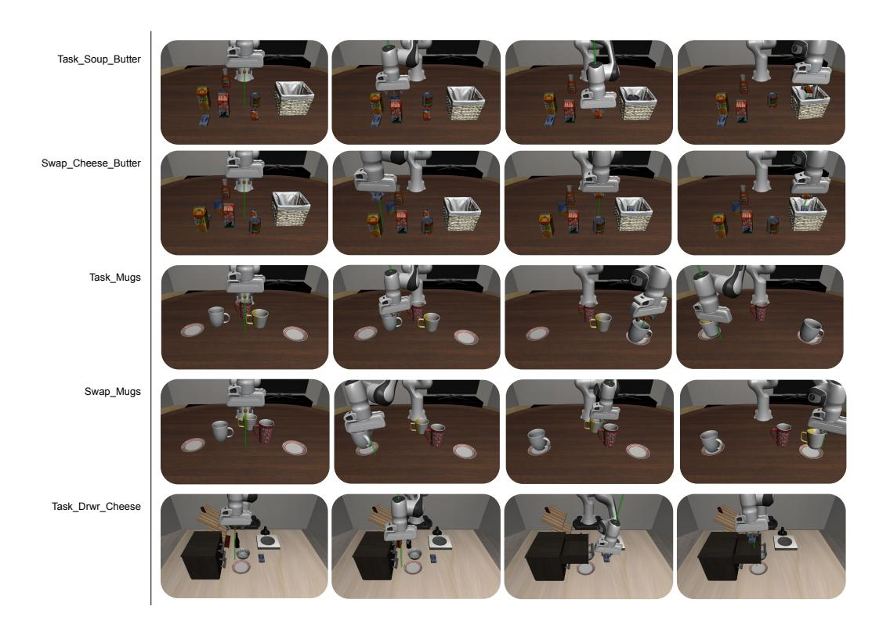

Figure A3: Qualitative task progression for pick and place, mug manipulation, and drawer manipulation in LIBERO-PRO.

Table A3: LIBERO-PRO task success rates (%) (n = 25). Cosine arbitration achieves the highest shared-autonomy mean success rate across the 10 Out-of-distribution tasks. Across the 10 tasks, all sharedautonomy methods significantly improved success rate over π0.5 using a one-sided Wilcoxon signed-rank test: p=9.77×10−4 .

| Task               | π0.5 | Blending | Cosine | Takeover | Teleoperation |
|--------------------|------|----------|--------|----------|---------------|
| task soup butter   | 34   | 96       | 96     | 100      | 100           |
| swap soup cheese   | 0    | 90       | 98     | 84       | 94            |
| swap cheese butter | 32   | 88       | 96     | 94       | 94            |
| task mugs          | 0    | 90       | 100    | 88       | 100           |
| swap mugs          | 10   | 88       | 94     | 92       | 100           |
| task choco         | 26   | 100      | 94     | 94       | 100           |
| swap juice         | 16   | 94       | 100    | 92       | 100           |
| task bowl          | 6    | 96       | 100    | 96       | 100           |
| swap bowl          | 4    | 92       | 98     | 100      | 100           |
| task drwr cheese   | 22   | 92       | 98     | 92       | 100           |
| Mean               | 15.0 | 92.6     | 97.4   | 93.2     | 98.8          |

# A7 Additional Details and Metrics for CALVIN

The unguided DP base policy executes autonomously with no human input. ITPS [\[9\]](#page-10-0) performs shared autonomy by injecting a human-specified position-target gradient into the policy's diffusion sampling at every denoising step. DynaGuide [\[19\]](#page-10-0) steers the policy autonomously, using a separately trained dynamics model and a classifier to bias diffusion sampling toward desired future states. Our method requires neither a modification to the diffusion sampler nor an auxiliary model: at each timestep it forms the executed action as a convex combination of the human's commanded action and the policy's action, with the blending weight set by the Cosine similarity between the two while deferring to the policy when human and policy agree, and to the human when they diverge.

Despite this simplicity, Cosine-similarity shared autonomy outperforms both more complex methods on every one of the 11 CALVIN subtasks. Figure [6](#page-7-0) reports per-task success rate. Cosine arbitration succeeds on

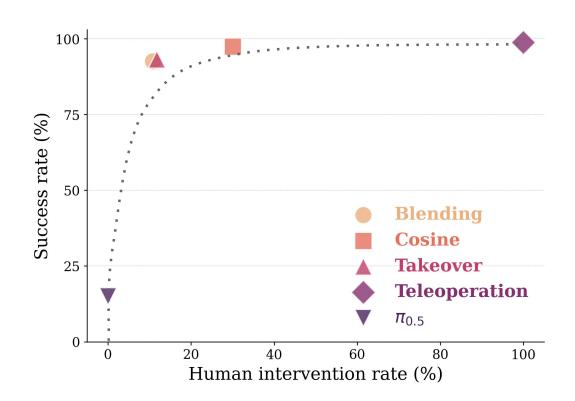

Figure A4: Mean rate of human intervention compared to success rate across all tasks for each method in LIBERO-PRO evaluations.

Table A4: Human intervention rate across LIBERO-PRO tasks for each shared-autonomy method. Values report mean  $\pm$  standard error across evaluation episodes ( $n\!=\!25$ ). All shared-autonomy methods require substantially less human intervention than pure Teleoperation, which corresponds to 100% intervention for every task. Intervention rate is reported as the percentage of control timesteps with active human input. Cosine: cosine-similarity arbitration; Blending: fixed blending arbitration; Takeover: full human control during intervention. Teleoperation is omitted from the table because it requires human input throughout the rollout, corresponding to 100% intervention for all tasks.

| Task               | Cosine              | Blending        | Takeover          |
|--------------------|---------------------|-----------------|-------------------|
| task_soup_butter   | $28.1 \pm 8.8$      | $6.0 \pm 2.9$   | $7.6 \pm 2.7$     |
| swap_soup_cheese   | $19.7 \pm 5.4$      | $9.3 \pm 1.9$   | $10.7 \pm 3.7$    |
| swap_cheese_butter | $28.3 \pm 8.5$      | $4.8 \pm 1.3$   | $4.7 \pm 2.0$     |
| task_mugs          | $32.1 \pm 5.8$      | $19.2 \pm 4.1$  | $19.0 \pm 4.1$    |
| swap_mugs          | $28.8 \pm 9.8$      | $7.3 \pm 3.0$   | $10.7 \pm 3.6$    |
| task_choco         | $26.6 \pm 9.7$      | $16.0 \pm 3.4$  | $15.7 \pm 4.5$    |
| swap_juice         | $26.7 \pm 12.7$     | $10.5 \pm 3.0$  | $15.7 \pm 3.6$    |
| task_bowl          | $35.4 \pm 9.8$      | $17.1 \pm 7.1$  | $16.4 \pm 10.1$   |
| swap_bowl          | $44.7 \pm 12.6$     | $14.1 \pm 4.8$  | $11.5 \pm 5.5$    |
| task_drwr_cheese   | $29.7 \!\pm\! 11.4$ | $4.1\!\pm\!1.6$ | $5.3 \!\pm\! 4.6$ |
| Mean               | 30.0                | 10.8            | 11.7              |

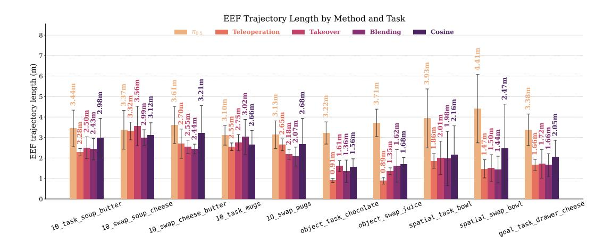

Figure A5: End effector length across all methods and tasks tested in LIBERO-PRO.

100% of episodes for all eight articulated subtasks and 70–90% for the three block-lift subtasks, averaging 93% across the suite. The two prior methods trail substantially, DynaGuide at 80% and ITPS at 66%, and the autonomous base policy reaches only 45%. The gap is widest on the block-lift subtasks, where the base policy and ITPS both fall below 50% while Cosine arbitration still completes a clear majority of

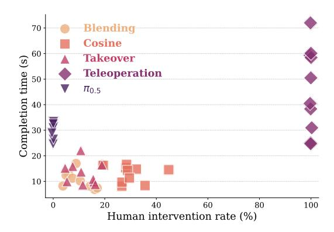

Figure A6: Completion time vs human intervention rates across all methods and tasks in LIBERO-PRO.

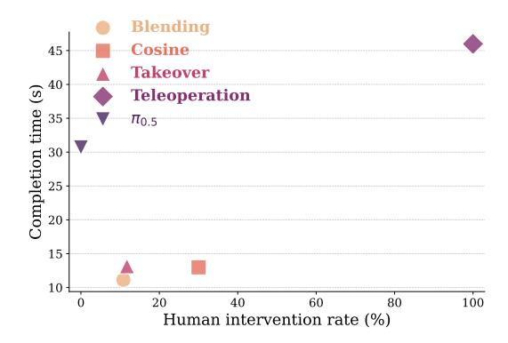

Figure A7: Completion time vs human intervention rate means across all methods and tasks in LIBERO-PRO.

episodes. Notably, ITPS and our method involve human intervention at comparable rates (roughly 75–85% of timesteps), so the advantage of Cosine arbitration over ITPS isolates the arbitration mechanism itself rather than the mere presence of a human operator.

Figure A8 reports the end-effector path length per episode. Cosine arbitration produces the most direct motions on nearly every subtask, while the autonomous base policy travels  $2-3\times$  farther for the same subtask, showing undirected exploratory motion that the human's coarse directional input efficiently suppresses under Cosine arbitration.

Figure A9 reports the mean time to complete each subtask, counting a failed episode as the full 400-step horizon so that the metric reflects an expected time-to-finish rather than rewarding methods for discarding their failures. Cosine arbitration and DynaGuide finish the articulated task fastest, typically well under 200 steps, whereas the base policy and ITPS are repeatedly dragged toward the 400-step cap by their failures.

Figure A10 shows a lower intervention rate for ITPS compared to Cosine, however ITPS has a much lower success rate (Figure 6), higher completion time (Figure A9), and higher end effector path length (Figure A8).

Figure A11 illustrates these differences qualitatively on button\_off. From an identical initial state, the base policy and ITPS fail to press the button and run out the full 400-step horizon, whereas DynaGuide and Cosine arbitration reach and press the button in well under 100 steps. Figure A12 and Figure A13 show examples of successes and failures for CALVIN subtasks.

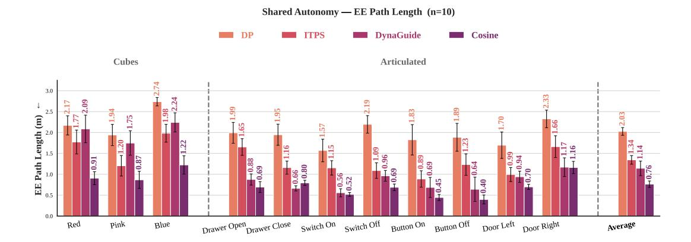

Figure A8: Mean end-effector path length (3-D arc length travelled per episode, in meters) across the four methods on 11 CALVIN subtasks (n=10 episodes per task; error bars: standard error of the mean). Cosine-similarity shared autonomy produces the most direct motions, consistently the shortest EE paths, while the autonomous baseline (DP) wanders most, often travelling 2–3× farther for the same task.

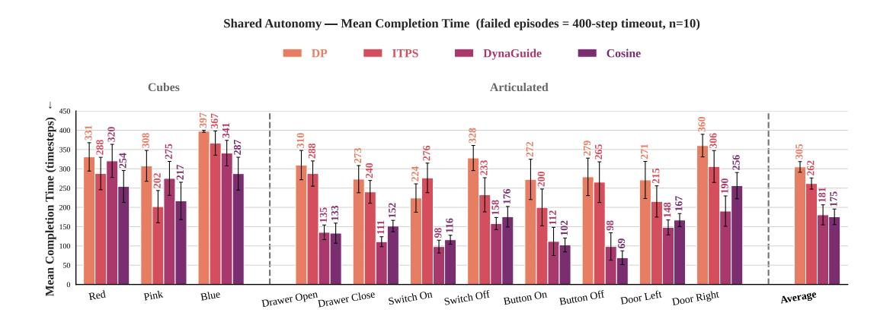

Figure A9: Mean subtask-completion time, in environment timesteps, across the four methods on 11 CALVIN tasks (n=10 episodes per subtask; error bars: standard error of the mean). Each episode contributes the timestep at which the subtask's success criterion is first met, or the full 400-step horizon if the episode failed, an expected time-to-finish that penalises low-success methods rather than discarding their failures. Cosine-similarity shared autonomy and DynaGuide complete the articulated subtasks fastest, while the autonomous baseline (DP), failing far more often, is dragged toward the 400-step cap.

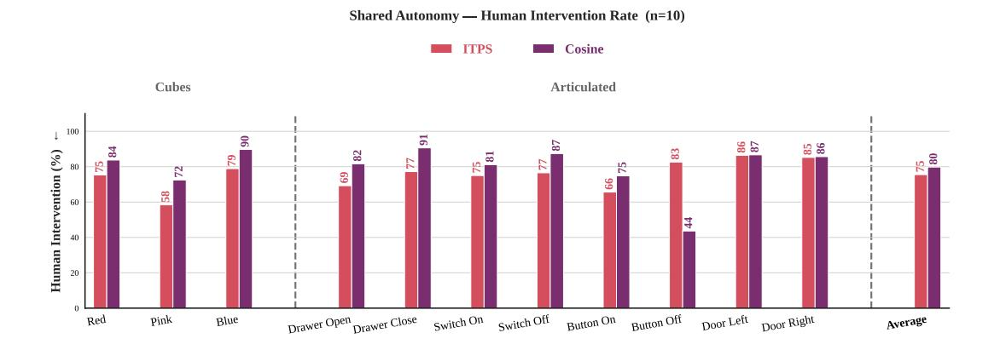

Figure A10: Mean human intervention rate across the two shared-autonomy methods on 11 CALVIN tasks (n=10 episodes per subtask), measured as the fraction of control timesteps with active human input. DP and DynaGuide are omitted (0% because there is no human in the loop). ITPS and Cosine differ by only 4.3 percentage points on average (75.5% vs 79.8%), so the success-rate advantage of Cosine over ITPS in Figure [6](#page-7-0) isolates the arbitration mechanism rather than the presence of a human operator.

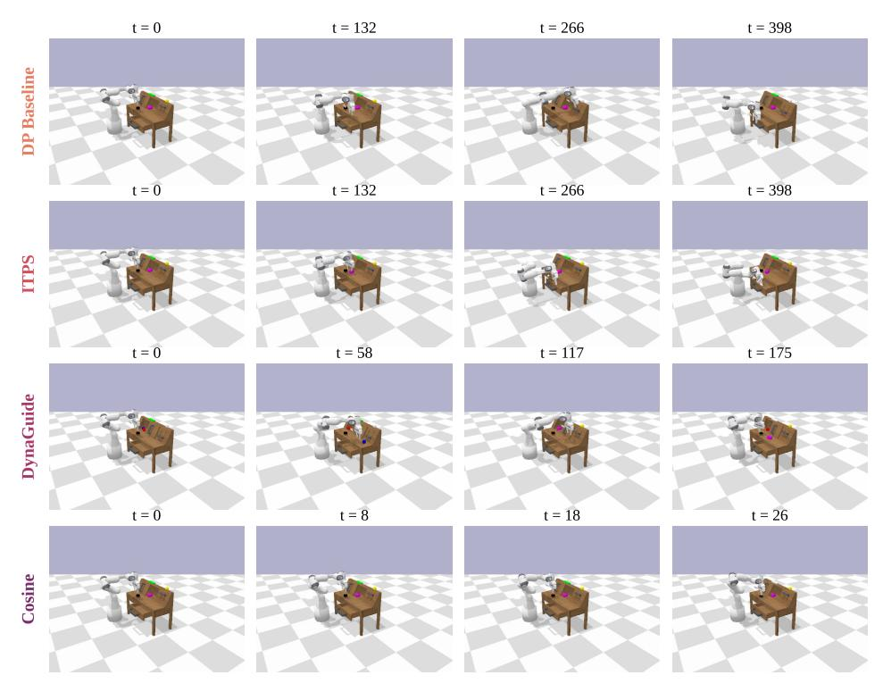

Figure A11: Qualitative rollout comparison on the button off subtask for CALVIN with DP. Each row is one method (DP, ITPS, DynaGuide, Cosine); the four columns are evenly-spaced frames from rollout 5, viewed from a fixed camera. All four rollouts begin from the same initial state (t=0). Because each episode ends at success or at the 400-step timeout, the rollouts span very different durations, so every frame is labeled with the environment timestep at which it is taken: DP and ITPS fail and run the full 400 steps without pressing the button, whereas DynaGuide and Cosine reach the button and complete the task in well under 200 steps.

#### **Cosine-Similarity Shared Autonomy on 4 CALVIN Tasks (All Successful)**

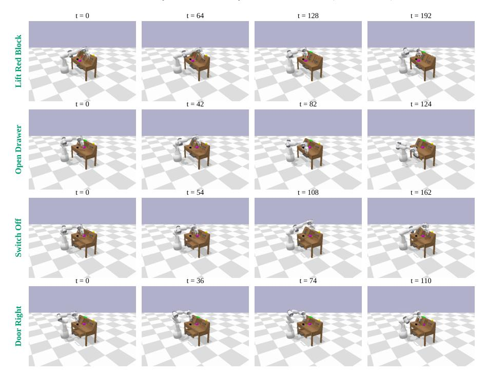

Figure A12: Qualitative rollout comparison for different subtasks in CALVIN. Shown with just Cosine guiding the DP policy.

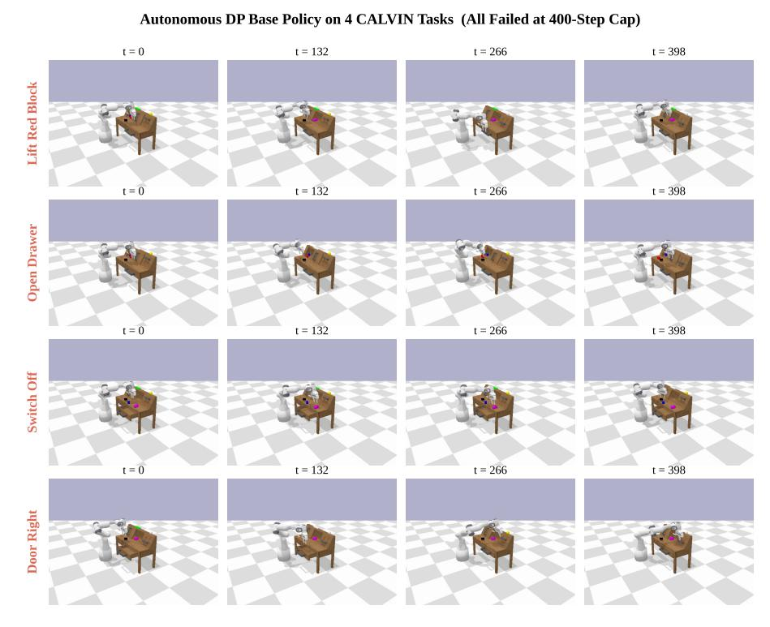

Figure A13: Qualitative rollout comparison for different subtasks in CALVIN. Shown with only the DP policy. Failures occur due to performing the wrong subtask (seen when performing the Door Right task), or due to stalling when out-of-distribution.

# A8 Additional Metrics for Real World

During each real-world hardware rollout, we track the human activation rate to evaluate whether the shared-autonomy behaviors observed in simulation transfer to physical robot execution. Human activation is defined as the percentage of control timesteps in which the operator provides input above the activity threshold. Pure Teleoperation requires human input throughout the entire rollout, corresponding to 100% intervention. In contrast, Cosine arbitration uses 63.9% intervention on Marker Plate, 54.6% on Close Drawer, and 68.7% on Open Cabinet, while Blending uses 53.9%, 48.5%, and 66.7% intervention on the same tasks. Both shared-autonomy methods significantly reduce human intervention relative to Teleoperation across all three hardware tasks using pairwise Mann–Whitney U tests, with p<1e−15 for all comparisons. These results show that SAPS transfers to real-world manipulation without reverting to continuous manual control. Instead, shared autonomy enables the operator to provide partial corrective input while π0.5 continues to contribute learned manipulation behavior during physical robot execution.

Table [2](#page-7-0) reports real-world task success rates across the three hardware tasks. Table A5 reports the corresponding human intervention rates and shows that the operator provides partial corrections while π0.5 continues to contribute learned manipulation behavior.

Figure [A14](#page-22-0) reports completion time across the hardware tasks. Both Cosine and Blending reduce completion time relative to autonomous π0.5, indicating that shared autonomy helps avoid inefficient autonomous recovery behavior. Figure [A15](#page-22-0) qualitatively shows successful executions of the three realworld tasks.

Table A5: (Hardware Evaluation of Mean Human Intervention (± Std Err) Across Shared Autonomy Methods (n = 20). Pairwise p-values comparing human intervention rates for Cosine and Blending shared autonomy against Teleoperation. Across Marker Plate, Close Drawer, and Open Cabinet, both shared-autonomy methods significantly reduce intervention relative to Teleoperation (p <10−15 for all comparisons).

| Task         | Teleoperation | Blending  | Cosine    |
|--------------|---------------|-----------|-----------|
| Marker Plate | 100±0         | 53.9±19.7 | 63.9±16.6 |
| Close Drawer | 100±0         | 48.5±12.7 | 54.6±24.0 |
| Open Cabinet | 100±0         | 66.7±13.6 | 68.7±14.5 |

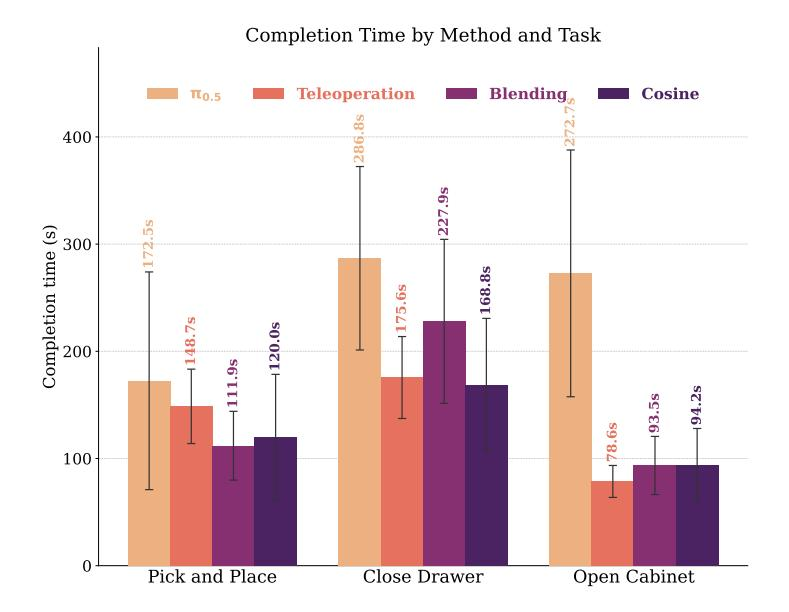

Figure A14: Mean Completion Time ( $\pm$  Std Err) Per Task Across Shared Autonomy methods (n=20 episodes/task). Pairwise p-values for hardware completion time comparisons. Cosine and Blending significantly reduce completion time relative to  $\pi_{0.5}$  execution on all tasks ( $p \le 0.0212$ ). Relative to Teleop, both methods are significantly different only on Marker Plate (Cosine: p = 0.0002, Blending: p = 0.0005), with no significant differences on Close Drawer or Open Cabinet.

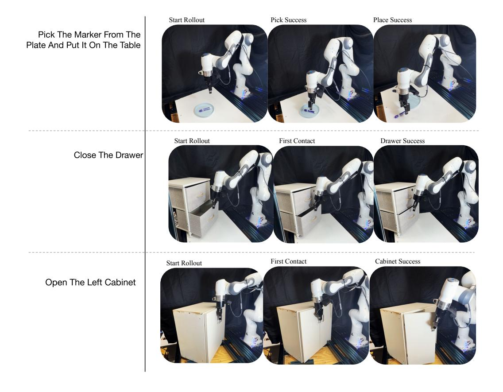

Figure A15: Real-world task progression for successful completion.