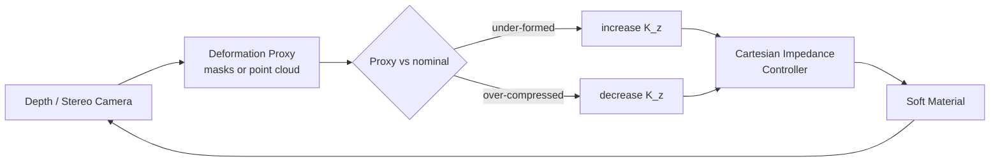
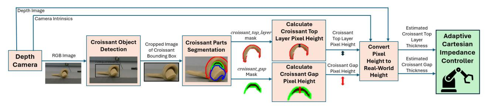
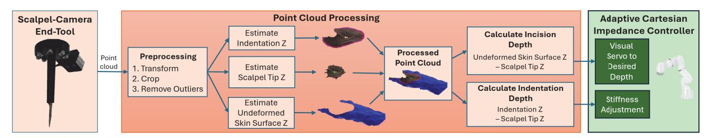

> **VAIRO** · Jeffrey Lee, Alexander Wong, Yue Hu · IEEE RO-MAN 2025 · DOI [10.1109/RO-MAN63969.2025.11217620](https://doi.org/10.1109/RO-MAN63969.2025.11217620)
> **VAISI** · Jeffrey Lee, Teresa Marotta, Stewart McLachlin, Alexander Wong, Yue Hu · IEEE-RAS Humanoids 2025
> Both: University of Waterloo (MME / SDE) — the <u><strong style="color:#a0399f">Active & Interactive Robotics Lab</strong></u>
> Sources: [VAIRO](<sources/VAIRO: A Vision-Based Adaptive Impedance-Control Robotic/VAIRO: A Vision-Based Adaptive Impedance-Control Robotic.md>) · [VAISI](<sources/VAISI: Vision-Based Adaptive Impedance Control for Surgical Incisions/VAISI: Vision-Based Adaptive Impedance Control for Surgical Incisions.md>)

> [!abstract] TL;DR
> ## Vision as a Substitute for a Force Sensor

Two papers, one recipe: manipulate a soft material whose mechanical properties are too variable to model, by using **vision to measure a deformation proxy** and feeding that proxy into the **stiffness term of a Cartesian impedance controller** — with no force/torque sensor and no material model anywhere in the loop. VAIRO rolls croissant dough with a Kinova Gen3, reading layer thickness and inter-layer gaps from YOLOv8 masks. VAISI cuts *ex vivo* porcine skin with a KUKA LBR Med, reading incision depth and skin indentation from an on-tool stereo point cloud. Both beat a constant-stiffness baseline; in both, the vision → stiffness mapping is hand-tuned rather than derived.

---

> [!info] Overview
> ## The Shared Argument

Model-based soft-material manipulation needs rheological or biomechanical parameters. Dough properties shift with flour, temperature, moisture, and fat; skin properties shift with body region, age, sex, and hydration. Both papers take the same position: **estimating those parameters online is not viable, so don't.** Instead, treat a *visually observable* deformation as direct evidence of whether the applied force is right, and close the loop on that.

The claimed novelty in VAIRO is that prior impedance-control work does not use vision feedback for force regulation; VAISI inherits the claim and adds the surgical instantiation.

---

> [!fact] Methodology
> ## Shared Substrate — Cartesian Impedance Control

Both build on Hogan's Cartesian impedance control. VAIRO writes it at the torque level for a 7-DoF arm:

$$
\tau_{ci} = J(q)^T\left(K_p(x_{des} - x) + K_d J(q)\dot{q}\right)
$$

| $\tau_{ci}\in\mathbb{R}^7$ | $K_p, K_d\in\mathbb{R}^{6\times6}$ | $J\in\mathbb{R}^{6\times7}$ | $q,\dot q\in\mathbb{R}^7$ | $x_{des}, x\in\mathbb{R}^6$ |
|---|---|---|---|---|
| joint torques for impedance behaviour | Cartesian stiffness / damping | robot Jacobian | joint positions / velocities | desired and current EE pose |

Damping is not adapted independently — it is slaved to stiffness at critical damping:

$$
K_d = 2\zeta\sqrt{K_p}, \qquad \zeta = 1
$$

> [!hint]- Note on $K_d$
> As written this omits the inertia term of the usual $D = 2\zeta\sqrt{KM}$, so the expression is not dimensionally consistent. Likely shorthand in the paper rather than the implementation; worth checking against the released controller if it ever appears.

The commanded torque adds inertial, Coriolis, and gravity compensation from the joint-space model $M(q)\ddot q + C(q,\dot q)\dot q + g(q) + \tau_{ext} = \tau_c$:

$$
\tau_c = \tau_{ci} + M(q)\ddot{q} + C(q,\dot{q})\dot{q} + g(q)
$$

Computed with **Pinocchio** for the rigid-body terms and Kinova's **Kortex API** for torque-mode communication at 1000 Hz. VAISI states the same behaviour at the wrench level, $F = M\Delta\ddot p + D\Delta\dot p + K(p_{des}-p)$, and notes the consequence that structures both papers: **$F$ is controllable through $p_{des}$, $K$, and $D$** — VAIRO modulates only $K$, VAISI modulates $K$ *and* $p_{des}$.

In both, only the **z-axis** (surface normal) stiffness adapts; all other translations and rotations are held stiff for trajectory tracking. VAIRO adds a specific reason for high *orientation* stiffness: it keeps the rolling force uniform across the width of the dough.

<!-- TODO: Convert the Mermaid below to Excalidraw and embed as ![[VAIRO-VAISI Shared Loop|100%]] -->



---

> [!fact] Methodology
> ## VAIRO — Croissant Rolling

<div align="center"></div>

**Task reduction.** The end-effector is designed as a flat "palm" with a rounded "fingertip" of *uniform width*, so force is applied evenly across the croissant. That symmetry reduces a 3D manipulation problem to a 2D one, which is what licenses off-the-shelf 2D vision tooling (Roboflow, YOLOv8) instead of 3D reasoning.

**Two-stage perception.** YOLOv8 detection finds a bounding box on `rolling_croissant_dough`; YOLOv8 segmentation then runs *only inside that crop* to produce `croissant_top_layer`, `croissant_core`, and `croissant_gap` masks. The stated reason for the two stages is discriminative rather than computational: segmenting the whole scene would require extra training to stop shadows registering as inter-layer gaps, whereas segmenting a known croissant lets dark regions be read as gaps directly. Fine-tuned on 238 hand-labelled images.

**Thickness estimation.** Heights are measured at the contact point — the mask pixel with the largest $y$ — with $N = 10$ px of lateral padding to suppress noise:

```python
def compute_real_mask_height(mask: np.ndarray,
                             depth: np.ndarray,
                             intrinsics: CameraIntrinsics,
                             n_pad: int = 10) -> float:
    '''
    Estimate the real-world thickness of a croissant part.
    The contact point p_ctr is the mask pixel with the greatest
    y (i.e. the topmost point touching the end-tool), which is
    the most critical region for real-time feedback. Heights are
    averaged over a +/- n_pad window to reduce measurement noise.
    Returns the mean height in metres.
    '''
    x_ctr = topmost_pixel(mask).x
    heights = []
    for x_i in range(x_ctr - n_pad, x_ctr + n_pad):
        y_top = highest_mask_pixel(mask, x_i)
        y_btm = lowest_mask_pixel(mask, x_i)
        # deproject both to metric coordinates before differencing
        r_top = deproject(x_i, y_top, depth, intrinsics)
        r_btm = deproject(x_i, y_btm, depth, intrinsics)
        heights.append(r_top.z - r_btm.z)
    return float(np.mean(heights))
```

**Trajectory.** The nominal rolling path comes from the roll-length relation $l = \pi h^2 / (4t)$, inverted to give the height the tool should be at after rolling distance $x$:

$$
z = \sqrt{\frac{4xt}{\pi}}
$$

The commanded trajectory is then offset **10% below** this — determined experimentally — because static friction is what pulls the dough over itself, and any slip loses the contact irrecoverably.

**Stiffness law.** The z-stiffness is a nominal value corrected by two opposing terms:

$$
\boxed{K_p = K_{p,\text{nom}} - K_{p,\text{layer}} + K_{p,\text{gap}}}
$$

$$
K_{p,\text{layer}} = \begin{cases}
0 & \text{if } t_{\text{layer}} \leq t_{\text{nom}} \\[4pt]
K_{p,\text{nom}} \times \left(1 - \dfrac{t_{\text{nom}} - t_{\text{layer}}}{t_{\text{nom}}}\right) & \text{if } t_{\text{layer}} > t_{\text{nom}}
\end{cases}
$$

$$
K_{p,\text{gap}} \mathrel{+}= K_{p,\text{nom}} \times \frac{t_{\text{gap}}}{t_{\text{nom}}} \div 100
$$

> [!hint]- ⚠ Eq. 8 appears inconsistent with its own rationale
> The prose says a **compressed** top layer (thinner than nominal) signals excessive pressure and should reduce stiffness. But the non-zero branch fires when $t_{\text{layer}} > t_{\text{nom}}$ — a layer *thicker* than nominal — and in that branch $(t_{\text{nom}} - t_{\text{layer}}) < 0$, making the bracket $> 1$ and therefore $K_{p,\text{layer}} > K_{p,\text{nom}}$, which drives $K_p$ negative through Eq. 7. Either the inequality or the sign inside the bracket is likely a typo. Worth resolving before reusing the law.

**The asymmetry is the real design decision.** $K_{p,\text{layer}}$ is *instantaneous* — applied only at the moment a compressed layer is observed, then released. $K_{p,\text{gap}}$ is *cumulative* (`+=`) and persists for the remainder of the roll. The reason is empirical: with instantaneous gap gains, stiffer materials produced oscillatory stiffness, and every downswing re-opened gaps. Making the gap term ratchet upward encodes "stiff material stays stiff," while the instantaneous layer term still provides relief against overshoot.

---

> [!fact] Methodology
> ## VAISI — Surgical Incisions

<div align="center"></div>

**Eye-in-hand end-tool.** The RealSense D405 is mounted *on* the scalpel, 7 cm from the blade heel (the D405's minimum range, where it claims 0.1 mm accuracy), angled 30° and aligned parallel to the blade. Three reasons given: reduce occlusion of the tissue by the scalpel itself; get enough standoff to image highly curved deforming surfaces; and exploit the tool's vertical height for that standoff so the cross-sectional footprint stays small enough for a surgical field.

**Two feedback signals, two distinct control roles.** This is the structural advance over VAIRO:

- `incision_depth` — how deep the blade is relative to *undeformed* tissue → drives $p_{des}$ via visual servoing.
- `indent_depth` — how much the tissue is being pushed rather than cut → drives $K$.

```python
def compute_skin_features(pc: PointCloud) -> tuple[float, float]:
    '''
    Extract incision depth and indentation depth from one cloud.
    The cloud is expressed in the Scalpel Tip Frame and cropped to
    a 2 cm radius box around its origin. Indentation is assumed to
    form a 3D Gaussian, so its rim is the local-maxima radius
    nearest the origin. Returns (incision_depth, indent_depth).
    '''
    pc = crop(transform_to_scalpel_tip(pc), radius_m=0.02)
    # statistical outlier removal: 25 nearest neighbours,
    # drop points beyond 1 sigma of the global mean distance
    pc = remove_statistical_outliers(pc, k=25, std_ratio=1.0)

    scalpel_tip_z = mean_z(nearest_to_axis(pc, n=10))
    indent_r = nearest_local_maxima_radius(pc)
    indent_z = mean_z(points_at_radius(pc, indent_r))
    nominal_skin_z = mean_z(points_beyond_radius(pc, indent_r))

    indent_depth = indent_z - scalpel_tip_z
    incision_depth = nominal_skin_z - scalpel_tip_z
    return incision_depth, indent_depth
```

**Control law.** A PID (gains 0.75, 0.25, 0.05) drives depth, with a hard cap at 1.5× the desired depth so a runaway cannot reach underlying anatomy. Stiffness moves in fixed ±5 N/m steps on the sign of the indentation change — if the tissue keeps indenting, the blade is pushing rather than cutting, so push harder:

```python
def incision_control(incision_depth: float,
                     indent_depth: float,
                     state: ControlState) -> Pose:
    '''
    Drive the blade to desired_depth, then sweep in x.
    Overshoot is capped at 1.5x desired_depth to protect the
    anatomy beneath the incision site. Stiffness ratchets on the
    sign of the indentation change: sustained or growing
    indentation means insufficient force to split the tissue.
    '''
    while incision_depth < state.desired_depth:
        state.p_des.z = min(state.pid_z(incision_depth),
                            state.desired_depth * 1.5)
        if indent_depth >= state.previous_indent_depth:
            state.k_z += 5
        else:
            state.k_z -= 5
        state.previous_indent_depth = indent_depth
    # depth PID stays active throughout the lateral cut
    for _ in range(state.n_x_steps):
        state.p_des.z = min(state.pid_z(incision_depth),
                            state.desired_depth * 1.5)
        state.p_des.x += state.x_step
    return state.p_des
```

---

> [!info] Implementation Tricks
> ## Decisions Worth Stealing

- **Physically isolate the camera from the robot (VAIRO).** Mounted off-arm, perpendicular to the rolling direction, so arm motion does not inject vibration into the depth measurement. VAISI abandons this for an on-tool camera and immediately pays for it — measurement noise grows with commanded velocity, explicitly attributed to camera vibration.
- **Nominal-stiffness identification by probing (VAIRO).** With no material model, the nominal $K_p$ is found by lowering the tool onto the material and ramping stiffness until a **1% height loss** is detected. A model-free calibration primitive that transfers to any material with a visible height.
- **Constrain segmentation to a detection crop** to change what a classifier is *allowed* to confuse — dark pixels become gaps rather than shadows.
- **Validate the sensor on a material that doesn't deform (VAISI).** Foam is penetrable with minimal deformation, so vision error can be measured against robot z-displacement without tissue mechanics confounding it.
- **Divide-by-100 damping of the adaptation rate (VAIRO Eq. 9).** Without it, stiffness ramped faster than the vision loop could observe the resulting compression — a pure rate-mismatch fix between a 60 Hz sensor and a 1000 Hz controller.

---

> [!hint] Experiments & Findings
> ## VAIRO — Four "Doughs", 10 Trials Each

Materials sheeted to 3 mm and cut into 140 mm equilateral triangles: puff pastry, Play-Doh, Creatology sensory dough, Crayola modeling clay. Measured stiffness ranks Creatology < Play-Doh < puff pastry < Crayola. Nominal $K_p$ fixed at **100 N/m**; ideal rolled height 17.60 mm.

Perception: detection mAP50 **0.994** (3 classes), segmentation mAP50 **0.889** (3 classes), running at 60 Hz.

Mean error from ideal height and sample variance, VAIRO vs. constant 100 N/m:

| Material | VAIRO ME [mm] | VAIRO $\sigma^2$ | Constant ME [mm] | Constant $\sigma^2$ |
|---|---|---|---|---|
| Puff pastry | **−0.21** | **0.58** | −2.76 | 3.55 |
| Play-Doh | **−0.10** | **0.24** | −2.52 | 0.45 |
| Creatology sensory dough | **0.18** | 0.57 | −2.97 | **0.13** |
| Crayola modeling clay | +0.51 | **0.09** | +0.57 | 0.43 |

The headline case is puff pastry, whose rheology drifts measurably *between trials* as it thaws — constant stiffness produced 6–7× the variance and outliers compressed to ~12 mm, while VAIRO held −0.21 mm mean error.

> [!hint]- ⚠ Where the comparison is weaker than it reads
> **The baseline is chosen at the nominal value.** 100 N/m sits above the measured stiffness of two of the four materials, so constant-stiffness rolling is structurally guaranteed to over-compress them. The three large negative MEs in the constant column are close to a foregone conclusion.
> **On the stiffest material the accuracy gain vanishes** — Crayola ME +0.51 (VAIRO) vs +0.57 (constant). Only the variance separates them (0.09 vs 0.43).
> **On Creatology, VAIRO is worse on variance** (0.57 vs 0.13) while much better on mean error, so "improves precision" does not hold uniformly across materials.
> **The force-regulation claim is not actually validated.** The authors state plainly that the Gen3's high joint friction produced latency and undesired forces uncorrelated with commanded stiffness, "inhibiting proper analysis of the force regulation." What is demonstrated is *final geometry*, not force.

---

> [!hint] Experiments & Findings
> ## VAISI — *Ex Vivo* Porcine Skin

**Sensor characterisation on foam** (vs. robot z-displacement as ground truth):

| Velocity [mm/s] | Bias [mm] | Noise (σ of residuals) [mm] |
|---|---|---|
| 0.5 | −0.144 | 0.144 |
| 1.0 | −0.372 | 0.202 |
| 1.5 | −0.321 | 0.130 |
| 2.0 | −0.717 | 0.225 |

Degradation with speed is attributed to PCL processing at only **4–8 Hz** on a Ryzen 7 7745HX, plus camera vibration. All subsequent incisions were therefore capped at **0.5 mm/s**.

**Baseline.** A constant 200 N/m fails outright — force converges to steady state while depth plateaus short of target. The paper's own framing is that this "highlights the necessity of stiffness adaptation."

**VAISI**, 10 trials per condition, caliper-measured at start / middle / end:

| Condition | ME [mm] (start/mid/end) | Max undershoot | σ [mm] |
|---|---|---|---|
| Belly, 5 mm | −2.30 / −1.87 / −1.70 | −2.60 | 0.48–1.06 |
| Hock, 5 mm | −0.46 / 0.03 / −0.24 | −1.85 | ~1.23 |
| Belly, 10 mm | −0.18 / −0.70 / −0.74 | −1.85 | 0.71–0.86 |
| Hock, 10 mm | 0.56 / 0.57 / 0.47 | −1.22 | 0.82–1.00 |

The belly-5 mm failure has a clean mechanical explanation: belly specimens carry a thick fat layer under a skin layer itself close to 5 mm, so the tissue deforms under the blade instead of staying taut enough to split.

> [!hint]- ⚠ Three things to weigh
> **The abstract overstates.** It claims "sub-millimeter depth-accurate cuts with a maximum standard deviation of 1.23 mm," but belly-5 mm runs −2.30 mm mean error. The body is honest about this — "sub-millimeter mean errors for **three of the four** test cases" — the abstract is not.
> **The baseline is built to fail.** 200 N/m was selected as a deliberately low constant stiffness; it never reaches depth in any trial. This establishes that *some* adaptation is needed, but it does not isolate adaptive stiffness against a well-tuned constant stiffness — the comparison VAIRO at least attempts.
> **Half the control law never executed.** Indentation increased monotonically through every incision, so the `k_z -= 5` branch never fired. The authors attribute this to the triangular #11 blade geometry preventing tissue relaxation, and concede the reduction "was not necessary in this case" though it might matter for a uniform instrument like a needle. The symmetric adaptation law is, in effect, untested in one direction.
> Also: vision accuracy is characterised only on **foam**, never on deforming tissue, and 0.5 mm/s is far below surgical speed.

---

> [!hint] Comparison
> ## What Changed Between the Two

| | **VAIRO** (RO-MAN 2025) | **VAISI** (Humanoids 2025) |
|---|---|---|
| Robot | Kinova Gen3 (torque mode, Kortex + Pinocchio) | KUKA LBR Med |
| Camera placement | Off-arm, physically isolated | Eye-in-hand, on the scalpel tool |
| Perception | Learned — YOLOv8 detect + segment, 238 images | Classical — PCL point-cloud geometry, no learning |
| Perception rate | 60 Hz | 4–8 Hz (the binding constraint) |
| Adapts | $K$ only; $p_{des}$ from a precomputed roll trajectory | $K$ **and** $p_{des}$ simultaneously |
| Adaptation law | Two-term, asymmetric (instantaneous ↓, cumulative ↑) | Symmetric fixed ±5 N/m step |
| Deformation proxy | Layer thickness + inter-layer gap | Indentation depth |
| Baseline | Constant 100 N/m (nominal) | Constant 200 N/m (fails outright) |
| Verdict | Geometry improved; force regulation unverified (joint friction) | Depth accuracy good in 3/4 cases; stiffness-down branch untested |

The two papers share a weakness worth naming: **the mapping from visual measurement to stiffness increment is hand-tuned in both** — the $\div 100$ in VAIRO, the $\pm 5$ N/m in VAISI — with no principled derivation and no sensitivity analysis. VAIRO's future work says so explicitly, calling for "better measurement to stiffness adjustment mappings." That gap is the obvious opening for a learned adaptation law, and connects directly to [[Haptic-Fused Visuomotor Policy Learning]], where the same coupling is approached from the policy side rather than the controller side.

**Neither releases code or data.** Both adaptation laws are a few lines and trivially reimplementable, so this is a moderate rather than fatal limitation — but the vision components (238-image YOLOv8 fine-tune; PCL indentation-radius extraction) are not reproducible without the datasets, and the tool designs are not published as CAD.

VAIRO's conclusion explicitly names "surgical operations on soft tissue" as a translation target, and VAISI is that translation — useful evidence that the group treats the framework, not the application, as the contribution.

---

> [!fact] Reflection
> ## My Read


