# Action-to-Action Flow Matching

[Jindou Jia](https://jiajindou.github.io/)1,∗ , [Gen Li](https://reagan1311.github.io/)1,∗ , [Xiangyu Chen](https://xyc0212.github.io/)1 , [Tuo An](https://morpheus-an.github.io/)1 , Yuxuan Hu1 , Jingliang Li1 , Xinying Guo1 , [Jianfei Yang](https://marsyang.site/)1

Diffusion-based policies have recently achieved remarkable success in robotics by formulating action prediction as a conditional denoising process. However, the standard practice of sampling from random Gaussian noise often requires multiple iterative steps to produce clean actions, leading to high inference latency that incurs a major bottleneck for real-time control. In this paper, we challenge the necessity of uninformed noise sampling and propose Action-to-Action flow matching (A2A), a novel policy paradigm that shifts from random sampling to initialization informed by the previous proprioceptive action. Unlike existing methods that treat proprioceptive action feedback as static conditions, A2A leverages historical proprioceptive sequences, embedding them into a high-dimensional latent space as the starting point for action generation. This design bypasses costly iterative denoising while effectively capturing the robot's physical dynamics and temporal continuity. Extensive experiments demonstrate that A2A exhibits high training efficiency, fast inference speed, and improved generalization. Notably, A2A enables high-quality action generation in as few as a single inference step, and exhibits superior robustness to visual perturbations and enhanced generalization to unseen configurations. Lastly, we also extend A2A to video generation, demonstrating its broader versatility in temporal modeling. Project site: [https://lorenzo-0-0.github.io/A2A\\_Flow\\_Matching](https://lorenzo-0-0.github.io/A2A_Flow_Matching).

Correspondence: [jindou.jia@ntu.edu.sg](mailto:jindou.jia@ntu.edu.sg), [jianfei.yang@ntu.edu.sg](mailto:jianfei.yang@ntu.edu.sg)

## 1 Introduction

Recent advances in imitation learning architectures have significantly expanded the capabilities of robotic systems operating in complex and unstructured environments [\(Ai et al.,](#page-12-0) [2025\)](#page-12-0). Among these, diffusion-based policies [\(Ho et al.,](#page-12-1) [2020;](#page-12-1) [Lipman et al.,](#page-13-0) [2023;](#page-13-0) [Chi et al.,](#page-12-2) [2025;](#page-12-2) [Intelligence et al.,](#page-12-3) [2025a\)](#page-12-3) have emerged as a powerful paradigm for modeling the intrinsic multi-modality of human demonstrations. These methods formulate action generation as a conditional denoising process: during training, a neural network learns to predict injected noise, while at inference time, executable actions are obtained by iteratively denoising samples initialized from random noise.

Despite their strong empirical performance on high-precision and multi-modal tasks, diffusion models suffer from a well-known limitation: the "denoise-from-scratch" paradigm incurs substantial inference latency [\(Pan](#page-13-1) [et al.,](#page-13-1) [2026\)](#page-13-1). Generating a single action typically requires dozens of iterative denoising steps, creating a major bottleneck for real-time robotic control, where low cycle time and rapid feedback are essential for stable execution. To mitigate this limitation, prior work has explored improving the initialization of the diffusion process to accelerate inference. For instance, [Wagenmaker et al.](#page-14-0) [\(2025\)](#page-14-0) propose an RL-trained policy to steer the initial sampling distribution, while [Scholz and Turner](#page-13-2) [\(2025\)](#page-13-2) employ warm-start strategies to identify more informative starting points. These approaches replace uninformed Gaussian noise with priors closer to the data distribution, often through auxiliary models that predict distributional statistics conditioned on the current observation. While effective, such approaches still rely on stochastic noise initialization and inevitably introduce additional modeling complexity.

This observation raises a more fundamental question: do robotic policies truly need to be generated by sampling from random noise? Diffusion models were originally developed for high-fidelity image synthesis and video generation [\(Ho et al.,](#page-12-1) [2020;](#page-12-1) [Song et al.,](#page-13-3) [2021a;](#page-13-3) [Rombach et al.,](#page-13-4) [2022;](#page-13-4) [Lipman et al.,](#page-13-0) [2023;](#page-13-0) [Liu et al.,](#page-13-5) [2023b;](#page-13-5) [Blattmann et al.,](#page-12-4) [2023\)](#page-12-4), where generation typically begins from uninformed noise due to the absence of meaningful priors. Robot control, however, operates under a fundamentally different regime. Modern robots

1MARS Lab, Nanyang Technological University

∗Equal contribution

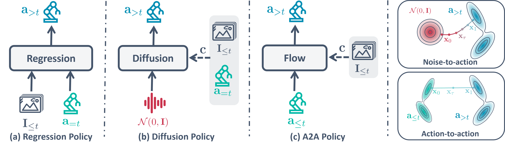

Figure 1 Comparison of robotic policy paradigms. (a) Regression Policy: Deterministic mapping from multi-modal inputs to actions. (b) Diffusion Policy: Generative modeling via iterative denoising from Gaussian noise. (c) A2A Policy: Informed action generation through a structured flow between historical and future actions. Action-to-action allows for more efficient transport than noise-to-action, enabling one-step flow mapping feasible even with a lightweight MLP architecture.

are equipped with rich state sensors that provide continuous, low-latency feedback about the system's configuration and dynamics [\(Jia et al.,](#page-13-6) [2025b,](#page-13-6) [2024\)](#page-13-7). This structured feedback constitutes a strong and reliable prior, naturally encoding the robot's current physical state or recent execution history, and thus offers a principled alternative to random noise initialization for action generation [\(Jia et al.,](#page-13-8) [2025a\)](#page-13-8).

However, as shown in Fig. [1](#page-1-0) (a) and (b), most existing approaches adhere to either regression- or diffusionbased paradigms that condition action generation on a simple concatenation of the current proprioceptive state/action and visual observations. Such designs overlook the temporal continuity intrinsic to robotic motion and often dilute low-dimensional proprioceptive signals when fused directly with high-dimensional visual representations. Moreover, recent studies show that explicit conditioning on proprioceptive states can adversely affect spatial generalization [\(Zhao et al.,](#page-14-1) [2025a\)](#page-14-1). Consequently, rich historical information about system dynamics and action trends remains largely underexploited in prevailing frameworks. Notably, diffusion models define mappings between probability distributions rather than individual states. This perspective motivates a natural question: can the inherent proximity between distributions of past executions and future actions be exploited to reduce learning complexity, yielding a shorter and more stable transport path for policy generation?

To this end, we propose Action-to-Action Flow Matching (A2A), a novel flowing matching-based policy paradigm that shifts action generation from uninformed sampling to informed initialization. Unlike prior approaches that initialize the diffusion process with standard Gaussian noise, A2A directly leverages a sequence of historical proprioceptive actions as the starting point for action generation, as illustrated in Fig. [1.](#page-1-0) To capture subtle motion patterns and temporal dependencies, these low-dimensional action histories are embedded into a high-dimensional latent space. By learning a flow that transports historical action distributions to future actions, A2A bypasses the costly iterative denoising process from Gaussian noise. We evaluate A2A extensively in both simulated environments and real-world robotic systems. Empirically, our method exhibits remarkable training efficiency and consistently outperforms 8 state-of-the-art baselines. In particular, A2A achieves significantly faster inference convergence, i.e., up to 20× and 5× faster than vanilla diffusion and flow matching methods, respectively, while enabling high-quality action generation in as few as a single inference step. Moreover, grounding the generation process in proprioceptive history substantially improves robustness to visual perturbations, and the history-informed initialization enhances generalization to unseen configurations by enforcing physical consistency over time.

In summary, we introduce a new diffusion-based robot policy paradigm that replaces stochastic noise initialization with history-based proprioceptive initialization, enabling informed action generation grounded in the robot's own dynamics. Leveraging latent state representations, A2A captures fine-grained motion structure and supports efficient action-to-action transitions without iterative denoising from random noise. Extensive experiments in both simulated and real-world robotic environments demonstrate that our method achieves state-of-the-art performance across training efficiency, inference speed, robustness to visual perturbations, and generalization to unseen configurations. Furthermore, we showcase the applicability of A2A in robotic video generation, suggesting promising potential for broader scalability.

## 2 Related work

#### 2.1 Visuomotor policy

Visuomotor policy is a robot learning framework that maps raw sensory observations, typically high-dimensional visual inputs and low-dimensional robotic states, directly into low-level control actions. Early approaches, such as action chunking (ACT) [\(Zhao et al.,](#page-14-2) [2023\)](#page-14-2), utilized a conditional variational autoencoder with Transformers [\(Vaswani et al.,](#page-13-9) [2017\)](#page-13-9) to learn fine-grained bimanual manipulation by predicting future action sequences. Diffusion policy [\(Chi et al.,](#page-12-2) [2025\)](#page-12-2) introduced a diffusion generative paradigm by modeling the action distribution as a score-based gradient field [\(Ho et al.,](#page-12-1) [2020;](#page-12-1) [Song et al.,](#page-13-10) [2021b\)](#page-13-10), significantly improving stability in multi-modal environments. Flow matching [\(Lipman et al.,](#page-13-0) [2023\)](#page-13-0) used in Vision-Language-Action (VLA) models, like π family [\(Intelligence et al.,](#page-12-3) [2025a,](#page-12-3)[b;](#page-12-5) [Black et al.,](#page-12-6) [2024\)](#page-12-6), has sought to simplify the generative process by learning straight-line probability paths between noise and action distributions. More recently, [Pan et al.](#page-13-1) [\(2026\)](#page-13-1) suggest that the selection of advanced model architectures (e.g., DiT [\(Peebles and](#page-13-11) [Xie,](#page-13-11) [2023\)](#page-13-11) and UNet[\(Chi et al.,](#page-12-2) [2025\)](#page-12-2)) and action chunking strategy [\(Zhao et al.,](#page-14-2) [2023\)](#page-14-2) has a more significant impact on the success of flow matching than the regression method.

Despite these successes, diffusion methods suffer from high computational costs due to their iterative multi-step inference nature and complex architectures. Conversely, the vision-to-action model (VITA) [\(Gao et al.,](#page-12-7) [2026\)](#page-12-7) pursues architectural minimalism by employing a lightweight Multi-Layer Perceptron (MLP) backbone for direct vision-to-action mapping. However, VITA relies completely on visual inputs, making it vulnerable to environmental visual distractors. Furthermore, VITA exhibits a dimensionality mismatch within its flow space. Recent efforts such as MeanFlow-based policies [\(Fang et al.,](#page-12-8) [2025;](#page-12-8) [Geng et al.,](#page-12-9) [2025b\)](#page-12-9) and consistency models [\(Zhang et al.,](#page-14-3) [2025;](#page-14-3) [Li et al.,](#page-13-12) [2026b;](#page-13-12) [Song et al.,](#page-13-13) [2023\)](#page-13-13) have begun to push one-step generation into robotic action prediction by optimizing the theoretical boundaries of the noise-to-action mapping. In contrast, A2A exploits the physical continuity of actions to directly map proprioceptive historical actions to future actions, fundamentally shortening the generative path and enabling high-performance single-step generation.

#### 2.2 Noise optimization of diffusion

In image and video synthesis, optimizing initial noise is a key strategy for enhancing generation quality and speed [\(Ahn et al.,](#page-12-10) [2024;](#page-12-10) [Mao et al.,](#page-13-14) [2024;](#page-13-14) [Samuel et al.,](#page-13-15) [2024;](#page-13-15) [Eyring et al.,](#page-12-11) [2024;](#page-12-11) [Scholz and Turner,](#page-13-2) [2025\)](#page-13-2). For example, [Ahn et al.](#page-12-10) [\(2024\)](#page-12-10) eliminate the need for computationally expensive guidance techniques by learning to map standard Gaussian noise to a guidance-free noise space through a lightweight LoRA module [\(Hu et al.,](#page-12-12) [2022\)](#page-12-12). Similarly, warm-start diffusion [\(Scholz and Turner,](#page-13-2) [2025\)](#page-13-2) utilizes a deterministic model to provide an informed mean and variance of the initial Gaussian distribution based on context, reducing the sampling path. In robotics, however, noise optimization is rarely explored. [Wagenmaker et al.](#page-14-0) [\(2025\)](#page-14-0) adapts behavioral cloning policies by running reinforcement learning over the latent-noise space, allowing the agent to steer robot actions without altering the base policy weights.

Departing from the long transport paths of the noise-to-data paradigm, [Chen et al.](#page-12-13) [\(2024\)](#page-12-13) leverage informative initial distributions, yet remains constrained by its dependence on heuristic or pre-trained models. Our A2A introduces an action-to-action transport mechanism. By directly employing clean historical data as the initial distribution, we leverage the physical continuity of robotic motion to place the starting point much closer to the target in the high-dimensional latent space. This reduced distributional gap bypasses the need for multi-step refinement, enabling high-fidelity single-step inference optimized for real-time robotic control.

## 3 Action-to-action flow matching

#### 3.1 Flow matching

We adopt flow matching (Lipman et al., 2023) as the algorithmic foundation, given its widespread adoption in the robotics field (Black et al., 2024; Intelligence et al., 2025a; Bjorck et al., 2025). Flow matching provides a simulation-free training objective that learns to transform a source distribution  $p_0 = \mathcal{N}(\mathbf{0}, \mathbf{I})$  into a target data distribution  $p_1 = p_{\text{data}}$  over  $\mathbb{R}^d$ . Let  $p_\tau : \mathbb{R}^d \to \mathbb{R}_{>0}$  denote a time-dependent probability density for  $\tau \in [0, 1]$ , defining a probability path that interpolates between  $p_0$  and  $p_1$ . This path is generated by a time-dependent vector field  $\mathbf{v} : [0, 1] \times \mathbb{R}^d \to \mathbb{R}^d$  via the ordinary differential equation (ODE)

$$\frac{d\mathbf{x}_{\tau}}{d\tau} = \mathbf{v}_{\tau}(\mathbf{x}_{\tau}), \qquad \mathbf{x}_{0} \sim p_{0}, \tag{1}$$

where  $\mathbf{x}_{\tau} \in \mathbb{R}^d$  denotes the state at flow time  $\tau$ .

The optimal transport displacement map (Lipman et al., 2023) is adopted, which is formalized as  $\mathbf{x}_{\tau} = (1 - \tau)\mathbf{x}_0 + \tau\mathbf{x}_1$ . The goal is to train a neural network  $f_{\theta}(\mathbf{x}_{\tau}, \tau, \mathbf{c})$  parameterized by  $\theta$  to approximate the conditional vector field, where  $\mathbf{c}$  represents the external conditioning (e.g., visual observations and proprioceptive states). The flow matching loss is defined as

$$\mathcal{L}_{FM} = \mathbb{E}_{\tau \sim \mathcal{U}[0,1], \mathbf{x}_0 \sim p_0, \mathbf{x}_1 \sim p_1} \left\| f_{\theta}(\mathbf{x}_{\tau}, \tau, \mathbf{c}) - \mathbf{v}_{\tau}(\mathbf{x}_{\tau}) \right\|^2.$$
(2)

With the learned  $f_{\theta}(\mathbf{x}_{\tau}, \tau, \mathbf{c})$ , sampling in the inference phase is usually conducted via discretized *Euler* integration.

#### 3.2 Action to action flow

Different from previous generative-based polices that denoise from *Gaussian* distributions (Ho et al., 2020; Lipman et al., 2023; Chi et al., 2025), A2A aims to learn a policy from a proprioceptive historical action space to a future action space, as depicted in Fig. 1(c). The formulation of the action **a** is task-dependent and can accommodate

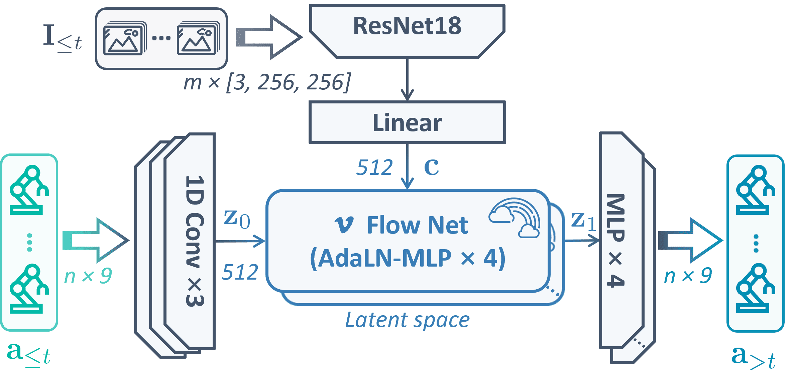

Figure 2 Overview of A2A architecture. The framework consists of three main components. 1) A condition path that encodes visual observations using a ResNet-18 backbone and a linear projector to generate a global condition c. 2) A source path that employs a CNN with a 5 kernel size to compress the n-frame history actions into a latent starting point  $\mathbf{z}_0$ . 3) A flow-based generation process. The flow net, built with AdaLN-MLP blocks, predicts the vector field to transport  $\mathbf{z}_0$  to the target latent  $\mathbf{z}_1$  within a unified 512-dimensional latent space. Finally, a residual MLP decoder transforms  $\mathbf{z}_1$  into the future action sequence.

various control modalities, including joint positions and end-effector states. We chose the joint angles in simulation and the end-effector states in experiments. Given historical actions  $\mathbf{a}_{\leq t} = \{\mathbf{a}_{t-n+1}, \dots, \mathbf{a}_t\}^1$ , visual observations  $\mathbf{I}_{\leq t} = \{\mathbf{I}_{t-m+1}, \dots, \mathbf{I}_t\}$ , next actions  $\mathbf{a}_{>t} = \{\mathbf{a}_{t+1}, \dots, \mathbf{a}_{t+n}\}$ , where n and m represent the action and observation horizons, respectively. The A2A framework transforms the distribution of historical actions directly into the distribution of future actions via a conditional flow in a shared latent space  $\mathcal{Z}$ .

Fig. 2 details the A2A architecture. Concretely, the proposed architecture leverages a Convolutional Neural Network (CNN)-based autoencoder to map action trajectories into a compact latent space  $\mathcal{Z}$ . Specifically, the action encoder  $E_a$  and decoder  $D_a$  parameterize the mapping  $\mathbf{z}_0 = E_a(\mathbf{a}_{\leq t})$  and the reconstruction  $\hat{\mathbf{a}}_{>t} = D_a(\mathbf{z}_1)$ . Simultaneously, the visual encoder  $E_I$  extracts features from multi-modal image streams  $\mathbf{I}_{\leq t}$ , which are further projected via an MLP to form a global conditioning vector  $\mathbf{c} = MLP(E_I(\mathbf{I}_{\leq t}))$ . Finally, we define the action-to-action flow in  $\mathcal{Z}$  via a time-dependent vector field  $\mathbf{v}_{\tau}$  that satisfies the ODE  $d\mathbf{z}_{\tau}/d\tau = \mathbf{v}_{\tau}(\mathbf{z}_{\tau})$  for  $\tau \in [0, 1]$ .

Due to the physical consistency of sequential robot motions, adjacent action chunks exhibit inherent similarity. By further embedding these segments into a high-dimensional latent space and training with flow matching,

&lt;sup>1To enhance closed-loop robustness,  $\mathbf{a}_{\leq t}$  denotes the history of executed actions inferred from proprioceptive feedback, rather than previously commanded actions, accounting for imperfect low-level tracking.

the distribution of the starting point z0 is well aligned with the target z1 (see Figs. [8](#page-7-0) and [S6\)](#page-18-0). This reduction in distributional distance drastically simplifies the transport mapping, enabling a lightweight MLP to attain strong performance even with single-step inference.

Note that historical actions a≤t can also be corrupted with subtle noise to introduce stochasticity and preserve a certain degree of multimodality (Fig. [S8\)](#page-19-0). In the presence of action-level uncertainties, the performance of A2A is compromised due to its inherent dependence on preceding action sequences. Injecting subtle stochastic perturbations into the historical actions before the encoding stage can substantially enhance its generalization capability against such uncertainties. Section [4.3.2](#page-8-0) provides empirical evidence supporting the effectiveness of this mechanism.

#### 3.3 Learning objectives

The total training objective Ltotal is formulated as a multi-task loss to ensure generation accuracy and physical consistency simultaneously.

Flow matching loss The primary objective is the regression of the time-dependent vector field fθ(zτ , τ, c) in the latent space Z. This loss ensures that the model learns the optimal transport path between the latent starting action z0 and the latent target action z1, i.e.,

$$\mathcal{L}_{FM} = \mathbb{E}_{\tau \sim \mathcal{U}[0,1], \mathbf{z}_0, \mathbf{z}_1} \left\| f_{\theta}(\mathbf{z}_{\tau}, \tau, \mathbf{c}) - \mathbf{v}_{\tau}(\mathbf{z}_{\tau}, \tau, \mathbf{c}) \right\|^2.$$
(3)

Eq. [\(3\)](#page-4-0) is the specific A2A formulation of Eq. [\(2\)](#page-3-2) in the action latent space Z.

Autoencoder reconstruction loss To ensure that the latent space Z preserves the topological structure of the action space, we apply an ℓ1 reconstruction loss to the action autoencoder, i.e.,

$$\mathcal{L}_{AE} = \mathbb{E}_{\mathbf{a}_{>t}} \|\mathbf{a}_{>t} - D_a(E_a(\mathbf{a}_{>t}))\|_1.$$
(4)

This loss regularizes the encoder Ea and decoder Da to maintain high-fidelity reconstruction of action chunks.

Inference consistency loss To bridge the gap between abstract latent generation and physical execution, inspired by [Gao et al.](#page-12-7) [\(2026\)](#page-12-7), we introduce inference consistency loss. The inference consistency aims to align ODE-inferred and ground truth actions in both the latent space and the original action space, i.e.,

$$\mathcal{L}_{IC} = \mathbb{E}_{\hat{\mathbf{z}}_{1}, \mathbf{a}_{>t}} \| \hat{\mathbf{z}}_{1} - E_{a}(\mathbf{a}_{>t}) \|_{1} + \lambda_{0} \mathbb{E}_{\hat{\mathbf{z}}_{1}, \mathbf{a}_{>t}} \| D_{a}(\hat{\mathbf{z}}_{1}) - \mathbf{a}_{>t} \|_{1},$$
(5)

where zˆ1 is the latent vector obtained via ODE integration and λ0 ∈ R>0 denotes a user-defined weight. This objective ensures that the generated flow trajectories translate into physically meaningful and executable actions. [Gao et al.](#page-12-7) [\(2026\)](#page-12-7) have found that LIC is critical for avoiding latent space collapse.

Finally, the total training objective Ltotal is formalized with three weighting coefficients λ1, λ2, and λ3 ∈ R>0

$$\mathcal{L}_{total} = \lambda_1 \mathcal{L}_{FM} + \lambda_2 \mathcal{L}_{AE} + \lambda_3 \mathcal{L}_{IC}. \tag{6}$$

## 4 Evaluation

We conduct a comprehensive evaluation of the proposed A2A across 5 simulational tasks (Stack Cube and Pick Cube from ManiSkill [\(Mu et al.,](#page-13-16) [2021\)](#page-13-16), Close Box from RLBench [\(James et al.,](#page-13-17) [2020\)](#page-13-17), Open Drawer and Pick-Place Bowl from LIBERO [\(Liu et al.,](#page-13-18) [2023a\)](#page-13-18)) in Roboverse platform [\(Geng et al.,](#page-12-15) [2025a\)](#page-12-15) and 2 real-world tasks (Pick Cube and Open Drawer ) on Franka robot, as shown in Fig. [3,](#page-5-0) Fig. [5,](#page-6-0) and Fig. [6.](#page-6-1) Our performance is benchmarked against eight state-of-the-art baseline methods, including DDPM-UNet [\(Chi](#page-12-2) [et al.,](#page-12-2) [2025;](#page-12-2) [Ho et al.,](#page-12-1) [2020\)](#page-12-1), DDPM-DiT [\(Ho et al.,](#page-12-1) [2020;](#page-12-1) [Peebles and Xie,](#page-13-11) [2023\)](#page-13-11), DDIM-UNet [\(Chi et al.,](#page-12-2) [2025;](#page-12-2) [Song et al.,](#page-13-3) [2021a\)](#page-13-3), FM-UNet [\(Lipman et al.,](#page-13-0) [2023\)](#page-13-0), FM-DiT [\(Lipman et al.,](#page-13-0) [2023;](#page-13-0) [Peebles and Xie,](#page-13-11) [2023\)](#page-13-11), Score-UNet [\(Song et al.,](#page-13-10) [2021b\)](#page-13-10), ACT [\(Zhao et al.,](#page-14-2) [2023\)](#page-14-2), and VITA [\(Gao et al.,](#page-12-7) [2026\)](#page-12-7). To ensure

Table 1 Success rates across 5 simulation tasks under 9 different algorithms (100 demonstrations, 30 epochs). The best results are highlighted in bold, while the second-best results are indicated with underlines.

| Methods    | Steps | Close Box (%) | Pick Cube (%) | Stack Cube (%) | Open Drawer (%) | Pick-Place Bowl (%) |
|------------|-------|------------------|------------------|-------------------|--------------------|------------------------|
| A2A        | 6     | 92               | 92               | 86                | 92                 | 90                     |
| VITA       | 6     | 88               | 88               | 80                | 90                 | 92                     |
| FM-UNet    | 10    | 82               | 70               | 28                | 34                 | 68                     |
| FM-DiT     | 10    | 58               | 88               | 26                | 28                 | 84                     |
| DDPM-UNet  | 100   | 72               | 60               | 36                | 64                 | 66                     |
| DDPM-DiT   | 100   | 58               | 58               | 16                | 14                 | 68                     |
| DDIM-UNet  | 40    | 70               | 56               | 36                | 64                 | 82                     |
| Score-UNet | 100   | 36               | 36               | 12                | 0                  | 4                      |
| ACT        | 1     | 82               | 86               | 32                | 80                 | 60                     |

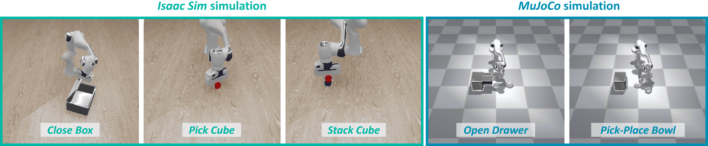

Figure 3 Simulational tasks. Simulations are conducted in the Roboverse platform [\(Geng et al.,](#page-12-15) [2025a\)](#page-12-15). Implementary tasks include Stack Cube and Pick Cube from ManiSkill [\(Mu et al.,](#page-13-16) [2021\)](#page-13-16), Close Box from RLBench [\(James et al.,](#page-13-17) [2020\)](#page-13-17), Open Drawer and Pick-Place Bowl from LIBERO [\(Liu et al.,](#page-13-18) [2023a\)](#page-13-18)).

a fair and rigorous comparison, we have standardized the hyperparameters (e.g., chunk size, batch size) and network scales across all evaluated methods to the greatest extent possible. The evaluation primarily focuses on training efficiency, inference cost, and generalization. We use λ0 = 0.5, λ1 = 1, λ2 = 0.5, λ3 = 1, n = m = 8, and a batch size of 32 across all experiments (Appendix [A.2\)](#page-15-0).

#### 4.1 Training efficiency

We first analyze the performance of A2A across different training data sizes and epoch numbers. Fig. [4](#page-5-1) illustrates the training efficiency of all evaluated methods. As illustrated in Fig. [4](#page-5-1) (Left), A2A demonstrates superior convergence speed compared to DDPM-UNet and FM-UNet, achieving a stable 100% success rate within significantly limited 40 training epochs on the Close Box task.

Furthermore, the sampling efficiency results in Fig. [4](#page-5-1) (Right) reveal that A2A quickly reaches and maintains a high performance ceiling as the number of demonstrations increases. In contrast, both DDPM-UNet and FM-UNet exhibit noticeable fluctuations and lower stability. This discrepancy likely stems from the increasing trajectory diversity in the

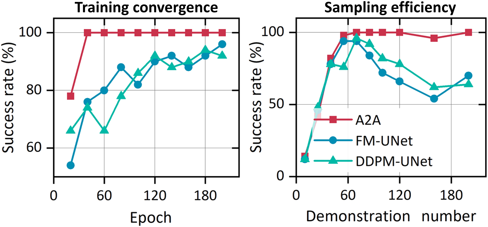

Figure 4 Training efficiency test. Left: Success rates across varying training epochs (using 100 demonstrations in Close Box task). Right: Success rates across varying demonstration numbers (100 epochs in Stack Cube task).

increasing dataset of the Stack Cube task, which may require higher model capacity or extended training epochs to accommodate. To validate this hypothesis, we conduct further evaluations on the DDPM-UNet

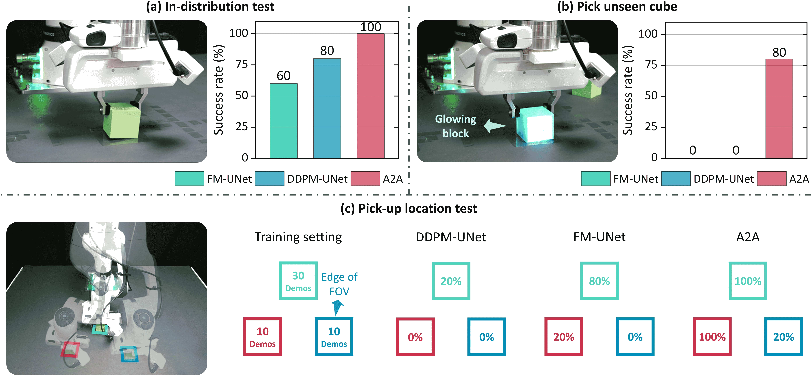

Figure 5 Experimental results of Pick Cube task. (a) Policies are trained on a limited dataset of 30 trajectories for 100 epochs. During evaluation, each method is tested over 10 trials. (b) Generalization capability is further challenged by replacing the target with an unseen glowing block. (c) Pick the cube from different locations with a limited 10 training demonstrations.

and FM-UNet baselines. As illustrated in Fig. [S3,](#page-16-0) their success rates gradually converge to 100% as training epochs increase.

Real-world test in Fig. [5](#page-6-0) (a) and Fig. [6](#page-6-1) (a) further shows that with only 30 training trajectories, A2A-Flow achieves a 100% in-distribution success rate, outperforming DDPM-UNet and FM-UNet. Fig. [6](#page-6-1) (b) further illustrates that in the Open Drawer task, the proposed algorithm achieves a shorter completion time, whereas DDPM-UNet and FM-UNet exhibit significant hesitation during the operation. Moreover, we further implement a pick-up location test. Two additional pick-up locations are added (Fig. [5](#page-6-0) (c)), each with only 10 demonstrations. A2A demonstrates rapid adaptation and high success rates, showcasing its superior data efficiency in novel scenarios. Even at the edge of the field-of-view (FOV) (bottom-right location, Fig. [S1\)](#page-16-1), A2A sustains a viable success rate, underscoring its robustness to suboptimal visual inputs. These results indicate that

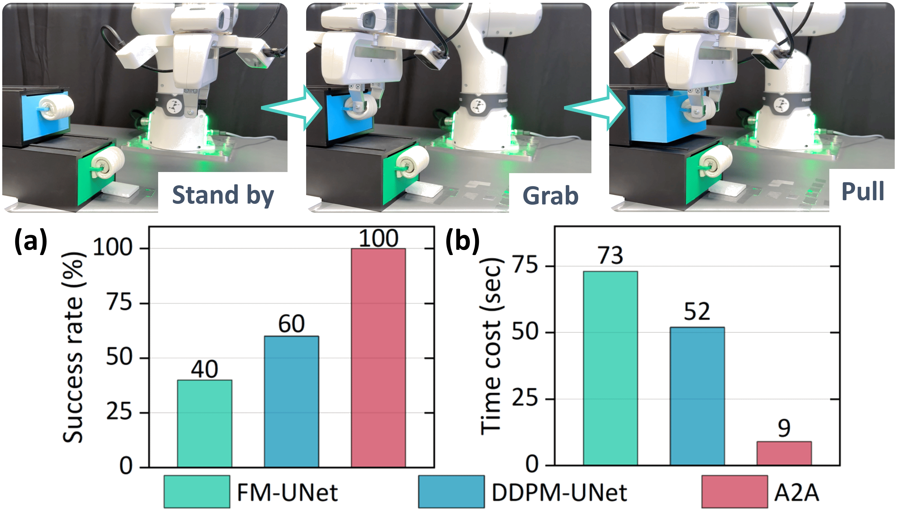

Figure 6 Experimental results of Open Drawer task. Policies are trained on a limited dataset of 30 trajectories for 300 epochs. Time cost denotes the total time elapsed during task completion. Success rate is evaluated over 10 trials.

A2A policy achieves superior performance, particularly in regimes characterized by limited training data and fewer training epochs.

The quantitative results across 5 different tasks and 9 algorithms are summarized in Table [1.](#page-5-2) A2A consistently achieves the highest success rates. VITA, which similarly incorporates an inference consistency mechanism [\(Gao](#page-12-7) [et al.,](#page-12-7) [2026\)](#page-12-7), also achieves a competitively high success rate. Notably, we find that given advanced transformer architectures and identical hyperparameters, regression-based ACT achieves performance comparable to generation-based methods. This observation aligns with recent findings by [Pan et al.](#page-13-1) [\(2026\)](#page-13-1).

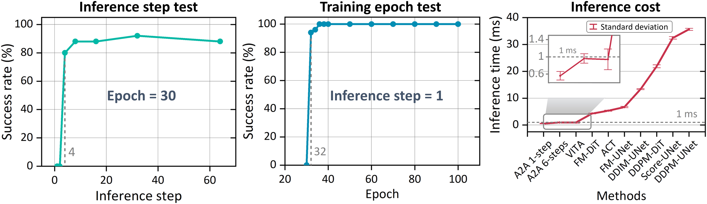

Figure 7 Inference cost test. Setting: Close Box. Left: Success rate over inference steps with fixed 30 epochs. Middle: Success rate over training epochs with only one-step inference. Right: Mean inference time per sampling step for all evaluated models, benchmarked on an identical hardware to ensure fairness.

Figure 8 Convergence of latent space representations during A2A training. Settings: Close Box, one-step inference. We apply t-SNE to jointly embed history and future action latents, with paired samples connected by lines. Line colors indicate distances computed in the 512-dimensional latent space.

#### 4.2 Inference cost

Capitalizing on the inherent efficiency of flow matching, we further examine the extreme inference speed achievable by the A2A policy. We first evaluate the impact of sampling steps on training performance. As shown in Fig. [7](#page-7-1) (Left), increasing the number of inference steps leads to a rapid improvement in success rates; however, the marginal gains diminish significantly beyond 4 steps. Regarding Fig. [7](#page-7-1) (Middle), when the inference budget is restricted to only one step, the success rate rises above 90% substantially after 32 training epochs.

Fig. [8](#page-7-0) visualizes the convergence of latent space representations under the one-step inference during training. We employ t-SNE to jointly embed history and future action latents, with paired samples connected by lines to represent the learned flow. As training progresses, the average distance between the history and future action chunks decreased significantly. Furthermore, the trajectories connecting these pairs increasingly align into parallel paths. These phenomena provide strong empirical evidence for the feasibility of single-step flow mapping from history to future latents, while the emerging parallelism underscores the rectilinearity of the learned flow.

Furthermore, we benchmark the mean inference time per sampling step across various algorithms on identical hardware (NVIDIA GeForce RTX 5090 GPU with 32GB VRAM), as depicted in Fig. [7](#page-7-1) (Right). Attributable to the extreme compressibility of sampling steps and the efficient MLP-based architecture, the inference latency of A2A is maintained below 1 ms. Notably, in the single-step inference regime, the latency reaches an impressive 0.56 ms, indicating significant potential for tasks that demand high-frequency decision-making.

Note that A2A and VITA [\(Gao et al.,](#page-12-7) [2026\)](#page-12-7) exhibit superior inference speed compared to regression-based ACT [\(Zhao et al.,](#page-14-2) [2023\)](#page-14-2). Beyond the reduced number of sampling epochs, this efficiency also stems from the pure MLP operations in the latent space. Conversely, ACT in this work utilizes a cost Transformer architecture with self-attention and cross-attention mechanisms.

Table 2 Comparison of success rates across 4 different randomization scenes. All models are trained with 100 demonstrations for 200 epochs in Level 0. The best results are highlighted in bold, while the second-best results are indicated with underlines.

| Methods       | Level 0 (%) | Level 1 (%) | Level 2 (%) | Level 3 (%) |
|---------------|----------------|----------------|----------------|----------------|
| A2A (1 step)  | 100            | 20             | 16             | 22             |
| A2A (6 steps) | 100            | 38             | 42             | 38             |
| VITA          | 100            | 4              | 2              | 2              |
| FM-UNet       | 96             | 6              | 6              | 4              |
| DDPM-UNet     | 92             | 2              | 4              | 2              |
| Score-UNet    | 94             | 0              | 2              | 0              |
| ACT           | 86             | 8              | 2              | 0              |

### 4.3 Generalization performance

#### 4.3.1 Visual uncertainty

We further evaluate the generalization performance of the proposed A2A policy under various visual uncertainties. Roboverse [\(Geng et al.,](#page-12-15) [2025a\)](#page-12-15), the adopted platform, categorizes the scene randomizations for the Close Box task into four progressive levels of difficulty. Level 0 serves as the training dataset, involving initial box pose variations (see Appendix Fig. [S4\)](#page-17-0). Level 1 introduces significant background textures randomization (see Appendix Fig. [S5\)](#page-17-1), while Level 2 adds illumination perturbations. Finally, Level 3 incorporates camera viewpoint variations. Detailed randomization configurations are provided in the Appendix [A.1.](#page-15-1)

Table [2](#page-8-1) presents the success rates of evaluated methods across Levels 0 to 3. Notably, even when encountering Level 1-3 for the first time, A2A (6 steps) maintains a robust success rate of 30-40%, consistently outperforming all baseline methods. In the single-step inference regime, A2A continues to exhibit superior generalization compared to other algorithms. We also verified its visual generalization performance in real-world tests, as shown in Fig. [5.](#page-6-0) We substitute the targeted cube with an unseen glowing variant, inducing severe visual distractors. The baselines fail entirely in this case, whereas our algorithm sustains a robust 80% success rate.

We argue that the fundamental reason for this robustness is our decoupled strategy, lightening the representation entanglement problem [\(Li et al.,](#page-13-19) [2026a\)](#page-13-19). Unlike conventional methods that simply concatenate proprioceptive

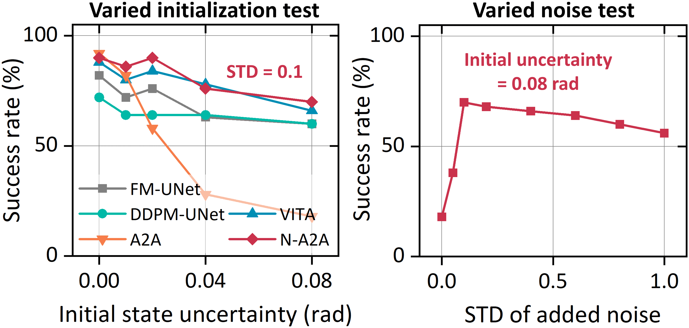

Figure 9 Generalization test on different initiation. Left: Success rate under varying levels of initial state uncertainty. Settings: Close Box, 30 epochs, 100 demonstration numbers. Noised A2A (N-A2A) refers to the initial action distribution occupied by 0.1 STD Gaussian noise. Right: Success rate under varying levels of initial noise. The initial state uncertainty is set as 0.08 rad.

and visual features, we process them through distinct strategies, preventing low-dimensional proprioceptive signals from being overshadowed by high-dimensional ones, thereby enabling the model to leverage the complementary strengths of each modality more effectively. Specifically, grounding the generation process in historical actions can substantially improve robustness to visual perturbations, which enforces physical consistency over time. Moreover, we find that injecting noise into historical trajectories (0.02 standard deviation, STD) can further narrow the generalization gap, from 20% to 52% on Level 1.

#### 4.3.2 Initial state uncertainty

Given the temporal dependency of subsequent action sequences on previous ones in A2A, a natural question arises regarding its robustness to uncertainties in the historical sequence. To investigate this, we randomize the initial pose of the robot, as illustrated in Fig. [S7.](#page-18-1) The results in Fig. [9](#page-8-2) (Left) indicate that the A2A, compared to baselines, which generate actions from pure noise at each step, is indeed more sensitive to uncertainties within the action history. However, by injecting a small amount of Gaussian noise (0.1 standard deviation, STD) into the historical actions, it can be observed that a significant boost in generalization performance is achieved. Fig. [9](#page-8-2) (Right) further depicts the relationship between the success rate and the intensity of the injected noise. How to optimally fuse clean historical data with Gaussian noise to balance determinism and stochasticity remains a compelling direction for future research.

## 5 Ablation study

We further conduct ablation studies on the architectural design to answer two fundamental questions: whether the generative paradigm provides superior performance over the deterministic regression baseline; whether performing flow matching within the latent space is more effective than directly in the raw action space.

#### 5.1 Regression or generation

There is a growing discourse regarding the relative merits of generation versus regression in the context of robotic control [\(Pan et al.,](#page-13-1) [2026\)](#page-13-1). Here, we also attempt to substitute the flow matching objective with a deterministic regression approach. To ensure a fair comparison, all other architectural components, including the encoder and the latent space configuration, remain strictly identical. The results are presented in Fig. [10](#page-9-0) (Left), where Flow-latent denotes the flow matching performed within the latent space, i.e., our final choice. Reglatent represents deterministic regression performed within the latent space. We found that both methods achieve high success rates on the training distribution, which aligns with recent findings by [Pan et al.](#page-13-1) [\(2026\)](#page-13-1). However, Fig. [10](#page-9-0) (Right) reveals that the generative ap-

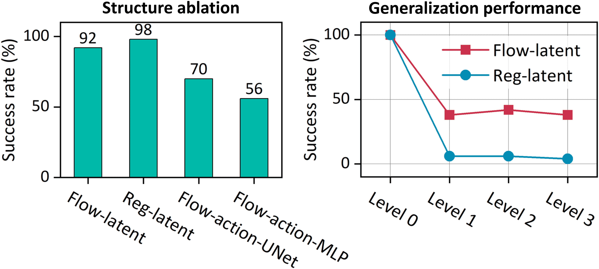

Figure 10 Ablation study of model structure. Settings: Close Box, 30 epochs, 100 demonstration numbers, 6 inference steps for flow-based methods. Left: Impact of learning objectives and representation spaces. Comparison of flow matching and regression strategies implemented in both latent and raw action spaces. Right: Generalization capability. Robustness comparison between latent-space regression and flow matching under varying environmental perturbations.

proach exhibits significantly higher resilience to environmental perturbations, whereas the regression variant fails to generalize to unseen scenarios. This gap might stem from the decoupling of action and visual inputs. Direct combination with higher-dimensional visual representations for the regression method may dilute the benefits of low-dimensional proprioceptive signals.

#### 5.2 Action space or latent space

We further evaluate flow matching performed without the latent space, using both U-Net and MLP (same as A2A) backbones. The results are shown in Fig. [10](#page-9-0) (Left), where Flow-action-UNet represents flow matching directly in the raw action space using a U-Net architecture, and Flow-action-MLP denotes flow matching directly in the raw action space using an MLP architecture. It can be seen that flow matching in the raw action space leads to inferior convergence performance compared to the latent-space approach. This reason can be attributed to the high-dimensional representation in the latent space, which effectively aligns the initial and target distributions of the flow. This structured alignment facilitates a smoother learning process,

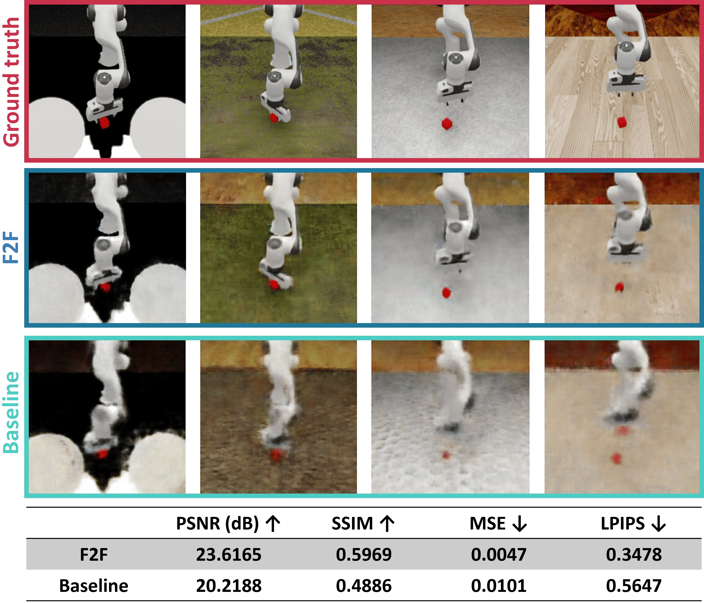

Figure 11 Video generation results. The predicted third frames in four different unseen scenarios are visualized.

enabling the model to achieve high performance even within a single-step inference regime, as shown in Figs. [8](#page-7-0) and [S6.](#page-18-0)

## 6 Application to video generation

Similar to robotic manipulation, video generation in the form of future frame prediction is inherently a temporal continuity task. High-fidelity future video prediction can enhance the performance of VLA models [\(Zhao](#page-14-4) [et al.,](#page-14-4) [2025b;](#page-14-4) [Deng et al.,](#page-12-16) [2026\)](#page-12-16). This work further explores the transferability of the A2A paradigm to video generation, hereafter referred to as Frames-to-Frames flowing matching (F2F). The training dataset comprises 100 videos for each level (Levels 0–4) of the pick cube task, while the test set consists of four unseen scenarios in the same task. F2F is designed to predict three future frames based on a history of three consecutive frames. Both F2F and baseline are trained with 500 epochs. See Appendix [A.4](#page-15-2) for implementation details. As illustrated in Fig. [11,](#page-10-0) F2F achieves significantly higher generation quality compared to a regression-based baseline implemented under the same network configuration. While these results are achieved with a smallscale model, the F2F paradigm possesses significant scaling potential for larger architectures. Future work will further pursue the integration of predicted video into the policy architecture to further augment the performance of A2A.

## 7 Conclusion

This paper introduces A2A, an efficient generative paradigm that replaces noise-based initialization with action-to-action transport. By leveraging the physical consistency of sequential motions, A2A aligns starting and target distributions, enabling a lightweight MLP to achieve high success rates with minimal latency. Across diverse simulation and real-world robotic benchmarks, A2A matches or surpasses state-of-the-art diffusion and flow-based policies while reducing inference to fewer steps. This approach effectively eliminates the computational bottlenecks typical of diffusion-based policies. Beyond robotics and video generation, the framework is inherently suited for diverse continuous temporal tasks, and its potential in domains characterized by sequential continuity remains a promising avenue for future exploration.

## 8 Limitation

A2A is grounded in the physical continuity of actions, which makes it most effective for tasks dominated by smooth, continuous control signals. For discrete or switch-like action dimensions, such as binary gripper open/close commands, this continuity prior provides limited benefit. Moreover, the current objective requires manual tuning of several loss-weighting coefficients. We leave adaptive loss weighting and support for hybrid continuous-discrete action spaces as promising directions for future work.

## References

- Donghoon Ahn, Jiwon Kang, Sanghyun Lee, Jaewon Min, Minjae Kim, Wooseok Jang, Hyoungwon Cho, Sayak Paul, SeonHwa Kim, Eunju Cha, et al. A noise is worth diffusion guidance. arXiv preprint arXiv:2412.03895, 2024.
- Bo Ai, Stephen Tian, Haochen Shi, Yixuan Wang, Tobias Pfaff, Cheston Tan, Henrik I Christensen, Hao Su, Jiajun Wu, and Yunzhu Li. A review of learning-based dynamics models for robotic manipulation. Science Robotics, 10 (106):eadt1497, 2025.
- Johan Bjorck, Fernando Castañeda, Nikita Cherniadev, Xingye Da, Runyu Ding, Linxi Fan, Yu Fang, Dieter Fox, Fengyuan Hu, Spencer Huang, et al. Gr00t n1: An open foundation model for generalist humanoid robots. arXiv preprint arXiv:2503.14734, 2025.
- Kevin Black, Noah Brown, Danny Driess, Adnan Esmail, Michael Equi, Chelsea Finn, Niccolo Fusai, Lachy Groom, Karol Hausman, Brian Ichter, et al. π0: A vision-language-action flow model for general robot control. arXiv preprint arXiv:2410.24164, 2024.
- Andreas Blattmann, Tim Dockhorn, Sumith Kulal, Daniel Mendelevitch, Maciej Kilian, Dominik Lorenz, Yam Levi, Zion English, Vikram Voleti, Adam Letts, et al. Stable video diffusion: Scaling latent video diffusion models to large datasets. arXiv preprint arXiv:2311.15127, 2023.
- Kaiqi Chen, Eugene Lim, Kelvin Lin, Yiyang Chen, and Harold Soh. Don't start from scratch: Behavioral refinement via interpolant-based policy diffusion. In Proceedings of Robotics: Science and Systems (RSS), 2024. doi: 10.15607/ RSS.2024.XX.122.
- Cheng Chi, Zhenjia Xu, Siyuan Feng, Eric Cousineau, Yilun Du, Benjamin Burchfiel, Russ Tedrake, and Shuran Song. Diffusion policy: Visuomotor policy learning via action diffusion. The International Journal of Robotics Research, 44(10-11):1684–1704, 2025.
- Yufan Deng, Zilin Pan, Hongyu Zhang, Xiaojie Li, Ruoqing Hu, Yufei Ding, Yiming Zou, Yan Zeng, and Daquan Zhou. Rethinking video generation model for the embodied world. arXiv preprint arXiv:2601.15282, 2026.
- Luca Eyring, Shyamgopal Karthik, Karsten Roth, Alexey Dosovitskiy, and Zeynep Akata. Reno: Enhancing one-step text-to-image models through reward-based noise optimization. Advances in Neural Information Processing Systems, 37:125487–125519, 2024.
- Han Fang, Yize Huang, Yuheng Zhao, Paul Weng, Xiao Li, and Yutong Ban. Omp: One-step meanflow policy with directional alignment. arXiv preprint arXiv:2512.19347, 2025.
- Dechen Gao, Boqi Zhao, Andrew Lee, Ian Chuang, Hanchu Zhou, Hang Wang, Zhe Zhao, Junshan Zhang, and Iman Soltani. VITA: Vision-to-action flow matching policy. In Proceedings of International Conference on Learning Representations, 2026.
- Haoran Geng, Feishi Wang, Songlin Wei, Yuyang Li, Bangjun Wang, Boshi An, Charlie Tianyue Cheng, Haozhe Lou, Peihao Li, Yen-Jen Wang, et al. RoboVerse: Towards a unified platform, dataset and benchmark for scalable and generalizable robot learning. In Proceedings of Robotics: Science and Systems, 2025a.
- Zhengyang Geng, Mingyang Deng, Xingjian Bai, J Zico Kolter, and Kaiming He. Mean flows for one-step generative modeling. arXiv preprint arXiv:2505.13447, 2025b.
- Jonathan Ho, Ajay Jain, and Pieter Abbeel. Denoising diffusion probabilistic models. Advances in Neural Information Processing Systems, 33:6840–6851, 2020.
- Edward J Hu, Yelong Shen, Phillip Wallis, Zeyuan Allen-Zhu, Yuanzhi Li, Shean Wang, Lu Wang, Weizhu Chen, et al. LoRA: Low-rank adaptation of large language models. In Proceedings of International Conference on Learning Representations, 2022.
- Physical Intelligence, Ali Amin, Raichelle Aniceto, Ashwin Balakrishna, Kevin Black, Ken Conley, Grace Connors, James Darpinian, Karan Dhabalia, Jared DiCarlo, et al. π ∗ 0.6: A VLA that learns from experience. arXiv preprint arXiv:2511.14759, 2025a.
- Physical Intelligence, Kevin Black, Noah Brown, James Darpinian, Karan Dhabalia, Danny Driess, Adnan Esmail, Michael Equi, Chelsea Finn, Niccolo Fusai, Manuel Y. Galliker, Dibya Ghosh, Lachy Groom, Karol Hausman, Brian Ichter, Szymon Jakubczak, Tim Jones, Liyiming Ke, Devin LeBlanc, Sergey Levine, Adrian Li-Bell, Mohith Mothukuri, Suraj Nair, Karl Pertsch, Allen Z. Ren, Lucy Xiaoyang Shi, Laura Smith, Jost Tobias Springenberg, Kyle Stachowicz, James Tanner, Quan Vuong, Homer Walke, Anna Walling, Haohuan Wang, Lili Yu, and Ury

- Zhilinsky. π0.5: A vision-language-action model with open-world generalization. arXiv preprint arXiv:2504.16054, 2025b.
- Stephen James, Zicong Ma, David Rovick Arrojo, and Andrew J Davison. RLBench: The robot learning benchmark & learning environment. IEEE Robotics and Automation Letters, 5(2):3019–3026, 2020.
- Jindou Jia, Meng Wang, Zihan Yang, Bin Yang, Yuhang Liu, Kexin Guo, and Xiang Yu. Learning-based observer for coupled disturbance. arXiv preprint arXiv:2407.13229, 2024.
- Jindou Jia, Kexin Guo, Yuyang Wang, Sicheng Zhou, Jiayi Zhang, Yuhang Liu, Xiang Yu, Yang Shi, and Lei Guo. FORESEER: Recognize and utilize uncertainties by integrating data-based learning and symbolic feedback. The International Journal of Robotics Research, page 02783649251364000, 2025a.
- Jindou Jia, Zihan Yang, Meng Wang, Kexin Guo, Jianfei Yang, Xiang Yu, and Lei Guo. Feedback favors the generalization of neural ODEs. In Proceedings of International Conference on Learning Representations, 2025b.
- Lin Li, Qihang Zhang, Yiming Luo, Shuai Yang, Ruilin Wang, Fei Han, Mingrui Yu, Zelin Gao, Nan Xue, Xing Zhu, et al. Causal world modeling for robot control. arXiv preprint arXiv:2601.21998, 2026a.
- Shaolong Li, Lichao Sun, and Yongchao Chen. One-step flow policy: Self-distillation for fast visuomotor policies. arXiv preprint arXiv:2603.12480, 2026b.
- Yaron Lipman, Ricky T. Q. Chen, Heli Ben-Hamu, Maximilian Nickel, and Matt Le. Flow matching for generative modeling. In Proceedings of International Conference on Learning Representations, 2023.
- Bo Liu, Yifeng Zhu, Chongkai Gao, Yihao Feng, Qiang Liu, Yuke Zhu, and Peter Stone. LIBERO: Benchmarking knowledge transfer for lifelong robot learning. Advances in Neural Information Processing Systems, 36:44776–44791, 2023a.
- Xingchao Liu, Chengyue Gong, and Qiang Liu. Flow straight and fast: Learning to generate and transfer data with rectified flow. In Proceedings of International Conference on Learning Representations, 2023b.
- Jiafeng Mao, Xueting Wang, and Kiyoharu Aizawa. The lottery ticket hypothesis in denoising: Towards semantic-driven initialization. In Proceedings of European Conference on Computer Vision, pages 93–109. Springer, 2024.
- Tongzhou Mu, Zhan Ling, Fanbo Xiang, Derek Yang, Xuanlin Li, Stone Tao, Zhiao Huang, Zhiwei Jia, and Hao Su. ManiSkill: Generalizable manipulation skill benchmark with large-scale demonstrations. In Proceedings of Conference on Neural Information Processing Systems Datasets and Benchmarks Track, 2021.
- Chaoyi Pan, Giri Anantharaman, Nai-Chieh Huang, Claire Jin, Daniel Pfrommer, Chenyang Yuan, Frank Permenter, Guannan Qu, Nicholas Boffi, Guanya Shi, and Max Simchowitz. Much ado about noising: Dispelling the myths of generative robotic control. In Proceedings of International Conference on Learning Representations, 2026.
- William Peebles and Saining Xie. Scalable diffusion models with transformers. In Proceedings of the IEEE/CVF International Conference on Computer Vision, pages 4195–4205, October 2023.
- Robin Rombach, Andreas Blattmann, Dominik Lorenz, Patrick Esser, and Björn Ommer. High-resolution image synthesis with latent diffusion models. In Proceedings of the IEEE/CVF Conference on Computer Vision and Pattern Recognition, pages 10684–10695, 2022.
- Dvir Samuel, Rami Ben-Ari, Simon Raviv, Nir Darshan, and Gal Chechik. Generating images of rare concepts using pre-trained diffusion models. In Proceedings of the AAAI Conference on Artificial Intelligence, pages 4695–4703, 2024.
- Jonas Scholz and Richard E Turner. Warm starts accelerate conditional diffusion. arXiv preprint arXiv:2507.09212, 2025.
- Jiaming Song, Chenlin Meng, and Stefano Ermon. Denoising diffusion implicit models. In Proceedings of International Conference on Learning Representations, 2021a.
- Yang Song, Jascha Sohl-Dickstein, Diederik P Kingma, Abhishek Kumar, Stefano Ermon, and Ben Poole. Score-based generative modeling through stochastic differential equations. In Proceedings of International Conference on Learning Representations, 2021b.
- Yang Song, Prafulla Dhariwal, Mark Chen, and Ilya Sutskever. Consistency models. In Proceedings of International Conference on Machine Learning, pages 32211–32252, 2023.
- Ashish Vaswani, Noam Shazeer, Niki Parmar, Jakob Uszkoreit, Llion Jones, Aidan N Gomez, Łukasz Kaiser, and Illia Polosukhin. Attention is all you need. Advances in Neural Information Processing Systems, 30, 2017.

- Andrew Wagenmaker, Mitsuhiko Nakamoto, Yunchu Zhang, Seohong Park, Waleed Yagoub, Anusha Nagabandi, Abhishek Gupta, and Sergey Levine. Steering your diffusion policy with latent space reinforcement learning. arXiv preprint arXiv:2506.15799, 2025.
- Qinglun Zhang, Zhen Liu, Haoqiang Fan, Guanghui Liu, Bing Zeng, and Shuaicheng Liu. FlowPolicy: Enabling fast and robust 3D flow-based policy via consistency flow matching for robot manipulation. In Proceedings of the AAAI Conference on Artificial Intelligence, pages 14754–14762, 2025.
- Juntu Zhao, Wenbo Lu, Di Zhang, Yufeng Liu, Yushen Liang, Tianluo Zhang, Yifeng Cao, Junyuan Xie, Yingdong Hu, Shengjie Wang, et al. Do you need proprioceptive states in visuomotor policies? arXiv preprint arXiv:2509.18644, 2025a.
- Qingqing Zhao, Yao Lu, Moo Jin Kim, Zipeng Fu, Zhuoyang Zhang, Yecheng Wu, Zhaoshuo Li, Qianli Ma, Song Han, Chelsea Finn, et al. CoT-VLA: Visual chain-of-thought reasoning for vision-language-action models. In Proceedings of the Computer Vision and Pattern Recognition Conference, pages 1702–1713, 2025b.
- Tony Z Zhao, Vikash Kumar, Sergey Levine, and Chelsea Finn. Learning fine-grained bimanual manipulation with low-cost hardware. In Proceedings of Robotics: Science and Systems, 2023.

## A Appendix

### A.1 Randomization level setting

To systematically evaluate the robustness of evaluated methods, we utilize Roboverse's hierarchical generalization levels by introducing stochastic perturbations to the simulation environment. This section details the configuration of Level 0 (object randomization), Level 1 (+background randomization), Level 2 (+lighting randomization), and Level 3 (+camera viewpoint randomization).

Level 0 introduces the randomization of initial object positions, as illustrated in Fig. [S4.](#page-17-0) It serves as the training set for the evaluated algorithms.

Level 1 primarily focuses on the randomization of the environmental background, as illustrated in Fig. [S5.](#page-17-1) This level is designed to evaluate the policy's robustness against non-task-relevant visual distractors.

Level 2 further adds lighting randomization. We randomize illumination using primary DiskLights (12k-45k intensity), auxiliary SphereLights (5k-20k intensity), and ambient presets. Parameters include color temperatures from 2500K to 6500K, directional jitters of ±15◦ for ceiling lights, and sphere light positional offsets of ±0.5m (lateral/longitudinal) and ±0.3 m (vertical) to create diverse shadowing patterns.

Level 3 implements camera viewpoint randomization additionally. Camera extrinsics are perturbed using a uniform distribution within a delta range of ±20cm for lateral/longitudinal shifts. Vertical shifts are restricted to an upward range of 0 to 10 cm.

### A.2 Hyperparameters

Training hyperparameters used in all simulations and experiments are set to the same, as shown in Table [S1.](#page-15-3) Note that the standard ACT implementation on the Roboverse platform comprises approximately 60M parameters, nearly double that of DDPM-UNet (≈ 28M). To ensure a fair comparison, we have modified the Transformer backbone of ACT to halve its parameter count, thereby aligning the model scales across all evaluated baselines.

Table S1 Training hyperparameters.

| Hyperparameters | Value |
|-----------------|-------|
| n               | 8     |
| m               | 8     |
| λ0              | 0.5   |
| λ1              | 1     |
| λ2              | 0.5   |
| λ3              | 1     |
| Batch size      | 32    |

#### A.3 Experimental setup

In real tests, we deploy A2A on a Franka robotic platform, maintaining complete consistency in training parameters with our simulation baseline. A key distinction from the simulation environment is the utilization of dual-view visual input, the setup of which is shown in Fig. [S1.](#page-16-1)

#### A.4 Video generation

Fig. [S2](#page-16-2) illustrates the architectural framework of the F2F algorithm, showcasing the transition from historical frame sequences to future predictions. Historical frames I≤t are encoded into a 512-dimensional latent space using a ResNet18 backbone and a VAE head to obtain the initial state z0. A Flow Net Transformer, consisting of 4 layers and 4 attention heads, learns the vector field v to map z0 to the target latent z1. The future frames I>t are then reconstructed through a 5-layer convolutional upsampling decoder. We employ a deterministic

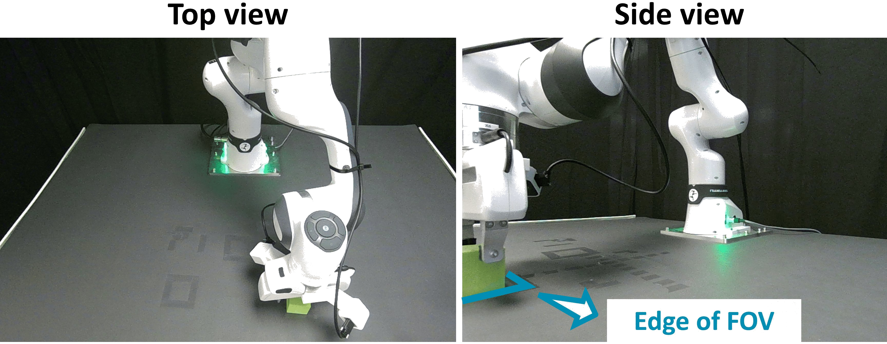

Figure S1 The camera views in real tests.

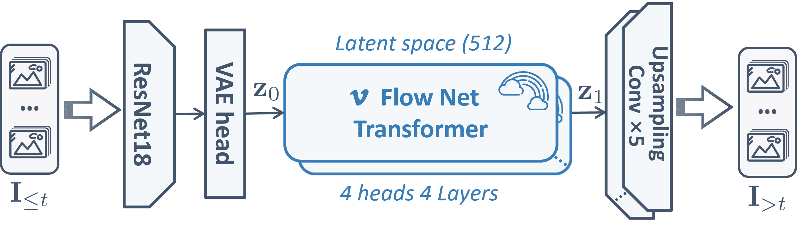

Figure S2 Overview of F2F architecture for video prediction. The model leverages a ResNet-VAE architecture to compress historical observations into a latent space, where a Transformer-based flowing matching computes the transport to future states. The predicted sequence I>t is generated via a convolutional upsampling block.

regression model as the baseline, which predicts future frames directly from historical sequences. For a fair comparison, aside from the omission of the flow-matching training objective, the baseline maintains an architecture identical to F2F.

During evaluation, the predictive performance is assessed using four complementary metrics: Peak Signal-to-Noise Ratio (PSNR), Structural Similarity Index Measure (SSIM), Mean Squared Error (MSE), and Learned Perceptual Image Patch Similarity (LPIPS).

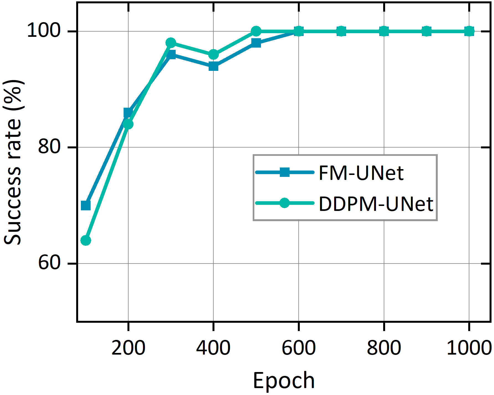

Figure S3 Additional test on training efficiency of DDPM-UNet and FM-UNet.

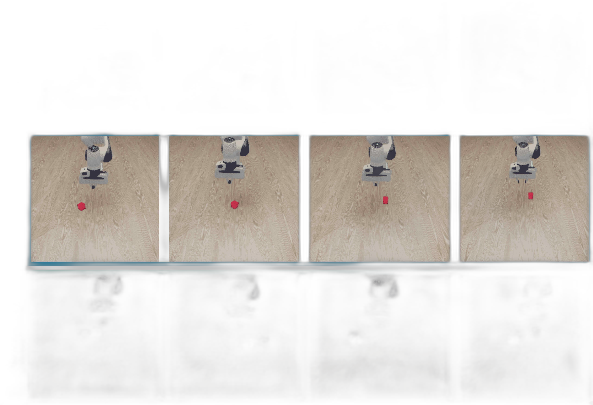

Figure S4 Randomization Level 0. Level 0 introduces the randomization of initial object positions. It serves as the training set.

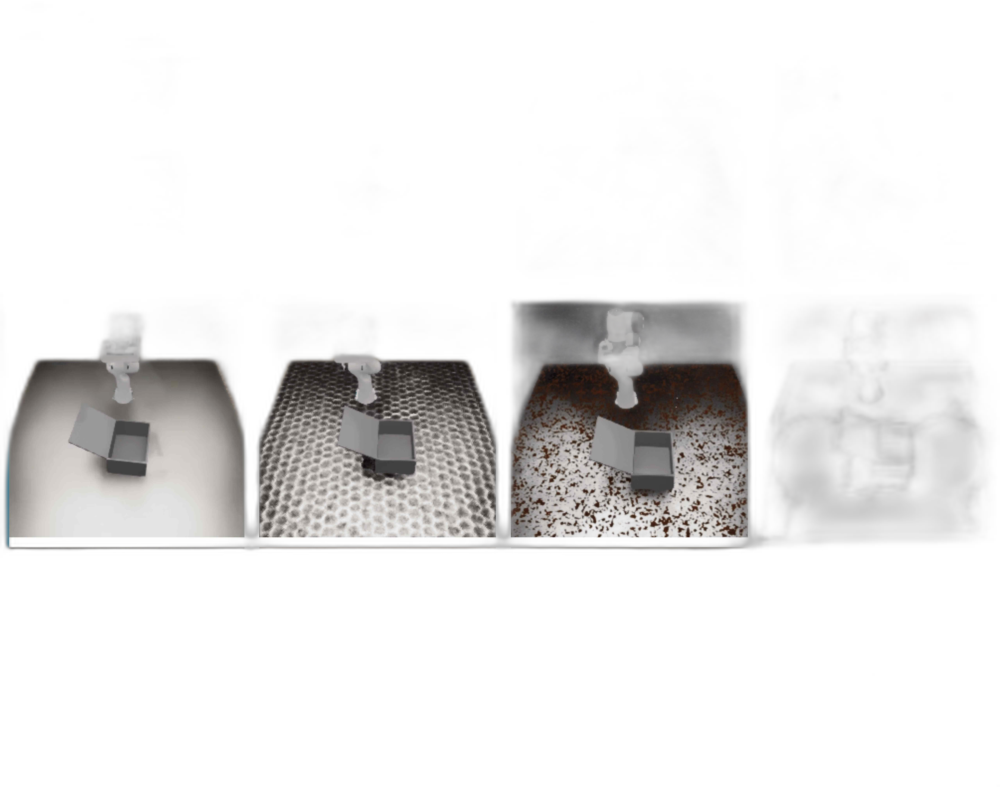

Figure S5 Randomization Level 1. Level 1 primarily focuses on the randomization of the environmental background.

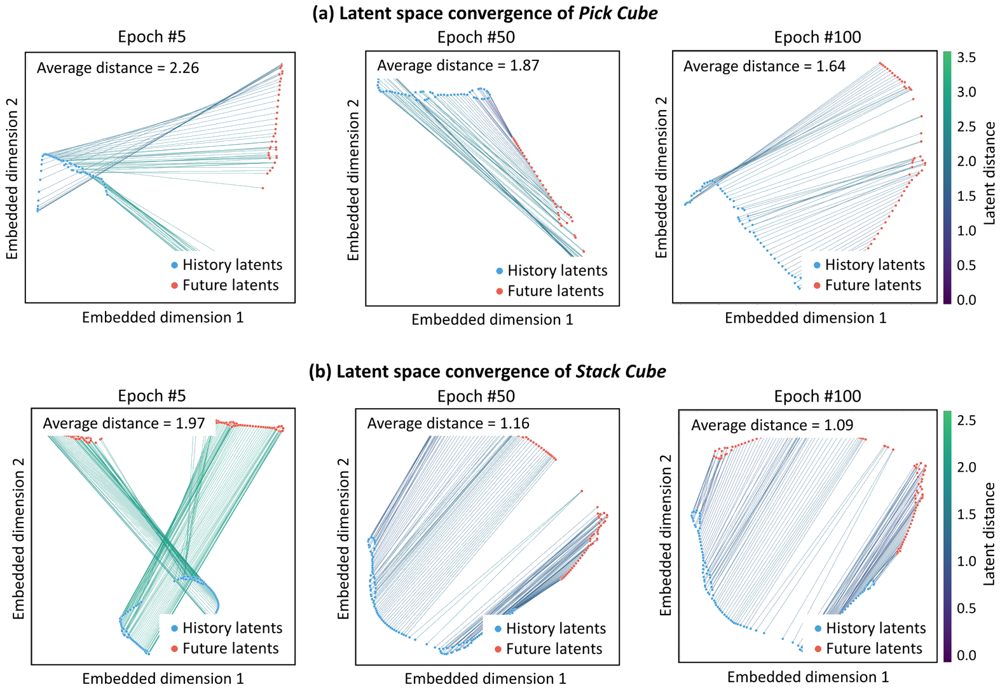

Figure S6 Convergence of latent space representations in Pick Cube and Stack Cube tasks. We apply t-SNE to jointly embed history and future action latents, with paired samples connected by lines. Line colors indicate distances computed in the 512-dimensional latent space.

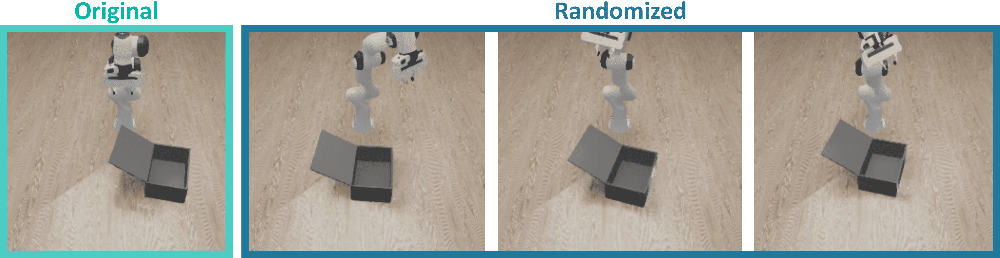

Figure S7 Initial state uncertainty. We randomize the initial pose of the robot to investigate the generalization performance under action-level uncertainty.

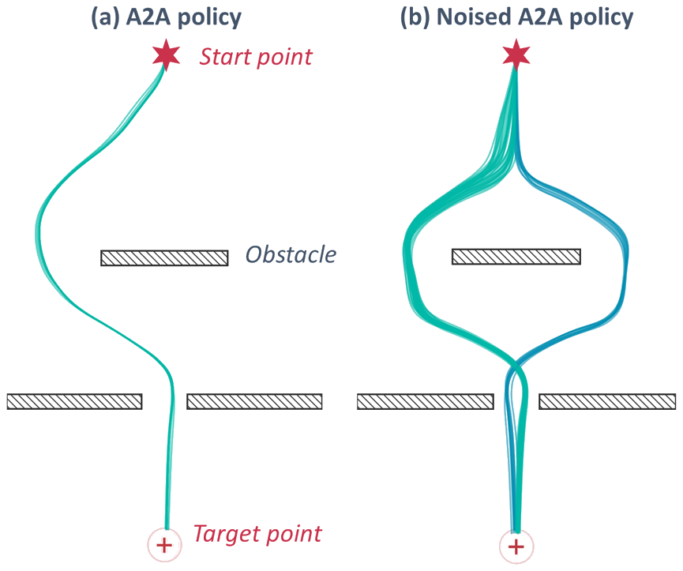

Figure S8 Subtle action noise unlocks multimodal behavior. A 2D navigation task in which the agent must reach the target (⊕) from the start (⋆) by passing through a gap between obstacles, a setting with inherently multimodal optimal solutions (going left or right of the upper obstacle). (a) The A2A policy is effectively deterministic: rollouts collapse to a single mode despite the multimodal training data. (b) Adding zero-mean Gaussian noise with std σ = 0.02 to the historical actions a≤t breaks this determinism without sacrificing task success, allowing the policy to express both modes across rollouts. This validates our design choice of action perturbation as a lightweight mechanism for preserving the multimodality of the learned policy.
