*Article*

The International Journal of Robotics Research 1–24 © The Author(s) 2018 Reprints and permissions: sagepub.co.uk/journalsPermissions.nav DOI: 10.1177/0278364918768950 journals.sagepub.com/home/ijr

#### **Arvid QL Keemink1 , Herman van der Kooij1,2 and Arno HA Stienen1,3**

### **Abstract**

*This paper presents an overview of admittance control as a method of physical interaction control between machines and humans. We present an admittance controller framework and elaborate control scheme that can be used for controller design and development. Within this framework, we analyze the influence of feed-forward control, post-sensor inertia compensation, force signal filtering, additional phase lead on the motion reference, internal robot flexibility, which also relates to series elastic control, motion loop bandwidth, and the addition of virtual damping on the stability, passivity, and performance of minimal inertia rendering admittance control. We present seven design guidelines for achieving high-performance admittance controlled devices that can render low inertia, while aspiring coupled stability and proper disturbance rejection.*

### **Keywords**

Admittance control, pHRI, haptics, passivity, robotics

**Admittance control for physical**

**human–robot interaction**

# **1. Introduction**

During physical human–robot interaction (pHRI) a robot measures motions of or forces from the human and adequately responds to these. Several control methods exist for controlling robots in contact with a mechanical environment (Zeng and Hemami, 1997), namely: (in)direct force control (Maples and Becker, 1986), impedance control (Hogan, 1985), admittance control (Newman, 1992; Whitney, 1977), and full-state interaction control (Albu-Schäffer et al., 2004, 2007). The human user is usually seen as a special case of the environment.

In this paper we discuss the admittance control paradigm, a control method that is not commonly used for haptic interaction control (Faulring et al., 2007). By measuring the interaction force with the human user, the *set-point* to a lowlevel motion controller is changed through virtual model dynamics to achieve some preferred interaction responsive behavior (Lammertse, 2004; Maples and Becker, 1986; Whitney, 1977) (see Figure 1). The motion controller is commonly a reference following velocity controller, due to power conjugation of force and velocity, and this is what we will assume in the remainder of the text.

By making the relation between the measured force and the velocity reference, the *virtual model dynamics*, consistent with laws of mechanics, simulation of physical dynamical systems is possible (Adams and Hannaford, 1999; Van der Linde et al., 2002).

Admittance control is the opposite, or dual (Adams and Hannaford, 1999; Lammertse, 2004), of the ubiquitous method of impedance control (Hogan, 1985), where forces are applied, either through open-loop or closed-loop control, to the human user after motion is detected. The naming reflects the causality of the used virtual model dynamics. Owing to this dual nature of admittance control and impedance control, they naturally excel at both different ends of the "haptic spectrum" (Adams and Hannaford, 1999; Faulring et al., 2007; Ott et al., 2010; Yokokohji et al., 1996). For admittance controlled devices it is easier to render stiff virtual surfaces and a challenge to render low inertia. It is troubled by dynamically interacting with stiff real surfaces (constrained motion) (Adams and Hannaford, 1999; Newman and Zhang, 1994; Surdilovic, 1996). Impedance control, on the other hand, is a better candidate to render low inertia but not to render stiff virtual surfaces. It is troubled by dynamically interacting with low inertia (free motion) (Adams and Hannaford, 1999).

#### **Corresponding authors:**

Arvid QL Keemink, Biomechanical Engineering, University of Twente, PO Box 217, 7500 AE Enschede, The Netherlands. Email: a.q.l.keemink@utwente.nl

1University of Twente, The Netherlands

2Delft Technical University, The Netherlands

3Northwestern University, Chicago, IL, USA

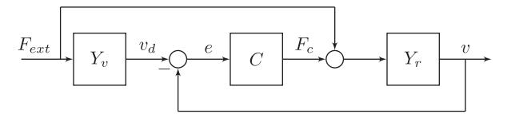

**Fig. 1.** Basic stand-alone admittance control diagram of an uncoupled admittance controlled robot. It shows the measured externally applied force *Fext*, passing through the virtual dynamics *Yv* to generate velocity reference *vd*. A controller *C* attempts to enforce this velocity on the robot *Yr* by applying a control force *Fc* through an actuator (not shown). External force *Fext* also acts directly on the robot dynamics *Yr*. The resulting motion of the robot is given by *v*.

# **2. Motivation**

Although admittance control has been applied successfully in multiple devices (see Section 3.2), an overview of applications, properties, and possibilities of admittance control is lacking. We provide an overview of the development and applications of admittance control. In addition, we briefly recapitulate the notions of stability and passivity of admittance controlled systems. The main contribution of this work is the presentation of an elaborate admittance controller framework and its control scheme that summarizes major contributions from literature and experience, which can be used for controller design and development. Within this framework, we analyze the influence of (1) feedforward control, (2) force signal filtering, (3) post-sensor inertia compensation, (4) the addition of virtual damping, (5) additional phase lead on the motion reference, (6) motion loop bandwidth, and (7) internal robot flexibility (which in the limit directly relates to series elastic control) on the stability, passivity, and performance of minimal inertia rendering admittance control. Finally, these analyses lead to a set of design guidelines for achieving highperformance admittance controlled devices that can render low inertia, aspiring robust coupled stability. The analyses are focus solely on single-degree-of-freedom (single-DOF), single interface linear-time-invariant (LTI) systems with one-port admittance interaction.

# **3. Background**

# *3.1. Naming*

The name *admittance control* dates back to 1992 due to the developments of Newman (1992), Gullapalli et al. (1992), and Schimmels and Peshkin (1992). Different names for what is commonly called admittance control can be found in the literature: *position-based* (Carignan and Smith, 1994; Colbaugh et al., 1992; Heinrichs et al., 1997; Lawrence and Stoughton, 1987; Ott and Nakamura, 2009; Pelletier and Doyon, 1994) or *velocity-based impedance control* (Duchaine and Gosselin, 2007). It is sometimes interchanged with *impedance control* (Aguirre-Ollinger et al., 2007; Rahman et al., 1999). In all cases there is the measurement of force that generates a motion control reference or a deviation from such a reference.

Some authors distinguish between motion-based impedance control and admittance control by focusing in the former case on motion tracking and in the latter case on force tracking (Seraji and Colbaugh, 1997; Ueberle and Buss, 2004; Zeng and Hemami, 1997). We choose to use the generic term *admittance control* for all types of force-to-desired-motion relationships in this work, and recognize the fact that an admittance controller can track both motion and forces simultaneously.

The desired dynamical behavior, the admittance, felt at the "interaction port" where the human interacts with the device, is called by different names: *desired dynamics* (Carignan and Cleary, 2000), *target dynamics* (Carignan and Cleary, 2000; Dohring and Newman, 2003), *mechanical drive point mobility* (Newman, 1992), *virtual admittance/environment/model/dynamics* (Adams and Hannaford, 1999; Lammertse, 2004), or *driving-point dynamics* (Colgate and Hogan, 1988). It could also be called the indirect force controller.

Dependent on the form of the desired dynamical behavior, several authors adopt different names for the controller. The term *admittance control* is used for a inertia simulation (Lammertse, 2004), but also for pure damping (Carmichael and Liu, 2013; Nambi et al., 2011) or generic force to motion simulation (Adams and Hannaford, 1999; Yokokohji et al., 1996). *Accommodation control* is solely used for pure damping behavior (Newman, 1992; Whitney, 1977). Finally, *compliance control* is used for pure spring behavior (Zeng and Hemami, 1997). If the controller is to mask only (static) friction effects and keep the same inertia (its natural admittance) as the robot system, Newman and Zhang (1994) proposed the name *natural admittance control* (NAC).

In this work, we take the aforementioned single analyses, and the major innovations and combine them into a single framework. We use the term virtual dynamics (or virtual admittance) to describe the dynamics we want the device to display to the human, and to refer to the model that is used to calculate a velocity reference for a velocity controller to track. The dynamics that are actually felt by the human will be called the *apparent dynamics* (or apparent admittance), which preferably approaches the virtual dynamics.

# *3.2. History and applications*

Interaction control gained widespread academic interest after the pioneering work of Hogan (1985) and Colgate (1988) on impedance control and passivity at the end of the 1980s. The first mentions of using a control method very similar to admittance control date back to Whitney (1977), where it was used to respond to hard contact in industrial applications and therefore for indirect force control purposes.

Initially, interaction control was developed for applications such as welding and deburring, where stiff robot position control was highly impractical due to high stiffness and friction of the processed parts (Colbaugh et al., 1992; Schimmels and Peshkin, 1992, 1994; Seraji and Colbaugh, 1997; Whitney, 1977). Accommodation and admittance control were first introduced on retrofitted industrial robots (Colbaugh et al., 1992; Dohring and Newman, 2003; Glosser and Newman, 1994; Maples and Becker, 1986; Pelletier and Doyon, 1994; Whitney, 1977). Ott and Nakamura (2009) exploited a force sensor in the base to increase the safety of the system. Bascetta et al. (2013) use variable admittance control for teaching of industrial manipulators to interact safely during manufacturing.

A patent from Fokker Control Systems (US4398889 A) describes admittance control in flight simulator devices in the field of *control loading*, starting from 1980. First mentions pHMI come from haptic master devices to render virtual dynamics in flight simulation and later in more generic scenarios (Adams and Hannaford, 2002; Clover, 1999; Strolz and Buss, 2008). In these cases virtual environments with admittance causality could be simulated, allowing more straightforward rendering of constrained motions.

Mentions of active devices capable of safe interaction between human and machines emerged at the beginning of the 1990s (Hogan, 1989; Kazerooni, 1990). Further development of the method led to successful practical admittancebased devices such as the HapticMaster (Van der Linde and Lammertse, 2003; Van der Linde et al., 2002) for generic haptic simulation, the Simodont for the training of dental practice, and Lopes II (Meuleman et al., 2013) for the rehabilitation of human walking, all developed by Moog Inc. (Moog Inc., 2014).

Faulring et al. (2004, 2007) mentioned the use of Cobots with continuous variable transformers (CVTs) to be able to render stiff constraints in an admittance control mode. Other methods employ admittance control in a master-slave setup (Kragic et al., 2005; Lee et al., 2008) for surgery.

Exoskeleton control, used for the upper extremities (Carignan et al., 2009; Huo et al., 2011; Kim et al., 2012; Miller and Rosen, 2010; Yu et al., 2011), is sometimes implemented in multi-DOF admittance-controlled devices to aid in rehabilitation (Carmichael and Liu, 2013; Colombo et al., 2005; Culmer et al., 2005, 2010; Ozkul and Erol Barkana, 2011; Stienen et al., 2010). Rendering low inertia and task-dependent stiffness assist the wearer in making motions with the arm. Owing to the motioncontrolled nature of the device, it can switch seamlessly between admittance control and pure motion control. This makes it a good candidate for identification of the human neuromusculoskeletal system dynamics through applied position perturbations, and for switching between automated, reactive, and cooperative tasks, as explained by Stienen et al. (2011).

Several lower-extremity exoskeleton devices use admittance control to render low impedance (high admittance) during the generation of locomotion patterns for rehabilitation purposes (Bortole et al., 2013; Meuleman et al., 2013). For mobile lower-extremity rehabilitation the admittance controller is used to have carts move with the patient with minimal effort (Patton et al., 2008). Other designs are developed for knee recovery specifically (Aguirre-Ollinger et al., 2007; Wang et al., 2009). A method used by Aguirre-Ollinger et al. (2007, 2011) is to use admittance control with acceleration feedback as implicit force control to reduce the inertia of the lower leg of the human to facilitate knee recovery (Aguirre-Ollinger et al., 2012). Rehabilitation of the ankle with admittance control is described by Saglia et al. (2010).

Admittance control for end-point interaction is mainly used for power amplification or load reduction (Colgate et al., 2003; Kazerooni and Guo, 1993; Lecours et al., 2012; Surdilovic and Radojicic, 2007) and the masking of unwanted dynamical effects in industrial applications. In these cases the heavy-load-bearing capabilities of large and strong devices can result in substantial power amplification of a human user.

Special cases of admittance control can be found for interaction with humanoids (Li et al., 2012; Okunev et al., 2012), anthropomorphic arms and hands (Yamada et al., 2013), aerial vehicles (Augugliaro and D'Andrea, 2013), and mobile carts (Wang et al., 2015).

Furthermore, learning and adapting admittance control schemes have been implemented (Gullapalli et al., 1992). Adaptive models, time-varying parameters, or neural networks are used to optimize the interaction between the device and the human towards some objective (Dimeas et al., 2013; Prabhu and Garg, 1998; Yu et al., 2013).

# *3.3. Design challenges*

Owing to the velocity or position controlled nature of many admittance controlled devices, it is straightforward to create stiff or dissipative haptic constraints to assist in cooperative human–robot tasks. When the human is not supposed to be constrained, the device should have high admittance (i.e. low impedance). Preferably, the apparent admittance should be higher than the natural admittance of the inert, heavy, and dissipative robot.

Infinite admittance, or zero impedance, over the complete frequency range is impossible to achieve on an admittance controlled device due to division by zero in the force– velocity relationship. A common approach is to have the virtual dynamics be a *pure virtual inertia* (Aguirre-Ollinger et al., 2007) that is as "low as possible," while retaining stability when coupled to the user. The pure virtual inertia assures low impedance for low frequencies, attenuation of high frequencies, and non-dissipative behavior. The low virtual inertia admittance approach is the same as high integral indirect force control with an inner velocity-control loop. The integral force gain is the reciprocal of the virtual inertia. Effectively, the low virtual inertia generates a force controller that attempts to minimize the interaction force between device and the user.

A problem with this method (further described in Section 5.3) is that when lowering the virtual inertia, the robot becomes unstable when in contact with stiffened human limbs or stiff environments. To reduce the apparent inertia while keeping safe and stable interaction behavior is therefore a challenge for admittance control.

Owing to the high bandwidth of the inner motioncontrol loop, the admittance controller can achieve significant masking of nonlinear static friction effects inherent to the device itself (Newman and Zhang, 1994). The drawback of such a high motion-control bandwidth is the sensitivity of the controller to drive-train backlash and flexibility. Drive-train backlash and flexibility can result in unstable position-velocity limit cycles (Aguirre-Ollinger et al., 2007).

# *3.4. Admittance control in perspective*

*3.4.1. Admittance control as a form of teleoperation.* Admittance control can be seen as a form of indirect force control (Zeng and Hemami, 1997), or as a specific case of a bilateral teleoperation controller. The latter fits the framework of the 4C Controller, as popularized by Lawrence (1993) and Hashtrudi-Zaad and Salcudean (2001). In this case it comprises a virtual admittance slave with possibly added virtual environment, without any communication delays. In this framework it is called the position– force architecture, reflecting the human causality instead of model causality. Attempting to simulate any "virtual slave" system on an admittance controlled setup is similar to designing a master–slave setup with dissimilar master–slave dynamics and kinematics.

*3.4.2. Admittance versus impedance control.* The main difference between admittance control and impedance control is that the former controls motion after a force is measured, and the latter controls force after motion or deviation from a set point is measured (Lammertse, 2004).

Impedance controlled devices are commonly used for manual haptic and teleoperation displays. Admittance control is used more often in larger non-backdrivable highfriction devices that are of the full-body type (e.g. wearable robotics) and heavy-duty type (e.g. industry). This difference is mainly due to the ease of designing adequately performing impedance controlled devices with open-loop force generation. It circumvents the need of using a force sensor, which is generally expensive and sensitive to drift and temperature change, and does not demand stiff mechanics of the robot as is preferred for a closed-loop force controlled system. A drawback of such an impedance control method is the disturbing "feel" of the remaining parasitic dynamics and friction effects of the device itself (Adams and Hannaford, 1999). Therefore, these impedance devices are commonly designed to be lightweight and to have low friction. If the impedance control force generation is open loop, the device is highly forgiving to backlash and drive-train flexibility.

If explicit force control is used in the impedance controller, i.e. impedance control with force feedback (Adams and Hannaford, 1999; Carignan and Cleary, 2000; Faulring et al., 2007), the system's parasitic dynamics are highly suppressed. However, low-frequency resonant modes and backlash will destabilize the system (Adams and Hannaford, 1999). The closed-loop control of force in impedance control, and the closed-loop control of motion in admittance control, result in better approaching of the virtual dynamics. Possible non-collocation of force sensor and actuator limits the achievable force control bandwidth in impedance control. This is less of a problem in admittance control, since the actuator and velocity sensor are usually collocated, although such internal flexibility allows for less robust coupled stability and reduced approximation of the virtual dynamics. The range of achievable apparent dynamics or *z*width (Colgate and Brown, 1994) is higher for admittance control than for impedance control (Adams and Hannaford, 1999; Faulring et al., 2007).

# **4. Stability and passivity**

In contrast to a motion servo, a system that focuses on stable physical interaction aspires several kinds of stability (Colgate and Hogan, 1988), of which the last will be discussed separately.

- 1. Uncoupled stability, when the device is "free," not being in contact with a human.
- 2. Contact transition stability, when transitioning from being free to being in contact.
- 3. Coupled stability, when the device is and stays in contact with a user or environment.

In practical cases the admittance controlled robot will make contact, or will already be in contact with a human, an object or the fixed world. The possible making or breaking of contact, is a contact *transition*, which can lead to nontrivial transition or *switching instability* (Liberzon, 2003). However, we neglect the transitioning stage in our analyses, assuming a robotic device that has been held by, or attached to, a human user for sufficiently long time, or has its controller software started while already fully in contact or when fully uncoupled.

# *4.1. Coupled stability*

A human and machine being in contact, exchanging mechanical power or exerting forces bilaterally, behave as a single coupled system as shown in Figure 2. Coupling stability is non-trivial, since two separately stable systems

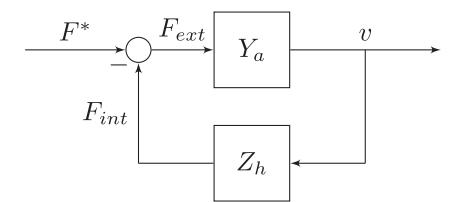

Fig. 2. Interconnection of admittance controlled robot that has apparent admittance  $Y_a$  and the human that has impedance  $Z_h$ , creating closed-loop (coupled) interaction behavior. The external voluntary force from the human is given by  $F^*$ , the force generated by the intrinsic human dynamics is given by  $F_{int}$ , which both sum to the total external force  $F_{ext}$  experienced by the robot. This external force passes through the complete system dynamics  $Y_a$  (see Figure 1) and results in real velocity v.

can exhibit coupled instability (Colgate, 1988), or an unstable robot system could become stable after coupling it to a human user.

The coupling of an admittance controlled device with apparent admittance  $Y_a$  to an impedance human user  $Z_h$  creates a "force loop" with negative feedback. For controlled devices interacting with a human user, the stability behavior is therefore highly dependent on the user's impedance characteristics (Zeng and Hemami, 1997).

## 4.2. Robust coupled stability: energy passivity

The analysis method related to *energy passivity* (Raisbeck, 1954) made its way from electrical network coupling stability to robot–human and robot–environment interaction. It allows the use of a similar argument to guarantee stability of robots during interaction (i.e. coupling) with all possible energetically passive environments. The situation where the robot interacts with a human user is different, in the sense that the human user can exhibit non-passive dynamical behavior (Dyck et al., 2013). However, from everyday experience we know that the interaction of humans with passive objects is stable. Therefore, as long as the controlled robot's apparent dynamics are energetically passive, the interaction between robot and human will be stable.

Energetically passive behavior of the apparent dynamics of the controlled robot, together with good performance, form therefore a design "goal" to aim for, since it puts the responsibility of interaction stability with the human. Passivity conditions are useful during controller design, and are investigated in the remainder of this work.

4.2.1. Definition. The definition of an energetically passive one-port system is that it cannot deliver more energy than what was put into it (Colgate, 1988); i.e. for mechanical systems it would be required that

$$\int_{-\infty}^{t} F(\tau) v(\tau) d\tau \ge 0 \tag{1}$$

where F and v are power-conjugated force and velocity inputs or outputs of a mechanical system of either admittance or impedance causality. If the apparent dynamical behavior of the robot during free motions is designed to behave like a passive system in accordance with Equation (1), stability is *guaranteed* for *any* combination of the passive robot coupled to another passive system.

Colgate (1988) described a method to assess passivity in the frequency domain for LTI systems. A *single-DOF* LTI controlled robot, in our case the uncoupled apparent dynamics  $Y_a$  in admittance form (see  $Y_a$  in Figure 2) is passive *if and only if*;

- 1.  $Y_a(s)$  has no poles in the right half of the complex plane (i.e. uncoupled stability);
- 2. any imaginary poles of  $Y_a(s)$  are simple and have with positive real residues (i.e. a positive coefficient after partial fractional expansion);
- 3.  $\Re\{Y_a(j\omega)\} \ge 0$ ,  $\forall \omega \in \mathbb{R}$  (i.e. the admittance is positive real for all positive and negative real frequencies; for discrete time systems this is required up to the positive and negative Nyquist frequency).

The first condition we usually conform to in stable motion control. The combination of the second and third conditions is commonly referred to as the *positive real con*dition (Colgate, 1988), which provides useful design guidelines. Following Dohring and Newman (2003), the positive real condition for systems without time delay reduces to the demand that  $\Re\{N\}\Re\{D\} + \Im\{N\}\Im\{D\} \geq 0, \forall \omega \in \mathbb{R}$ , with N and D being the numerator and denominator of  $Y_a$ , respectively, and  $\Re\{\cdot\}$  and  $\Im\{\cdot\}$  the real and imaginary parts of the argument, respectively. This condition leads to an even polynomial in angular frequency  $\omega$ . If the coefficient for the  $\omega^0$  term is zero, all remaining polynomial coefficients should be greater than, or equal to, zero to have a passive dynamical system. These coefficients being greater than, or equal to, zero, including the uncoupled stability conditions, give all the *necessary* passivity conditions. If the polynomial has a non-zero coefficient for  $\omega^0$ , then finding marginal passivity conditions can become more involved. Fourth-order polynomials, which are effectively secondorder polynomials in  $\omega^2$ , then require discriminant analysis. For higher-order polynomials there might not be a generally applicable method to find analytical marginal passivity conditions. Nevertheless, the more straightforward demand that all coefficients should be greater than, or equal to, zero for a polynomial in  $\omega$  of any order guarantees a passive system, albeit conservative (i.e. dissipating). In the analyses in this work, we will use this more strict demand that all polynomial coefficients should be greater than, or equal to, zero to determine system passivity.

A consequence of the positive real condition is that, the apparent dynamics  $Y_a$  cannot have a relative pole-zero excess greater than 1 and the system has to be minimum-phase (i.e. no unstable zeroes).

*4.2.2. Practicality.* Several authors suggest that enforcing passivity is too conservative for human–machine interaction (Adams and Hannaford, 1999; Buerger and Hogan, 2006; Haddadi, 2011; Hashtrudi-Zaad and Salcudean, 2001; Willaert et al., 2009). This is mainly due to the fact that the human interaction impedance in practice is bounded. Therefore, aiming for coupled stability with any human limb that can be infinitely stiff, infinite in inertial mass, or infinitely dissipative, is conservative.

A controller design method used by Adams and Hannaford (1999) to take finite human impedance into account, is to absorb the maximal and minimal human admittance into the robot's apparent admittance. The new robot admittance is coupled to an abstract passive human impedance that is allowed to take on any value. This allows for application of the positive real condition for design, while still accounting for the limited human impedance range.

Investigations into the limited impedance ranges of the human arm are also discussed by Buerger and Hogan (2006, 2007). The coupled stability problem is consequently handled as a robust control problem with known parametric uncertainty in the human impedance parameters. A constrained optimization method is used to find controller gains that achieve good apparent dynamics and guaranteed stability within a limited human impedance range.

Haddadi (2011) developed a passivity-based robust stability method that is less conservative than the approached described above. Rules and visual aids are developed to incorporate bounds of the human or environment impedance for less-conservative guaranteed stability conditions, with a better trade-off between stability and performance.

# *4.3. Ez-width*

Passive behavior of a controlled robot might not always be achievable due to controller choices or due to unwanted poor dynamical performance when the robot is behaving passively. If by controller design the apparent dynamics *Ya* are stable, but non-passive, the coupled human–robot system in Figure 2 can be complementarily stabilized (Buerger and Hogan, 2007) by a (limited) range of *passive* human dynamical behavior. This human dynamical behavior can be modeled as quasi-linear dynamics, parameterized by limb stiffness, damping, and inertia (Buerger and Hogan, 2007; Hogan, 1989). When considering human limb stiffness and damping values only, this range is similar to the *z*-width metric (Colgate and Brown, 1994). Instead of the dynamical parameters for which the robot is passive, our human stiffness and damping range describes the impedance of the *human* (*Zh*) (or environment) for which the *coupled* system is still stable. Therefore, we will call this stabilizing range of stiffness and damping: environment *z*-width, or *ez-width*. The ez-width describes in what range a passive human's stiffness and damping can be for a system to be marginally stable for a human's limb inertia or another parameter, i.e. it is an environment margin.

In this work, the ez-width is used to see in what range the human limb stiffness and damping can be if we depart from the wish for (strict) passivity of the apparent dynamics *Ya*. The ez-width of *Ya* can be calculated by evaluating the Routh array or Hurwitz determinants of the closed-loop system from Figure 2, namely *Ya*/( 1 + *ZhYa*), or by evaluating the Nyquist criterion of the loop gain formed by *ZhYa*. The ez-width diagrams in this work were calculated numerically, determining the phase margin of *ZhYa* for a *passive Zh* of the form *mhs* + *bh* + *kh*/*s*, with *mh*, *bh*, and *kh* the inertia, damping, and stiffness of the human limb, respectively. If the phase margin was negative, the coupled system was unstable. The ez-width diagrams show the demarcation between stable and unstable regions. The ez-width can be infinite. A robot with that property is energetically passive.

It should be noted, however, that the usefulness of ezwidth diagrams relies heavily on the major assumption that a second-order passive quasi-linear mass–spring–damper model is sufficient to describe neural feedback-controlled human limb behavior. Although several studies show that for certain tasks this assumption holds (e.g. Hogan, 1989), for other tasks or robot admittance it does not (Dyck et al., 2013). Therefore, the ez-width diagrams only show bestcase interaction scenarios where the human would behave fully passively. This assumption could be violated during more realistic real-world tasks, resulting in reduced effective ez-width.

# **5. Admittance control model**

In this section, a generic electromechanical set-up and a control model are presented to explain several of the observed instability and performance effects. The control model incorporates ideas from literature and from our experience. The goal of this section is to give the reader an introduction to a naive admittance controller design to expand upon with the 'guidelines' discussed in Section 6.

# *5.1. Physical setup*

A schematic admittance controlled device is shown in Figure 3. An actuator generates mechanical power by the supply of electrical power through a controlled current or applied voltage. Such an actuator is commonly an electromechanical motor, although hydraulic actuation has been implemented successfully (Heinrichs et al., 1997). These actuators usually impose forces on the mechanics of the device, which consists of a drive train, moving parts and robotic links. Close to the interaction point a force sensor measures the interaction forces with the user. This sensor is usually non-collocated with the actuator.

A force sensor has non-zero inertia, and usually a tool (for industrial applications), handle (for manual interaction) or cuff (for exoskeleton-like applications) is attached to the

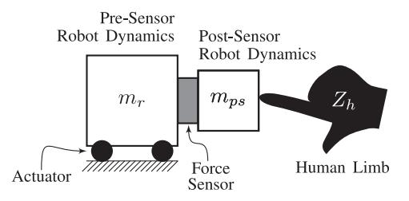

**Fig. 3.** Generic electromechanical system overview of an admittance controlled device. An actuator moves all mechanics (robot inertia  $m_r$  and some dissipation) placed before (i.e. 'pre') the force sensor. Behind the force sensor (i.e. 'post') there will be mechanics that generate force sensor measurements during motion  $(m_{ps})$ . These post sensor mechanics consequently interact with the human limb  $Z_h$ . The sensor is assumed to be infinitely stiff and its inertia is absorbed in  $m_{ps}$ .

sensor. It will measure these *post-sensor* dynamics during motion of the pre-sensor system as an impedance effect. These post-sensor dynamics can be thought of as the *known* time-invariant impedance of the interaction dynamics, and is preferably solely inertial in nature. These post-sensor dynamics do not include the user's dynamics. We therefore deem the user's impedance to be the *unknown* impedance  $Z_h$ . Instead of the force sensor, the post-sensor dynamics interact with a human limb or another object in the environment. The consequential interaction force is measured by the force sensor. The admittance controller will, due to these forces, attempt to respond like the virtual dynamics.

### 5.2. Admittance control diagram

The stand-alone apparent dynamics  $Y_a$  from Figure 2 is shown in extended and expanded form in Figure 4, omitting the interconnection with the user  $(Z_h)$ . The admittance causality is observed when noting the external force  $(F_{ext})$  as the input, tracking the signal to the motion (velocity, v) of the system as the output. The complete transfer function from force  $F_{ext}$  to motion v, describing this system's apparent dynamics, is given in Appendix 2.

The total control diagram is composed of several subsystems that will be discussed in the following paragraphs. Dependence on Laplace variable *s* is mostly omitted for readability and used symbols are explained in Appendix 1.

- 5.2.1. Forces on the system. Externally applied force ( $F_{ext}$ ) by the human and their passive dynamics, and forces from the post-sensor dynamics ( $F_{ps}$ ) act on this system. They are measured by a force sensor with limited bandwidth, possible filtering, or observer dynamics ( $S_f$ ).
- 5.2.2. From measured force to desired velocity. The signal is consequently sampled (smp) to be processed by the digital controller. The measured forces  $(F_m)$  pass through the virtual dynamics  $(Y_v)$ , which calculates the desired dynamical behavior. A transmission ratio  $(k_r)$  increases the

reference velocity of the virtual dynamics to the desired robot motor velocity  $(v_d)$ . This velocity, which is not necessarily a state from the virtual admittance, see Section 6.5, is the reference signal for the velocity controller to track.

5.2.3. Control and actuation. The velocity controller outputs a desired electrical current to be imposed on the actuators by the current controller. The velocity controller consists of a feed-forward  $(C_{ff})$  and feedback controller  $(C_{fb})$ . The feedback controller is commonly of the PI type:  $C_{fb} = k_p + k_i/s$ . Additional force amplification  $(G_f)$  allows for apparent reduction in robot inertia and damping/friction effects.

All reference current values from the force-amplification, feed-forward, and feedback control  $(i_{gf} + i_{ff} + i_{fb})$  are presented to the closed-loop current controller  $(H_i)$ . The output value is held constant during a sample time  $T_s$  using a zero-order hold (ZOH). We assume the current controller to have high bandwidth (commonly > 2 kHz for industrial current controllers), and some processing delay that adds to the sampling-and-processing delays from the ZOH.

The controlled current generates a motor control force  $(F_c)$  that is amplified by the gearing ratio  $k_r$ . This control force acts on the passive robot dynamics  $(Y_r)$ . External forces and disturbance forces  $(F_{dst})$ , such as static friction and obstructions also act on the robot and actuator.

5.2.4. Resulting motion and impedance effects. The robot's resulting motion is due to the sum of these forces. This motion is measured by a velocity sensor or observer  $(S_v)$ , and an acceleration sensor or observer  $(S_a)$ . The former is used in the closed-loop velocity control. The latter is used in compensation strategies (see Section 6.3) through  $\hat{Z}_{ps}$ . Any post-sensor dynamics  $(Z_{ps})$ , i.e. a tool or cuff, generates impedance reaction forces  $F_{ps}$  on the device's force sensor and adds to the robot dynamics directly through the forward path to  $Y_r$ .

### 5.3. Control model

We are interested in a simple model that can explain instability when in contact with stiff human limbs or environments. We call this model the *baseline* model, with which we can compare performance of possible improvements. It constitutes a naive admittance controller with feedback control only and virtual dynamics as in Figure 1. The robot constitutes a rigid-body mass with some dissipation, and is shown in Figure 5. The apparent dynamics of this baseline system is denoted by  $\bar{Y}_a$ . This robot can be in contact with a human that applies force  $F_{ext}$ , which can be from human impedance (shown in dotted gray in Figure 5).

This baseline model is derived from the elaborate model in Figure 4. We assume ideal sensors, such that  $(S_f = S_v = 1)$ , no acceleration sensing  $(S_a = 0)$ , no feed-forward control  $(G_f = C_{ff} = 0)$ , assume post-sensor impedance  $Z_{ps} = m_{ps}s$ , and set  $m_r = m'_r + m_m k_r^2$  and  $b_r = b'_r + b_m k_r^2$ 

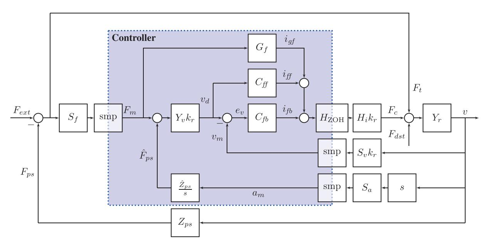

Fig. 4. Expansion of the apparent robot dynamics  $Y_a$  shown in Figures 1 and 2 (note that it does not show coupling to the human, as is shown in Figure 2). Open circles imply summation. The block "smp" implies discrete sampling of a continuous time signal. The shaded area is the controller, which is implemented in software. See the text in Section 5.2 or Appendix 1 for an explanation of the used symbols. The total transfer function of the apparent admittance  $Y_a$  from  $F_{ext}$  to v is given in Appendix 2.

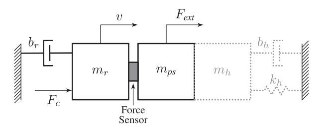

**Fig. 5.** Schematic view of a rigid robot. An external force  $F_{ext}$  and a controller force from an actuator  $F_c$  are applied to the robot inertia  $m_r$  combined with the post-sensor inertia  $m_{ps}$ , both resulting in some robot velocity v. Some energy losses during robot motion are modeled as viscous damping  $b_r$ . The robot can be rigidly connected to a human with inertia  $m_h$ , stiffness  $k_h$ , and damping  $b_h$ , shown by the gray dotted outline.

to add the effects of reflected inertia  $(m_m k_r^2)$  and damping  $(b_m k_r^2)$  from the *motor* to those of the robot inertia  $(m'_r)$  and damping  $(b'_r)$ . The used parameter values are presented in Table 1. The controller attempts to make a 10 kg inertia robot with damping feel like a pure 2 kg inertia, which gives an inertia reduction factor of five and removes damping effects.

The equation of motion of the system in Figure 5, omitting the human impedance, absorbing any external force (either from human impedance or extraneous force) into  $F_{ext}(t)$  is given by

$$(m_r + m_{ps})\dot{v}(t) + b_r v(t) = F_{ext}(t) + F_c(t) + k_r F_{dst}(t)$$
 (2)

with  $m_r$  the pre-sensor robot inertia and  $m_{ps}$  the post-sensor robot inertia, v(t) the real robot velocity,  $b_r$  the viscous effects in the drive train,  $k_r$  the transmission ratio of the

**Table 1.** Baseline system dynamical parameters

| Parameter      | Value    |
|----------------|----------|
| $m_{V}$        | 2 kg     |
| $k_r$          | 1        |
| $m_r$          | 10 kg    |
| $m_{DS}$       | 2 kg     |
| $m_{ps}$ $b_r$ | 5 Ns/m   |
| $k_D$          | 100 Ns/m |
| $k_p$ $k_i$    | 2000 N/m |

drive train,  $F_{ext}(t)$  the external force applied by the user (directly felt by the robot actuators),  $F_c(t)$  the force applied by the controller through actuators and transmission, and  $F_{dst}(t)$  disturbance forces acting on the robot on the actuator side. Equation (2) is rewritten in the Laplace domain (omitting dependency on s for readability) as

$$(m_r s + b_r) v = F_{ext} - m_{ps} v s + F_c + k_r F_{dst}$$
 (3)

The controller equations for this baseline model for virtual dynamics of inertial form (virtual inertia  $m_v$ ) are given by

$$Y_{\nu} = \frac{1}{m_{\nu}s} \tag{4}$$

$$v_d = k_r Y_v (F_{ext} - m_{ns} vs) \tag{5}$$

$$F_c = k_r \frac{k_p s + k_i}{s} (v_d - k_r v) \tag{6}$$

with  $k_p$  and  $k_i$  the proportional and integral controller gains, respectively. Equation (4) gives the transfer function of the virtual dynamics. Equation (5) shows that the reference velocity is calculated from the measured interaction

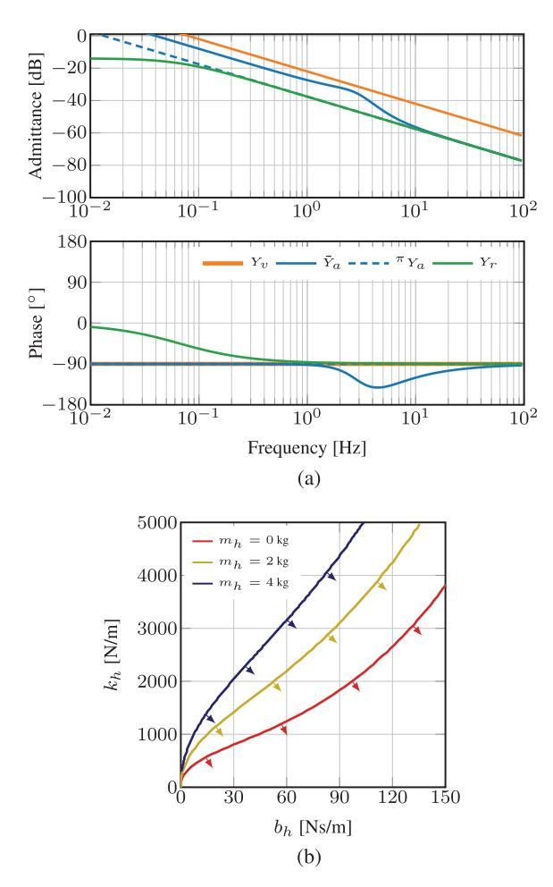

**Fig. 6.** Behavior and performance of a typical admittance controlled system. (a) Bode plot of the *uncoupled* system: apparent dynamics  $\bar{Y}_a$  approaches virtual dynamics  $Y_v$  for low frequencies, but the constant difference is due to sensor inertia  $m_{ps}$ . Passive system  $^{\pi}Y_a$  has controller gains such that they conform to equations (7) and (8). This passive system performs poorly, very similar to the robot dynamics  $Y_r$  instead of the virtual dynamics  $Y_v$ . (b) The ez-width of  $\bar{Y}_a$  *coupled* to a second-order impedance is larger for higher human limb inertia  $m_h$ . The region of stable interaction is indicated by the arrow markings.

force, namely external force  $F_{ext}$  and the post-sensor inertial effects  $-m_{ps}vs$ . Equation (6) shows a typical PI velocity controller that generates a controller force based on the velocity error  $e_v = v_d - k_r v$ .

5.3.1. Uncoupled stability. For positive choices for all parameters, the apparent dynamics created by Equations (3)–(6) has three poles: one valued zero from the purely inertial virtual dynamics  $Y_{\nu}$ , and two stable (possibly complex) poles from the PI-feedback controller. Therefore, the robot is stable when in free air, when it is not held by the human.

In Figure 6a is shown that the baseline apparent admittance  $\bar{Y}_a$  is stable, and partially approaches the virtual

dynamics  $Y_v$ . For low frequencies there is a constant difference in admittance modulus, which is an inertia offset due the post sensor inertia  $m_{ps}$ . The naive admittance controller can therefore not remove any post-sensor inertia (see Section 6.3 how to achieve this). At high frequencies the apparent dynamics  $\bar{Y}_a$  drop back to the robot dynamics  $Y_r$ , introducing excess phase lag in the frequency range of the transition.

5.3.2. Passivity of the uncoupled apparent dynamics. Passivity of this robot is guaranteed if and only if

$$m_{v} > 0$$

$$m_{v} \ge \frac{K_{p}}{K_{p} + b_{r}} m_{r} \approx m_{r}$$
(7)

$$-b_r K_i \ge 0 \tag{8}$$

with  $K_p = k_p k_r^2$  and  $K_i = k_i k_r^2$ . Equation (8) tells us we have to sacrifice low-frequency performance for passivity by setting  $k_i = 0$  (it cannot be made negative, since that would violate the uncoupled stability requirement). This is understandable from the fact that the integral controller adds extra phase lag for low frequencies onto the already marginally passive virtual inertia behavior. Therefore, any amount of extra phase lag makes the apparent admittance active. At the passivity limit given by Equation (7), which demands to have the controller introduced pole in  $Y_a$  to be of higher frequency than the introduced zero we are left with a passive equivalent system with the same inertia as the robot itself (see Figure 6a, system  ${}^{\pi}Y_a$ ). Therefore, passive inertia reduction is *not* possible with admittance control with a pure virtual inertia and solely using feedback control. Having high transmission ratio (i.e.  $k_r \gg 1$ ) makes it more difficult for such a system to be passive, according to Equation (7). The passivity criterion tells us to use little integral gain, and use low transmission ratio. This conflicts with good disturbance rejection and performance.

5.3.3. Coupled stability. The uncoupled baseline system with parameters described in Table 1 is not passive and will have finite ez-width, when coupled to a passive human limb, as is shown in Figure 6b.

All the stability boundaries in Figure 6b have in common that they pass through the origin, for any human limb inertia. This shows that admittance controlled systems would never be stable for interaction with pure springs, or pure spring—mass combinations. This is something that is not observed in practice, because all human limbs and realistic mechanical environments have some form of energy dissipation. The upward slope of all curves through the origin shows that adding limb damping yields a decent "stiffness margin" and stable interaction.

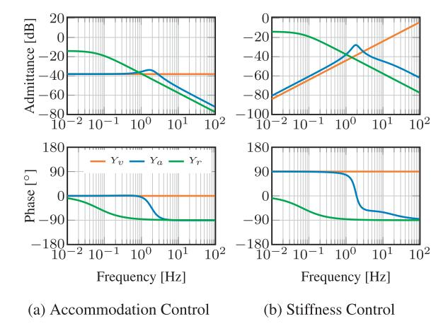

Fig. 7. Admittance control apparent dynamics  $Y_a$  for uncoupled (a) passive accommodation control ( $b_v = 80 \text{ Ns/m}$ ) and (b) passive stiffness control ( $k_v = 1000 \text{ N/m}$ ). Both figures share the same legend. The low-frequency mismatch in (b) is due to the integral velocity gain  $k_i$  that acts like a spring in series with virtual spring  $k_v$ . In both figures the phase of  $Y_a$  stays within  $\pm 90^\circ$ , which shows passivity.

## 5.4. Virtual damping and stiffness behavior

Naive admittance controllers can more straightforwardly render *pure* virtual damping (i.e. accommodation) and *pure* stiffness effects passively with decent performance. This is illustrated in Figure 7a and Figure 7b. For low frequencies the apparent admittance approaches the virtual admittance well for both accommodation and stiffness control. Above the feedback controller bandwidth, the apparent admittance becomes inertial in nature due to the robot's intrinsic dynamics.

If in Equation (4) the virtual dynamics are replaced by  $Y_{\nu}=\frac{1}{b_{\nu}}$  (i.e. accommodation form), the passivity conditions become

$$b_{\nu} \ge 0$$
  
$$m_r K_i \le (K_p + b_r)(K_p + b_{\nu})$$

This shows again that  $K_i$  should be kept low, the robot inertia has to be low and that either the virtual damping, robot damping, or proportional gain has to be high to have passive accommodation control.

If in Equation (4) the virtual dynamics are replaced by  $Y_{\nu} = \frac{s}{k_{\nu}}$  (i.e. stiffness form), the relevant passivity condition is trivial with  $k_{\nu} \geq 0$ , when assuming positive values for all other parameters. The apparent stiffness  $k_{app}$  of the device is

$$k_{app} = \left(\lim_{s \to 0} \left(\frac{Y_a}{s}\right)\right)^{-1} = \left(\frac{1}{k_v} + \frac{1}{K_i}\right)^{-1}$$

or two springs (the integral/position gain and the virtual stiffness) in series, as can be seen in Figure 7b. The apparent stiffness differs slightly from the virtual stiffness due to finite integral controller gain  $k_i$ .

#### 5.5. Virtual element combinations

For combinations of mass–spring–damper elements in the virtual dynamics, the passivity conditions become combinations of the conditions presented in the previous sections. This leads to upper and lower limits of robot and controller parameters that become difficult to interpret as design guidelines in some cases. The effective behavior of these passivity conditions, and what they effectively teach us, is shown in Table 2. Note that the mass–damper combination is also discussed in more detail in Section 6.4.

As a rule of thumb it can be stated that if virtual mass is used, the condition in Equation (7) is invariant to addition of other elements. In addition, the conditions for a spring—damper combination add directly (therefore reducing the passivity of a pure spring), but the mass—spring combination acquires an extra addition to the passivity condition.

Table 2 also gives a coupled stability robustness ranking from 1 (the best) to 7 (the worst) showing for a fixed set of controller and robot parameters which virtual admittance makes the robot "most" passive.

Note that the virtual mass–spring–damper case is the only combination that also has a non-trivial uncoupled stability requirement related to an upper limit on  $k_i$ . All other parameter combinations achieve uncoupled stability due to positive parameters. The generic mass–spring–damper passivity, and stability, conditions are derived and shown in more detail in Appendix 3.

# 6. Guidelines for minimal inertia

In Section 5.4 it was shown that pure damping and stiffness are readily rendered passively by the robot. Therefore, we focus on the challenge of rendering low system inertia. We expand the naive model from Section 5.3 to incorporate and analyze additions to the control diagram that are shown in Figure 4 and were discussed in Section 5.2. We use the passivity criterion for the uncoupled system, the ez-width of the system coupled to a passive second order system, disturbance rejection and admittance tracking performance (i.e. how well the apparent admittance matches the virtual admittance) to draw conclusions about the feasibility of certain design choices. We will always compare a change in design or model to the "baseline" controller from Section 5.3, and attempt the same inertia reduction of a factor five from 10 to 2 kg.

From this analysis follows a set of guidelines that is presented here in random order. The derivation of the apparent dynamical behavior, the uncoupled stability conditions and positive real conditions for all the guidelines are shown in Appendices 2 and 3.

## 6.1. Guideline 1: Use feed-forward control

If the robot controller can be used in torque (or current) control mode it is beneficial to use feed-forward control.

**Table 2.** Conditions c. that need to be greater than or equal to zero for different combinations of haptic elements: virtual spring  $k_v$ , virtual damper  $b_v$ , and virtual inertia  $m_v$ . The effective influence states whether it gives a lower or upper bound on a parameter. The coupled stability ranking states the system that is most robustly stable when coupled (rank 1) to worst robustly stable when coupled (rank 7) for a fixed set of robot and controller parameters.

| Element(s)                                                                                 | Condition(s)                                                                                                                         | Effective influence                                                                                                                                                                                                                                                                                                                                                           | Coupled stability ranking       |
|--------------------------------------------------------------------------------------------|--------------------------------------------------------------------------------------------------------------------------------------|-------------------------------------------------------------------------------------------------------------------------------------------------------------------------------------------------------------------------------------------------------------------------------------------------------------------------------------------------------------------------------|---------------------------------|
| $k_{v}$ $b_{v}$ $m_{v}$ $m_{v}, b_{v}$ $k_{v}, b_{v}$ $m_{v}, k_{v}$ $m_{v}, k_{v}, b_{v}$ | $c_k$ $c_b$ $c_{m1}, c_{m2}$ $c_b + c_{m1}, c_{m2}$ $c_k + c_b$ $c_{mk} = c_s + c_{m1} + \delta_{mk}, c_{m2}$ $c_{mk} + c_b, c_{m2}$ | $k_{\nu} \geq 0$ $k_{i} \leq \dots$ $k_{i} = 0, m_{\nu} \geq \dots$ $k_{i} \leq \dots$ (lower than for pure damper), $m_{\nu} \geq \dots$ $k_{i} \leq \dots$ (higher than for pure damper) $k_{i} \leq \dots$ (lower than for mass-damper), $m_{\nu} \geq \dots$ $k_{i} \leq \dots$ (higher than mass-spring, lower than mass-damper), $m_{\nu} \geq \dots$ | 1 3 7 4 2 6 5 |

Feed-forward control can be applied in the form of force gain  $(G_f > 0)$  and inertia and damping compensation (impedance  $C_{ff} = \mu_{ff} s + \beta_{ff}$ ). The passivity condition in Equations (7) and (8) change due to the addition of feed-forward control to

$$m_{v} \ge \frac{(K_{p} + \beta_{ff}k_{r}^{2})m_{r} - (K_{p} + b_{r})\mu_{ff}k_{r}^{2}}{(G_{f}k_{r} + 1)(K_{p} + b_{r})}$$
(9)

$$0 \le (\beta_{ff}k_r^2 - b_r)K_i \tag{10}$$

By setting  $\beta_{ff}k_r^2 \geq b_r$  in Equation (10), it is possible to use integral gain for good low-frequency approach of the apparent dynamics to the virtual dynamics. The feed-forward inertia parameter  $\mu_{ff}$  effectively removes inertia from the robot, such that there is less inertia to reduce by the feedback controller. This can be seen in the numerator of Equation (9) where feed-forward inertia  $\mu_{ff}$  is subtracted from the robot inertia  $m_r$ . The inertia-increasing effect of  $\beta_{ff}$  on the right-hand side of Equation (9) can be counteracted by using  $G_f > 0$ .

For high transmission ratios, the passivity condition in Equation (9) reduces to

$$\mu_{ff} \geq \frac{k_p + \beta_{ff}}{k_p + b_m} m_m$$

This shows that only with feed-forward does high transmission actually help in achieving some passive low virtual inertia.

The use of feed-forward increases both the ez-width and improves the admittance tracking performance for high frequencies above the velocity controller bandwidth. As is shown in Figure 8, the admittance can be made passive (the ez-width becomes infinite), while approaching the virtual admittance much better at high frequencies than the baseline system  $\bar{Y}_a$  could. The apparent inertia for high frequencies is given by

$$m_{app} = \left(\lim_{s \to \infty} (sY_a)\right)^{-1}$$
$$= m_{ps} + \frac{m_r}{\frac{\mu_{ff}}{m_r} k_r^2 + G_f k_r + 1}$$

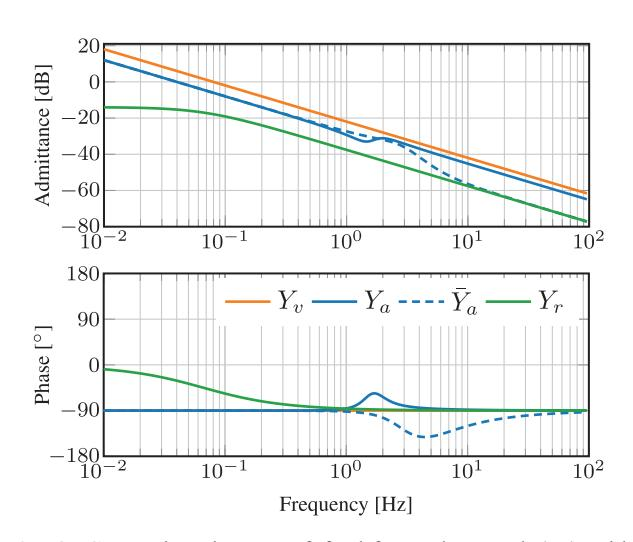

**Fig. 8.** Comparing the use of feed-forward control  $(Y_a)$  with the baseline system  $\bar{Y}_a$ . It can be seen that the high-frequency approach of the virtual dynamics is good for  $Y_a$ . Furthermore, the phase lag of  $Y_a$  stays within passivity bounds, as opposed to  $\bar{Y}_a$ . Used parameter values:  $G_f = 5$ ,  $\mu_{ff} = 10$  kg, and  $\beta_{ff} = 2$  Ns/m.

Without any feed-forward (i.e.  $G_f = 0$  or  $\mu_{ff} = 0$ ) the high-frequency inertia would always fall back to the total robot inertia  $m_{ps} + m_r$ . The use of feed-forward control passively reduces this inertia, but it cannot become lower than  $m_{ps}$ .

## 6.2. Guideline 2: Avoid force filtering

It is tempting to low-pass filter force sensor measurements to reduce effects of noise or aliasing that cause random motion of the robot. This should be avoided if the virtual admittance is purely inertial (i.e.  $Y_v = 1/m_v s$ ). Consider a force sensor bandwidth limitation given by

$$S_f(s) = B_n^{-1}(s)$$

with  $B_n(s)$  a Butterworth polynomial of order n. For all orders n > 0 we add extra poles and  $n\pi/2$  rad phase-lag to

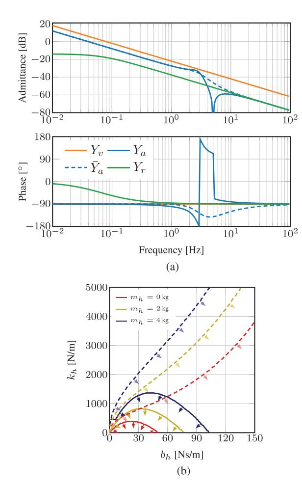

Fig. 9. Influence of low-pass filtering the measured force on system performance and interaction stability. (a) This bode plot shows a system with force filtering  $(Y_a)$  and the baseline system  $\bar{Y}_a$ . The used filter is of first order with high time constant 0.05 s to show an extreme effect on phase lag and consequently on ez-width. It can be seen that high-frequency approach of the virtual dynamics is poor for  $Y_a$ . Furthermore, the phase-lag of  $Y_a$  is bigger than for  $\bar{Y}_a$ , resulting in a system much more unstable when in contact with a human limb. (b) The ez-width of  $Y_a$ , compared with baseline (dashed lines). Owing to force filtering the ez-width is reduced. The region of stable interaction is indicated by the arrow markings.

the virtual admittance  $Y_{\nu}$ . This extra phase lag directly conflicts with the relative-order constraint from the frequency domain passivity criterion (see Section 4.2). A single-pole low-pass filter with time constant  $\tau_f$  would change the passivity condition of Equation (7), only if  $k_i = 0$  to

$$m_{\nu} \ge m_r \frac{K_p}{K_n + b_r} + K_p \tau_f \tag{11}$$

Setting  $k_i$  and then picking  $m_v$  on the passivity bounds would not lead to any decrease in inertia. Adding a low-pass filter with  $\tau_f > 0$  makes this effect even worse, requiring an increase in virtual (and, therefore, apparent) inertia for the system to be passive.

Filtering will therefore reduce ez-width (see Figure 9b for an extreme case of low-pass filtering) and limit high-frequency apparent admittance performance (see Figure 9a). This is not problematic for n = 1 with accommodation control, or n = 2 for stiffness control, which will both effectively become admittance control due to the extra pole(s) of the filter (see Appendix 3).

If filtering is inevitable, e.g. for anti-aliasing, then the filter bandwidth should be as high as possible and the filter order as low as possible.

# 6.3. Guideline 3: Compensate post-sensor inertia

Post-sensor dynamical effects are not reduced or masked by the basic admittance controller (Section 5.3), or by feed-forward control (Section 6.1). The post-sensor inertial effects can be compensated in the low-frequency range by performing post-sensor dynamics compensation (in impedance form) with a compensation inertia  $\mu_c$ , and low-pass filter time constant  $\tau_c$ :

$$\hat{Z}_{ps}S_a = \frac{\mu_c}{\tau_c s + 1}$$

This improves the performance, because indeed we achieve the following apparent inertial behavior at low frequencies:

$$Y_{a,\text{low-freq}} \approx \frac{1}{s} \lim_{s \to 0} (sY_r)$$

$$= \frac{1}{s(m_v + m_{ps} - \mu_c)}$$

If  $\mu_c = m_{ps}$  the post-sensor dynamics are completely compensated, as shown in Figure 10a.

This method, however, reduces ez-width (see Figure 10b). The passivity condition in Equation (7) changes to (assuming  $\tau_c = 0$ )

$$m_v \ge \frac{K_p}{K_p + b_r} (m_r + \mu_c)$$

where  $\mu_c$  effectively increased the lower bound on the value of  $m_v$ .

In accordance with Aguirre-Ollinger et al. (2011, 2012) this method can also be used to effectively give the robot *negative* inertia. This will reduce the inertia of the object or human limb attached to the robot. For this to work,  $\tau_c > 0$  (or even higher-order filters) and some limb damping  $b_h > 0$  is required.

## 6.4. Guideline 4: Use some virtual damping

Virtual admittance of inertial form can in most applications be changed to a combination of inertia and a small amount of damping

$$Y_{v} = \frac{1}{m_{v}s + b_{v}}$$

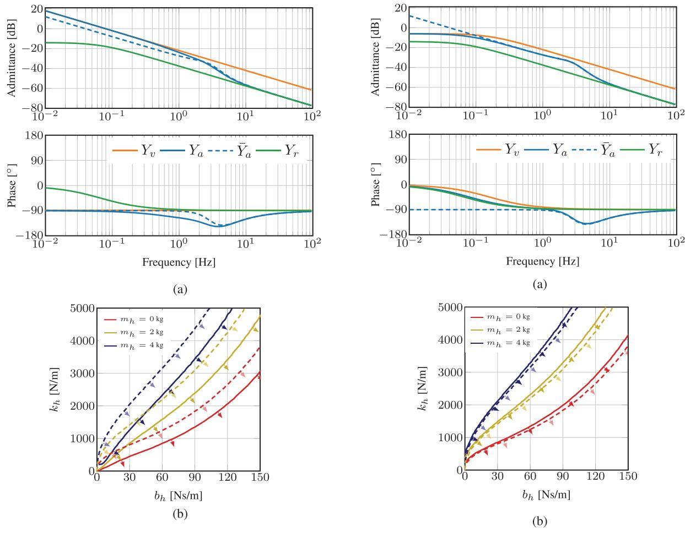

Fig. 10. Influence of post-sensor compensation on system performance and interaction stability. (a) This bode plot shows a system with post-sensor compensation  $(Y_a)$  and the baseline system  $\bar{Y}_a$ . The used amount of post-sensor inertia compensation was  $\mu_c=2$  kg, the same amount as the post-sensor inertia, with low-pass filter  $\tau_c=0.1$  s. The compensation improves low-frequency tracking, but generates phase lag. (b) Owing to the added phase lag, the ezwidth of  $Y_a$  (solid lines) is lower than that of  $\bar{Y}_a$  (dashed lines). Post-sensor inertia compensation therefore reduces ez-width. The region of stable interaction is indicated by the arrow markings.

Fig. 11. Influence of adding virtual damping on system performance and interaction stability. (a) This bode plot shows a system with some virtual damping  $(Y_a)$  and our baseline system  $\bar{Y}_a$ . The added damping has a value of  $b_v = 2$  Ns/m. (b) The virtual damping reduces some phase lag. The ez-width of  $Y_a$  (solid lines) is larger than that of  $\bar{Y}_a$  (dashed lines). Using a small amount of damping therefore increases ez-width. The region of stable interaction is indicated by the arrow markings.

The small amount of damping  $(b_v)$  is hardly felt by the user, but adds useful phase lead at lower frequencies that can lead to passivity and increased ez-width, if the phase lead is near the excessive phase lag. Therefore, added virtual damping is successful when the velocity controller bandwidth is low or has long delays.

The passivity conditions in Equation (8) changes, when adding some virtual damping, to

$$K_i \le b_v \frac{(K_p + b_v)(K_p + b_r)}{b_r m_v + b_v m_r}$$

Passivity condition in Equation (7) is left unaltered, i.e. adding some virtual damping will not allow for lower  $m_v$ . A third new passivity condition is the rather trivial one  $b_v K_i^2 \ge 0$ . Since integral gain can be increased, virtual damping

allows for better low-frequency tracking (see Figure 11a at the low frequencies).

Figure 11b shows that ez-width becomes larger when adding some virtual damping. A minor penalty for using damping is the dissipative nature, impeding motion.

## 6.5. Guideline 5: Modify the velocity reference

It is common that industrial robots with "black box" PI velocity control (or equivalently PD position control) are retrofitted with an admittance controller. In that case, adding feed-forward (guideline 1) is not possible, and some other way has to be found to obtain better admittance tracking and good ez-width.

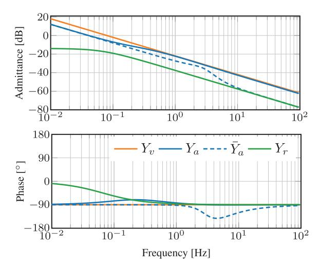

**Fig. 12.** Influence of a system with extra phase lead (*Ya*) with our baseline system (*Y*¯ *a*) for *ka* = 1. The addition of phase lead improves admittance tracking, and reduces phase lag, resulting in a passive system.

It is possible to change the virtual admittance and add some form of acceleration feed-forward with gain *ka*

$$Y_v = (sk_a + 1) Y_v'$$

with *Y* 0 *v* some intended virtual dynamical behavior. This creates some phase lead, and better high-frequency tracking of the originally intended virtual admittance *Y* 0 *v* .

The passivity conditions in Equations (7) and (8) change to

$$m_{\nu} \ge \frac{K_p m_r - k_a (K_p^2 + K_p b_r - K_i m_r)}{K_p + b_r}$$

$$0 \le (k_a K_i - b_r) K_i$$
(12)

This complex looking condition gives us some advice: (1) use a robot with minimal inertia *mr* , (2) keep integral velocity gain "low" to benefit from *ka*, although *K p* is usually so large this is not a problem. The addition of *ka* also allows for passive use of integral gain. Therefore, adding this additional phase lead will improve ez-width and performance (see Figure 12). The use of high transmission ratio *kr* will reduce the condition in Equation (12) to *ka* ≥ 0, ensuring passivity for any positive value of *ka*.

# *6.6. Guideline 6: Increase velocity loop bandwidth*

Many passivity conditions in the aforementioned guidelines demand low *kp* and low *ki* of the velocity controller. However, high bandwidth control actually improves ezwidth drastically. This seemingly contradicting statement comes from the fact that high bandwidth pushes the excessive phase lag to high frequencies, becoming only an issue for higher human stiffness values. Therefore, increasing *kp* and *ki* could have beneficial effect on ez-width, while

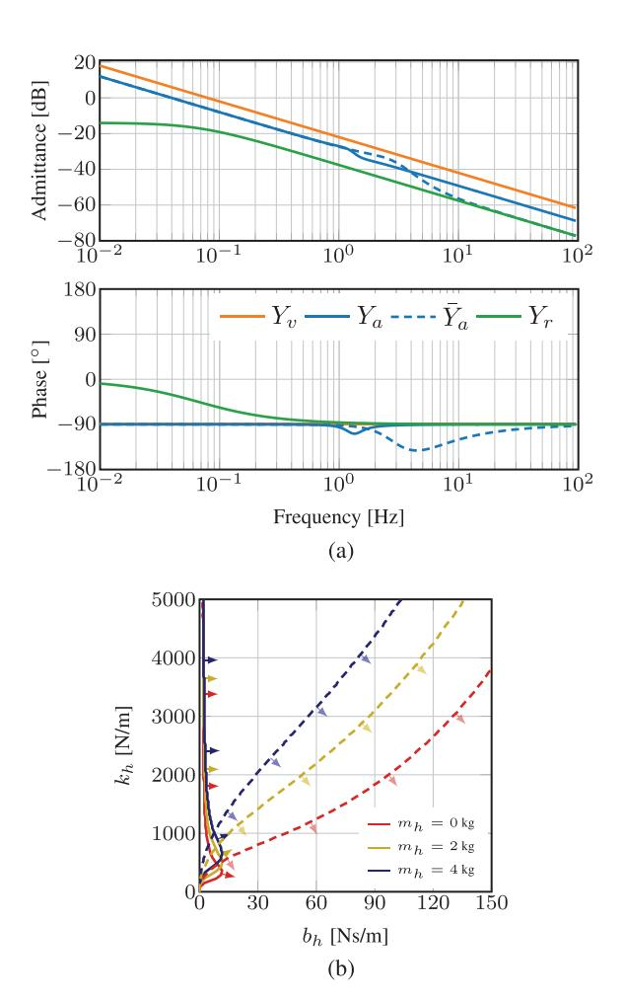

**Fig. 13.** Influence of differential velocity control on system performance and interaction stability. (a) Bode plot to compare a system with band-limited differential control (*Ya*) with our baseline system *Y*¯ *a*. The parameters are *kd* = 25 Ns2 /m (i.e. kg) and τ*d* = 0.1 s. Differential control reduces phase lag and improves admittance tracking for high frequencies. (b) Owing to the reduced phase lag, the ez-width of *Yr* (solid lines) is much larger than that of *Y*¯ *a* (dashed lines). Adding differential control to the velocity controller therefore increases ez-width. The region of stable interaction is indicated by the arrow markings.

fully neglecting the passivity requirement. Furthermore, higher *kp* and *ki* values ensure more disturbance rejection at the motor side, which suppresses unwanted friction and parasitic dynamics.

*6.6.1. Add differential velocity control.* An additional method to increase the velocity control bandwidth is to use a PID velocity (PDD2 position) controller (Aung and Kikuuwe, 2015). The feedback controller is augmented with differential gain *kd* and low-pass filter time constant τ*d*, and it takes on the form

$$C_{fb} = k_p + \frac{k_i}{s} + \frac{k_d s}{\tau_d s + 1}$$

To be a proper and implementable transfer function, differentiation is band-limited by the low-pass filter. Unfortunately, the passivity condition from Equation (8) remains unaltered. The passivity condition from Equation (7) becomes

$$m_v \ge \frac{K_p m_r + b_r K_i \tau_d^2 - b_r K_d}{K_p + b_r}$$

with  $K_d = k_d k_r^2$ . This shows that the virtual inertia parameter has to be increased if there is non-zero  $K_i$  and non-zero  $\tau_d$ . We also obtain a new condition, very similar to Equation (7), which exists only if  $\tau_d \neq 0$ . It states that still no passive inertia reduction can be achieved

$$m_{v} \ge m_{r} \frac{K_{p} \tau_{d} + K_{d}}{(K_{p} + b_{r}) \tau_{d} + K_{d}} \approx m_{r}$$

Band-limited differential control action has little effect on the passivity conditions, and it cannot make the system passive with  $K_i \neq 0$  and  $\tau_d \neq 0$ .

However, as expected, adding a band-limited differential velocity controller assists in achieving the better high-frequency approach of the virtual admittance, as is shown in Figure 13a. Adding differential gain also increases the ezwidth drastically, as is shown in Figure 13b. This behavior is due to the introduced zero in the transfer function due to the differentiation, and now we can choose the location of the new pole location that was introduced by the low-pass filter.

6.6.2. Reduce time delays. Another method to achieve higher-velocity bandwidth in practical setups is to reduce any additional phase lag due to DA conversion (ZOH) or current controller delays. The ZOH dynamics, for a system with sample time  $T_s$ , are given by

$$H_{ZOH} = \frac{1 - e^{-sT_s}}{sT_c}$$

which has  $-90^{\circ}$  phase lag at the Nyquist frequency  $\omega_N = \pi/T_s$ . Increasing the sampling frequency, reducing  $T_s$ , will increase the velocity loop bandwidth. Any pure delay of the form  $e^{-sT_d}$  has  $-90^{\circ}$  phase lag when  $\omega T_d = \pi/2$ . Decreasing  $T_d$  will move the excessive phase lag to higher frequencies and increase ez-width. Adding sufficient proportional velocity controller gain counteracts the phase lag introduced by the ZOH or pure delays, and can makes the system passive for accommodation and stiffness control.

### 6.7. Guideline 7: Optimize for robot stiffness

If we consider a flexible robot with a low-frequency resonant mode (below the controllers' Nyquist frequency), we can model this as two inertias sharing a fraction  $\gamma$  and  $1-\gamma$  of the total robot inertia. The distal  $m_r\gamma$  and proximal  $m_r(1-\gamma) = m_r\gamma'$  are connected by a structural stiffness  $(k_s)$  and damper  $(b_s)$ ; see Figure 14. The force sensor is

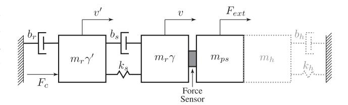

**Fig. 14.** Schematic view of a flexible robot, or a system with series elastic actuation. The robot now consists of two inertias  $m_r \gamma$  and  $m_r (1 - \gamma) = m_r \gamma'$ , connected by structural stiffness  $k_s$  and damping  $b_s$  that determine pole location of the lowest resonant mode. The robot can be rigidly connected to a human with inertia  $m_h$ , stiffness  $k_h$ , and damping  $b_h$ , shown by the gray dotted outline

now non-collocated with the actuator. If  $\gamma = 0$ , this system reduces to an admittance controller for a series elastic actuator, where  $k_s$  is actually the stiffness of the series elastic element that is used as a force sensor. See Appendix 4 for the equations of motion for such a system.

According to Colgate and Hogan (1989) the inertia cannot be passively reduced to any inertia smaller than  $m_r \gamma$ . Except for the condition  $\gamma \in [0, 1]$ , the found passivity conditions are too complex to draw straightforward conclusions (see Appendix 3).

The performance with a high-frequency mode is acceptable (see Figure 15a). The ez-width is sensitive to  $\gamma$ ,  $b_s$ , and  $k_s$ . The ez-width is reduced when lowering internal stiffness, lowering internal damping, and increasing  $\gamma > 0$ , as is shown in Figure 15b. This hints at the fact that series elastic actuation, with low  $\gamma$ , where the force sensor is the spring, should be achievable for admittance controlled system.

### 7. Discussion

Naive haptic admittance controllers that use only feedback control achieve passivity with good approach of the intended dynamics, when rendering pure virtual stiffness or pure damping. However, such controllers have difficulty rendering pure inertia lower than the original device inertia. This is inconvenient, since the admittance control paradigm is commonly used to attempt inertia reduction of bulky devices. The analyses in this paper, our experience, and reports in literature show that attempted inertia reduction leads to coupled instability. With a feedback-only velocity controller, admittance controllers become unstable when the device is firmly held by humans (e.g. for cooperative industrial tasks or haptic displays) or when it is attached to limbs (e.g. for rehabilitation devices). However, completely avoiding feedback control is infeasible, since it is required to suppress unwanted disturbances from external forces and friction forces.

The guidelines presented in this work, summarized in Table 3, propose several solutions to this coupled instability problem when rendering virtual inertia lower than the

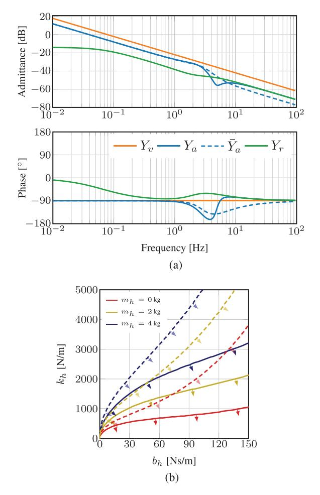

**Fig. 15.** The influence of having a system with finite internal stiffness on system performance and interaction stability (a) This bode plot shows a system with finite stiffness (*Ya*) and our baseline system *Y*¯ *a*. The parameters are γ = 0.5, *ks* = 1000 N/m, and *bs* = 100 N/m. Finite internal stiffness generates more phase lag. (b) Owing to the added phase lag, the ez-width of *Yr* (solid lines) is lower than that of *Y*¯ *r* (dashed lines). Finite internal stiffness of the robot therefore reduces ez-width. The region of stable interaction is indicated by the arrow markings.

device inertia. The goal of these guidelines is to simultaneously (1) achieve a better approach of the apparent dynamics to the intended virtual dynamics, and (2) ensure robust coupled stability in the sense of passivity. The guidelines give a qualitative description of how to design key parameters of the mechanical system and control system. These were derived from the fact that the design has to be close to passivity, but also approach the intended dynamics properly with sufficient disturbance rejection. We did not discuss proper controller design (i.e. choices for tuning feedback gains). Any objective in terms of robustness or optimality could be used for determining feedback controller gains, as long as these are within uncoupled stability bounds, and interaction stability bounds given in this work. The ezwidth or passivity bounds should be used as optimization constraints during such controller design.

Using the presented framework for designing admittance controlled systems has several limitations. We derived most of the guidelines from an idealized stiff and single-DOF robot. In multi-DOF robots, energetic coupling between nonlinear DOFs could result in instability effects absent in single-DOF analyses. A dynamical model with distributed mechanical compliance might be more useful in practical cases. However, the analysis for a system with a single resonant mode leads to qualitatively non-informative and complex conditions for passivity, uncoupled stability and interaction stability. For a distributed flexible model this would be even more so. Nevertheless, while the conditions might seem complicated, they could be incorporated in design software.

In practice, velocity measurements required for velocity control can be performed by tachometers (EMF-based) or gyroscopes. The more common alternative of numerical differentiation of joint position encoder signals with high spatial resolution leads to quantized and noisy estimates of joint velocity. Such a noisy estimate result in a noisy or grindy feel when interacting with the robot. Low-pass filtering this quantization noise results in unwanted resonance in the PI velocity controller's feedback loop and jeopardizes passivity. Therefore, estimation methods that use optimal integration of joint position measurements, joint acceleration estimations and a model of the device could give a joint velocity estimation with low phase lag and a high signal-to-noise ratio.

However, measuring or estimating the robot accelerations, also required for guidelines 3 and 6, can be difficult in practice. We have added first-order low-pass filters in the analyses to indicate limited sensor bandwidth observed in practice. Accelerometers output noisy signals, resulting in a noisy feel of the device during interaction. Other acceleration estimation methods, such as double numerical differentiation of joint-encoder measurements yield heavily quantized and noisy estimations as well. Possible state observer models together with optimal sensory integration could aid in obtaining an optimal estimation of the acceleration. Note that guidelines 1 and 5 do not need acceleration measurements. These use the accelerations from the virtual dynamics, which are derived from the force measurements.

The analyses in this work focused mostly on the influence of isolated parameter changes. Coupled parameter changes, for example by using feed-forward control and a low-pass filter on the force concurrently, were not discussed. Applying two guidelines, or changing two system variables could show unexpected interaction.

We briefly discussed the influence of ZOH and timedelay effects on passivity properties. Using discrete time sub-models for the feedback controller, virtual dynamics and possible state estimators might give slightly different and more realistic passivity conditions. Nevertheless, since

|  |  |  | Table 3. Summary of the seven guidelines presented in Section 5.3, together with the main motivation. |
|--|--|--|-------------------------------------------------------------------------------------------------------|
|  |  |  |                                                                                                       |

|   | Guideline                        | Motivation                                                                                                                             |
|---|----------------------------------|----------------------------------------------------------------------------------------------------------------------------------------|
| 1 | Use feed-forward control         | Effectively lowers the robot inertia to be reduced by the admittance controller                                                        |
| 2 | Avoid force filtering            | Introduces excessive phase-lag onto marginally passive virtual inertia model                                                           |
| 3 | Compensate post-sensor inertia   | Reduces the apparent inertia, but significantly reduces coupled stability margins                                                      |
| 4 | Use some virtual damping         | Allows for better low-frequency tracking of admittance                                                                                 |
| 5 | Modify the velocity reference    | Non-physical phase-lead can give better tracking of pure inertial model and increases coupled stability margins                     |
| 6 | Increase velocity loop bandwidth | Pushes the excessive phase lag to higher frequencies, which requires higher environment stiffness to destabilize the coupled system |
| 7 | Optimize for robot stiffness     | Internal resonant modes introduce phase lag between force sensor measurement and velocity measurement                               |

haptic devices usually use fast sampling frequencies above 1,000 Hz, we assume that the found guidelines are valid.

The post-sensor effects analyzed were assumed to be purely inertial. In practice, we notice that post-sensor backlash and flexibility leads to unwanted limit cycles. Whether this behavior is to be expected from the apparent dynamics in combination with coupled post-sensor dynamics, or exhibit a different form of instability, has to be further analyzed.

### **Acknowledgments**

The authors would like to thank Piet Lammertse, Jos Meuleman, Ralph Macke, and Erik-Jan Euving for their suggestions and sharing their insights.

### **Funding**

This research is part of the H-Haptics programme, supported by the Dutch Technology Foundation (STW), which is part of the Dutch Organisation for Scientific Research (NWO), and which is partly funded by the Ministry of Economic Affairs (Project Number: 12162).

## **References**

- Adams RJ and Hannaford B (1999) Stable haptic interaction with virtual environments. *IEEE Transactions on Robotics and Automation* 15(3): 465–474.
- Adams RJ and Hannaford B (2002) Control law design for haptic interfaces to virtual reality. *IEEE Transactions on Control Systems Technology* 10(1): 3–13.
- Aguirre-Ollinger G, Colgate JE, Peshkin MA and Goswami A (2007) Active-impedance control of a lower-limb assistive exoskeleton. In: *IEEE 10th International Conference on Rehabilitation Robotics (ICORR)*, pp. 188–195.
- Aguirre-Ollinger G, Colgate JE, Peshkin MA and Goswami A (2011) Design of an active one-degree-of-freedom lower-limb exoskeleton with inertia compensation. *The International Journal of Robotics Research* 30(4): 486–499.
- Aguirre-Ollinger G, Colgate JE, Peshkin MA and Goswami A (2012) Inertia compensation control of a one-degree-offreedom exoskeleton for lower-limb assistance: Initial experiments. *IEEE Transactions on Neural Systems and Rehabilitation Engineering* 20(1): 68–77.

- Albu-Schäffer A, Ott C and Hirzinger G (2004) A passivity based cartesian impedance controller for flexible joint robots-part II: Full state feedback, impedance design and experiments. In: *IEEE International Conference on Robotics and Automation (ICRA)*, volume 3, pp. 2666–2672.
- Albu-Schäffer A, Ott C and Hirzinger G (2007) A unified passivity-based control framework for position, torque and impedance control of flexible joint robots. *The International Journal of Robotics Research* 26(1): 23–39.
- Augugliaro F and D'Andrea R (2013) Admittance control for physical human-quadrocopter interaction. In: *European Control Conference (ECC)*. pp. 1805–1810.
- Aung MTS and Kikuuwe R (2015) Acceleration feedback and friction compensation for improving the stability of admittance control. In: *10th Asian Control Conference (ASCC)*, pp. 1–6.
- Bascetta L, Ferretti G, Magnani G and Rocco P (2013) Walkthrough programming for robotic manipulators based on admittance control. *Robotica* 31(07): 1143–1153.
- Bortole M, del Ama A, Rocon E, Moreno J, Brunetti F and Pons J (2013) A robotic exoskeleton for overground gait rehabilitation. In: *IEEE International Conference on Robotics and Automation (ICRA)*, pp. 3356–3361.
- Buerger SP and Hogan N (2006) Relaxing passivity for human– robot interaction. In: *IEEE/RSJ International Conference on Intelligent Robots and Systems (IROS)*, pp. 4570–4575.
- Buerger SP and Hogan N (2007) Complementary stability and loop shaping for improved human–robot interaction. *IEEE Transactions on Robotics* 23(2): 232–244.
- Carignan C, Tang J and Roderick S (2009) Development of an exoskeleton haptic interface for virtual task training. In: *IEEE/RSJ International Conference on Intelligent Robots and Systems (IROS)*, pp. 3697–3702.
- Carignan CR and Cleary KR (2000) Closed-loop force control for haptic simulation of virtual environments. *Haptics-e* 1(2): 1– 14.
- Carignan CR and Smith JA (1994) Manipulator impedance accuracy in position-based impedance control implementations. In: *IEEE International Conference on Robotics and Automation (ICRA)*, pp. 1216–1221.
- Carmichael MG and Liu D (2013) Admittance control scheme for implementing model-based assistance-as-needed on a robot. In: *35th Annual International Conference of the IEEE Engineering in Medicine and Biology Society (EMBC)*, pp. 870–873.
- Clover C (1999) A control-system architecture for robots used to simulate dynamic force and moment interaction between humans and virtual objects. *IEEE Transactions on Systems,*

- *Man, and Cybernetics, Part C: Applications and Reviews* 29(4): 481–493.
- Colbaugh R, Glass K et al. (1992) Simulation studies in manipulator impedance control. In: *American Control Conference (ACC)*, pp. 2941–2946.
- Colgate E and Hogan N (1989) An analysis of contact instability in terms of passive physical equivalents. In: *IEEE International Conference on Robotics and Automation (ICRA)*, pp. 404–409.
- Colgate JE (1988) *The control of dynamically interacting systems*. PhD Thesis, Massachusetts Institute of Technology.
- Colgate JE and Brown JM (1994) Factors affecting the z-width of a haptic display. In: *IEEE International Conference on Robotics and Automation (ICRA)*, pp. 3205–3210.
- Colgate JE and Hogan N (1988) Robust control of dynamically interacting systems. *International Journal of Control* 48(1): 65–88.
- Colgate JE, Peshkin MA and Klostermeyer SH (2003) Intelligent assist devices in industrial applications: a review. In: *IEEE/RSJ International Conference on Intelligent Robots and Systems (IROS)*, pp. 2516–2521.
- Colombo R, Pisano F, Micera S, etal. (2005) Robotic techniques for upper limb evaluation and rehabilitation of stroke patients. *IEEE Transactions on Neural Systems and Rehabilitation Engineering* 13(3): 311–324.
- Culmer P, Jackson A, Levesley M, et al. (2005) An admittance control scheme for a robotic upper-limb stroke rehabilitation system. In: *27th Annual Conference of IEEE Engineering in Medicine and Biology*.
- Culmer PR, Jackson AE, Makower S, et al. (2010) A control strategy for upper limb robotic rehabilitation with a dual robot system. *IEEE/ASME Transactions on Mechatronics* 15(4): 575–585.
- Dimeas F, Koustoumpardis P and Aspragathos N (2013) Admittance neuro-control of a lifting device to reduce human effort. *Advanced Robotics* 27(13): 1013–1022.
- Dohring M and Newman W (2003) The passivity of natural admittance control implementations. In: *IEEE International Conference on Robotics and Automation (ICRA)*, vol. 3, pp. 3710–3715.
- Duchaine V and Gosselin CM (2007) General model of human– robot cooperation using a novel velocity based variable impedance control. In: *EuroHaptics Conference, 2007 and Symposium on Haptic Interfaces for Virtual Environment and Teleoperator Systems*, pp. 446–451.
- Dyck M, Jazayeri A and Tavakoli M (2013) Is the human operator in a teleoperation system passive? In: *World Haptics Conference (WHC)*, pp. 683–688.
- Faulring EL, Colgate JE and Peshkin MA (2004) A high performance 6-DOF haptic cobot. In: *IEEE International Conference on Robotics and Automation (ICRA)*, vol. 2, pp. 1980–1985.
- Faulring EL, Lynch KM, Colgate JE and Peshkin MA (2007) Haptic display of constrained dynamic systems via admittance displays. *IEEE Transactions on Robotics* 23(1): 101–111.
- Glosser GD and Newman WS (1994) The implementation of a natural admittance controller on an industrial manipulator. In: *IEEE International Conference on Robotics and Automation (ICRA)*, pp. 1209–1215.
- Gullapalli V, Grupen RA and Barto AG (1992) Learning reactive admittance control. In: *IEEE International Conference on Robotics and Automation (ICRA)*, pp. 1475–1480.

- Haddadi A (2011) *Stability, Performance, and Implementation Issues in Bilateral Teleoperation Control and Haptic Simulation Systems*. PhD Thesis, Queen's University at Kingston, Canada.
- Hashtrudi-Zaad K and Salcudean SE (2001) Analysis of control architectures for teleoperation systems with impedance/admittance master and slave manipulators. *The International Journal of Robotics Research* 20(6): 419–445.
- Heinrichs B, Sepehri N and Thornton-Trump A (1997) Positionbased impedance control of an industrial hydraulic manipulator. *IEEE Control Systems* 17(1): 46–52.
- Hogan N (1985) Impedance Control: An approach to manipulation: Part I - Theory. *Transactions of the ASME Journal of Dynamic Systems, Measurement and Control* 107(1): 1–7.
- Hogan N (1989) Controlling impedance at the man/machine interface. In: *IEEE International Conference on Robotics and Automation (ICRA)*, pp. 1626–1631.
- Huo W, Huang J, Wang Y, Wu J and Cheng L (2011) Control of upper-limb power-assist exoskeleton based on motion intention recognition. In: *IEEE International Conference on Robotics and Automation (ICRA)*, pp. 2243–2248.
- Kazerooni H (1990) Human–robot interaction via the transfer of power and information signals. *IEEE Transactions on Systems, Man and Cybernetics* 20(2): 450–463.
- Kazerooni H and Guo J (1993) Human extenders. *Journal of Dynamic Systems, Measurement, and Control* 115(2B): 281–290.
- Kim H, Miller LM, Li Z, Roldan JR and Rosen J (2012) Admittance control of an upper limb exoskeleton - reduction of energy exchange. In: *Annual International Conference of the IEEE Engineering in Medicine and Biology Society (EMBC)*, pp. 6467–6470.
- Kragic D, Marayong P, Li M, Okamura AM and Hager GD (2005) Human–machine collaborative systems for microsurgical applications. *The International Journal of Robotics Research* 24(9): 731–741.
- Lammertse P (2004) *Admittance control and impedance control a dual*. FCS Control Systems.
- Lawrence DA (1993) Stability and transparency in bilateral teleoperation. *IEEE Transactions on Robotics and Automation* 9(5): 624–637.
- Lawrence DA and Stoughton RM (1987) Position-based impedance control- achieving stability in practice. In: *AIAA Guidance, Navigation and Control Conference*, Monterey, CA, pp. 221–226.
- Lecours A, Mayer-St-Onge B and Gosselin C (2012) Variable admittance control of a four-degree-of-freedom intelligent assist device. In: *IEEE International Conference on Robotics and Automation (ICRA)*, pp. 3903–3908.
- Lee J, Kim K, Chung WK, Choi S and Kim YS (2008) Human-guided surgical robot system for spinal fusion surgery: CoRASS. In: *IEEE International Conference on Robotics and Automation (ICRA)*, pp. 3881–3887.
- Li Z, Tsagarakis NG and Caldwell DG (2012) A passivity based admittance control for stabilizing the compliant humanoid coman. In: *12th IEEE-RAS International Conference on Humanoid Robots (Humanoids)*, pp. 43–49.
- Liberzon D (2003) *Switching in systems and control*. New York: Springer.

Maples J and Becker J (1986) Experiments in force control of robotic manipulators. In: *IEEE International Conference on Robotics and Automation (ICRA)*, vol. 3, pp. 695–702.

- Meuleman J, van Asseldonk E and van der Kooij H (2013) Novel actuation design of a gait trainer with shadow leg approach. In: *IEEE International Conference on Rehabilitation Robotics (ICORR)*, pp. 1–8.
- Miller LM and Rosen J (2010) Comparison of multi-sensor admittance control in joint space and task space for a seven degree of freedom upper limb exoskeleton. In: *3rd IEEE RAS and EMBS International Conference on Biomedical Robotics and Biomechatronics (BioRob)*, pp. 70–75.
- Moog Inc. (2014) High Fidelity Simulation. http://www.moog. com.
- Nambi M, Provancher WR and Abbott JJ (2011) On the ability of humans to apply controlled forces to admittance-type devices. *Advanced Robotics* 25(5): 629–650.
- Newman WS (1992) Stability and performance limits of interaction controllers. *Journal of Dynamic Systems, Measurement, and Control* 114(4): 563–570.
- Newman WS and Zhang Y (1994) Stable interaction control and coulomb friction compensation using natural admittance control. *Journal of Robotic Systems* 11(1): 3–11.
- Okunev V, Nierhoff T and Hirche S (2012) Human-preferencebased control design: Adaptive robot admittance control for physical human–robot interaction. In: *IEEE RO-MAN*, pp. 443–448.
- Ott C, Mukherjee R and Nakamura Y (2010) Unified impedance and admittance control. In: *IEEE International Conference on Robotics and Automation (ICRA)*, pp. 554–561.
- Ott C and Nakamura Y (2009) Base force/torque sensing for position based Cartesian impedance control. In: *IEEE/RSJ International Conference on Intelligent Robots and Systems (IROS)*, pp. 3244–3250.
- Ozkul F and Erol Barkana D (2011) Design of an admittance control with inner robust position control for a robot-assisted rehabilitation system RehabRoby. In: *IEEE/ASME International Conference on Advanced Intelligent Mechatronics (AIM)*, pp. 104–109.
- Patton J, Brown DA, Peshkin M, et al. (2008) KineAssist: design and development of a robotic overground gait and balance therapy device. *Topics in Stroke Rehabilitation* 15(2): 131–139.
- Pelletier M and Doyon M (1994) On the implementation and performance of impedance control on position controlled robots. In: *IEEE International Conference on Robotics and Automation (ICRA)*, pp. 1228–1233.
- Prabhu SM and Garg DP (1998) Fuzzy-logic-based reinforcement learning of admittance control for automated robotic manufacturing. *Engineering Applications of Artificial Intelligence* 11(1): 7–23.
- Rahman M, Ikeura R and Mizutani K (1999) Investigating the impedance characteristic of human arm for development of robots to co-operate with human operators. In: *IEEE International Conference on Systems, Man, and Cybernetics (SMC)*, vol. 2, pp. 676–681.
- Raisbeck G (1954) A definition of passive linear networks in terms of time and energy. *Journal of Applied Physics* 25(12): 1510–1514.
- Saglia JA, Tsagarakis NG, Dai JS and Caldwell DG (2010) Control strategies for ankle rehabilitation using a high performance

- ankle exerciser. In: *IEEE International Conference on Robotics and Automation (ICRA)*, pp. 2221–2227.
- Schimmels JM and Peshkin MA (1992) The robustness of an admittance control law designed for force guided assembly to the disturbance of contact friction. In: *IEEE International Conference on Robotics and Automation (ICRA)*, pp. 2361– 2366.
- Schimmels JM and Peshkin MA (1994) Force-assembly with friction. *IEEE Transactions on Robotics and Automation* 10(4): 465–479.
- Seraji H and Colbaugh R (1997) Force tracking in impedance control. *The International Journal of Robotics Research* 16(1): 97–117.
- Stienen AH, Hekman EE, ter Braak H, Aalsma AM, van der Helm FC and van der Kooij H (2010) Design of a rotational hydroelastic actuator for a powered exoskeleton for upper limb rehabilitation. *IEEE Transactions on Biomedical Engineering* 57(3): 728–735.
- Stienen AH, McPherson JG, Schouten AC and Dewald J (2011) The ACT-4D: a novel rehabilitation robot for the quantification of upper limb motor impairments following brain injury. In: *IEEE International Conference on Rehabilitation Robotics (ICORR)*, pp. 1–6.
- Strolz M and Buss M (2008) Haptic rendering of actuated mechanisms by active admittance control. In: *Haptics: Perception, Devices and Scenarios*. New York: Springer, pp. 712–717.
- Surdilovic D (1996) Contact stability issues in position based impedance control: theory and experiments. In: *IEEE International Conference on Robotics and Automation (ICRA)*, vol. 2, pp. 1675–1680.
- Surdilovic D and Radojicic J (2007) Robust control of interaction with haptic interfaces. In: *International Conference on Robotics and Automation (ICRA)*, pp. 3237–3244.
- Ueberle M and Buss M (2004) Control of kinesthetic haptic interfaces. In: *IEEE/RSJ International Conference on Intelligent Robots and Systems (IROS)*, vol. 22.
- Van der Linde RQ and Lammertse P (2003) Hapticmaster–a generic force controlled robot for human interaction. *Industrial Robot: An International Journal* 30(6): 515–524.
- Van der Linde RQ, Lammertse P, Frederiksen E and Ruiter B (2002) The hapticmaster, a new high-performance haptic interface. In: *Eurohaptics*, pp. 1–5.
- Wang D, Li J and Li C (2009) An adaptive haptic interaction architecture for knee rehabilitation robot. In: *International Conference on Mechatronics and Automation (ICMA)*, pp. 84–89.
- Wang H, Patota F, Buondonno G, Haendl M, De Luca A and Kosuge K (2015) Stability and variable admittance control in the physical interaction with a mobile robot. *International Journal of Advanced Robotic Systems* 12(12): 173.
- Whitney DE (1977) Force feedback control of manipulator fine motions. *Journal of Dynamic Systems, Measurement, and Control* 99(2): 91–97.
- Willaert B, Corteville B, Reynaerts D, Van Brussel H and Vander Poorten EB (2009) Bounded environment passivity of the classical position-force teleoperation controller. In: *IEEE/RSJ International Conference on Intelligent Robots and Systems (IROS)*, pp. 4622–4628.
- Yamada D, Huang J and Yabuta T (2013) Comparison between admittance and impedance control of a multi-finger-arm robot

using the guaranteed manipulability method. *Precision Instrument and Mechanology* 2(1): 85–93.

Yokokohji Y, Hollis RL and Kanade T (1996) What you can see is what you can feel-development of a visual/haptic interface to virtual environment. In: *IEEE Virtual Reality Annual International Symposium*, pp. 46–53.

Yu W, Rodriguez RC and Li X (2013) Neural PID admittance control of a robot. In: *American Control Conference (ACC)*, pp. 4963–4968.

Yu W, Rosen J and Li X (2011) PID admittance control for an upper limb exoskeleton. In: *American Control Conference (ACC)*, pp. 1124–1129.

Zeng G and Hemami A (1997) An overview of robot force control. *Robotica* 15(5): 473–482.

# **Appendix 1: Notation and suffixes**

*Notation*

*b*: Physical or virtual mechanical linear damping or rotational damping.

*C*: Controller transfer function.

*F*: Physical or virtual mechanical force or torque.

*G*: Controller gain.

*H*: Generic transfer function.

*i*: Electrical current.

*j*: Imaginary constant √ −1.

*k*: (1) Physical or virtual mechanical stiffness (*ks* ,*kv*), (2) controller gain (*kp*, *ki* , *kd*, *ka*), or (3) transmission ratio (*kr*).

*K*: Controller gain multiplied by the square of the transmission ratio.

*m*: Physical or virtual mechanical linear mass or rotational inertia.

*s*: Laplace variable.

smp: Discrete time sampler.

*S*: Sensor or state/signal estimator transfer function.

*T*: Delay time.

*v*: Physical or virtual mechanical velocity or angular velocity.

*Y*: Mechanical admittance, either virtual or physical.

*Z*: Mechanical impedance, physical.

*Z*ˆ: Mechanical impedance, model.

β: Feed-forward mechanical linear or rotational damping.

µ: Feed-forward mechanical linear mass or rotational inertia.

ω: Angular frequency.

τ : First-order dynamical system time constant.

# *Subscripts and superscripts*

*a*: relating to (1) apparent dynamics transfer function (*Ya*), (2) phase-lead (acceleration) gain (*ka*), or (3) acceleration (*Sa*).

*dst*: relating to disturbance forces

*ext*: relating to external input force.

*fb*: relating to feedback control.

*ff*: relating to feed-forward control.

*gf*: relating to force gain.

*i*: relating to (1) electrical current or (2) integral gain (*ki*).

*m*: relating to the actuator (motor).

*ps*: post-sensor effect.

*r*: relating to (1) robot or (2) gearing ratio.

*s*: relating to sampling time.

*T*: relating to torque (torque constant *kT* ).

*v*: relating to (1) the virtual dynamics parameters or (2) the virtual dynamics transfer functions.

ZOH: relating to zero-order hold.

# **Appendix 2: Full system transfer function**

The full transfer function for the system shown in Figure 4 is given by

$$Y_{a} = \frac{v}{F_{ext}}$$

$$= \frac{Y_{r}(H_{d}S_{f}(G_{f} + C'Y_{v}^{*}) + 1)}{Y_{r}(Z_{ps} + D) + 1}$$

with

$$D = H_d(C_{fb}S_vk_r + G_fS_fZ_{ps} - C'Y_v^*\delta_Z)$$

$$C' = C_{fb} + C_{ff}$$

$$Y_v^* = Y_vk_r$$

$$\delta_Z = S_a\hat{Z}_{ps} - S_fZ_{ps}$$

$$H_d = H_{ZOH}H_ik_r$$

The disturbance force influence is given by

$$S_p = \frac{v}{F_d} = \frac{Y_r}{Y_r(Z_{ps} + D) + 1}$$

In its most elaborate form, the following subsystems are used (see Appendix 1 for the definition of symbols):

$$Y_r = \frac{1}{m_r s + b_r}$$

$$C_{fb} = k_p + \frac{k_i}{s} + \frac{k_d s}{\tau_d s + 1}$$

$$C_{ff} = \mu_{ff} s + \beta_{ff}$$

$$Z_{ps} = m_{ps} s, \quad \hat{Z}_{ps} = \frac{\mu_c s}{\tau_c s + 1}$$

$$H_{\text{ZOH}} = \frac{1 - e^{-sT_s}}{sT_s}, \quad H_i = k_T \frac{e^{-sT_d}}{\tau_i s + 1}$$

$$Y_v = \frac{k_a s^2 + s}{m_v s^2 + b_v s + k_v}$$

$$S_v = \frac{1}{\tau_v s + 1}, \quad S_f = \frac{1}{\tau_f s + 1}, \quad S_a = \frac{1}{\tau_a s + 1}$$

Here it is assumed *Yr* describes a stiff robot system. See Appendix 3 for a flexible robot system.

# Appendix 3: Derivations of stability and passivity

Naive feedback only: Section 5.3

Combining Equations (3)–(6) yields apparent admittance

$$Y_a = \frac{1}{s} \frac{m_v s^2 + K_p s + K_i}{a_2 s^2 + a_1 s + a_0}$$

with  $a_2 = (m_r + m_{ps}) m_v$ ,  $a_1 = (K_p + b_r) m_v + K_p m_{ps}$ ,  $a_0 = K_i(m_v + m_{ps})$ ,  $K_p = k_p k_r^2$ , and  $K_i = k_i k_r^2$ .

Setting  $s = j\omega$ , we arrive at

$$Y_a(j\omega) = \frac{(m_v\omega^2 - K_i) - jK_p\omega}{a_1\omega^2 + j(a_2\omega^3 - a_0\omega)} = \frac{N_a(j\omega)}{D_a(j\omega)}$$

The positive real condition becomes

$$\Re\{N_a\}\Re\{D_a\} + \Im\{N_a\}\Im\{D_a\} \ge 0, \ \forall \omega$$
 $c_1\omega^4 + c_2\omega^2 \ge 0, \ \forall \omega$ 
 $c_1 = (K_p + b_r)m_v^2 - K_pm_rm_v$ 
 $c_2 = -K_ib_rm_v$ 

For passivity we require that  $c_1 \ge 0$  and  $c_2 \ge 0$ . Dividing both conditions by  $m_v$  (under the constraint that  $m_v > 0$ ) gives passivity conditions (7) and (8).

Naive accommodation control: Section 5.4

Combining Equations (3), (4), and (6) with  $Y_{\nu} = 1/b_{\nu}$  yields apparent dynamics

$$Y_a = \frac{(K_p + b_v)s + K_i}{b_2 s^2 + ((K_p + b_r)b_v + K_i m_{ps})s + b_v K_i}$$

with  $b_2 = (m_r + m_{ps}) b_v + K_p m_{ps}$ . Analogous to the method in the previous section, we set  $s = j\omega$  and arrive at the positive real condition

$$d_1\omega^2 + d_2 \ge 0, \ \forall \omega$$
  
 $d_1 = (K_p + b_v)(K_p + b_r)b_v - K_i m_r b_v$   
 $d_2 = b_v K_i^2$ 

For passivity we require that  $d_1 \ge 0$  and  $d_2 \ge 0$ . Dividing  $d_1$  by  $b_{\nu}$  (under the constraint that  $b_{\nu} \ge 0$ , which also conforms directly to  $d_2$ ) we arrive at the passivity conditions mentioned in the text.

Naive stiffness control: Section 5.4

Analogous to the previous section, setting  $Y_{\nu} = \frac{s}{k_{\nu}}$  yields apparent admittance

$$Y_a = \frac{K_r s^2 + (K_i + k_v) s}{K_p m_{ps} s^3 + \gamma_2 s^2 + (K_p + b_r) k_v s + K_i k_v}$$

with  $\gamma_2 = (m_r + m_{ps}) k_v + K_i m_{ps}$ . This system is always stable for positive choice of parameters. Setting  $s = j\omega$  yields the positive real condition

$$e_1\omega^4 + e_2\omega^2 \ge 0, \ \forall \omega$$

$$e_1 = K_p k_\nu m_r$$

$$e_2 = (K_p + b_r) k_\nu^2 + K_i b_r k_\nu$$

Since both  $e_1 \ge 0$  and  $e_2 \ge 0$  for positive parameters, this system is always passive.

### Element combinations: Section 5.5

Combining different haptic elements into the virtual dynamics results in additions of passivity conditions. Therefore, we will derive the passivity conditions for a mass–spring–damper system

$$Y_{v} = \frac{s}{m_{v}s^2 + b_{v}s + k_{v}}$$

and show how it relates to the passivity conditions found in the preceding sections.

The apparent admittance for this system becomes

$$Y_a = \frac{m_v s^3 + (b_v + K_p) s^2 + (K_i + k_v) s}{m_r m_v s^4 + \phi_3 s^3 + \phi_2 s^2 + \phi_1 s + K_i k_v}$$

with  $\phi_3 = b_r m_v + b_v m_r + K_p m_v$ ,  $\phi_2 = b_r b_v + b_v K_p + K_i m_v + k_v m_r$  and  $\phi_1 = b_v K_i + b_r k_v + K_p k_v$ . This system is not necessarily stable for positive choice of parameters. The full stability condition (found by generating the Routh array) is given as

$$b_{v}(b_{r} + K_{p})([b_{r}^{2} + K_{p}^{2}]k_{v}m_{v} + [b_{r}b_{v} + b_{v}K_{p} + K_{i}m_{v}]K_{i}m_{v} + [b_{r}b_{v} + b_{v}K_{p} + k_{v}m_{r}]k_{v}m_{r} + 2b_{r}K_{p}k_{v}m_{v} + b_{v}^{2}K_{i}m_{r}) \ge 2(b_{r} + K_{p})(b_{v}K_{i}k_{v}m_{r}m_{v})$$

Note that the left- and right-hand sides share a common factor of  $b_v(b_r + K_p)$ . This complicated condition is effectively an upper bound on  $K_i$ .

Analogous to the method in the previous sections, we set  $s = j\omega$  and arrive at the positive real condition

$$\lambda_{1}\omega^{6} + \lambda_{2}\omega^{4} + \lambda_{3}\omega^{2} \ge 0, \ \forall \omega$$

$$\lambda_{1} = b_{r}m_{v}^{2} + K_{p}m_{v}^{2} - K_{p}m_{r}m_{v}$$

$$\lambda_{2} = b_{r}b_{v}^{2} + b_{v}K_{p}^{2} + b_{v}^{2}K_{p} + b_{r}b_{v}K_{p} - b_{r}K_{i}m_{v} - b_{v}K_{i}m_{r} - 2b_{r}k_{v}m_{v} + K_{p}k_{v}m_{r} - 2K_{p}k_{v}m_{v}$$

$$\lambda_{3} = b_{v}K_{i}^{2} + b_{r}k_{v}^{2} + K_{p}k_{v}^{2} + b_{r}K_{i}k_{v}$$

Inspection of  $\lambda_1$  shows that it is the same as condition (7) (or  $c_1$  in the analysis of the "Naive feedback only"). This shows that condition (7) is invariant to the addition of other haptic elements. Inspection of  $\lambda_3$  shows that it is an addition of

conditions  $d_2$  and  $e_2$  from the analysis on naive accommodation and naive stiffness control. Inspection of  $\lambda_2$  shows that it is a summation of  $d_1$ ,  $e_1$ ,  $c_1$  (i.e. condition (8)), and an extra term  $\delta_{mk} = -2(K_p + b_r) k_v m_v$ . This leads to all the combinations discussed in Section 5.5 and shown in Table 2.

## Guideline 1: Using feed-forward control

We set  $Y_v = 1/m_v s$ , and change the control force to

$$F_c = k_r \left( \frac{k_p s + k_i}{s} (v_d - k_r v) + (\mu_{ff} s + \beta_{ff}) v_d + G_f F_{ext} \right)$$

The apparent admittance becomes

$$Y_a = \frac{1}{s} \frac{(\mu_{ff} k_r^2 + (1 + G_f k_r) m_v) s^2 + (\beta_{ff} k_r^2 + K_p) s + K_i}{f_2 s^2 + f_1 s + f_0 s}$$

With  $f_2 = \mu_{ff}k_r^2 m_{ps} + (m_r + m_{ps}) m_v$ ,  $f_1 = (K_p + b_r) m_v + (\beta_{ff}k_r^2 + K_p) m_{ps}$ , and  $f_0 = (m_v + m_{ps}) K_i$ . This system is always stable for positive choice of parameters. Setting  $s = j\omega$  yields the positive real condition

$$g_{1}\omega^{4} + g_{2}\omega^{2} \ge 0, \ \forall \omega$$

$$g_{1} = (G_{f}k_{r} + 1)(K_{p} + b_{r})m_{v}^{2} - (K_{p} + \beta_{ff}k_{r}^{2})m_{r}m_{v} + (K_{p} + b_{r})\mu_{ff}k_{r}^{2}m_{v}$$

$$g_{2} = (\beta_{ff}k_{r}^{2} - b_{r})K_{i}$$

For passivity we require that  $g_1 \ge 0$  and  $g_2 \ge 0$ . Dividing  $g_1$  by  $m_v$  we arrive at the passivity conditions of Equations (9) and (10). Looking at condition  $g_1 \ge 0$ , it can be noted that feed-forward control of the mass reduces the robot inertia from the view of the feedback controller.

### Guideline 2: Avoid force filtering

We apply a low-pass filter to the measured force

$$S_f = \frac{1}{\tau_f s + 1}$$

This makes the virtual dynamics effectively

$$Y'_{v} = Y_{v}S_{f} = \frac{1}{m_{v}s} \frac{1}{\tau_{f}s + 1} = \frac{1}{\tau_{f}m_{v}s^{2} + m_{v}s}$$

We set  $k_i = 0$ , since we know that the naive admittance controller has that requirement for being positive real, and adding a low-pass filter will make it worse. The apparent admittance becomes

$$Y_a = \frac{1}{s} \frac{m_v \tau_f s^2 + m_v s + K_p}{h_2 s^2 + h_1 s + (K_p + b_r) m_v + K_p m_{ps}}$$

with  $h_2 = (m_r + m_{ps}) \tau_f m_v$  and  $h_1 = ((K_p + b_r) \tau_f + m_r + m_p s) m_v$ . This gives positive real condition

$$n_1\omega^4 + n_2\omega^2 \ge 0, \ \forall \omega$$
  
 $n_1 = (K_p + b_r) m_v^2 \tau_f^2$   
 $n_2 = (K_p + b_r) m_v^2 - K_p m_v (m_r + (K_p + b_r) \tau_f)$ 

For passivity we require that  $n_1 \ge 0$  and  $n_2 \ge 0$ , which results in the passivity condition in Equation (11).

Passive physical equivalence of filtered dynamics Note that first- and second-order filters change accommodation and stiffness control into admittance control effectively. Consider pure spring virtual dynamics  $Y_v(s) = s/k_v$  in series with a second-order low-pass filter  $B_2(s)$  (with cut-off frequency  $\omega_c = 1/\tau_c$  and relative damping  $\zeta$ ):

$$Y_{\nu}(s)B_{2}(s) = \frac{s}{k_{\nu}} \frac{1}{\tau_{c}^{2}s^{2} + 2\zeta\tau_{c}s + 1} = \frac{s}{m_{\nu}'s^{2} + b_{\nu}'s + k_{\nu}}$$

which is a typical mass–spring–damper admittance form with apparent virtual inertia  $m'_{\nu} = \tau_c^2 k_{\nu}$  and virtual damping  $b'_{\nu} = 2\zeta \tau_c k_{\nu}$ .

Similarly, for accommodation control, a first-order lowpass filter on the measured force will turn the dynamics into admittance control. Consider pure damping virtual dynamics  $Y_{\nu}(s) = 1/b_{\nu}$  in series with a first-order low-pass filter  $B_1(s)$  (time constant  $\tau_c$ ):

$$Y_{\nu}(s)B_1(s) = \frac{1}{b_{\nu}} \frac{1}{\tau_c s + 1} = \frac{1}{m'_{\nu} s + b_{\nu}}$$

which is a typical mass–damper admittance form with apparent virtual inertia  $m'_v = \tau_c b_v$ . The same holds true for virtual dynamics of spring–damper form with a first-order low-pass filter in series.

### Guideline 3: Compensate post-sensor inertia

We generate an additional force reading to counteract the post-sensor effects

$$S_a \hat{Z}_{ps} s = \frac{\mu_c s}{\tau_c s + 1} v$$

We set  $k_i = 0$ , since it will interfere with passivity, because we are not changing the inner velocity loop (this assumption was validated). The apparent admittance becomes

$$Y_a = \frac{1}{s} \frac{(m_v \tau_c) s^2 + (K_p \tau_c + m_v) s + K_p}{(m_r + m_{ps}) m_v \tau_c s^2 + q_1 s + q_2}$$

with  $q_1 = ((K_p + b_r) \tau_c + m_r + m_{ps}) m_v + K_p m_{ps} \tau_c$  and  $q_2 = (K_p + b_r) m_v + K_p (m_{ps} - \mu_c)$ . For uncoupled stability we require  $q_2 \ge 0$ , which puts an upper bound on the maximum value for  $\mu_c$ .

The positive real condition becomes

$$r_1 \omega^4 + r_2 \omega^2 \ge 0, \ \forall \omega$$

$$r_1 = (K_p m_v - K_p m_r + b_r m_v) \tau_c^2 m_v$$

$$r_2 = (K_p + b_r) m_v^2 - K_p m_v (m_r + \mu_c) - K_p^2 \mu_c \tau_c$$

For passivity we therefore require that  $r_1 \ge 0$  and  $r_2 \ge 0$ . Condition  $r_1$  equals the condition in Equation (7). Condition  $r_2$  is an additional constraint. The total condition is

$$m_{v} \ge \frac{K_{p}}{K_{p} + b_{r}} (m_{r} + \mu_{c}) + \frac{K_{p}^{2}}{K_{p} + b_{r}} \frac{\mu_{c}}{m_{v}} \tau_{c}$$

If  $\tau_c \to 0$ , the last part on the right hand side of the equation drops and we end up with the condition discussed in the text.

## Guideline 4: Use some virtual damping

The virtual dynamics has an additional damping parameter  $b_v$ 

$$Y_{v} = \frac{1}{m_{v}s + b_{v}}$$

The apparent admittance becomes

$$Y_a = \frac{m_v s^2 + (K_p + b_v) s + K_i}{(m_r + m_{ps}) m_v s^3 + t_2 s^2 + t_1 s + K_i b_r}$$

with  $t_2 = (m_r + m_{ps})(K_p + b_v) + b_r m_v$  and  $t_1 = (m_v + m_{ps})K_i + (K_p + b_r)b_v$ .

The uncoupled stability of this system is guaranteed if all parameters are positive, since the stability condition  $t_2t_1 \ge (m_r + m_{ps}) m_v K_i b_r$  always holds in that case.

If we set  $s = j\omega$ , the positive real condition is found to be

$$u_{1}\omega^{4} + u_{2}\omega^{2} + u_{3} \ge 0, \ \forall \omega$$

$$u_{1} = (K_{p}m_{v} - K_{p}m_{r} + b_{r}m_{v}) m_{v}$$

$$u_{2} = b_{v}(K_{p} + b_{v})(K_{p} + b_{r}) - K_{i}(b_{r}m_{v} + b_{v}m_{r})$$

$$u_{3} = K_{i}b_{v}$$

Therefore, for passivity we require that  $u_1 \ge 0$ ,  $u_2 \ge 0$ , and  $u_3 \ge 0$ . These conditions are discussed in the text. Requiring that all coefficients are at least 0 is somewhat conservative, because the  $\omega^4$  and  $\omega^0$  polynomials could counteract the active behavior of the  $\omega^2$  polynomial.

## Guideline 5: Modify the velocity reference

Although the virtual dynamics is described by a pure inertia, the effective virtual dynamics has the form

$$Y_v' = \frac{k_a s + 1}{m_v s}$$

The apparent admittance becomes

$$Y_a = \frac{1}{s} \frac{(K_p k_a + m_v) s^2 + (K_p + K_i k_a) s + K_i}{v_2 s^2 + v_1 s + (m_v + m_{ps}) K_i}$$

with  $v_2 = m_r m_v + m_{ps}(m_v + K_p k_a)$  and  $v_1 = (K_p + b_r) m_v + (K_p + K_i k_a) m_{ps}$ .

The positive real condition:

$$w_1 \omega^4 + w_2 \omega^2 \ge 0, \ \forall \omega$$

$$w_1 = (K_p + b_r) m_v^2 +$$

$$((K_p^2 + b_r K_p - K_i m_r) k_a - k_p m_r) m_v$$

$$w_2 = (k_a K_i - b_r) K_i m_v$$

Therefore, for passivity we require that  $w_1 \ge 0$  and  $w_2 \ge 0$ .

Guideline 6: Increase velocity loop bandwidth
Apparent admittance:

$$Y_a = \frac{1}{s} \frac{m_v \tau_d s^3 + x_2' s^2 + (K_p + K_i \tau_d) s + K_i}{(m_r + m_{ps}) m_v \tau_d s^3 + x_2 s^2 + x_1 s + x_0}$$

with  $x'_2 = m_v + K_d + K_p \tau_d$ ,  $x_2 = (m_r + m_{ps}) m_v + (m_v + m_{ps}) K_d + ((K_p + b_r) m_v + K_p m_{ps}) \tau_d$ ,  $x_1 = (K_p + b_r) m_v + K_p m_{ps} + K_i \tau_d (m_v + m_{ps})$  and  $x_0 = (m_v + m_{ps}) K_i$ 

For stability we demand that (derived from the Routh array):

$$x_2x_1 \ge (m_r + m_{ps})m_v x_0$$

which always holds for positive parameters.

The positive real condition yields

$$y_{1}\omega^{6} + y_{2}\omega^{4} + y_{3}\omega^{2} \ge 0, \ \forall \omega$$

$$y_{1} = (K_{d} + (K_{p} + b_{r})\tau_{d})\tau_{d}m_{v}^{2} - (K_{p}\tau_{d} + K_{d})m_{r}m_{v}\tau_{d}$$

$$y_{2} = (K_{p} + b_{r})m_{v}^{2} + (b_{r}(K_{d} - K_{i}\tau_{d}^{2}) - K_{p}m_{r})m_{v}$$

$$y_{3} = -b_{r}K_{i}m_{v}$$

Therefore, for passivity we require that all parameters are positive, and that  $y_1 \ge 0$ ,  $y_2 \ge 0$ , and  $y_3 \ge 0$ . Using this system with non-zero positive integral gain cannot result in a passive system. The other two passivity conditions are discussed in the text in Section 6.6.1.

# Appendix 4: System with internal compliance transfer function and positive real conditions

The equations of motion for the system in Figure 14 are given by

$$(m_r \gamma' s + b_r) \nu' = F_c + k_r F_d + (\nu - \nu') (k_s / s + b_s)$$

$$m_r \gamma s \nu = F_{ext} - m_{ps} \nu s - (\nu - \nu') (k_s / s + b_s)$$

The equations for  $Y_v$ ,  $v_d$  remain the same as in Equations (4) and (5). Equation (6) changes slightly to

$$F_c = k_r \frac{k_p s + k_i}{s} (v_d - k_r v')$$

The apparent admittance (felt at the distal mass) is given by

$$Y_a = \frac{v}{F_{ext}} = \frac{1}{s} \frac{z_4' s^4 + z_3' s^3 + z_2' s^2 + z_1' s + z_0'}{z_4 s^4 + z_3 s^3 + z_2 s^2 + z_1 s + z_0}$$

with numerator coefficients

$$z'_{4} = m_{r}m_{v}(1 - \gamma)$$

$$z'_{3} = (K_{p} + b_{r} + b_{s})m_{v}$$

$$z'_{2} = (K_{i} + k_{s})m_{v} + b_{s}k_{p}k_{r}$$

$$z'_{1} = b_{s}k_{i}k_{r} + k_{p}k_{r}k_{s}$$

$$z'_{0} = k_{i}k_{r}k_{s}$$

and denominator coefficients

$$z_{4} = m_{v}m_{r}^{2}(\gamma - \gamma^{2}) + m_{ps}m_{v}m_{r}(1 - \gamma)$$

$$z_{3} = ((K_{p} + b_{r} + b_{s})m_{ps} + b_{s}m_{r} + (K_{p} + b_{r})\gamma m_{r})m_{v}$$

$$z_{2} = (b_{r}b_{s} + (K_{i} + k_{s})m_{ps} + k_{s}m_{r} + b_{s}K_{p} + \gamma K_{i}m_{r})m_{v} + b_{s}k_{p}k_{r}m_{ps}$$

$$z_{1} = ((K_{p} + b_{r})k_{s} + b_{s}K_{i})m_{v} + (b_{s}k_{i} + k_{p}k_{s})k_{r}m_{ps}$$

$$z_{0} = K_{i}k_{s}m_{v} + k_{i}k_{s}m_{ps}k_{r}$$

Since the denominator polynomial is fourth order, there are two non-trivial conditions to achieve marginal uncoupled stability

$$z_3 z_2 - z_4 z_1 = \Gamma_1 \ge 0$$
$$\Gamma_1 z_1 - z_3^2 z_0 \ge 0$$

These conditions are not insightful and we assume the controller is stable. Stability depends mostly on integral gain *ki* and internal stiffness *ks* .

Setting *s* = *j*ω we arrive at the positive real condition

$$\xi_1 \omega^8 + \xi_2 \omega^6 + \xi_3 \omega^4 + \xi_4 \omega^2 \ge 0, \ \forall \omega$$

with

$$\xi_{1} = (\gamma^{2} - 2\gamma + 1) b_{s} m_{r}^{2} m_{v}^{2}$$

$$\xi_{2} = (-b_{s} k_{i} - k_{p} k_{s}) m_{r}^{2} k_{r} \gamma^{2} +$$

$$(k_{s} k_{p} m_{r} + (2m_{v} k_{r} + m_{r}) b_{s} k_{i} -$$

$$b_{s} k_{p} (K_{p} + b_{r})) m_{r} k_{r} \gamma +$$

$$m_{v} b_{s} ((K_{p} + b_{r}) (K_{p} + b_{r} + b_{s}) - 2K_{i} m_{r}) -$$

$$m_{r} b_{s}^{2} k_{p} k_{r}$$

$$\xi_{3} = ((b_{r} k_{s} - b_{s} K_{i}) m_{r} k_{i} k_{r} \gamma +$$

$$(b_{s} K_{i}^{2} + (K_{p} + b_{r}) k_{s}^{2}) m_{v} -$$

$$(b_{r} b_{s}^{2} k_{i} + k_{p} m_{r} k_{s}^{2}) k_{r}) m_{v}$$

$$\xi_{4} = -b_{r} k_{i} k_{r} k_{s}^{2} m_{v}$$

For passivity we therefore require that ξ*n* ≥ 0, *n* = 1, 2, 3, and 4. For these conditions it becomes hard to determine what constitutes a passive design. Only from ξ1 it is required that γ ≥ 0. Condition ξ4 is the same as Equation (8), stating that no integral velocity gain can be used to remain passive.