# VAISI: Vision-Based Adaptive Impedance-Control for Surgical Incisions

Jeffrey Lee1, Teresa Marotta1, Stewart McLachlin1, Alexander Wong2, Yue Hu1

*Abstract*— Robot-assisted surgery requires precise control of both position and interaction forces during soft tissue manipulation, a task challenged by the non-linear and highly variable mechanical properties of soft tissues. Skin incisions are a critical first step in many surgical procedures, and performing them accurately presents a fundamental robotic challenge in soft material manipulation. This paper introduces VAISI (Vision-Based Adaptive Impedance-Control for Surgical Incisions), a novel model-free robotic control framework that leverages real-time stereo vision feedback for precise depth regulation and force modulation during skin incisions. This approach is coupled with a compact scalpel-camera end-effector to measure the state and deformations of the targeted soft tissue. The VAISI framework uses vision-based feedback to adapt end-effector stiffness and trajectory via Cartesian impedance control, minimizing excess force while achieving accurate incisions. Experimental validation on *ex vivo* porcine belly and hock skin demonstrates that a low-constant-stiffness approach fails to apply enough force to create incisions, whereas VAISI enables sub-millimeter depth-accurate cuts with a maximum standard deviation of 1.23mm, emphasizing the necessity of force adaptation in unknown situations. These results highlight the ability of vision-guided adaptive control for safe and precise soft tissue incisions in future autonomous surgical systems.

## I. INTRODUCTION

Robotic-assisted and autonomous robotic surgery can allow for safer, more efficient, and more optimized surgical procedures [1] [2]. Many current robotic-assisted procedures leverage robots for improved access to the underlying anatomy (minimally invasive), integrate preoperative planning within the surgical workflow, and allow for more targeted, precise interventions [2]. Soft tissue incisions are the critical first step in many surgical procedures and key for minimally-invasive procedures, where smaller incisions facilitate healing and reduce the formation of scar tissue. Teleoperated robotic systems, such as the da Vinci robot, are commonly used for these types of surgical procedures as robots allow for increased precision, dexterity, and haptic feedback [3]. Leveraging collaborative robotic manipulators (CoBots) for minimally-invasive procedures, though, could offer surgeons additional flexibility during procedures, where CoBots could be adapted to perform a variety of tasks using different end-effectors, acting as surgical assistants, working alongside surgeons in operating rooms.

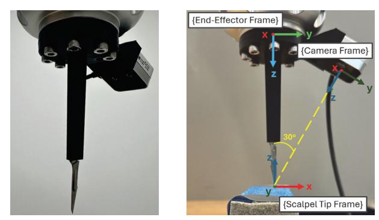

Fig. 1: Scalpel end-tool with the RealSense D405 close-range stereo vision camera

Soft tissue incisions are challenging for CoBots to perform due to the nonlinear deformation of tissue during manipulation [4]. Effective robotic control must adapt to the deformations to successfully execute surgical tasks. This is further challenged by the variability in mechanical properties of skin, with thickness varying by body region [5], elastic modulus varying with age and skin layers (epidermis, dermis, and hypodermis) [6], and environmental conditions (temperature and humidity) affecting mechanical properties [7]. As a result, skin models are complex to use and develop for deformation tracking, and do not generalize well to different cases. To overcome this issue, vision feedback can be leveraged to allow for model-free approaches to track dynamic tissue movement and enable robots to perform soft tissue manipulation.

While incisions must be optimized for surgical success, post-operative implications of surgical incisions are also key to consider. Scarring and scar tissue formation are common outcomes post-surgical incisions, which can potentially lead to psychological and functional side-effects due to physical impairment (stiffer, less elastic tissue [8]) and societal stigma [9] [10]. From a procedural standpoint, it has been recognized that tension forces across a wound affect scar formations [9]. Studies have found that excessive mechanical stress exerted in the wound environment induces scarring via activation of mechanotransduction pathways [9] [11] (conversion of mechanical stimuli into biochemical signals that result in intracellular changes [12]). Therefore, minimizing mechanical forces during incision is crucial to reduce postoperative scarring and its associated complications.

Autonomous soft tissue incisions and manipulation is a growing research area, with a key focus on developing different methods to address the unique mechanical behaviour of soft tissues [13]. Leonard *et al.* developed a robotic system capable of performing suturing [14] named Smart Tissue

1 Department of Mechanical and Mechatronics Engineering, University of Waterloo, Canada jeffrey.lee@uwaterloo.ca, tdmarotta@uwaterloo.ca, stewart.mclachlin@uwaterloo.ca, yue.hu@uwaterloo.ca 2 Department of Systems Design Engineering, University of Waterloo, Canada alexander.wong@uwaterloo.ca We acknowledge the support of University of Waterloo's Faculty of Engineering

Anastomosis Robot (STAR). STAR is a robot arm equipped with a monocular colour camera and an actuated suturing tool [14]; it allows surgeons to specify the location of each stitch or allows for the automatic placement of stitches [14]. Li *et al.* proposed a surgical perception framework that continuously collects 3D geometric data to map deformable surgical fields and tracking instruments [15]. Their framework proposed using visual perception from endoscopic image data along with a robotic control loop to allow for accurate soft tissue manipulation [15]. Li *et al.* implemented the framework for evaluation on the da Vinci Surgical System and demonstrated that the framework allowed for reliable tracking during significant tissue deformations [15]. Liang *et al.* developed a system capable of performing autonomous incision of the cornea by leveraging a monocular camera [16], which is used to determine the position of the scalpel and to capture the surgical scene [16]. Experiments performed with the robotic system on *ex vivo* porcine eyes showed that the system was capable of performing precise cuts [16]. All these works demonstrated precise results; however, they all also require specialized robotic systems or cameras to perform their tasks, limiting the scalability of their work to more general-purpose robots such as CoBots or humanoids. More generalized surgical solutions were recently investigated using a humanoid for assistance in surgical practices [17], but still rely on teleoperation of the robot with motion mapping, where incision procedures were not optimized. In addition, given that the system requires a medical professional to teleoperate the robot, it does not address the issue of the increasing demand for healthcare workers.

In this work, we introduce a generalized autonomous solution to performing surgical incisions using CoBots and stereo vision feedback. This solution is designed to be adaptable across various procedures and robotic platforms. Our main contributions are as follows:

- 1) A compact end-tool scalpel with an integrated stereo vision camera (Fig. 1), capable of capturing finegrained soft tissue deformations for extensible and vision-based feedback control during incisions.
- 2) The VAISI framework: a model-free, vision-driven adaptive impedance control system for CoBots, designed to autonomously perform skin incisions while minimizing tissue trauma through:
  - a) Millimeter-scale incision depth precision;
  - b) Adaptively minimizing incision force.

This work is experimentally verified using the KUKA LBR Med CoBot (Kuka Robotics, Germany), with incisions performed on *ex vivo* porcine belly and hock skin.

## II. BACKGROUND

## *A. Mechanics of Soft Tissue*

Soft tissues are unmineralized, flexible tissues that comprise of a variety of tissues within the body, including skin, tendons, ligaments, blood vessels, and more [18]. They display a nonlinear stress-strain relationship, are capable of large deformations, and have viscoelastic properties [4] [19]. Additionally, the mechanics of soft tissues are highly variable, depending on tissue type, age, and sex [19].

To model the behaviour of soft tissues, many mathematical models have been proposed [20]. In particular, different models can be used to describe specific behaviours of tissue, including: hyperelasticity (nonlinear or linear), viscoelasticity (nonlinear or linear), anisotropy, and heterogeneity [20]. Additionally, soft tissue behaviour changes over time and during damage, a critical behaviour present during surgical procedures [20]. Since many mathematical models exist for soft tissue behaviour, selecting the appropriate model for use is highly dependent on the application and intended tissue for manipulation or incisions [20]. As a result, developing a model-based generalized solution for incision automation would require significant development to create the vast number of models needed for various tissues.

# *B. Soft Material Manipulation in Robotics*

The deformability of soft materials creates a complex problem of tracking a soft object's state for manipulation tasks with robots. Model-based approaches on estimating soft objects' physical properties and its deformation from interactions is a common approach in current literature [21] [22], but for materials where there is a high variation in physical properties, such as soft tissue, these model-based methods are not a viable option as models cannot be confidently relied upon. Thus, in this paper, we rely solely on model-free approaches, using sensors to estimate the soft material's state.

Model-free approaches in literature use machine learning to directly map sensor measurements to control the robot, as demonstrated in the works of [23], [24], [25], and [26]. These studies utilize vision to capture real-time point-cloud or RGBD data of the soft object being manipulated. This data is then processed for feature extraction and used for feedback control to manipulate the soft object into a desired shape. Building on these successes, this paper will leverage vision-based measurements to capture soft tissue deformation, enabling feedback control for precise manipulation.

## *C. Variable Cartesian Impedance Control*

The use of impedance control has gained popularity to modulate interaction forces in robotic tasks through its compliant behavior, whether it be with humans or objects in its environment [27]. A review done by Abu-Dakka *et al.* has found that recent works on varying the robot's impedance parameters online has proven to be an effective strategy to adapt robot's behaviors to unknown environments, with learning approaches prominently being used to modulate the impedance parameters [27]. This review encapsulates a promising direction on the use of online variable impedance control for robotic manipulation tasks with new or unknown objects and environments.

The basis of the forces exerted by a robotic manipulator's end-effector in Cartesian impedance control is derived from Hooke's Law to produce the behavior of a spring-massdamper system [28]:

$$F = M\Delta\ddot{p} + D\Delta\dot{p} + K(p_{des} - p) \quad (1)$$

where  $F \in \mathbb{R}^6$  is exerted force,  $M \in \mathbb{R}^6$  is inertia,  $D \in \mathbb{R}^6$  is damping,  $K \in \mathbb{R}^6$  is stiffness,  $\ddot{p} \in \mathbb{R}^6$  is acceleration,  $\dot{p} \in \mathbb{R}^6$  is velocity,  $p \in \mathbb{R}^6$  is position, and  $p_{des} \in \mathbb{R}^6$  is the desired position of the end-effector.  $K$  and  $D$  are diagonal matrices with each value denoting the virtual stiffness and damping gains to be applied on each Cartesian direction and rotation. As a result, Cartesian impedance control allows the control of  $F$  through the modulation of  $p_{des}$ ,  $K$ , and  $D$ .

#### III. METHODOLOGY

#### *A. Design of the Stereo Vision Scalpel End-Tool*

The development of the compact scalpel end-tool with a stereo vision sensor presented in this work consists of two main components: selection of a stereo camera for accurate measurements suitable for surgical applications and the mechanical design of the scalpel camera assembly.

*1) Vision Module:* The stereo vision module selected for integration with the end-effector is the Intel RealSense D405. This sensor offers key advantages for robotic applications thanks to the broad compatibility of the Intel RealSense SDK with widely used robotics platafforms (C++, Python, and both Robotics Operating System - ROS 1 and 2). Additionally, the D405 is optimized for close-range depth sensing and delivers measurement accuracies of up to 0.1 mm at a distance of 7 cm [29]. This accuracy is key for the surgical environment, where high precision is critical. Furthermore, the compact form factor of the D405 supports the development of space-constrained end-effector designs, making it well-suited for minimally invasive or collaborative surgical environments.

2) *Stereo Vision Scalpel End-Tool Design:* The scalpel end-tool with a stereo vision module designed for this work is depicted in Fig. 1. To optimize the balance between minimizing the end-tool's footprint and enhancing the accuracy of the camera's measurements of the manipulated soft tissue, the camera is positioned 7 cm from the heel of the blade. The camera's face is oriented at a 30 deg angle relative to the scalpel and is aligned parallel to the blade (see Fig. 1), thereby reducing the occlusion of the tissue by the scalpel. The deformability of soft tissues often results in surfaces with significant curvature, which can complicate accurate imaging. This issue is especially prominent during incisions, where protrusions and cavities often form from this manipulation. To mitigate this issue, it is crucial for the vision system to be positioned and angled at a sufficient distance from the tissue's surface, which is achieved with this design. Furthermore, the 30 deg angle offers the additional advantage of utilizing the tool's vertical height to achieve the necessary camera-to-tissue distance, thereby reducing the tool's overall cross-sectional footprint. This configuration allows for greater visibility and monitoring of incisions in a surgical environment.

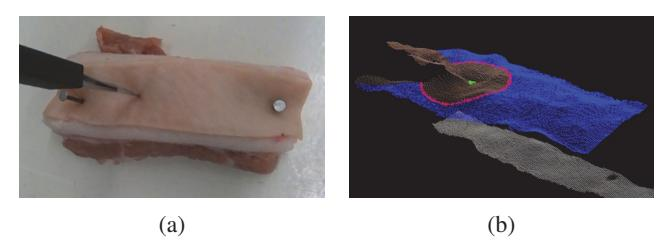

Fig. 2: (a) depicts the RGB image captured by the end-tool camera during an incision and (b) is the visualization of the processed point-cloud using Alg.1, where green represent points used for *scalpel\_tip\_z*, red represent points calculated for *indent\_r*, and blue represents points used for *nominal\_skin\_z*

#### *B. Incision Feature Estimation using Stereo Vision*

To accomplish the task of incisions in soft tissue in robotics, two critical pieces of feedback must be captured: the location of the tissue and its deformation while it is being manipulated. With the goal of depth precision in mind, the vision algorithm developed for VAISI measures:

- The depth of the tip of the scalpel blade from the surface of the soft tissue.
- 2) The indentation deformation on the soft tissue from the incision interaction of the scalpel blade.

Using the point-cloud generated from the RGBD data captured by the stereo-vision camera, Alg. 1 was developed using the Point Clof Cloud Library (PCL) [30] to capture these measurements as *incision\_depth* and *indent\_depth*, respectively. Fig. 2 shows a visualization of a point-cloud processed by Alg. 1 during an incision.

**Algorithm 1** Point cloud processing to calculate incision depth and indentation deformation

**Input:** Point cloud, *pc*, captured by the stereo vision camera on the scalpel end-tool

**Output:** Distance between the scalpel tip and skin surface, and skin indentation

1 **Function** computeSkinFeatures(*pc*):

| 2 | Transform $pc$ to $\{\text{Scalpel Tip Frame}\}$ . |
|---|----------------------------------------------------|
| 3 | Crop $pc$                                          |

3 Crop  $pc$ 

4 Remove outliers in *pc*

5  $scalpel\_tip\_z = \frac{1}{10} \sum_{i=1}^{10} z_i$ ,

where  $\{(x_i, y_i, z_i)\}_{i=1}^{10} = \text{argmin} \left( \sqrt{x^2 + y^2} \right) \in pc$ 

**6**    *indent\_r* = min{*indent\_r* =  $\sqrt{x_i^2 + y_i^2}$  | (*xi, yi, zi*) ∈ pc    $\nabla z_i = 0$ }

7  $|(x_i, y_i, z_i) \in pc, \nabla z_i = 0\rangle$   
 indent  $z = \frac{1}{\sqrt{N}} z$ .

7 $\forall \sqrt{x_i^2 + y_i^2} = \text{indent-r}, (x_i, y_i, z_i) \in \text{pc}$   
 indent depth = indent  $z$  - scalpel tin  $z$ 

8 *indent\_depth = indent\_z - scalpel\_tip\_z*

9 
$$\text{nominal\_skin\_z} = \frac{1}{N} \sum_{i=1}^N z_i,$$
$$\begin{aligned} & \forall \sqrt{x_i^2 + y_i^2} > \text{indent\_r}, (x_i, y_i, z_i) \in \text{point\_cloud} \\ & \text{incision\_depth} = \text{nominal\_skin\_z} - \text{scalpel\_tip\_z} \end{aligned}$$
 $\forall \sqrt{x_i^2 + y_i^2} > \text{indent}_r, (x_i, y_i, z_i) \in \text{point\_cloud}$ 

**11 return** *incision\_depth* and *indent\_depth*

Firstly, in line 2, the point cloud is transformed from the Camera Frame to the tip of the scalpel, defined at the origin

of the Scalpel Tip Frame, as shown in Fig. 1. In line 3, the point cloud is cropped to a 2cm radius bounding box around the origin of the Scalpel Tip Frame to reduce the computation for the following steps while still capturing local features. In line 4, statistical outliers are removed by calculating the mean distance to each point's 25 nearest neighbors and eliminating points with mean distances greater than one standard deviation above the global mean [30]. In line 5, the depth of the scalpel tip at the incision point, defined as *scalpel\_tip\_z*, is calculated as the mean  $z$  of the 10 points closest to the x-y origin of the Scalpel Tip Frame. In line 6, skin indentation deformation is identified. Assuming that the skin indentation forms in the shape of a 3D Gaussian, an indentation is identified by finding the local maxima radius closest to the origin of the Scalpel Tip Frame. This radius is defined as *indent\_r* and, in line 7, the average z-value of the points lying at this radius is defined as *indent\_z*. In line 8, *indent\_depth* is computed as the difference between *indent\_z* and *scalpel\_tip\_z*. In line 9, the average z-value of the points lying outside of *indent\_r* is defined as *nominal\_skin\_z* to represent the height of the skin surface at its nominal (relaxed and uncompressed) state. Finally, in line 10, under the assumption that the desired incision depth is relative to the surface of the soft tissue at its nominal state, *incision\_depth* is calculated as the difference between the *scalpel\_tip\_z* and *nominal\_skin\_z*.

## *C. Vision-Based Adaptive Cartesian Impedance Control*

The desired end-tool position,  $p_{des}$ , and stiffness,  $K$ , of the impedance controller as introduced in Sec. II-C, are adapted from the vision feedback. *incision\_depth* provides feedback on the position of the soft tissue, and therefore provides the z-position required for the scalpel end-tool to reach a desired incision depth. *indent\_depth* provides feedback on skin deformation caused by forces insufficient to penetrate the tissue layers, resulting in an indentation through compressing the skin surface rather than incision. As such, VAISI simultaneously uses the *incision\_depth* feedback for visual servoing to the incision depth with  $p_{des}$ , and the *indent\_depth* feedback to control the incision force through adaptive stiffness,  $K$ , and critical damping,  $D$ , to create precise-depth incisions. The implementation of this combined control is outlined in the following, supplemented by Alg. 2 and Fig. 3.

1) *Visual Servoing via Incision Depth Feedback*: To control the incision depth on the deformable soft-tissue, the control point,  $p_{des}$ , for the Cartesian impedance controller is adaptively set using the vision feedback *incision\_depth*. The incision is first performed by a linear downward trajectory using proportional-integral-derivative (PID) control in the negative z-direction of the scalpel tip frame, with *desired\_depth* as the input and *incision\_depth* as the feedback signal (line 3). In addition, a maximum 50% overshoot for the control points is also imposed to prevent damage of underlying anatomy and excessive cuts (line 3). The framework waits until the desired depth is reached (line 2), then a linear x-trajectory is used to create an incision while

the depth-PID control remains active (lines 9-11).

2) *Adaptive Stiffness via Skin Indentation Feedback*: Surgeons perform an incision by modulating downward pressure until the scalpel penetrates the skin and then continues to create a smooth cut [31]. Similarly, VAISI modulates the downward stiffness of the Cartesian impedance controller to penetrate the skin by using the *indent\_depth* feedback. With the notion of indents indicating greater incision forces needed to split the tissue, as *indent\_depth* stays the same or increases during the incisions, VAISI will adapt by increasing z-stiffness and thereby the incision force (lines 4-5). If *indent\_depth* decreases, z-stiffness decreases (lines 6-7). Once the desired incision depth is reached, the adjusted stiffness is then maintained to create a smooth cut.

## Algorithm 2 Incision Control

**Input:** *incision\_depth* and *indent\_depth*

**Output:** CoBot end-effector position  $p_{ctrl}$ 

1 **Function** incisionControl(incision\_depth,  
indent\_depth):

| 2  | <b>while</b> <i>incision_depth</i> < <i>desired_depth</i> <b>do</b>                             |
|----|-------------------------------------------------------------------------------------------------|
| 3  | $p_{des.z} = \min(\text{PID}_z(\text{incision\_depth}),$ <i>desired_depth</i> $\times 1.5$ ) |
| 4  | <b>if</b> <i>indent_depth</i> $\geq$ <i>previous_indent_depth</i> <b>then</b>                   |
| 5  | $\lfloor K_z + 5$                                                                               |
| 6  | <b>else</b>                                                                                     |
| 7  | $\lfloor K_z - 5$                                                                               |
| 8  | $previous\_indent\_depth = \text{indent\_depth}$                                                |
| 9  | <b>for</b> <i>number of x trajectory steps</i> <b>do</b>                                        |
| 10 | $p_{des.z} = \min(\text{PID}_z(\text{incision\_depth}),$ <i>desired_depth</i> $\times 1.5$ ) |
| 11 | $p_{des.x} += x\_step$                                                                          |
| 12 | <b>return</b> $p_{ctrl}$                                                                        |

## IV. EXPERIMENTS AND RESULTS

# *A. Evaluation of the Stereo Vision Scalpel End-Tool*

To verify the performance of the stereo vision scalpel end-tool introduced in Sec. III-A, the tool is mounted on a 7 DoF KUKA LBR Med, with a #11 scalpel blade. Foam was selected as the test specimen as it is penetrable with minimal deformation, enabling evaluation of vision measurements independent of material deformation. The end-tool is positioned perpendicularly on top of foam so that a z-trajectory results in a straight stab incision, as seen in Fig. 1. Using this setup, desired incision trajectories at 0.5 mm/s, 1 mm/s, 1.5 mm/s, and 2 mm/s were used to create incisions of 10mm in the foam using position control on the robot. The z-displacement measured from the robot is recorded as the ground truth of the incision depth to be compared to the *incision\_depth* measurements from Alg.1.

Measurements obtained from the experiments can be seen in Fig. 4, where the dotted lines represent the robot measured displacement and the solid lines are the vision measured displacement. The bias (compared to the displacement measured by the robot) and noise (measured using the standard

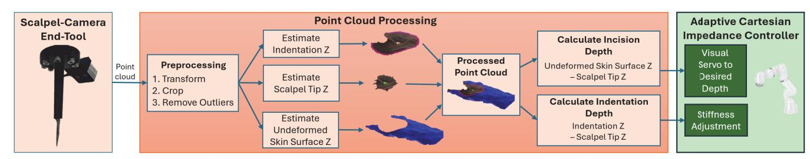

Fig. 3: VAISI Framework Overview

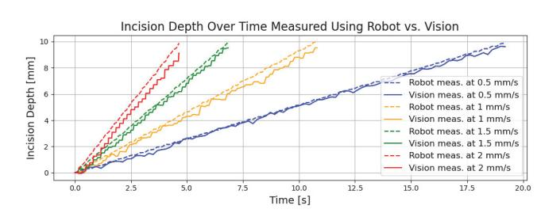

Fig. 4: Incision depth measurement on a piece of foam from the LBR Med vs. the Realsense D405 on the end-tool at four incision velocities.

| Desired Incision Velocity [mm/s] | Bias [mm] | Noise (Standard Deviation of Residuals) [mm] |
|----------------------------------|-----------|----------------------------------------------|
| 0.5                              | -0.144    | 0.144                                        |
| 1.0                              | -0.372    | 0.202                                        |
| 1.5                              | -0.321    | 0.130                                        |
| 2.0                              | -0.717    | 0.225                                        |

TABLE I: Bias and noise of incision depth measurements using the RealSense D405 on the end-tool at four desired incision velocities, using the z-displacement measured from the LBR Med as the ground truth.

deviation of residuals) are reported in Table I. The experiment reveals that using the RealSense D405 camera for the scalpel end-tool achieves sub-millimeter accuracy at the reported velocities. However, a decrease in both accuracy and precision is seen as the velocity of the incision increases. This degradation in performance can be attributed to two main factors. Firstly, there is high latency from point cloud processing. Using PCL with the available hardware, an AMD Ryzen™ 7 7745HX processor, for this experiment produced vision measurements between 4-8 Hz, resulting in an increase of measurement errors at higher speeds. Secondly, it was observed that there was an increase in vibrations from increasing the robot's operating speed, resulting in vibrations on the camera sensor. This likely attributed to the increase in measurement noise observed in this test. From this result, the incision performed in the next sections to evaluate VAISI was limited to a maximum of 0.5 mm/s to optimize the accuracy of the vision measurements.

# *B. Experimental Setup*

The same hardware setup as the previous section is used to conduct robotic skin incisions using the VAISI framework. Two types of *ex vivo* tissues were used as the specimens in this work: porcine belly skin and hock skin. Porcine

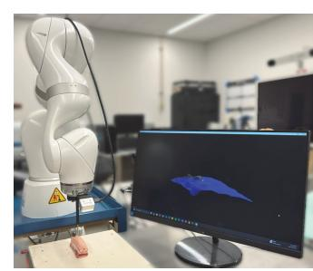

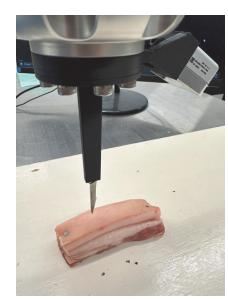

(a) Overall setup (b) Close-up view

Fig. 5: Experimental setup for performing incisions on porcine using the LBR Med and scalpel camera end-tool

models were chosen as they provide mechanical forces across their skin most similar to those found in humans [9]. These specimens were secured to a hardwood surface to keep the tissue in place during the incision process (as in a real surgical procedure, the incision location would likely be immobile). Fig. 5 depicts this setup with porcine belly as the test tissue.

## *C. Results*

To validate the effectiveness of the VAISI framework on creating incisions with minimal force, incisions using no stiffness adaptation, and incisions using VAISI were both performed. To further demonstrate the VAISI framework's effectiveness, incisions of different desired depths were also performed.

*1) Without Stiffness Adaptation:* Due to the unknown mechanical properties of the skin tissue and underlying anatomical structures, it is not feasible to define a constant force required to achieve incision. Nevertheless, with the objective of minimizing incision force, incisions were conducted using a low constant stiffness of 200 N/m to assess whether incisions can be achieved through the application of minimal force alone. Figs. 6 and 7 show the results on porcine belly and hock skin, respectively, with a target incision depth of 10 mm over five trials. These results demonstrate that a constant stiffness of 200 N/m was insufficient to reach the target depth. Incision force plots, measured as the z-direction force on the end-effector, showed convergence to a steady state across all trials, while incision depth plateaued below the desired value. This indicates that automated incisions to a specified depth cannot be achieved using a constant force or stiffness that fails to overcome tissue mechanics. The failure of these trials highlights the necessity of stiffness adaptation

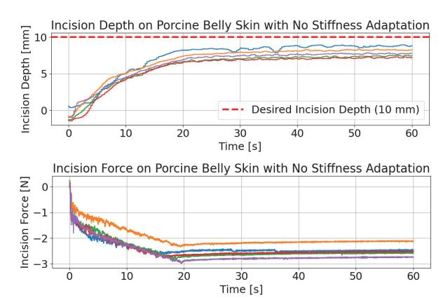

Fig. 6: Incision depth and force using constant stiffness of 200 N/m on porcine belly skin

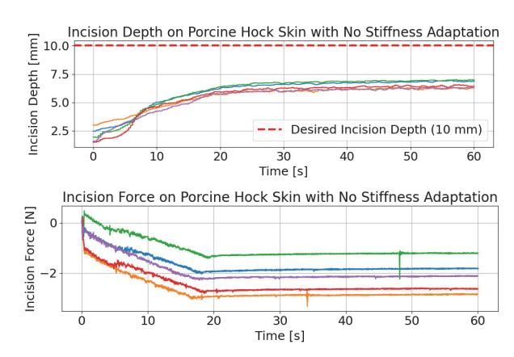

Fig. 7: Incision depth and force using constant stiffness of 200 N/m on porcine hock skin

to modulate applied forces and achieve precise incisions in tissues with unknown mechanical properties.

2) *VAISI Framework*: To validate the performance of the VAISI framework, incisions on porcine hock skin and belly skin were performed with desired depths of 5mm and 10mm. 10 trials of each test case were conducted. PID values for Alg. 2 were 0.75, 0.25, and 0.05, respectively. The vision measurements of *incision\_depth* and *indent\_depth* along with the adapted impedance controller stiffness is reported in Fig. 8. The incisions were then measured at the start, middle, and end using a caliper to verify the depth of the incisions. The mean error, overshoot, undershoot, and standard deviation from the desired depth of these measurements are reported in Table II.

It is worth noting that the specimens used in this study exhibited variation in the thickness of the skin, fat, and muscle layers, even within the same anatomical region. This resulted in variations in indent deformation measurements and therefore stiffness adaptations. Especially, specimens with a large fat layer underneath the tough skin allowed for greater deformation under the incision force, instead of remaining taut for the blade to slice through the skin. This resulted in an especially tough manipulation challenge for a shallow 5mm incision on porcine belly, which had a large fat layer underneath a skin layer close to 5mm, resulting in incisions too shallow and the worse performing case.

Furthermore, skin indentation increased during the entire incision process to the desired depth for all cases. This is likely due to the triangular geometry of the #11 scalpel blade preventing the tissue to return to its uncompressed state around the incision point. This indicates that the stiffness reduction in the VAISI framework was not necessary in this case, but may be useful for cases where the incision instrument has a uniform shape, such as a needle.

Overall, VAISI demonstrated highly promising performance, achieving sub-millimeter mean depth accuracy and maintaining maximum errors below 2 mm across all trials on porcine hock skin and 10 mm incisions on porcine belly skin. Notably, the low standard deviation observed across experiments highlights the system's excellent precision and repeatability. These results underscore VAISI's potential as a robust and reliable tool for precise incision control in soft tissue, paving the way for future applications in both preclinical research and clinical settings where high accuracy and consistency are critical.

#### V. CONCLUSION AND FUTURE WORK

VAISI, a Vision-based Adaptive Impedance-control framework for Surgical Incisions along with a compact stereovision scalpel end-tool was presented. VAISI is a modelfree framework designed with the goal of depth precision and minimizing tissue damage by controlling both a CoBot's position and applied force through adaptive impedance control. Utilizing point-cloud data of a target soft-tissue, its position relative to the CoBot and its deformation during manipulation is captured. These two visual feedbacks are then used to visual servo the CoBot to a desired incision depth and control the applied force by adapting the stiffness of the impedance controller, respectively. Furthermore, a compact stereo vision scalpel end-tool design was developed for CoBots that can serve as surgical assistants in operating rooms. The overall system was experimentally validated with incisions performed on porcine hock skin and belly skin with desired depths of 5mm and 10mm. The experiments revealed promising results with sub-millimeter mean errors for three of the four test cases, and precision with low standard deviations in all cases.

This work serves as a step towards fully autonomous surgery by tackling a common procedure in surgery: skin incisions. Currently, VAISI has shown promising results for automating small stab incisions with #11 scalpel blades. Investigations on using different surgical scalpel blades and larger, different incisions could be extended on the VAISI framework. Multi-modal force adaptation could also be investigated by integrating a force sensor on the scalpel tool. Ultimately, VAISI, in conjunction with the stereo vision scalpel end-tool, offers a generalized, model-free, visionbased solution for robotic incision tasks in soft materials such as soft-tissue. This approach has the potential to be deployed across various robotic platforms, including CoBots, mobile manipulators, and humanoids for autonomous and collaborative surgical operations.

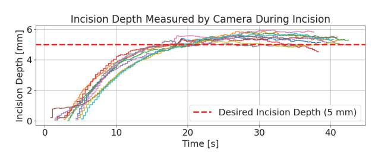

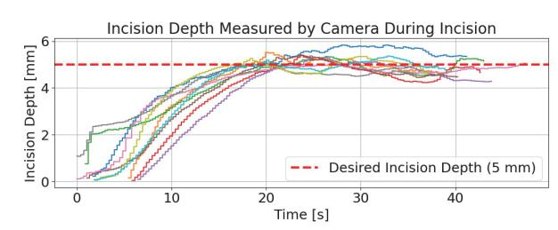

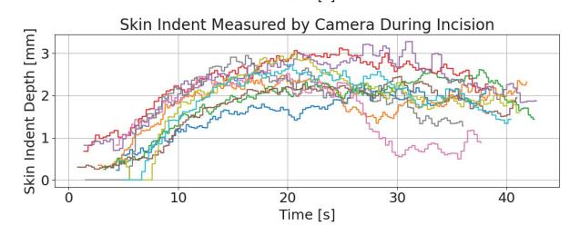

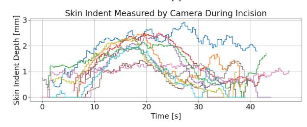

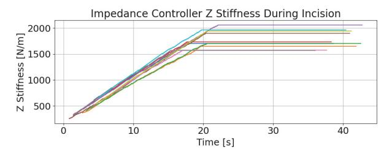

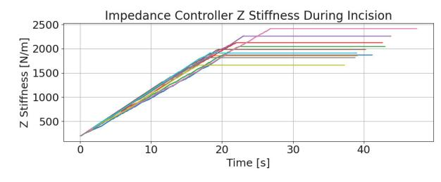

(a) Specimen: porcine belly skin Desired depth: 5mm

(b) Specimen: porcine hock skin Desired depth: 5mm

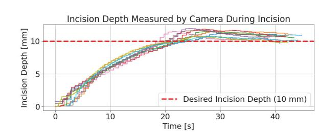

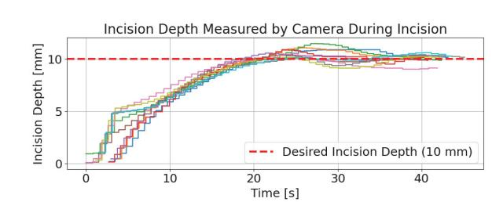

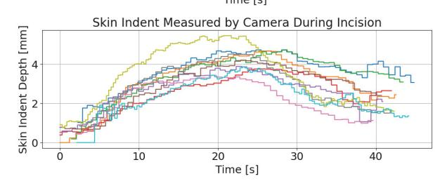

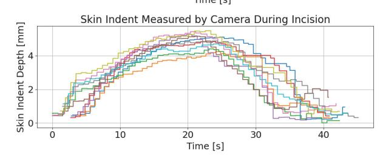

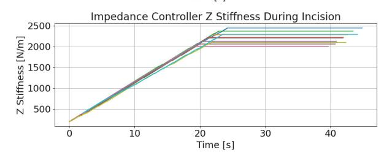

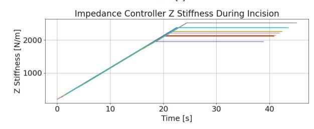

(c) Specimen: porcine belly skin Desired depth: 10mm.

(d) Specimen: porcine hock skin Desired depth: 10mm

Fig. 8: Vision measured incision depth, vision measured skin indentation, and adapted impedance controller z-stiffness during the incision process of each test condition

| Point of Incision                          | Start        | Middle | End   |
|--------------------------------------------|--------------|--------|-------|
| Mean Error from Desired Depth [mm]         | -2.30        | -1.87  | -1.70 |
| Maximum Overshoot from Desired Depth [mm]  | No Overshoot |        |       |
| Maximum Undershoot from Desired Depth [mm] | -2.56        | -2.59  | -2.6  |
| Standard Deviation of Incision Depth [mm]  | 0.48         | 0.87   | 1.06  |

#### (a) Porcine belly skin with 5mm desired incision depth

| Point of Incision                          | Start | Middle | End   |
|--------------------------------------------|-------|--------|-------|
| Mean Error from Desired Depth [mm]         | -0.46 | 0.03   | -0.24 |
| Maximum Overshoot from Desired Depth [mm]  | 1.56  | 1.72   | 1.64  |
| Maximum Undershoot from Desired Depth [mm] | -1.85 | -1.46  | -1.70 |
| Standard Deviation of Incision Depth [mm]  | 1.23  | 1.23   | 1.19  |

#### (b) Porcine hock skin with 5mm desired incision depth

|                                            | Point of Incision | Start | Middle | End |
|--------------------------------------------|-------------------|-------|--------|-----|
| Mean Error from Desired Depth [mm]         | -0.18             | -0.70 | -0.74  |     |
| Maximum Overshoot from Desired Depth [mm]  | 0.77              | 0.39  | 0.36   |     |
| Maximum Undershoot from Desired Depth [mm] | -1.7              | -1.81 | -1.85  |     |
| Standard Deviation of Incision Depth [mm]  | 0.86              | 0.71  | 0.80   |     |

#### (c) Porcine belly skin with 10mm desired incision depth

|                                            | Point of Incision | Start | Middle | End   |
|--------------------------------------------|-------------------|-------|--------|-------|
| Mean Error from Desired Depth [mm]         | 0.56              | 0.57  | 0.47   | 0.47  |
| Maximum Overshoot from Desired Depth [mm]  | 1.69              | 1.61  | 1.94   | 1.94  |
| Maximum Undershoot from Desired Depth [mm] | -0.94             | -1.06 | -1.22  | -1.22 |
| Standard Deviation of Incision Depth [mm]  | 0.82              | 0.90  | 1.00   | 1.00  |

#### (d) Porcine hock skin with 10mm desired incision depth

TABLE II: Performance at the start, middle, and end of incisions over 10 trials of each test condition

## REFERENCES

[1] A. Shademan *et al.*, "Supervised autonomous robotic soft tissue surgery," *Science translational medicine*, vol. 8, no. 337, p. 337ra64, 2016. [2] K. Reddy *et al.*, "Advancements in robotic surgery: a comprehensive overview of current utilizations and upcoming frontiers," *Cureus*, vol. 15, no. 12, 2023. [3] P. Probst, "A review of the role of robotics in surgery: To davinci and beyond!" *Missouri medicine*, vol. 120, no. 5, p. 389, 2023. [4] Y.-c. Fung, *Biomechanics: mechanical properties of living tissues*. Springer Science & Business Media, 2013. [5] H. Yousef *et al.*, *Anatomy, Skin (Integument), Epidermis*. Treasure Island (FL): StatPearls Publishing, 2025, updated June 8, 2024. [Online]. Available: https://www.ncbi.nlm.nih.gov/books/NBK470464/ [6] I. L. Kruglikov *et al.*, "Skin aging as a mechanical phenomenon: The main weak links," *Nutrition and Healthy Aging*, vol. 4, no. 4, pp. 291–307, 2018. [Online]. Available: https://journals.sagepub.com/doi/10.3233/NHA-170037 [7] F. Hendriks *et al.*, "The relative contributions of different skin layers to the mechanical behavior of human skin in vivo using suction experiments," *Medical Engineering Physics*, vol. 28, no. 3, pp. 259–266, 2006. [Online]. Available: https://www.sciencedirect.com/science/article/pii/S1350453305001451

[8] D. T. Corr *et al.*, "Biomechanics of scar tissue and uninjured skin," *Advances in wound care*, vol. 2, no. 2, pp. 37–43, 2013. [9] C. E. Berry *et al.*, "The effects of mechanical force on fibroblast behavior in cutaneous injury," *Frontiers in Surgery*, vol. 10, p. 1167067, 2023. [Online]. Available: https://www.ncbi.nlm.nih.gov/pmc/articles/PMC10151708/ [10] B. Brown *et al.*, "The hidden cost of skin scars: quality of life after skin scarring," *Journal of Plastic, Reconstructive Aesthetic Surgery*, vol. 61, no. 9, pp. 1049–1058, 2008. [Online]. Available: https://www.sciencedirect.com/science/article/pii/S1748681508003951 [11] L. A. Barnes *et al.*, "Mechanical forces in cutaneous wound healing: Emerging therapies to minimize scar formation," *Advances in Wound Care*, vol. 7, no. 2, pp. 47–56, 2018. [Online]. Available: https://www.ncbi.nlm.nih.gov/pmc/articles/PMC5792236/ [12] P. L. Head, "Rehabilitation considerations in regenerative medicine," *Physical Medicine and Rehabilitation Clinics of North America*, vol. 27, no. 4, pp. 1043–1054, 2016, regenerative Medicine. [13] P. Shi *et al.*, "A soft tissue scalpel cutting robotic system with sucker fixation," in *IEEE 14th International Conference on Control and Automation*, 2018, pp. 1162–1167. [14] S. Leonard *et al.*, "Smart tissue anastomosis robot (star): A visionguided robotics system for laparoscopic suturing," *IEEE Transactions on Biomedical Engineering*, vol. 61, no. 4, pp. 1305–1317, 2014. [15] Y. Li *et al.*, "Super: A surgical perception framework for endoscopic tissue manipulation with surgical robotics," *IEEE Robotics and Automation Letters*, vol. 5, no. 2, pp. 2294–2301, 2020. [16] H. Liang *et al.*, "Autonomous clear corneal incision guided by force–vision fusion," *IEEE Transactions on Industrial Electronics*, vol. 71, no. 8, pp. 9319–9327, 2024. [17] S. Atar *et al.*, "Humanoids in hospitals: A technical study of humanoid robot surrogates for dexterous medical interventions," 2025. [Online]. Available: https://arxiv.org/abs/2503.12725 [18] G. A. Holzapfel *et al.*, "Biomechanics of soft tissue," *The handbook of materials behavior models*, vol. 3, no. 1, pp. 1049–1063, 2001. [19] S. N. Kosari *et al.*, "Robotic compression of soft tissue," in *IEEE International Conference on Robotics and Automation*, 2012, pp. 4654–4659. [20] N. Famaey *et al.*, "Soft tissue modelling for applications in virtual surgery and surgical robotics," *Computer methods in biomechanics and biomedical engineering*, vol. 11, no. 4, pp. 351–366, 2008. [21] T. Wada *et al.*, "Indirect simultaneous positioning operations of extensionally deformable objects," in *Proceedings. IEEE/RSJ International Conference on Intelligent Robots and Systems. Innovations in Theory, Practice and Applications*, vol. 2, 1998, pp. 1333–1338. [22] ——, "Robust manipulation of deformable objects by a simple pid feedback," in *IEEE International Conference on Robotics and Automation*, vol. 1, 2001, pp. 85–90. [23] M. O. Fonkoua *et al.*, "Deformation control of a 3d soft object using rgb-d visual servoing and fem-based dynamic model," *IEEE Robotics and Automation Letters*, vol. 9, no. 8, pp. 6943–6950, 2024. [24] Z. Hu *et al.*, "3-d deformable object manipulation using deep neural networks," *IEEE Robotics and Automation Letters*, vol. 4, no. 4, pp. 4255–4261, 2019. [25] B. Thach *et al.*, "Learning visual shape control of novel 3d deformable objects from partial-view point clouds," in *International Conference on Robotics and Automation*, 2022, pp. 8274–8281. [26] Z. Hu *et al.*, "Three-dimensional deformable object manipulation using fast online gaussian process regression," *IEEE Robotics and Automation Letters*, vol. 3, no. 2, pp. 979–986, 2018. [27] F. J. Abu-Dakka *et al.*, "Variable impedance control and learning—a review," *Frontiers in Robotics and AI*, vol. 7, p. 590681, 2020. [Online]. Available: https://doi.org/10.3389/frobt.2020.590681 [28] A. Albu-Schaffer *et al.*, "Cartesian impedance control techniques for torque controlled light-weight robots," in *IEEE International Conference on Robotics and Automation*, vol. 1, 2002, pp. 657–663. [29] I. Corporation, "Intel realsense depth camera d405," 2024, accessed: 2024-10-04. [Online]. Available: https://www.intelrealsense.com/depth-camera-d405/ [30] R. B. Rusu *et al.*, "3D is here: Point Cloud Library (PCL)," in *IEEE International Conference on Robotics and Automation*, Shanghai, China, May 9-13 2011. [31] A. S. Wright *et al.*, "Instrument handling: Scalpels," 2024, accessed: 2024-10-04. [Online]. Available: https://sites.uw.edu/uwgensurgtechskills/instrument-handling-scalpels/